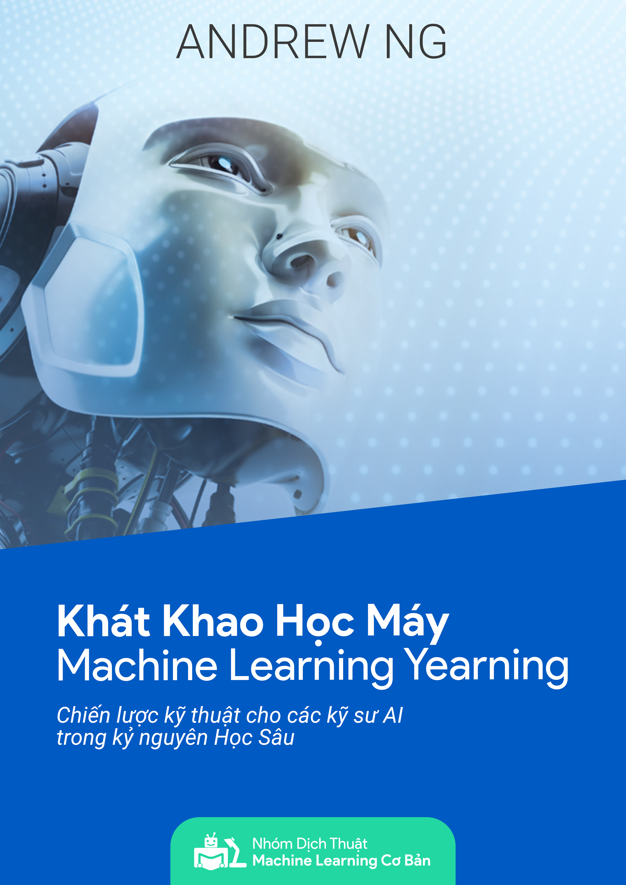

# Dự án dịch sách [Machine Learning Yearning](https://www.deeplearning.ai/machine-learning-yearning/) (Khát khao Học Máy), Andrew Ng ra tiếng Việt

## Bản đầy đủ các chương đã dịch xong

### Online
* [Tiếng Việt](./chapters/book_vn.md)
* [Song ngữ Anh-Việt](./chapters/book_en_vn.md)

### Ebook

* [Tiếng Việt](./chapters/book_mly_with_cover_vn.pdf)
* **Hiện tại bản ebook song ngữ bị lỗi, nhóm sẽ cập nhật trong thời gian sớm nhất**

### Những người thực hiện
[Nhóm dịch thuật Machine Learning Cơ Bản](https://github.com/aivivn/Machine-Learning-Yearning-Vietnamese-Translation/graphs/contributors)

## Nguồn
Bản tiếng Anh https://github.com/ajaymache/machine-learning-yearning. Mặc dù là bản Draft, nội dung bản này cũng đã khá đầy đủ.

## Bảng thuật ngữ
Tất cả các thuật ngữ cần được dịch theo chuẩn trong file [glossary](glossary.md).

## Báo lỗi
Nếu bạn đọc gặp bất cứ lỗi nào về cuốn sách: chính tả, cách dịch, hình vẽ, công thức, ..., nhờ bạn [tạo pull request](https://github.com/aivivn/Machine-Learning-Yearning-Vietnamese-Translation/pulls) để sửa trực tiếp hoặc [tạo một issue](https://github.com/aivivn/Machine-Learning-Yearning-Vietnamese-Translation/issues) thông báo lỗi. Cảm ơn các bạn.
