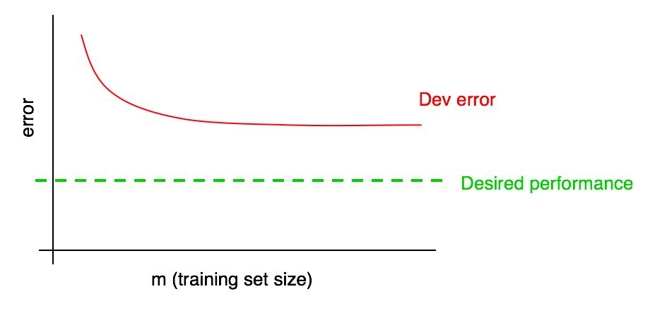
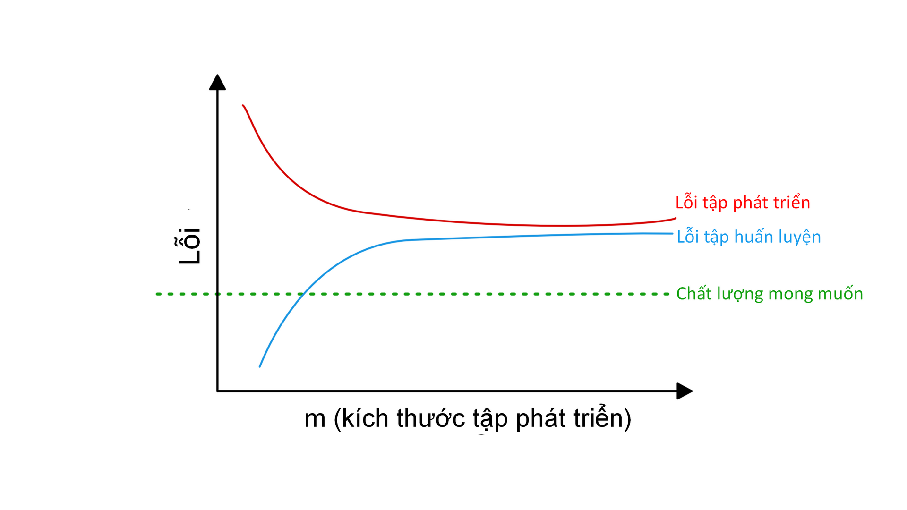
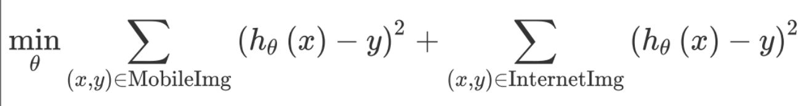
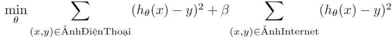

**MỤC LỤC**

* [1. Tại sao cần chiến lược Học Máy](#1-tại-sao-cần-chiến-lược-học-máy)
* [2. Cách sử dụng cuốn sách khi làm việc nhóm](#2-cách-sử-dụng-cuốn-sách-khi-làm-việc-nhóm)
* [3. Điều kiện tiên quyết và Ký hiệu](#3-điều-kiện-tiên-quyết-và-ký-hiệu)
* [4. Quy mô thúc đẩy quá trình phát triển học máy](#4-quy-mô-thúc-đẩy-quá-trình-phát-triển-học-máy)
* [5. Tập phát triển và tập kiểm tra](#5-tập-phát-triển-và-tập-kiểm-tra)
* [6. Tập phát triển và tập kiểm tra nên có cùng phân phối](#6-tập-phát-triển-và-tập-kiểm-tra-nên-có-cùng-phân-phối)
* [7. Tập phát triển/kiểm tra cần lớn đến mức nào?](#7-tập-phát-triểnkiểm-tra-cần-lớn-đến-mức-nào)
* [8. Thiết lập một phép đo đơn trị làm mục tiêu tối ưu](#8-thiết-lập-một-phép-đo-đơn-trị-làm-mục-tiêu-tối-ưu)
* [9. Phép đo tối ưu và phép đo thỏa mãn](#9-phép-đo-tối-ưu-và-phép-đo-thỏa-mãn)
* [10. Xây dựng một tập phát triển và một phép đo sẽ tăng tốc quá trình làm việc](#10-xây-dựng-một-tập-phát-triển-và-một-phép-đo-sẽ-tăng-tốc-quá-trình-làm-việc)
* [11. Khi nào cần thay đổi tập phát triển/kiểm tra và các phép đo](#11-khi-nào-cần-thay-đổi-tập-phát-triểnkiểm-tra-và-các-phép-đo)
* [12. Điều cần nhớ: Thiết lập các tập phát triển và kiểm tra](#12-điều-cần-nhớ-thiết-lập-các-tập-phát-triển-và-kiểm-tra)
* [13. Bạn mong muốn xây dựng một hệ thống phòng chống email rác mới. Nhóm của bạn có rất nhiều ý tưởng:](#13-bạn-mong-muốn-xây-dựng-một-hệ-thống-phòng-chống-email-rác-mới-nhóm-của-bạn-có-rất-nhiều-ý-tưởng)
* [14. Phân tích lỗi: đánh giá ý tưởng dựa trên tập phát triển](#14-phân-tích-lỗi-đánh-giá-ý-tưởng-dựa-trên-tập-phát-triển)
* [15. Đánh giá song song các ý tưởng trong quá trình phân tích lỗi](#15-đánh-giá-song-song-các-ý-tưởng-trong-quá-trình-phân-tích-lỗi)
* [16. Dọn dẹp những mẫu bị gán nhãn nhầm trong tập phát triển và tập kiểm tra](#16-dọn-dẹp-những-mẫu-bị-gán-nhãn-nhầm-trong-tập-phát-triển-và-tập-kiểm-tra)
* [17. Nếu bạn có một tập phát triển lớn, chia nó thành hai tập con và chỉ phân tích trên một tập](#17-nếu-bạn-có-một-tập-phát-triển-lớn,-chia-nó-thành-hai-tập-con-và-chỉ-phân-tích-trên-một-tập)
* [18. Tập phát triển Eyeball và Blackbox nên lớn như thế nào?](#18-tập-phát-triển-eyeball-và-blackbox-nên-lớn-như-thế-nào)
* [19. Điều cần nhớ: Phân tích lỗi cơ bản](#19-điều-cần-nhớ-phân-tích-lỗi-cơ-bản)
* [20. Độ chệch và Phương sai: Hai nguồn lớn của lỗi](#20-độ-chệch-và-phương-sai-hai-nguồn-lớn-của-lỗi)
* [21. Những ví dụ về Độ chệch và Phương sai](#21-những-ví-dụ-về-độ-chệch-và-phương-sai)
* [22. So sánh với tỉ lệ lỗi tối ưu](#22-so-sánh-với-tỉ-lệ-lỗi-tối-ưu)
* [23. Xử lý Độ chệch và Phương sai](#23-xử-lý-độ-chệch-và-phương-sai)
* [24. Sự đánh đổi giữa Độ chệch và Phương sai](#24-sự-đánh-đổi-giữa-độ-chệch-và-phương-sai)
* [25. Các kĩ thuật để giảm độ chệch có thể tránh được](#25-các-kĩ-thuật-để-giảm-độ-chệch-có-thể-tránh-được)
* [26. Phân tích lỗi trên tập huấn luyện](#26-phân-tích-lỗi-trên-tập-huấn-luyện)
* [27. Các kỹ thuật làm giảm phương sai](#27-các-kỹ-thuật-làm-giảm-phương-sai)
* [28. Chẩn đoán độ chệch và phương sai: Đồ thị quá trình học](#28-chẩn-đoán-độ-chệch-và-phương-sai-đồ-thị-quá-trình-học)
* [29. Vẽ đồ thị sai số huấn luyện](#29-vẽ-đồ-thị-sai-số-huấn-luyện)
* [30. Diễn giải đồ thị quá trình học: Độ chệch cao](#30-diễn-giải-đồ-thị-quá-trình-học-độ-chệch-cao)
* [31. Giải nghĩa các đồ thị quá trình học: Những trường hợp khác](#31-giải-nghĩa-các-đồ-thị-quá-trình-học-những-trường-hợp-khác)
* [32. Vẽ đồ thị quá trình học](#32-vẽ-đồ-thị-quá-trình-học)
* [33. Tại sao chúng ta so sánh với chất lượng mức con người?](#33-tại-sao-chúng-ta-so-sánh-với-chất-lượng-mức-con-người)
* [34. Cách xác định chất lượng mức con người](#34-cách-xác-định-chất-lượng-mức-con-người)
* [35. Vượt qua chất lượng mức con người](#35-vượt-qua-chất-lượng-mức-con-người)
* [36. Khi nào bạn nên huấn luyện và kiểm tra trên những phân phối khác nhau](#36-khi-nào-bạn-nên-huấn-luyện-và-kiểm-tra-trên-những-phân-phối-khác-nhau)
* [37. Làm sao để quyết định có nên sử dụng toàn bộ dữ liệu?](#37-làm-sao-để-quyết-định-có-nên-sử-dụng-toàn-bộ-dữ-liệu)
* [38. Làm thế nào để quyết định có nên bao gồm dữ liệu không nhất quán](#38-làm-thế-nào-để-quyết-định-có-nên-bao-gồm-dữ-liệu-không-nhất-quán)
* [39. Đánh trọng số dữ liệu](#39-đánh-trọng-số-dữ-liệu)
* [40. Tổng quát hóa từ tập huấn luyện đến tập phát triển](#40-tổng-quát-hóa-từ-tập-huấn-luyện-đến-tập-phát-triển)
------------------
> # 1. Why Machine Learning Strategy

# 1. Tại sao cần chiến lược Học Máy 

> Machine learning is the foundation of countless important applications, including web search, email anti-spam, speech recognition, product recommendations, and more. I assume that you or your team is working on a machine learning application, and that you want to make rapid progress. This book will help you do so.

Học Máy là nền tảng cho hàng loạt ứng dụng quan trọng như tìm kiếm trang web, lọc thư điện tử spam, nhận dạng giọng nói, gợi ý sản phẩm, và nhiều ứng dụng khác nữa. Nếu bạn cùng các thành viên trong nhóm đang làm một dự án học máy và rất muốn tiến triển nhanh chóng, thì quyển sách này là dành cho bạn.

> **Example: Building a cat picture startup**

 **Ví dụ: Xây dựng Startup về ảnh mèo** 

> Say you’re building a startup that will provide an endless stream of cat pictures to cat lovers.

Giả sử bạn xây dựng công ty khởi nghiệp cung cấp không giới hạn ảnh mèo cho những người yêu thích. 

> You use a neural network to build a computer vision system for detecting cats in pictures. But tragically, your learning algorithm’s accuracy is not yet good enough. You are under tremendous pressure to improve your cat detector. What do you do?

Bạn dùng mạng neural cho hệ thống thị giác máy nhận biết ảnh có hình mèo. Nhưng dở một cái là thuật toán bạn dùng chưa đủ độ chính xác. Bạn đang chịu rất nhiều áp lực để tăng chất lượng dự đoán tìm ảnh mèo. Bạn sẽ làm thế nào?

> Your team has a lot of ideas, such as:

Nhóm bạn có thể đưa ra rất nhiều ý tưởng như:

> * Get more data: Collect more pictures of cats.

* Lấy thêm dữ liệu: Sưu tầm thêm nhiều ảnh mèo.

> * Collect a more diverse training set. For example, pictures of cats in unusual positions; cats with unusual coloration; pictures shot with a variety of camera settings; ...

* Lấy tập huấn luyện đa dạng hơn. Ví dụ như: ảnh mèo ở vị trí độc lạ, ảnh mèo với màu sắc khác thường, ảnh mèo được chụp với cấu hình máy ảnh khác nhau .v.v.

> * Train the algorithm longer, by running more gradient descent iterations.

* Huấn luyện thuật toán lâu hơn bằng cách chạy nhiều vòng lặp gradient descent hơn. 
 
> * Try a bigger neural network, with more layers/hidden units/parameters.

* Thử nghiệm mạng neural lớn hơn với nhiều tầng/nút ẩn/tham số hơn.

> * Try a smaller neural network.

* Thử nghiệm mạng neural nhỏ hơn.

> * Try adding regularization (such as L2 regularization).

*  Thử nghiệm kỹ thuật regularization (ví dụ như L2 regularization)

> * Change the neural network architecture (activation function, number of hidden units, etc.)

*  Thay đổi kiến trúc mạng neural (ví dụ: hàm activation, số lượng nút ẩn, .v.v)

* ...

> If you choose well among these possible directions, you’ll build the leading cat picture platform, and lead your company to success. If you choose poorly, you might waste months. How do you proceed?

Nếu chọn đúng một trong những hướng kể trên, có thể bạn sẽ xây dựng nên một nền tảng ảnh mèo và startup thành công. Ngược lại, nếu chọn nhầm hướng, bạn có thể đánh mất cả tháng trời. Vậy phải làm như thế nào? 

> This book will tell you how. Most machine learning problems leave clues that tell you what’s useful to try, and what’s not useful to try. Learning to read those clues will save you months or years of development time.

Cuốn sách này sẽ giúp bạn trả lời câu hỏi đó. Phần lớn các vấn đề về học máy đều có những dấu hiệu riêng ẩn chứa gợi ý về phương hướng giải quyết. Việc học để phát hiện ra những dấu hiệu đó sẽ giúp bạn tiết kiệm hàng tháng hay thậm chí hàng năm trời phát triển sản phẩm. 

------------------
> # 2. How to use this book to help your team

# 2. Cách sử dụng cuốn sách khi làm việc nhóm

> After finishing this book, you will have a deep understanding of how to set technical direction for a machine learning project.

Sau khi đọc xong cuốn sách này, bạn sẽ hiểu sâu hơn về cách lựa chọn hướng giải quyết kỹ thuật cho đề tài học máy. 

> But your teammates might not understand why you’re recommending a particular direction. Perhaps you want your team to define a single-number evaluation metric, but they aren’t convinced. How do you persuade them?

Nhưng có thể cộng sự của bạn không hiểu tại sao bạn lại chọn hướng đi như vậy. Có thể bạn muốn cả đội xác định và dùng một phép đo đơn trị, nhưng liệu tất cả thành viên đều đồng tình với quyết định đó? Và bạn sẽ làm gì để thuyết phục họ?

> That’s why I made the chapters short: So that you can print them out and get your teammates to read just the 1-2 pages you need them to know.

Đó là lý do tại sao tôi chủ tâm viết những chương rất ngắn. Bạn có thể dễ dàng thuyết phục quý đồng nghiệp bằng cách chia sẻ 1-2 trang bản in của chương liên quan.

> A few changes in prioritization can have a huge effect on your team’s productivity. By helping your team with a few such changes, I hope that you can become the superhero of your team!

Chỉ với một vài thay đổi nhỏ về thứ tự ưu tiên có thể tác động lớn tới năng suất công việc của cả nhóm. Và bằng những thay đổi đó, tôi hi vọng bạn sẽ sớm trở thành siêu nhân Học Máy của cả đội!

------------------
># 3. Prerequisites and Notation

# 3. Điều kiện tiên quyết và Ký hiệu

> If you have taken a Machine Learning course such as my machine learning MOOC on Coursera, or if you have experience applying supervised learning, you will be able to understand this text.

Nếu bạn đã từng học một lớp về Học Máy ví dụ như lớp MOOC của tôi trên Coursera, hoặc bạn có kinh nghiệm áp dụng học có giám sát thì cuốn sách này sẽ dễ hiểu đối với bạn.

> I assume you are familiar with **supervised learning**: learning a function that maps from x to y, using labeled training examples (x,y). Supervised learning algorithms include linear regression, logistic regression, and neural networks. There are many forms of machine learning, but the majority of Machine Learning’s practical value today comes from supervised learning.

Tôi giả định rằng bạn đã quen thuộc với **học có giám sát**: học một hàm ánh xạ từ x tới y, sử dụng các cặp dữ liệu có nhãn (x,y). Các thuật toán học có giám sát bao gồm hồi quy tuyến tính, hồi quy logistic và mạng neural. Học Máy có rất nhiều dạng tuy nhiên phần lớn các giá trị thực tiễn của nó hiện nay đến từ học có giám sát.

> I will frequently refer to neural networks (also known as "deep learning"). You’ll only need a basic understanding of what they are to follow this text.

Tôi sẽ thường xuyên đề cập đến mạng neural (còn được biết đến là "học sâu"). Bạn chỉ cần nắm được một số khái niệm cơ bản về mạng neural là có thể hiểu được nội dung cuốn sách.

> If you are not familiar with the concepts mentioned here, watch the first three weeks of videos in the Machine Learning course on Coursera at http://ml-class.org

Nếu những khái niệm nêu trên còn mới với bạn thì bạn hãy xem các video ba tuần đầu tiên của khóa học Machine Learning trên Coursera tại http://ml-class.org

------------------
> # 4. Scale drives machine learning progress

# 4. Quy mô thúc đẩy quá trình phát triển học máy

> Many of the ideas of deep learning (neural networks) have been around for decades. Why are these ideas taking off now?

Rất nhiều những ý tưởng của học sâu (mạng neural) đã xuất hiện từ hàng thập kỷ trước. Vậy tại sao tới bây giờ chúng mới bùng nổ như vậy?  

> Two of the biggest drivers of recent progress have been:

Hai nguyên nhân lớn nhất dẫn tới những phát triển gần đây của học sâu là:

> * **Data availability.** People are now spending more time on digital devices (laptops, mobile devices). Their digital activities generate huge amounts of data that we can feed to our learning algorithms.

* **Dữ liệu sẵn có**. Ngày nay, mọi người dành nhiều thời gian hơn bên những thiết bị số như máy tính xách tay, thiết bị di động, .v.v. Chính những thiết bị số này tạo ra nguồn dữ liệu cực lớn dùng cho những thuật toán học ngày nay.

> * **Computational scale.** We started just a few years ago to be able to train neural networks that are big enough to take advantage of the huge datasets we now have.

* **Quy mô năng lực tính toán**. Cho tới một vài năm gần đây chúng ta mới có thể huấn luyện mạng neural đủ lớn để tận dụng những bộ dữ liệu khổng lồ này. 

> In detail, even as you accumulate more data, usually the performance of older learning algorithms, such as logistic regression, "plateaus." This means its learning curve "flattens out," and the algorithm stops improving even as you give it more data:

Cho dù có thêm nhiều nhiều dữ liệu nữa, chất lượng của thuật toán học máy cổ điển như hồi quy logistic cũng không tăng. Nghĩa là đồ thị quá trình học chững lại và thuật toán ngừng cải thiện ngay cả khi có thêm dữ liệu:

> It was as if the older algorithms didn’t know what to do with all the data we now have.

Như thể thuật toán cổ điển không biết xử lý thế nào với tất cả lượng dữ liệu chúng ta đang có.

> If you train a small neutral network (NN) on the same supervised learning task, you might get slightly better performance:

Nếu bạn huấn luyện một mạng neural nhỏ cho cùng một tác vụ học có giám sát thì bạn có thể đạt chất lượng cao hơn một chút:

> Here, by "Small NN" we mean a neural network with only a small number of hidden units/layers/parameters. Finally, if you train larger and larger neural networks, you can obtain even better performance [1]:

"Mạng neural nhỏ" ở đây có nghĩa là mạng neural với ít nút ẩn/tầng/tham số. Sau cùng, bạn có thể cải thiện chất lượng thêm nữa nếu dùng các mạng neural lớn hơn [1]: 

> Thus, you obtain the best performance when you (i) Train a very large neural network, so that you are on the green curve above; (ii) Have a huge amount of data.

Vì thế bạn có thể đạt được chất lượng tốt nhất khi (i) huấn luyện mạng neural rất lớn - tương ứng với đường chất lượng màu xanh lục và (ii) có lượng dữ liệu lớn. 

> Many other details such as neural network architecture are also important, and there has been much innovation here. But one of the more reliable ways to improve an algorithm’s performance today is still to (i) train a bigger network and (ii) get more data.

Nhiều chi tiết khác như kiến trúc mạng neural cũng rất quan trọng, và có nhiều sáng tạo trong lĩnh vực này. Tuy nhiên, một trong những cách đáng tin cậy hơn để tăng chất lượng thuật toán vẫn là (i) huấn luyện mạng lớn hơn và (ii) lấy thêm dữ liệu.

> **FOOTNOTE:**

**CHÚ THÍCH:**

> [1] This diagram shows NNs doing better in the regime of small datasets. This effect is less consistent than the effect of NNs doing well in the regime of huge datasets. In the small data regime, depending on how the features are hand-engineered, traditional algorithms may or may not do better. For example, if you have 20 training examples, it might not matter much whether you use logistic regression or a neural network; the hand-engineering of features will have a bigger effect than the choice of algorithm. But if you have 1 million examples, I would favor the neural network.

[1] Mặc dù hình vẽ thể hiện mạng neural cho kết quả tốt hơn với tập dữ liệu nhỏ, nhưng hiện tượng này ít nhất quán hơn so với việc mạng neural hoạt động tốt với dữ liệu lớn. Với dữ liệu nhỏ, chất lượng thuật toán cổ điển có thể hoặc không tốt hơn mạng neural và phụ thuộc vào cách tạo đặc trưng thủ công. Nếu ta chỉ có 20 mẫu huấn luyện thì việc dùng hồi quy logistic hay mạng neural không khác biệt nhiều; việc xây dựng đặc trưng thủ công như thế nào sẽ mang lại sự khác biệt nhiều hơn so với việc chọn thuật toán. Còn nếu có một triệu mẫu, thì tôi sẽ chọn dùng mạng neural.

> The process of how to accomplish (i) and (ii) are surprisingly complex. This book will discuss the details at length. We will start with general strategies that are useful for both traditional learning algorithms and neural networks, and build up to the most modern strategies for building deep learning systems.

Quá trình đạt được (i) huấn luyện mạng lớn và (ii) tập dữ liệu lớn có thể phức tạp hơn bạn tưởng. Vấn đề này sẽ được thảo luận đầy đủ và chi tiết trong cuốn sách này. Chúng ta sẽ bắt đầu với các chiến lược chung, hữu ích cho cả thuật toán truyền thống lẫn mạng neural, và từ từ hình thành chiến lược mới nhất cho việc xây dựng các hệ thống học sâu.
------------------
> # 5. Your development and test sets

# 5. Tập phát triển và tập kiểm tra

> Let’s return to our earlier cat pictures example: You run a mobile app, and users are uploading pictures of many different things to your app. You want to automatically find the cat pictures.

Trở lại với ví dụ bức ảnh mèo ở phần trước: khi bạn có một ứng dụng di động, và người dùng đang tải nhiều loại ảnh lên ứng dụng của bạn. Bạn muốn tự động tìm ra đâu là các bức ảnh mèo.

> Your team gets a large training set by downloading pictures of cats (positive examples) and non-cats (negative examples) off of different websites. They split the dataset 70%/30% into training and test sets. Using this data, they build a cat detector that works well on the training and test sets.

Nhóm của bạn có một tập dữ liệu lớn bằng cách tải các bức ảnh mèo (các mẫu dương) và các bức ảnh không có mèo (các mẫu âm) từ nhiều nguồn khác nhau. Tập dữ liệu này sau đó được chia 70%/30% thành tập huấn luyện và tập kiểm tra. Sử dụng tập dữ liệu này, bạn tạo ra một bộ nhận dạng mèo có thể hoạt động tốt ở cả tập huấn luyện và tập kiểm tra.

> But when you deploy this classifier into the mobile app, you find that the performance is really poor!

Tuy nhiên, khi triển khai bộ nhận dạng mèo này lên một ứng dụng di động, bạn lại thấy rằng chất lượng rất tệ!

> **What happened?**

**Điều gì đã xảy ra?**

> You figure out that the pictures users are uploading have a different look than the website images that make up your training set: Users are uploading pictures taken with mobile phones, which tend to be lower resolution, blurrier, and poorly lit. Since your training/test sets were made of website images, your algorithm did not generalize well to the actual distribution you care about: mobile phone pictures.

Bạn nhận ra rằng các bức ảnh được người dùng tải lên nhìn khác các bức ảnh mà bạn tải về từ trên mạng mà được dùng để xây dựng tập dữ liệu: do các bức ảnh được chụp bằng điện thoại thường có độ phân giải thấp hơn, bị nhòe (mờ) hoặc tối hơn. Do bộ nhận dạng được huấn luyện trên tập dữ liệu từ ảnh trên mạng nên nó không khái quát hóa tốt đến phân phối thực tế mà bạn cần nhắm đến: ảnh chụp từ điện thoại.

> Before the modern era of big data, it was a common rule in machine learning to use a random 70%/30% split to form your training and test sets. This practice can work, but it’s a bad idea in more and more applications where the training distribution (website images in our example above) is different from the distribution you ultimately care about (mobile phone images).

Trước kỷ nguyên big data, có một nguyên tắc chung trong machine learing là chia tập huấn luyện và kiểm tra ngẫu nhiên theo tỉ lệ 70%/30%. Cách chia này có thể hiệu quả, nhưng không phải là một ý tưởng tốt trong ngày càng nhiều ứng dụng nơi mà phân phối của tập huấn luyện (ảnh trên mạng trong ví dụ trên đây) khác với phân phối của dữ liệu bạn thực sự quan tậm (ảnh chụp từ điện thoại).

> We usually define:

Chúng ta thường định nghĩa như sau:

> * **Training set** — Which you run your learning algorithm on.

* **Tập huấn luyện** — Là tập dữ liệu để chạy thuật toán học.

> * **Dev (development) set** — Which you use to tune parameters, select features, and make other decisions regarding the learning algorithm. Sometimes also called the hold-out cross validation set.

* **Tập phát triển** — Là tập dữ liệu được dùng để điều chỉnh lại các tham số, lựa chọn đặc trưng và quyết định các thay đổi liên quan đến thuật toán học. Đôi khi, nó còn được gọi là tập kiểm định chéo.

> * **Test set** — which you use to evaluate the performance of the algorithm, but not to make any decisions regarding what learning algorithm or parameters to use.

* **Tập kiểm tra** — Là tập dữ liệu dùng để đánh giá chất lượng của thuật toán học, nhưng không được dùng để quyết định các thay đổi liên quan đến thuật toán học hay các tham số.

> Once you define a dev set (development set) and test set, your team will try a lot of ideas, such as different learning algorithm parameters, to see what works best. The dev and test sets allow your team to quickly see how well your algorithm is doing.

Sau khi định nghĩa tập phát triển và tập kiểm tra, nhóm của bạn có thể thử nhiều ý tưởng khác nhau, ví dụ như các tham số khác nhau cho thuật toán học, để tìm ra ý tưởng tốt nhất. Tập phát triển và tập kiểm tra cho phép nhóm của bạn có thể đánh giá khả năng hoạt động của thuật toán một cách nhanh chóng.

> In other words, **the purpose of the dev and test sets are to direct your team toward the most important changes to make to the machine learning system**.

Nói cách khác, **mục đích của tập phát triển và tập kiểm tra là hướng nhóm bạn tơí những thay đổi quan trọng nhất trong hệ thống học máy**.

> So, you should do the following:

Vậy nên, bạn nên làm những điều sau đây:

> Choose dev and test sets to reflect data you expect to get in the future and want to do well on.

Lựa chọn tập phát triển và tập kiểm tra sao cho có thể phản ánh dữ liệu bạn gặp phải trong tương lai và muốn hoạt động tốt trên nó.

> In other words, your test set should not simply be 30% of the available data, especially if you expect your future data (mobile phone images) to be different in nature from your training set (website images).

Nói cách khác, tập kiểm tra không nên chỉ đơn thuần là 30% dữ liệu hiện có, đặc biệt là khi bạn mong đợi dữ liệu tương lai (ảnh chụp từ điện thoại) về bản chất sẽ khác với dữ liệu trong tập huấn luyện (ảnh từ trên mạng).

> If you have not yet launched your mobile app, you might not have any users yet, and thus might not be able to get data that accurately reflects what you have to do well on in the future. But you might still try to approximate this. For example, ask your friends to take mobile phone pictures of cats and send them to you. Once your app is launched, you can update your dev/test sets using actual user data.

Khi ứng dụng di động chưa được triển khai thì bạn có thể chưa có người dùng nào cả, nên việc có thể có được dữ liệu phản ánh chính xác dữ liệu tương lai là rất khó. Nhưng bạn vẫn có thể thử làm gần giống dữ liệu đó. Ví dụ, bạn có thể nhờ bạn bè chụp những bức ảnh mèo bằng điện thoại và gửi cho bạn. Một khi ứng dụng được triển khai, bạn có thể cập nhật tập phát triển/kiểm tra bằng dữ liệu người dùng thực tế.

> If you really don’t have any way of getting data that approximates what you expect to get in the future, perhaps you can start by using website images. But you should be aware of the risk of this leading to a system that doesn’t generalize well.

Nếu bạn thực sự không có cách nào để có được dữ liệu gần giống với dữ liệu tương lai thì bạn có thể sử dụng ảnh từ các trang web. Nhưng bạn nên nhận thức nguy cơ dẫn đến một hệ thống khái quát hóa không tốt.

> It requires judgment to decide how much to invest in developing great dev and test sets. But don’t assume your training distribution is the same as your test distribution. Try to pick test examples that reflect what you ultimately want to perform well on, rather than whatever data you happen to have for training.

Ta cần thẩm định để quyết định được cần phải tập trung bao nhiêu cho việc phát triển tập phát triển và tập kiểm tra. Tuy nhiên đừng đánh đồng phân phối giữa tập huấn luyện và tập kiểm tra. Hãy chọn ra những mẫu kiểm tra phản ánh cái mà bạn muốn thực hiện tốt, hơn là bất kì dữ liệu nào bạn tình cờ có được cho tập huấn luyện.

------------------
> # 6. Your dev and test sets should come from the same distribution

# 6. Tập phát triển và tập kiểm tra nên có cùng phân phối

> You have your cat app image data segmented into four regions, based on your largest markets: (i) US, (ii) China, (iii) India, and (iv) Other. To come up with a dev set and a test set, say we put US and India in the dev set; China and Other in the test set. In other words, we can randomly assign two of these segments to the dev set, and the other two to the test set, right?

Bạn có thể chia tập dữ liệu của ứng dụng ảnh mèo dựa theo bốn thị trường chính: (i) Hoa Kỳ, (ii) Trung Quốc, (iii) Ấn Độ, và (iv) Khu vực khác. Chúng ta có thể lấy dữ liệu từ Hoa Kỳ và Ấn Độ làm tập phát triển trong khi lấy Trung Quốc và Khu vực khác làm tập kiểm tra. Hay nói theo cách khác, liệu việc chọn ngẫu nhiên dữ liệu ảnh từ hai trong bốn khu vực trên làm tập phát triển và hai khu vực còn lại làm tập kiểm tra có đúng hay không?

> Once you define the dev and test sets, your team will be focused on improving dev set performance. Thus, the dev set should reflect the task you want to improve on the most: To do well on all four geographies, and not only two.

Một khi định nghĩa được tập phát triển và tập kiểm tra, nhóm của bạn sẽ tập trung cải thiện chất lượng trên tập phát triển. Bởi vậy, tập phát triển cần phản ánh tác vụ bạn muốn cải thiện nhiều nhất đó là: hoạt động tốt trên không chỉ hai mà cả bốn thị trường.

> There is a second problem with having different dev and test set distributions: There is a chance that your team will build something that works well on the dev set, only to find that it does poorly on the test set. I’ve seen this result in much frustration and wasted effort. Avoid letting this happen to you.

Nếu tập phát triển và tập kiểm tra có phân phối khác nhau, bạn có thể đối mặt vấn đề thứ hai: Có khả năng nhóm của bạn sẽ xây dựng ra thuật toán nào đó hoạt động tốt trên tập phát triển nhưng lại kém trên tập kiểm tra. Tôi đã từng thấy việc này dẫn đến những hệ quả gây thất vọng và lãng phí công sức. Hãy cố gắng tránh để điều này xảy ra.

> As an example, suppose your team develops a system that works well on the dev set but not the test set. If your dev and test sets had come from the same distribution, then you would have a very clear diagnosis of what went wrong: You have overfit the dev set. The obvious cure is to get more dev set data.

Ví dụ như nhóm của bạn phát triển một hệ thống hoạt động tốt trên tập phát triển nhưng kém trên tập kiểm tra. Nếu tập phát triển và tập kiểm tra có cùng một phân phối, thì bạn có thể xác định ngay vấn đề: Mô hình của bạn đã overfit tập phát triển. Cách xử lý hiển nhiên nhất đó là bổ sung thêm dữ liệu cho tập phát triển.

> But if the dev and test sets come from different distributions, then your options are less clear. Several things could have gone wrong:

Nhưng nếu tập phát triển và tập kiểm tra có phân phối khác nhau, thì việc xác định vấn đề sẽ phức tạp hơn. Rất nhiều vấn đề có thể xảy ra như:

> 1. You had overfit to the dev set.

1. Bạn đã overfit tập phát triển.

> 2. The test set is harder than the dev set. So your algorithm might be doing as well as could be expected, and no further significant improvement is possible.

2. Tập kiểm tra khó hơn tập phát triển. Vì thế thuật toán của bạn có thể đã hoạt động tốt hết mức có thể và không thể có thiện thêm nhiều nữa.

> 3. The test set is not necessarily harder, but just different, from the dev set. So what works well on the dev set just does not work well on the test set. In this case, a lot of your work to improve dev set performance might be wasted effort.

3. Tập kiểm tra không nhất thiết khó hơn, nhưng lại khác biệt so với tập phát triển. Do đó, việc thuật toán hoạt động tốt trên tập phát triển và kém trên tập kiểm tra là dễ hiểu. Trong trường hợp này, việc cố gắng cải thiện hiệu quả trên tập phát triển có thể trở nên vô nghĩa.

> Working on machine learning applications is hard enough. Having mismatched dev and test sets introduces additional uncertainty about whether improving on the dev set distribution also improves test set performance. Having mismatched dev and test sets makes it harder to figure out what is and isn’t working, and thus makes it harder to prioritize what to work on.

Làm việc với các ứng dụng học máy vốn dĩ đã khó. Việc không nhất quán giữa tập phát triển và kiểm tra khiến bạn càng khó chắc chắn về "liệu cải thiện chất lượng trên tập phát triển có đồng nghĩa với tăng chất lượng trên tập kiểm tra hay không?". Việc không đồng nhất giữa tập phát triển và tập kiểm tra khiến việc xác định những kỹ thuật giúp cải tiến chất lượng khó khăn hơn từ đó khó xắp xếp thứ tự ưu tiên của tác vụ.

> If you are working on a 3rd party benchmark problem, their creator might have specified dev and test sets that come from different distributions. Luck, rather than skill, will have a greater impact on your performance on such benchmarks compared to if the dev and test sets come from the same distribution. It is an important research problem to develop learning algorithms that are trained on one distribution and generalize well to another. But if your goal is to make progress on a specific machine learning application rather than make research progress, I recommend trying to choose dev and test sets that are drawn from the same distribution. This will make your team more efficient.

Nếu bạn đang làm việc thông qua một đánh giá xếp hạng của bên thứ ba, họ có thể đã chỉ ra là tập phát triển và tập kiểm tra không có cùng phân phối. So sánh với bài toán có tập phát triển và tập kiểm tra có cùng phân phối, thì chất lượng thuật toán của bạn trên tập đánh giá xếp hạng kia phụ thuộc nhiều vào may mắn hơn là kỹ năng. Việc phát triển thuật toán học mà được huấn luyện trên một phân phối này mà có khái quát hóa tốt trên một phân phối khác là một chủ đề nghiên cứu quan trọng. Tuy nhiên, nếu mục tiêu của bạn là cải tiến một ứng dụng học máy cụ thể thay vì làm nghiên cứu, thì tôi khuyên bạn chọn tập phát triển và tập kiểm tra có cùng phân phối. Điều này sẽ khiến nhóm bạn làm việc hiệu quả hơn.

------------------
> # 7. How large do the dev/test sets need to be?

# 7. Tập phát triển/kiểm tra cần lớn đến mức nào?

> The dev set should be large enough to detect differences between algorithms that you are trying out. For example, if classifier A has an accuracy of 90.0% and classifier B has an accuracy of 90.1%, then a dev set of 100 examples would not be able to detect this 0.1% difference. Compared to other machine learning problems I’ve seen, a 100 example dev set is small. Dev sets with sizes from 1,000 to 10,000 examples are common. With 10,000 examples, you will have a good chance of detecting an improvement of 0.1%. [2]

Tập phát triển phải đủ lớn để nhận ra sự khác biệt giữa các thuật toán đang thử nghiệm. Ví dụ, nếu bộ phân loại A có độ chính xác 90,0% và bộ phân loại B có độ chính xác 90,1%, thì một tập phát thiển có 100 mẫu sẽ không thể phát hiện sự khác biệt 0,1% này. So với các vấn đề khác trong học máy mà tôi đã thấy, một tập phát triển chỉ với 100 mẫu là nhỏ. Các tập phát triển thường có từ 1.000 tới 10.000 mẫu. Với 10.000 mẫu, bạn sẽ có thể thấy sự cải thiện ở mức 0,1%. [2]

> For mature and important applications—for example, advertising, web search, and product recommendations—I have also seen teams that are highly motivated to eke out even a 0.01% improvement, since it has a direct impact on the company’s profits. In this case, the dev set could be much larger than 10,000, in order to detect even smaller improvements.

Trong các ứng dụng quan trọng và đã đã đưa vào khai thác -- ví dụ như quảng cáo, tìm kiếm trên web và gợi ý sản phẩm -- tôi đã thấy nhiều nhóm rất muốn cải thiện chất lượng thuật toán dù chỉ là 0,01%, vì nó có ảnh hưởng trực tiếp đến lợi nhuận của công ty. Trong trường hợp này, tập phát triển có thể lớn hơn 10.000 mẫu rất nhiều để có thể phát hiện ra những cải tiến thậm chí nhỏ hơn.

> How about the size of the test set? It should be large enough to give high confidence in the overall performance of your system. One popular heuristic had been to use 30% of your data for your test set. This works well when you have a modest number of examples—say 100 to 10,000 examples. But in the era of big data where we now have machine learning problems with sometimes more than a billion examples, the fraction of data allocated to dev/test sets has been shrinking, even as the absolute number of examples in the dev/test sets has been growing. There is no need to have excessively large dev/test sets beyond what is needed to evaluate the performance of your algorithms.

Vậy còn kích thước của tập kiểm tra thì sao? Nó cần đủ lớn để mang lại độ tin cậy cao về chất lượng tổng thể của hệ thống. Một công thức thực nghiệm phổ biến là sử dụng 30% dữ liệu làm tập kiểm tra. Cách làm này hiệu quả với những tập dữ liệu với lượng mẫu khiêm tốn từ 100 tới 10.000. Tuy nhiên, trong kỷ nguyên big data với những bài toán học máy đôi khi có nhiều hơn một tỷ mẫu, tỉ lệ dữ liệu dùng cho tập phất triển và tập kiểm tra đã giảm xuống đáng kể, mặc dù số lượng mẫu trong hai tập này vẫn tăng lên. Thực sự không cần có tập phát triển/kiểm tra lớn quá mức để đánh giá chất lượng của các thuật toán.

> **FOOTNOTE:**

> [2] In theory, one could also test if a change to an algorithm makes a statistically significant difference on the dev set. In practice, most teams don’t bother with this (unless they are publishing academic research papers), and I usually do not find statistical significance tests useful for measuring interim progress.

**CHÚ THÍCH:**

[2] Trên lý thuyết, ta cũng có thể kiểm tra xem một thay đổi trong thuật toán có tạo ra sự khác biệt có ý nghĩa thống kê trên tập phát triển hay không. Trong thực tế, hầu hết mọi người đều không quan tâm đến điều này (trừ khi họ muốn công bố các các bài báo khoa học). Tôi thường thấy các bài kiểm định thống kê không mấy hữu ích trong việc đánh giá tiến độ phát triển.

------------------
> # 8. Establish a single-number evaluation metric for your team to optimize

# 8. Thiết lập một phép đo đơn trị làm mục tiêu tối ưu

> Classification accuracy is an example of a **single-number evaluation metric**: You run your classifier on the dev set (or test set), and get back a single number about what fraction of examples it classified correctly. According to this metric, if classifier A obtains 97% accuracy, and classifier B obtains 90% accuracy, then we judge classifier A to be superior.

Độ chính xác trong phân loại là ví dụ của **phép đo đơn trị** -- phép đo được biểu diễn bằng chỉ một con số. Khi chạy bộ phân loại trên một tập phát triển (hoặc tập kiểm tra), độ chính xác được tính bằng chỉ số thể hiện tỉ lệ mẫu được phân loại chính xác trên tổng số mẫu trong tập đó. Theo phép đo này, nếu độ chính xác của bộ phân loại A là 97% và của bộ phân loại B là 90% thì ta kết luận rằng bộ phân loại A cho kết quả tốt hơn.

> In contrast, Precision and Recall[3] is not a single-number evaluation metric: It gives two numbers for assessing your classifier. Having multiple-number evaluation metrics makes it harder to compare algorithms. Suppose your algorithms perform as follows:

Ngược lại, Precision và Recall[3] không phải là một phép đo đơn trị: có hai chỉ số được sử dụng để đánh giá bộ phân loại. Việc so sánh các thuật toán với nhau sẽ trở nên khó hơn với những phép đo đa trị -- những phép đo được biểu diễn bằng nhiều hơn một số. Giả sử thuật toán trả về kết quả như sau:

> Here, neither classifier is obviously superior, so it doesn’t immediately guide you toward picking one.

Ở đây, không bộ phân loại nào tốt hơn một cách rõ ràng, vì vậy dựa vào kết quả trên ta không thể ngay lập tức chọn ra một bộ phân loại tốt hơn.

| Bộ Phân Loại  | Precision | Recall |
| ----- | -------: | -------: |
| A  | 95%  | 90% |
| B  | 98%  | 85% |

> During development, your team will try a lot of ideas about algorithm architecture, model parameters, choice of features, etc. Having a **single-number evaluation metric** such as accuracy allows you to sort all your models according to their performance on this metric, and quickly decide what is working best.

Trong quá trình phát triển, nhóm bạn sẽ thử rất nhiều ý tưởng liên quan đến cấu trúc thuật toán, tham số mô hình, lựa chọn các đặc trưng, v.v.. Việc có một **phép đo đơn trị** như độ chính xác sẽ giúp xếp hạng các mô mình dựa theo những chất lượng trả về qua phép đo đó, từ đó nhanh chóng quyết định mô hình nào hoạt động tốt nhất.

> If you really care about both Precision and Recall, I recommend using one of the standard ways to combine them into a single number. For example, one could take the average of precision and recall, to end up with a single number. Alternatively, you can compute the "F1 score", which is a modified way of computing their average, and works better than simply taking the mean.[4]

Nếu bạn thực sự quan tâm đến cả Precision lẫn Recall. Tôi gợi ý sử dụng một trong những cách tiêu chuẩn để kết hợp các chỉ số đó thành một chỉ số duy nhất. Ví dụ, một người có thể lấy giá trị trung bình của Precision và Recall rồi thu về một phép đo đơn trị. Hoặc thay vào đó, bạn có thể tính "chỉ số F1", một biến thể của trung bình cộng, thường hoạt động tốt hơn việc chỉ lấy giá trị trung bình.

> Having a single-number evaluation metric speeds up your ability to make a decision when you are selecting among a large number of classifiers. It gives a clear preference ranking among all of them, and therefore a clear direction for progress.

Việc có một phép đo đơn trị sẽ giúp tăng tốc khả năng đưa ra quyết định của bạn khi bạn phải lựa chọn trong một số lượng lớn bộ phân loại. Phép đo đơn trị đưa ra ưu tiên rõ ràng trong việc phân hạng những thuật toán đó, tạo ra những đường hướng rõ ràng để phát triển. 

| Bộ Phân Loại | Precision | Recall | Chỉ số F1 |
| ----- | -------: | -------: | -----: |
| A  | 95%  | 90% | 92.4% |
| B  | 98%  | 85% | 91.0% |

> As a final example, suppose you are separately tracking the accuracy of your cat classifier in four key markets: (i) US, (ii) China, (iii) India, and (iv) Other. This gives four metrics. By taking an average or weighted average of these four numbers, you end up with a single number metric. Taking an average or weighted average is one of the most common ways to combine multiple metrics into one.

Một ví dụ cuối cùng, giả sử bạn đang theo dõi riêng biệt về độ chính xác của bộ phân loại mèo trong bốn thị trường trọng điểm: (i) Mĩ, (ii) Trung Quốc, (iii) Ấn Độ, và (iv) những nước khác. Bạn sẽ thu về bốn phép đo. Bằng cách lấy giá trị trung bình hoặc giá trị trung bình có trọng số của bốn chỉ số này, bạn sẽ thu được một phép đo đơn trị. Tính toán giá trị trung bình hoặc giá trị trung bình có trọng số là một trong những cách phổ biển nhất để kết hợp nhiều phép đo thành một.

> **FOOTNOTE:**

**CHÚ THÍCH:**
> [3] The Precision of a cat classifier is the fraction of images in the dev (or test) set it labeled as cats that really are cats. Its Recall is the percentage of all cat images in the dev (or test) set that it correctly labeled as a cat. There is often a tradeoff between having high precision and high recall.

[3] Precision của một bộ phân loại mèo là tỉ lệ những ảnh được phân nhãn chính xác là mèo trong tập phát triển (hoặc tập kiểm tra) trên tổng số những ảnh được bộ phân loại phân nhãn mèo trong cùng tập đó. Recall của bộ phân loại đó là số phần trăm của tất cả ảnh mèo ở trong tập phát triển (hoặc tập kiểm tra) được phân loại chính xác là mèo trong cùng tập đó. Thường có một sự đánh đổi giữa việc có chỉ số precision cao và chỉ số recall cao.

> [4] If you want to learn more about the F1 score, see [https://en.wikipedia.org/wiki/F1_score](https://en.wikipedia.org/wiki/F1_score). It is the "harmonic mean" between Precision and Recall, and is calculated as 2/((1/Precision)+(1/Recall)).

[4] Nếu bạn muốn đọc thêm về chỉ số F1, xem [https://en.wikipedia.org/wiki/F1_score](https://en.wikipedia.org/wiki/F1_score). Chỉ số F1 là trung bình điều hoà của Precision và Recall, được tính bằng 2/((1/Precision) + (1/Recall))

------------------
> # 9. Optimizing and satisficing metrics

# 9. Phép đo tối ưu và phép đo thỏa mãn

> Here’s another way to combine multiple evaluation metrics.

Đây là một cách khác để kết hợp nhiều phép đo.

> Suppose you care about both the accuracy and the running time of a learning algorithm. You need to choose from these three classifiers:

Giả sử bạn quan tâm đến cả độ chính xác lẫn thời gian chạy của một thuật toán học nào đó. Bạn cần phải chọn trong ba bộ phân loại sau:

| Bộ phân loại  | Độ chính xác | Thời gian chạy |
| ----- | -------: | -------: |
| A  | 90%  | 80ms |
| B  | 92%  | 95ms |
| C  | 95%  | 1,500ms |

> It seems unnatural to derive a single metric by putting accuracy and running time into a single formula, such as:

Việc tạo ra một phép đo đơn trị bằng cách đưa cả độ chính xác và thời gian chạy vào trong một công thức có vẻ không tự nhiên, ví dụ như:

> Accuracy - 0.5*RunningTime

Độ chính xác - 0.5*(Thời gian chạy)

> Here’s what you can do instead: First, define what is an "acceptable" running time. Lets say anything that runs in 100ms is acceptable. Then, maximize accuracy, subject to your classifier meeting the running time criteria. Here, running time is a "satisficing metric"—your classifier just has to be "good enough" on this metric, in the sense that it should take at most 100ms. Accuracy is the "optimizing metric."

Thay vào đó, bạn có thể làm như sau: Trước hết định nghĩa thế nào là một mốc thời gian chạy "chấp nhận được". Giả sử mốc dưới 100ms là chấp nhận được. Sau đó, hãy cực đại hóa độ chính xác, với ràng buộc là bộ phân loại đó vẫn đảm bảo yêu cầu về thời gian chạy. Ở đây, thời gian chạy là một "phép đo thỏa mãn" - bộ phân loại của bạn chỉ cần "đủ tốt" về mặt này (thời gian), theo nghĩa nó chỉ được phép chạy trong thời gian ít hơn 100ms. Độ chính xác mới là "phép đo tối ưu".

> If you are trading off N different criteria, such as binary file size of the model (which is important for mobile apps, since users don’t want to download large apps), running time, and accuracy, you might consider setting N-1 of the criteria as "satisficing" metrics. I.e., you simply require that they meet a certain value. Then define the final one as the "optimizing" metric. For example, set a threshold for what is acceptable for binary file size and running time, and try to optimize accuracy given those constraints.

Nếu bạn phải cân bằng giữa N tiêu chí khác nhau, ví dụ như kích thước file nhị phân của mô hình (điều này quan trọng với các ứng dụng di động, vì người dùng không muốn tải về những ứng dụng có kích thước lớn), thời gian chạy, và độ chính xác, bạn có thể cân nhắc đặt N-1 trong số các tiêu chí là các phép đo "thỏa mãn". Có nghĩa là bạn chỉ cần yêu cầu chúng đạt giá trị nào đó. Sau đó coi tiêu chí còn lại là phép đo "tối ưu". Ví dụ như đặt mức ngưỡng chấp nhận được cho kích thước file nhị phân và thời gian chạy, sau đó tối ưu độ chính xác với điều kiện các ràng buộc trên vẫn được thỏa mãn.

> As a final example, suppose you are building a hardware device that uses a microphone to listen for the user saying a particular "wakeword," that then causes the system to wake up. Examples include Amazon Echo listening for "Alexa"; Apple Siri listening for "Hey Siri"; Android listening for "Okay Google"; and Baidu apps listening for "Hello Baidu." You care about both the false positive rate—the frequency with which the system wakes up even when no one said the wakeword—as well as the false negative rate—how often it fails to wake up when someone says the wakeword. One reasonable goal for the performance of this system is to minimize the false negative rate (optimizing metric), subject to there being no more than one false positive every 24 hours of operation (satisficing metric).

Ví dụ cuối cùng, giả sử bạn cần xây dựng một thiết bị phần cứng có sử dụng microphone để nghe người dùng nói một từ "đánh thức" đặc biệt nào đó để đánh thức hệ thống. Ví dụ về từ đánh thức như Amazon Echo với "Alexa"; Apple Siri với "Hey Siri"; Android với "Hey Google" hay các ứng dụng của Baidu với "Hello Baidu". Bạn quan tâm đến cả tần suất dương tính giả (hay báo động nhầm) - tần suất mà hệ thống thức dậy khi không ai nói cụm đánh thức - cũng như tần suất âm tính giả (hay bỏ sót) - tần suất hệ thống không thức dậy khi có người nói cụm đánh thức. Một mục tiêu khả dĩ cho hệ thống này là tối thiểu hóa tần suất âm tính giả (phép đo tối ưu), trong ràng buộc rằng không có nhiều hơn một báo động nhầm cho mỗi 24 giờ hoạt động (phép đo thỏa mãn).

> Once your team is aligned on the evaluation metric to optimize, they will be able to make faster progress.

Một khi nhóm của bạn thống nhất về việc phép đo nào cần được tối ưu, cả nhóm sẽ đạt tiến độ nhanh hơn.

------------------
> # 10. Having a dev set and metric speeds up iterations

# 10. Xây dựng một tập phát triển và một phép đo sẽ tăng tốc quá trình làm việc

> It is very difficult to know in advance what approach will work best for a new problem. Even experienced machine learning researchers will usually try out many dozens of ideas before they discover something satisfactory. When building a machine learning system, I will often:

Thật sự rất khó để đoán trước phương án tiếp cận nào tốt nhất cho một vấn đề mới. Kể cả những nhà nghiên cứu học máy dày dặn kinh nghiệm cũng thường thử nghiệm cả chục ý tưởng mới khám phá ra cái gì đó thỏa mãn. Khi xây dựng một hệ thống học máy, tôi thường: 

> 1. Start off with some **idea** on how to build the system.

1. Bắt đầu với một vài ý tưởng xây dựng hệ thống.

> 2. Implement the idea in **code**.
2. Hiện thực hóa ý tưởng dưới dạng code.

> 3. Carry out an **experiment** which tells me how well the idea worked. (Usually my first few ideas don’t work!) Based on these learnings, go back to generate more ideas, and keep on iterating.

3. Tiến hành một **thí nghiệm** cho đo tính khả thi của ý tưởng. (Thường thì một số ý tưởng đầu tiên sẽ không khả thi!) Từ những kết quả đó, chúng ta quay lại thử nghiệm thêm những ý tưởng mới và cứ thế lặp lại.

> This is an iterative process. The faster you can go round this loop, the faster you will make progress. This is why having dev/test sets and a metric are important: Each time you try an idea, measuring your idea’s performance on the dev set lets you quickly decide if you’re heading in the right direction.

Đây là một quá trình lặp đi lặp lại. Hoàn thiện vòng lặp càng nhanh, thì càng sớm cải thiện kết quả. Đó là lý do tại sao có tập phát triển/thử nghiệm và một phép đo là rất quan trọng: Việc đánh giá chất lượng của mỗi ý tưởng trên tập phát triển giúp xác định liệu chúng ta có đi đúng hướng.

> In contrast, suppose you don’t have a specific dev set and metric. So each time your team develops a new cat classifier, you have to incorporate it into your app, and play with the app for a few hours to get a sense of whether the new classifier is an improvement. This would be incredibly slow! Also, if your team improves the classifier’s accuracy from 95.0% to 95.1%, you might not be able to detect that 0.1% improvement from playing with the app. Yet a lot of progress in your system will be made by gradually accumulating dozens of these 0.1% improvements. Having a dev set and metric allows you to very quickly detect which ideas are successfully giving you small (or large) improvements, and therefore lets you quickly decide what ideas to keep refining, and which ones to discard.

Ngược lại, giả sử bạn không có một tập phát triển và phép đo cụ thể. Như vậy mỗi khi nhóm của bạn phát triển một bộ phân loại mèo mới, bạn sẽ phải tích hợp nó vào ứng dụng, và ngồi thử nghiệm ứng dụng đó một vài tiếng để kiểm tra liệu bộ phân loại mới có cải thiện hay không. Quá trình này sẽ cực kì chậm! Đồng thời, nhóm của bạn sẽ rất khó nhận ra sự khác biệt nếu độ chính xác chỉ cải thiện từ 95.0% lên 95.1%, bạn sẽ không thể phát hiện sự cải thiện 0.1% đó chỉ qua việc ngồi thử nghiệm trên ứng dụng. Và hệ thống sau cùng là tích lũy của rất nhiểu bước cải thiện nhỏ 0.1%. Có một tập phát triển và phép đo cho phép bạn nhanh chóng phát hiện ra ý tưởng nào sẽ đem lại những cải tiến nhỏ (hoặc lớn), và từ đó bạn có thể quyết định những ý tưởng nào cần hoàn thiện thêm hoặc loại bỏ.

------------------
> # 11. When to change dev/test sets and metrics

# 11. Khi nào cần thay đổi tập phát triển/kiểm tra và các phép đo

> When starting out on a new project, I try to quickly choose dev/test sets, since this gives the team a well-defined target to aim for.

Khi bắt đầu một dự án, tôi luôn cố gắng chọn tập phát triển/kiểm tra thật nhanh để tạo một mục tiêu rõ ràng cho cả nhóm.

> I typically ask my teams to come up with an initial dev/test set and an initial metric in less than one week—rarely longer. It is better to come up with something imperfect and get going quickly, rather than overthink this. But this one week timeline does not apply to mature applications. For example, anti-spam is a mature deep learning application. I have seen teams working on already-mature systems spend months to acquire even better dev/test sets.

Tôi thường yêu cầu các nhóm của tôi xác định tập phát triển/kiểm tra và một phép đo ban đầu trong ít hơn một tuần, rất hiếm khi lâu hơn. Tốt hơn hết là có được những điều này, kể cả chưa hoàn hảo, và bắt đầu nhanh chóng hơn là suy nghĩ quá nhiều về chúng. Tuy nhiên, thời hạn một tuần không áp dụng với các ứng dụng đã phát triển. Ví dụ, chống thư rác là một ứng dụng học sâu đã phát triển. Tôi từng thấy những nhóm làm việc với những hệ thống đã phát triển dành hàng tháng để tạo được những tập phát triển/kiểm tra tốt hơn.

> If you later realize that your initial dev/test set or metric missed the mark, by all means change them quickly. For example, if your dev set + metric ranks classifier A above classifier B, but your team thinks that classifier B is actually superior for your product, then this might be a sign that you need to change your dev/test sets or your evaluation metric.

Nếu sau đó bạn nhận ra rằng tập phát triển/kiểm tra hoặc phép đo ban đầu không phù hợp với mục tiêu đặt ra, bằng mọi giá hãy thay đổi chúng một cách nhanh chóng. Chẳng hạn, nếu bộ phân loại A được đánh giá tốt hơn bộ phân loại B theo phép đo trên tập phát triển ban đầu, nhưng nhóm nghĩ rằng bộ phân loại B thực ra cho kết quả tốt hơn nhiều trên sản phẩm, điều này có thể là dấu hiệu cho thấy bạn cần thay đổi tập phát triển/kiểm tra hoặc phép đo.

> There are three main possible causes of the dev set/metric incorrectly rating classifier A higher:

Có ba nguyên nhân chính khiến việc tập phát triển/phép đo sai sót trong việc đánh giá bộ phân loại A cao hơn:

> **1. The actual distribution you need to do well on is different from the dev/test sets.**

**1. Phân phối thực tế mà bạn cần làm tốt khác với phân phối của tập phát triển/kiểm tra.**

> Suppose your initial dev/test set had mainly pictures of adult cats. You ship your cat app, and find that users are uploading a lot more kitten images than expected. So, the dev/test set distribution is not representative of the actual distribution you need to do well on. In this case, update your dev/test sets to be more representative.

Giả sử tập phát triển/kiểm tra ban đầu chủ yếu có ảnh mèo trưởng thành. Sau khi chạy ứng dụng, bạn nhận ra rằng thành viên thường tải lên nhiều ảnh mèo con hơn dự tính. Khi đó, phân phối của tập phát triển/kiểm tra không đại diện cho phân phối thực tế mà cần bạn hướng tới. Trong trường hợp này, bạn cần cập nhật tập phát triển/kiểm tra sao cho chúng có tính đại diện hơn.

> **2. You have overfit to the dev set.**

**2. Mô hình của bạn đã overfit tập phát triển.**

> The process of repeatedly evaluating ideas on the dev set causes your algorithm to gradually "overfit" to the dev set. When you are done developing, you will evaluate your system on the test set. If you find that your dev set performance is much better than your test set performance, it is a sign that you have overfit to the dev set. In this case, get a fresh dev set.

Quá trình lặp đi lặp lại việc đánh giá những ý tưởng trên tập phát triển khiến thuật toán dần "overfit" tập dữ liệu này. Sau quá trình phát triển, bạn sẽ đánh giá mô hình trên tập kiểm tra. Nếu bạn thấy rằng chất lượng trên tập phát triển tốt hơn nhiều do với chất lượng trên tập kiểm tra, đây là dấu hiệu bạn đã overfit tập phát triển. Trong trường hợp này, bạn hãy tạo một tập phát triển hoàn toàn mới.

> If you need to track your team’s progress, you can also evaluate your system regularly—say once per week or once per month—on the test set. But do not use the test set to make any decisions regarding the algorithm, including whether to roll back to the previous week’s system. If you do so, you will start to overfit to the test set, and can no longer count on it to give a completely unbiased estimate of your system’s performance (which you would need if you’re publishing research papers, or perhaps using this metric to make important business decisions).

Nếu bạn cần theo dõi tiến trình của nhóm, bạn cũng có thể đánh giá hệ thống thường xuyên -- chẳng hạn mỗi tuần hoặc mỗi tháng một lần -- trên tập kiểm tra. Tuy nhiên, không được sử dụng tập kiểm tra để ra quyết định thay đổi thuật toán, bao gồm việc quay lui về hệ thống trước đó. Nếu bạn làm vậy, bạn sẽ bắt đầu overfit tập kiểm tra, và không thể tiếp tục dựa vào nó để tạo ra một đánh giá hoàn toàn không thiên lệch cho chất lượng của hệ thống (đánh giá này bạn sẽ cần nếu bạn xuất bản công trình nghiên cứu, hoặc có thể sử dụng phép đo này để ra những quyết định quan trọng trong kinh doanh).

> **3. The metric is measuring something other than what the project needs to optimize.**

**3. Phép đo không phù hợp với mục tiêu tối ưu của dự án.**

> Suppose that for your cat application, your metric is classification accuracy. This metric currently ranks classifier A as superior to classifier B. But suppose you try out both algorithms, and find classifier A is allowing occasional pornographic images to slip through. Even though classifier A is more accurate, the bad impression left by the occasional pornographic image means its performance is unacceptable. What do you do?

Giả sử trong ứng dụng mèo, phép đo của bạn là độ chính xác phân loại. Phép đo này hiện tại xếp hạng bộ phân loại A tốt hơn bộ phân loại B. Tuy nhiên, giả sử bạn thử cả hai thuật toán, và nhận ra rằng bộ phân loại A thi thoảng chấp nhận những bức ảnh khiêu dâm. Ngay cả khi bộ phân loại A chính xác hơn, ấn tượng xấu gây ra bởi một vài bức ảnh khiêu dâm đồng nghĩa với việc chất lượng của nó là không chấp nhận được. Bạn sẽ làm gì?

> Here, the metric is failing to identify the fact that Algorithm B is in fact better than Algorithm A for your product. So, you can no longer trust the metric to pick the best algorithm. It is time to change evaluation metrics. For example, you can change the metric to heavily penalize letting through pornographic images. I would strongly recommend picking a new metric and using the new metric to explicitly define a new goal for the team, rather than proceeding for too long without a trusted metric and reverting to manually choosing among classifiers.

Ở đây, phép đo thất bại trong việc xác định được thực tế Thuật toán B tốt hơn Thuật toán A trong sản phẩm của bạn. Bởi vậy, bạn không thể đặt niềm tin vào phép đo này để chọn thuật toán tốt nhất. Đây là lúc phải thay đổi phép đo. Ví dụ, bạn có thể thay đổi phép đo sao cho nó "phạt" thật nặng nếu một thuật toán chấp nhận ảnh khiêu dâm. Tôi khuyên bạn chọn một phép đo mới và sử dụng phép đo này để định nghĩa lại mục tiêu rõ ràng cho nhóm, hơn là tiếp tục chọn ra một cách thủ công trong số các bộ phân loại khi không có một phép đo đáng tin.

> It is quite common to change dev/test sets or evaluation metrics during a project. Having an initial dev/test set and metric helps you iterate quickly. If you ever find that the dev/test sets or metric are no longer pointing your team in the right direction, it’s not a big deal! Just change them and make sure your team knows about the new direction.

Việc thay đổi tập phát triển/kiểm tra hoặc phép đo trong một dự án là khá phổ biến. Có một tập phát triển/kiểm tra và phép đo ban đầu giúp bạn hoàn thành chu kỳ phát triển một cách nhanh chóng. Nếu bạn nhận ra rằng tập phát triển/kiểm tra hoặc phép đo không còn giúp nhóm đi đúng hướng, không sao cả! Chỉ cần thay chúng và đảm bảo nhóm biết về hướng đi mới.

------------------
> # 12. Takeaways: Setting up development and test sets

# 12. Điều cần nhớ: Thiết lập các tập phát triển và kiểm tra

> * Choose dev and test sets from a distribution that reflects what data you expect to get in the future and want to do well on. This may not be the same as your training data’s distribution.

* Chọn tập phát triển và tập kiểm tra từ một phân phối phản ánh dữ liệu bạn dự tính nhận được trong tương lai và muốn hoạt động tốt trên nó. Phân phối này có thể không giống phân phối dữ liệu huấn luyện của bạn.

> * Choose dev and test sets from the same distribution if possible.

* Chọn tập phát triển và kiểm tra từ cùng một phân phối xác suất nếu có thể.

> * Choose a single-number evaluation metric for your team to optimize. If there are multiple goals that you care about, consider combining them into a single formula (such as averaging multiple error metrics) or defining satisficing and optimizing metrics.

* Chọn một phép đo đơn trị để tối ưu hóa. Nếu có nhiều thông số cần quan tâm, hãy kết hợp chúng thành một công thức duy nhất (chẳng hạn như lấy trung bình của các phép đo) hoặc định nghĩa phép đo thỏa mãn và phép đo để tối ưu.

> * Machine learning is a highly iterative process: You may try many dozens of ideas before finding one that you’re satisfied with.

* Học máy là một quá trình lặp đi lặp lại: Bạn có thể phải thử hàng tá ý tưởng trước khi tìm thấy một ý tưởng mà bạn hài lòng.

> * Having dev/test sets and a single-number evaluation metric helps you quickly evaluate algorithms, and therefore iterate faster.

* Có tập phát triển/kiểm tra và một phép đo đơn trị giúp bạn nhanh chóng đánh giá các thuật toán và do đó lặp lại nhanh hơn.

> * When starting out on a brand new application, try to establish dev/test sets and a metric quickly, say in less than a week. It might be okay to take longer on mature applications.

* Khi bắt đầu trên một ứng dụng hoàn toàn mới, cố gắng thiết lập tập phát triển/kiểm tra và một phép đo một cách nhanh chóng, trong vòng chưa đầy một tuần. Với các ứng dụng đã được phát triển, quá trình này có thể kéo dài hơn.

> * The old heuristic of a 70%/30% train/test split does not apply for problems where you have a lot of data; the dev and test sets can be much less than 30% of the data.

* Việc chia dữ liệu huấn luyện/kiểm tra theo tỉ lệ 70%/30% không áp dụng cho các bài toán với nhiều dữ liệu; tập phát triển và kiểm tra có thể chiếm ít hơn con số 30% rất nhiều.

> * Your dev set should be large enough to detect meaningful changes in the accuracy of your algorithm, but not necessarily much larger. Your test set should be big enough to give you a confident estimate of the final performance of your system.

* Tập phát triển của bạn phải đủ lớn để phát hiện các thay đổi có ý nghĩa đối với độ chính xác của thuật toán, nhưng không nhất thiết phải lớn hơn nhiều. Tập kiểm tra phải đủ lớn để cung cấp cho bạn ước lượng đáng tin cậy về chất lượng cuối cùng của hệ thống.

> * If your dev set and metric are no longer pointing your team in the right direction, quickly change them: (i) If you had overfit the dev set, get more dev set data. (ii) If the actual distribution you care about is different from the dev/test set distribution, get new dev/test set data. (iii) If your metric is no longer measuring what is most important to you, change the metric.

* Nếu tập phát triển và phép đo không còn chỉ cho nhóm của bạn đi đúng hướng, hãy nhanh chóng thay đổi chúng: (i) Nếu thuật toán đã overfit tập phát triển, hãy thu thập thêm dữ liệu cho tập này. (ii) Nếu phân phối xác suất thực tế mà bạn quan tâm khác với phân phối xác suất của tập phát triển/kiểm tra, hãy tạo tập phát triển và kiểm tra mới. (iii) Nếu phép đo không còn đo lường được điều quan trọng nhất với bạn, hãy thay đổi phép đo.

------------------
> # 13. You want to build a new email anti-spam system. Your team has several ideas:

# 13. Bạn mong muốn xây dựng một hệ thống phòng chống email rác mới. Nhóm của bạn có rất nhiều ý tưởng:

> * Collect a huge training set of spam email. For example, set up a "honeypot": deliberately send fake email addresses to known spammers, so that you can automatically harvest the spam messages they send to those addresses.

Thu thập một tập huấn luyện lớn về email rác. Ví dụ như thiết lập một Honeypot (Mồi nhử): cố ý gửi các địa chỉ email giả đến những spammer đã biết, và bạn có thể thu thập các tin nhắn rác mà họ gửi đến địa chỉ đó một cách tự động.

> * Develop features for understanding the text content of the email.

Phát triển những tính năng để hiểu được nội dung văn bản trong email.

> * Develop features for understanding the email envelope/header features to show what set of internet servers the message went through.

Phát triển những tính năng để hiểu được các đặc tính của phông thư/nhãn thư từ email nhằm hiển thị tập hợp các máy chủ internet mà thư đã đi qua.

> * and more.

* và nhiều hơn thế.

> Even though I have worked extensively on anti-spam, I would still have a hard time picking one of these directions. It is even harder if you are not an expert in the application area.

Mặc dù tôi đã kinh qua rất nhiều trong việc phòng chống email rác, tôi vẫn sẽ gặp khó khăn khi phải chọn một trong các hướng đi trên. Điều này sẽ còn khó hơn nếu bạn không phải là một chuyên gia trong lĩnh vực này.

> So don’t start off trying to design and build the perfect system. Instead, build and train a basic system quickly—perhaps in just a few days [5]. Even if the basic system is far from the "best" system you can build, it is valuable to examine how the basic system functions: you will quickly find clues that show you the most promising directions in which to invest your time. These next few chapters will show you how to read these clues.

Vì vậy, bạn không nên bắt đầu bằng việc thiết kế và xây dựng một hệ thống hoàn hảo. Thay vào đó, hãy xây dựng và huấn luyện nhanh một hệ thống cơ bản - có thể là trong vài ngày[5]. Ngay cả khi hệ thống cơ bản khác xa với hệ thống tốt nhất mà bạn có thể xây dựng, nó vẫn có giá trị để kiểm tra cách thức hoạt động của hệ thống cơ bản này: bạn sẽ nhanh chóng tìm ra được những dấu hiệu sẽ chỉ cho bạn những hướng đi hứa hẹn nhất để đầu tư thời gian của bạn. Trong những chương tiếp theo sẽ chỉ cho bạn cách tìm thấy những dấu hiệu này.

**CHÚ THÍCH:**
> [5] This advice is meant for readers wanting to build AI applications, rather than those whose goal is to publish academic papers. I will later return to the topic of doing research.

Lời khuyên này dành cho những độc giả có mong muốn xây dựng các ứng dụng AI, hơn là những người có mục tiêu là xuất bản những bài báo học thuật. Tôi sẽ quay trở lại với chủ đề nghiên cứu này sau.

------------------
> # 14. Error analysis: Look at dev set examples to evaluate ideas
# 14. Phân tích lỗi: đánh giá ý tưởng dựa trên tập phát triển 

> When you play with your cat app, you notice several examples where it mistakes dogs for cats. Some dogs do look like cats!

Khi kiểm thử ứng dụng nhận dạng mèo, bạn thấy rẳng một số bức ảnh chó bị nhận nhầm. Nhìn chúng tương đối giống mèo!

> A team member proposes incorporating 3rd party software that will make the system do better on dog images. These changes will take a month, and the team member is enthusiastic. Should you ask them to go ahead?

Một thành viên trong nhóm đề xuất tích hợp vào hệ thống phần mềm của bên thứ ba. Việc kết hợp này có thể giúp hệ thống phân biệt tốt hơn các bức ảnh chó. Có thể mất một tháng để hoàn thành quá trình tích hợp và người đề xuất ý tưởng rất hào hứng. Liệu bạn có nên yêu cầu thành viên đó bắt đầu công việc? 

> Before investing a month on this task, I recommend that you first estimate how much it will actually improve the system’s accuracy. Then you can more rationally decide if this is worth the month of development time, or if you’re better off using that time on other tasks.

Trước khi bỏ ra một tháng thực hiện, bạn nên ước lượng công việc này có thể cải thiện độ chính xác của hệ thống tới mức nào. Từ đó,bạn sẽ có thể quyết định xem có đáng bỏ ra chừng đó thời gian vào việc phát triển hay là dành nó cho những việc khác. 

> In detail, here’s what you can do:

Cụ thể, bạn có thể làm theo các bước sau:
> 1. Gather a sample of 100 dev set examples that your system ​misclassified​. I.e., examples that your system made an error on.
1. Thu thập 100 mẫu trong tập phát triển mà ứng dụng của bạn phân loại nhầm — không phải mèo nhưng được phân loại là mèo và ngược lại.
> 2. Look at these examples manually, and count what fraction of them are dog images.
2. Nhìn vào những mẫu trên và đếm xem bao nhiêu trong số đó là ảnh chó.

> The process of looking at misclassified examples is called ​**error analysis​**. In this example, if you find that only 5% of the misclassified images are dogs, then no matter how much you improve your algorithm’s performance on dog images, you won’t get rid of more than 5% of your errors. In other words, 5% is a "ceiling" (meaning maximum possible amount) for how much the proposed project could help. Thus, if your overall system is currently 90% accurate (10% error), this improvement is likely to result in at best 90.5% accuracy (or 9.5% error, which is 5% less error than the original 10% error).

Quá trình nhìn vào những mẫu bị phân loại nhầm được gọi là **phân tích lỗi**. Trong ví dụ này, nếu bạn nhận thấy rằng chỉ 5% lỗi là chó nhầm thành mèo thì cho dù cải thiện thuật toán theo hướng tích hợp phần mềm nhận dạng chó vào ứng dụng, bạn không thể loại bỏ quá 5% số ảnh bị nhận dạng sai. Nói cách khác, 5% là "cận trên" (số lượng tối đa có thể đạt được) cho mức độ cải thiện mà hướng đi trên có thể giúp cho hệ thống. Nếu như độ chính xác ban đầu của ứng dụng là 90% (10% lỗi), việc cải thiện chỉ làm cho hệ thống của bạn đạt được độ chính xác mới là 90.5% (9.5% lỗi, ít hơn 5% so với số lượng lỗi ban đầu). 

> In contrast, if you find that 50% of the mistakes are dogs, then you can be more confident that the proposed project will have a big impact. It could boost accuracy from 90% to 95% (a 50% relative reduction in error, from 10% down to 5%).

Ngược lại, nếu bạn nhận thấy rằng 50% lỗi là do chó bị nhầm thành mèo thì bạn có thể tự tin rằng phương án được đề xuất sẽ có tác động lớn. Nó có thể cải thiện đáng kể độ chính xác của hệ thống từ 90% lên 95% (giảm 50% tổng số lỗi, từ 10% xuống 5%). 

> This simple counting procedure of error analysis gives you a quick way to estimate the possible value of incorporating the 3rd party software for dog images. It provides a quantitative basis on which to decide whether to make this investment.

Cách phân tích lỗi đơn giản ở trên giúp bạn ước lượng nhanh hiệu quả của việc tích hợp phần mềm nhận dạng chó của bên thứ ba vào hệ thống nhận dạng mèo. Đây cũng là cơ sở định lượng để bạn lựa chọn xem có nên đi theo hướng này hay không.

> **Error analysis** can often help you figure out how promising different directions are. I’ve seen many engineers reluctant to carry out error analysis. It often feels more exciting to just jump in and implement some idea, rather than question if the idea is worth the time investment. This is a common mistake: It might result in your team spending a month only to realize afterward that it resulted in little benefit.

Việc **phân tích lỗi** thường giúp bạn nhìn thấy được triển vọng của những hướng giải quyết khác nhau. Tôi thấy nhiều kỹ sư tiến hành phân tích lỗi môt cách miễn cưỡng. Dường như đối với họ ngay lập tức thực hiện một số ý tưởng sẽ thú vị hơn là tự hỏi xem ý tưởng đó có thật sự đáng để bạn bỏ thời gian thực hiện. Đây là một lỗi phổ biến: nó có thể gây lãng phí hàng tháng chỉ để nhận ra rằng sự cải thiện là không đáng kể.

> Manually examining 100 examples does not take long. Even if you take one minute per image, you’d be done in under two hours. These two hours could save you a month of wasted effort.

Quan sát 100 mẫu để phân tích lỗi không tốn nhiều thời gian. Kể cả khi bạn bỏ ra một phút để kiểm tra từng ảnh, thời gian tổng cộng vẫn nhỏ hơn hai giờ. Nếu như ý tưởng kia không tốt, bỏ ra hai giờ phân tích lỗi này có thể giúp bạn tiết kiệm được một tháng.  

> Error Analysis refers to the process of examining dev set examples that your algorithm misclassified, so that you can understand the underlying causes of the errors. This can help you prioritize projects—as in this example—and inspire new directions, which we will discuss next. The next few chapters will also present best practices for carrying out error analyses.

Việc phân tích lỗi là quá trình kiểm tra các mẫu trong tập phát triển bị phân loại nhầm, từ đó bạn có thể hiểu được nguyên nhân.  Hiểu rõ nguyên nhân tạo ra lỗi sẽ giúp bạn nhìn ra những hướng giải quyết mới mà chúng ta sẽ thảo luận ở phần sau. Một số chương tiếp theo sẽ trình bày những "best practices" được dùng để phân tích lỗi. 

------------------
> # 15. Evaluating multiple ideas in parallel during error analysis

# 15. Đánh giá song song các ý tưởng trong quá trình phân tích lỗi

> Your team has several ideas for improving the cat detector:

Nhóm của bạn có một số ý tưởng cải thiện ứng dụng nhận dạng mèo:

> * Fix the problem of your algorithm recognizing dogs as cats.

* Sửa lỗi nhận dạng chó thành mèo trong thuật toán.

> * Fix the problem of your algorithm recognizing great cats (lions, panthers, etc.) as house cats (pets).

* Sửa lỗi nhận dạng thú họ mèo (sư tử, báo, v.v) thành mèo nhà (thú nuôi).

> * Improve the system’s performance on blurry images.

* Cải thiện chất lượng của hệ thống trên ảnh mờ.

* ...

> You can efficiently evaluate all of these ideas in parallel. I usually create a spreadsheet and fill it out while looking through ~100 misclassified dev set images. I also jot down comments that might help me remember specific examples. To illustrate this process, let’s look at a spreadsheet you might produce with a small dev set of four examples:

Bạn có thể đánh giá song song tất cả các ý kiến trên một cách hiệu quả. Tôi thường tạo một bảng và điền vào đó khi phân tích ~100 ảnh phân loại nhầm trong tập phát triển. Tôi cũng ghi chú ngắn gọn để ghi nhớ những trường hợp đặc biệt. Để minh họa cho quá trình này, bạn có thể tham khảo bảng được tạo ra từ một tập phát triển nhỏ với bốn mẫu dưới đây:

| Ảnh        | Chó       | Thú Họ Mèo | Ảnh Mờ    | Ghi chú                                    |
| :-------:  | :-------: | :-------:  | :-------: | :-------:                                  |
| 1          | ✔         |            |           | Chó pitbull có màu lạ                      |
| 2          |           |            | ✔         |                                            |
| 3          |           | ✔          | ✔         | Ảnh sư tử chụp ở sở thú trong một ngày mưa |
| 4          |           | ✔          |           | Một con báo bị khuất sau cây               |
| **Tổng %** | 25%       | 50%        | 50%       |                                            |

> Image #3 above has both the Great Cat and the Blurry columns checked. Furthermore, because it is possible for one example to be associated with multiple categories, the percentages at the bottom may not add up to 100%.

Bảng #3 ở trên có cả hai cột Thú Họ Mèo và Ảnh Mờ được đánh dấu. Thêm vào đó, bởi vì một mẫu có thể nằm ở nhiều hạng mục, tổng phần trăm của hàng cuối có thể không đạt 100%.

> Although you may first formulate the categories (Dog, Great cat, Blurry) then categorize the examples by hand, in practice, once you start looking through examples, you will probably be inspired to propose new error categories. For example, say you go through a dozen images and realize a lot of mistakes occur with Instagram-filtered pictures. You can go back and add a new "Instagram" column to the spreadsheet. Manually looking at examples that the algorithm misclassified and asking how/whether you as a human could have labeled the picture correctly will often inspire you to come up with new categories of errors and solutions.

Mặc dù bạn có thể tạo các hạng mục (Chó, Thú Họ Mèo, Ảnh Mờ) từ trước và sau đó phân loại các mẫu thủ công, thực tế trong quá trình phân tích mẫu, bạn có thể có những ý tưởng mới để tạo thêm các hạng mục. Ví dụ: bạn phân loại hàng chục bức ảnh và nhận ra nhiều lỗi xảy ra ở những tấm ảnh chỉnh bởi bộ lọc Instagram. Bạn có thể quay lại và thêm cột "Instagram" vào bảng. Bằng cách nhìn vào từng mẫu mà thuật toán phân loại nhầm và đặt câu hỏi làm thế nào/liệu rằng con người có thể nhận dạng mẫu này một cách chính xác, nhiều khả năng là bạn sẽ tìm được các hạng mục lỗi và giải pháp mới.

> The most helpful error categories will be ones that you have an idea for improving. For example, the Instagram category will be most helpful to add if you have an idea to "undo" Instagram filters and recover the original image. But you don’t have to restrict yourself only to error categories you know how to improve; the goal of this process is to build your intuition about the most promising areas to focus on.

Những hạng mục lỗi hữu ích nhất sẽ là những lỗi mà bạn có thể khắc phục. Ví dụ, hạng mục Instagram sẽ là hữu ích nhất để thêm vào nếu bạn biết cách "đảo ngược" bộ lọc Instagram và phục hồi ảnh gốc. Tuy nhiên bạn không nhất thiết phải giới hạn bản thân chỉ với những hạng mục mà bạn biết cách cải thiện; mục tiêu của quá trình này là xây dựng một góc nhìn rõ hơn về những đặc trưng tiềm năng mà bạn nên tập trung vào.

> Error analysis is an iterative process. Don’t worry if you start off with no categories in mind. After looking at a couple of images, you might come up with a few ideas for error categories. After manually categorizing some images, you might think of new categories and re-examine the images in light of the new categories, and so on.

Phân tích lỗi là một quá trình lặp đi lặp lại. Đừng lo nếu bạn bắt đầu mà vẫn chưa nghĩ được hạng mục nào. Bạn sẽ có thêm ý tưởng về các hạng mục lỗi mới sau khi phân tích một vài tấm ảnh. Sau khi phân loại thủ công một số hình ảnh, bạn có thể nghĩ ra các hạng mục mới và đối chiếu lại các mẫu ảnh theo hạng mục mới đó.

> Suppose you finish carrying out error analysis on 100 misclassified dev set examples and get the following:

Giả sử bạn hoàn thành việc phân tích lỗi 100 mẫu bị phân loại nhầm trên tập phát triển và có được kết quả như sau:

|  Ảnh        | Chó   | Thú Họ Mèo | Ảnh Mờ | Ghi chú                                   |
| :---------: |:-----:| :--------: |:-----: |:-----------------------------------------:|
| 1           |  ✔    |            |        | Chó pitbull có màu lạ                     |
| 2           |       |            |  ✔     |                                           |
| 3           |       |  ✔         |  ✔     | Ảnh sư tử chụp ở sở thú trong một ngày mưa|
| 4           |       |  ✔         |        | Một con báo bị khuất sau cây              |
| ...         | ...   | ...        | ...    | ...                                       |
| **Tổng %**  | 8%    | 43%        | 61%    |                                           |

> You now know that working on a project to address the Dog mistakes can eliminate 8% of the errors at most. Working on Great Cat or Blurry image errors could help eliminate more errors. Therefore, you might pick one of the two latter categories to focus on. If your team has enough people to pursue multiple directions in parallel, you can also ask some engineers to work on Great Cats and others to work on Blurry images.

Bạn thấy rằng việc khắc phục lỗi phân loại nhầm trên hạng mục Chó có thể loại bỏ tối đa 8% lỗi. Khắc phục các lỗi trên hạng mục Thú Họ Mèo và Ảnh Mờ có thể loại bỏ được nhiều lỗi hơn. Vì vậy bạn có thể chọn một trong hai hạng mục trên để tập trung vào. Nếu nhóm của bạn có đủ nhân lực để khắc phục nhiều hạng mục lỗi song song, bạn có thể phân công một số kỹ sư khắc phục lỗi trên hạng mục Thú Họ Mèo, những người còn lại khắc phục lỗi trên hạng mục Ảnh Mờ.

> Error analysis does not produce a rigid mathematical formula that tells you what the highest priority task should be. You also have to take into account how much progress you expect to make on different categories and the amount of work needed to tackle each one.

Phân tích lỗi không tạo ra một công thức toán học cứng nhắc cho bạn biết hạng mục nào có độ ưu tiên cao nhất. Bạn cũng cần đánh giá khả năng cải thiện có thể đạt được trên các hạng mục cũng như khối lượng công việc cần thiết để giải quyết từng hạng mục đó.

------------------
> # 16. Cleaning up mislabeled dev and test set examples

# 16. Dọn dẹp những mẫu bị gán nhãn nhầm trong tập phát triển và tập kiểm tra

> During error analysis, you might notice that some examples in your dev set are mislabeled. When I say "mislabeled" here, I mean that the pictures were already mislabeled by a human labeler even before the algorithm encountered it. I.e., the class label in an example (x,y) has an incorrect value for y. For example, perhaps some pictures that are not cats are mislabeled as containing a cat, and vice versa. If you suspect the fraction of mislabeled images is significant, add a category to keep track of the fraction of examples mislabeled:

Trong quá trình phân tích lỗi, bạn có thể nhận thấy rằng một vài mẫu trong trong tập phát triển đã bị gán nhãn nhầm. Khi tôi nói "bị gán nhãn nhầm" ở đây, ý tôi là những tấm ảnh đã bị gán nhãn nhầm bởi người dán nhãn trước cả khi được đưa vào thuật toán. Hay nói cách khác, nhãn lớp của một mẫu (x,y) có giá trị y sai. Ví dụ, có thể một số ảnh không chứa mèo bị gán nhãn nhầm thành có mèo và ngược lại. Nếu bạn nghi ngờ rằng tỷ lệ những ảnh bị gán nhãn nhầm là đáng kể, hãy thêm một hạng mục để theo dõi tỷ lệ các mẫu bị gán nhãn nhầm:

| Ảnh        | Chó        | Thú họ mèo | Ảnh mờ     | Dán nhãn sai |              Ghi chú                        |
|------------|:----------:|:----------:|:----------:|:------------:|---------------------------------------------|
| ...        |            |            |            |              |                                             |
| 98         |            |            |            | ✔            | Người dán nhãn đã bỏ qua con mèo ở phần nền |
| 99         |            | ✔          |            |              |                                             |
| 100        |            |            |            | ✔            | Bức vẽ của con mèo, không phải con mèo thật |
| **Tổng %** | 8%         | 43%        | 61%        | 6%           |                                             |

> Should you correct the labels in your dev set? Remember that the goal of the dev set is to help you quickly evaluate algorithms so that you can tell if Algorithm A or B is better. If the fraction of the dev set that is mislabeled impedes your ability to make these judgments, then it is worth spending time to fix the mislabeled dev set labels.

Vậy bạn có nên sửa lại những nhãn sai trong tập phát triển không? Hãy nhớ rằng mục tiêu của tập phát triển là giúp bạn nhanh chóng đánh giá những thuật toán nhờ đó bạn có thể biết liệu Thuật toán A hay Thuật toán B là tốt hơn. Nếu tỷ lệ bị gán nhãn nhầm trong tập phát triển cản trở khả năng ra những quyết định này của bạn, thì sẽ là đáng để bỏ thời gian ra để sửa lại những nhãn bị gán nhầm của tập phát triển.

> For example, suppose your classifier’s performance is:

Để ví dụ, giả sử chất lượng bộ phân loại của bạn là:

> * Overall accuracy on dev set.................... 90% (10% overall error.)

* Độ chính xác tổng thể trên tập phát triển.................... 90% (10% lỗi tổng thể.)

> * Errors due to mislabeled examples....... 0.6% (6% of dev set errors.)

* Những lỗi gây ra bởi các mẫu bị gán nhãn nhầm....... 0.6% (6% các lỗi trong tập phát triển.)

> * Errors due to other causes..................... 9.4% (94% of dev set errors)

* Những lỗi do các nguyên nhân khác..................... 9.4% (94% các lỗi trong tập phát triển)

> Here, the 0.6% inaccuracy due to mislabeling might not be significant enough relative to the 9.4% of errors you could be improving. There is no harm in manually fixing the mislabeled images in the dev set, but it is not crucial to do so: It might be fine not knowing whether your system has 10% or 9.4% overall error.

Ở đây, tỷ lệ 0,6% sai do gán nhầm nhãn có thể không quá đáng kể so với tỷ lệ 9,4% các lỗi mà bạn có thể cải thiện. Không có một tác hại nào trong việc sửa thủ công những ảnh bị gán nhẫn nhầm trong tập phát triển cả, nhưng nó không quá quan trọng để làm vậy: Việc bạn không biết liệu hệ thống của mình có 10% hay 9,4% lỗi chung là có thể chấp nhận được.

> Suppose you keep improving the cat classifier and reach the following performance:

Giả sử bạn tiếp tục cải thiện bộ nhận dạng mèo và đạt chất lượng:

> * Overall accuracy on dev set.................... 98.0% (2.0% overall error.)

* Độ chính xác tổng thể trên tập phát triển.................... 98.0% (2.0% lỗi tổng thể.)

> * Errors due to mislabeled examples....... 0.6%. (30% of dev set errors.)

* Những lỗi gây ra do các mẫu bị gán nhãn nhầm....... 0.6%. (30% các lỗi trong tập phát triển.)

> * Errors due to other causes..................... 1.4% (70% of dev set errors)

* Những lỗi do các nguyên nhân khác..................... 1.4% (70% các lỗi trong tập phát triển)

> 30% of your errors are due to the mislabeled dev set images, adding significant error to your estimates of accuracy. It is now worthwhile to improve the quality of the labels in the dev set. Tackling the mislabeled examples will help you figure out if a classifier’s error is closer to 1.4% or 2%—a significant relative difference.

30% lỗi của bạn đến từ những ảnh bị gán nhãn nhầm trong tập phát triển, việc này thêm một lượng đáng kể lỗi vào các đánh giá độ chính xác của bạn. Trong trường hợp này, cải thiện chất lượng của các nhãn trong tập phát triển là một việc đáng làm. Xử lý những mẫu bị gán nhãn nhầm sẽ giúp bạn biết được lỗi của bộ phân loại gần với 1.4% hay 2% -- một sự khác biệt đáng kể.

> It is not uncommon to start off tolerating some mislabeled dev/test set examples, only later to change your mind as your system improves so that the fraction of mislabeled examples grows relative to the total set of errors.

Việc bắt đầu xây dựng hệ thống với một vài nhãn sai trong tập phát triển/kiểm tra không phải là không phổ biến. Khi hệ thống được cải thiện, số mẫu bị gán nhãn sai dần chiếm tỷ lệ tương đối lớn trong tập lỗi, lúc này ta mới tiến hành sửa lại các nhãn đó.

> The last chapter explained how you can improve error categories such as Dog, Great Cat and Blurry through algorithmic improvements. You have learned in this chapter that you can work on the Mislabeled category as well—through improving the data’s labels.

Chương trước đã hướng dẫn cách bạn có thể cải thiện các hạng mục lỗi như Chó, Thú Họ Mèo và Ảnh Mờ qua những cải tiến về thuật toán. Bạn đã học trong chương này rằng bạn cũng có thể làm việc trên hạng mục Bị Gán Nhãn Sai nữa -- thông qua cải thiện các nhãn của dữ liệu.

> Whatever process you apply to fixing dev set labels, remember to apply it to the test set labels too so that your dev and test sets continue to be drawn from the same distribution. Fixing your dev and test sets together would prevent the problem we discussed in Chapter 6, where your team optimizes for dev set performance only to realize later that they are being judged on a different criterion based on a different test set.

Bất kể quy trình bạn áp dụng để sửa các nhãn trong tập huấn luyện là gì, hãy nhớ áp dụng cùng một quy trình cho các nhãn của tập kiểm tra, để đảm bảo tập phát triển và kiểm tra vẫn được lấy ra từ cùng một phân phối. Chỉnh sửa các tập phát triển và kiểm tra cùng nhau sẽ giúp tránh được những vấn đề chúng ta đã bàn trong Chương 6, khi nhóm của bạn tối ưu chất lượng cho tập phát triển để rồi phát hiện ra sau đó là chúng đang được đánh giá dựa trên một tiêu chuẩn khác dựa trên một tập kiểm tra khác.

> If you decide to improve the label quality, consider double-checking both the labels of examples that your system misclassified as well as labels of examples it correctly classified. It is possible that both the original label and your learning algorithm were wrong on an example. If you fix only the labels of examples that your system had misclassified, you might introduce bias into your evaluation. If you have 1,000 dev set examples, and if your classifier has 98.0% accuracy, it is easier to examine the 20 examples it misclassified than to examine all 980 examples classified correctly. Because it is easier in practice to check only the misclassified examples, bias does creep into some dev sets. This bias is acceptable if you are interested only in developing a product or application, but it would be a problem if you plan to use the result in an academic research paper or need a completely unbiased measure of test set accuracy.

Nếu bạn quyết định cải thiện chất lượng nhãn, hãy xem xét việc kiểm tra kỹ các nhãn của những mẫu mà hệ thống của bạn đã phân loại nhầm cũng như các nhãn của những mẫu mà nó đã phân loại chính xác. Rất có thể là cả nhãn gốc và thuật toán học tập của bạn đều đã sai trên một mẫu. Nếu bạn chỉ sửa những nhãn của mẫu mà hệ thống đã phân loại nhầm, bạn có thể đã gây ra thiên lệch trong đánh giá. Nếu bạn có 1.000 mẫu trong tập phát triển, và nếu bộ phân loại của bạn có 98,0% độ chính xác, sẽ dễ hơn khi kiểm tra 20 mẫu đã bị phân loại nhầm hơn là cả 980 mẫu được phân loại chính xác. Bởi vì trên thực tế, sẽ dễ hơn khi chỉ kiểm tra những mẫu bị phân loại nhầm, do đó sự thiên lệch sẽ lẻn vào một vài tập phát triển. Sự thiên lệch này là chấp nhận được nếu bạn chỉ quan tâm vào việc phát triển một sản phẩm hay một ứng dụng, nhưng nó sẽ là một vấn đề nếu bạn định sử dụng kết quả trong một bài báo nghiên cứu khoa học hay cần một phép đo hoàn toàn không thiên lệch cho độ chính xác của tập kiểm tra.

------------------
> # 17. If you have a large dev set, split it into two subsets, only one of which you look at

# 17. Nếu bạn có một tập phát triển lớn, chia nó thành hai tập con và chỉ phân tích trên một tập

>Suppose you have a large dev set of 5,000 examples in which you have a 20% error rate. Thus, your algorithm is misclassifying ~1,000 dev images. It takes a long time to manually examine 1,000 images, so we might decide not to use all of them in the error analysis.

Giả sử bạn có một tập phát triển lớn gồm 5000 mẫu, thu về tỉ lệ lỗi là 20%. Ở đây, thuật toán của bạn đang phân loại nhầm khoảng 1000 mẫu ảnh của tập phát triển. Sẽ rất lâu để phân tích thủ công 1000 ảnh này, vì vậy, ta có thể không sử dụng tất cả 1000 ảnh đó trong phân tích lỗi. 

>In this case, I would explicitly split the dev set into two subsets, one of which you look at, and one of which you don’t. You will more rapidly overfit the portion that you are manually looking at. You can use the portion you are not manually looking at to tune parameters.

Trong trường hợp này, tôi sẽ chia tập phát triển thành hai tập con không giao nhau: một tập sẽ được phân tích thủ công, tập còn lại thì không. Thuật toán sẽ overfit phần được phân tích thủ công nhanh hơn tập còn lại. Phần còn lại có thể được sử dụng để điều chỉnh tham số.

Let's continue our example above, in which the algorithm is misclassifying 1,000 out of 5,000 dev set examples. Suppose we want to manually examine about 100 errors for error analysis (10% of the errors). You should randomly select 10% of the dev set and place that into what we'll call an **Eyeball dev set** to remind ourselves that we are looking at it with our eyes. (For a project on speech recognition, in which you would be listening to audio clips, perhaps you would call this set an Ear dev set instead). The Eyeball dev set therefore has 500 examples, of which we would expect our algorithm to misclassify about 100.

Hãy cùng tiếp tục với ví dụ ở trên: ví dụ thuật toán đang phân loại nhầm 1000 mẫu trên tổng số 5000 mẫu trong tập phát triển. Giả sử chúng ta muốn sử dụng 100 mẫu bị phân lọại nhầm để phân tích lỗi (10% tổng số lỗi). Bạn nên chọn ra 10% mẫu trong tập phát triển một cách ngẫu nhiên và đặt nó vào trong một tập mà chúng ta sẽ gọi là **tập phát triển Eyeball** để tự nhắc chúng ta rằng ta sẽ trực tiếp nhìn vào bằng mắt. (Đối với những dự án nhận diện giọng nói mà bạn phải nghe audio, có lẽ bạn sẽ gọi tập này là tập phát triển Ear). Tập phát triển Eyeball chứa 500 mẫu, trong đó chúng ta sẽ kỳ vọng thuật toán phân loại nhầm khoảng 100 mẫu.

> The second subset of the dev set, called the **Blackbox dev set**, will have the remaining 4500 examples. You can use the Blackbox dev set to evaluate classifiers automatically by measuring their error rates. You can also use it to select among algorithms or tune hyperparameters. However, you should avoid looking at it with your eyes. We use the term "Blackbox" because we will only use this subset of the data to obtain "Blackbox" evaluations of classifiers.

Tập con thứ hai của tập phát triển, được gọi là **tập phát triển Blackbox**, sẽ chứa 4500 mẫu còn lại. Bạn có thể sử dụng tập phát triển Blackbox để đánh giá các bộ phân loại một cách tự động bằng cách đo tỉ lệ lỗi chúng. Bạn cũng có thể sử dụng tập này để lựa chọn thuật toán hoặc điều chỉnh tham số. Tuy nhiên, bạn nên tránh trực tiếp phân tích thủ công tập này. Chúng ta sử dụng thuật ngữ "Blackbox" vì chúng ta chỉ sử dụng tập con này để thu về những đánh giá "Blackbox" của bộ phân loại.

> Why do we explicitly separate the dev set into Eyeball and Blackbox dev sets? Since you will gain intuition about the examples in the Eyeball dev set, you will start to overfit the Eyeball dev set faster. If you see the performance on the Eyeball dev set improving much more rapidly than the performance on the Blackbox dev set, you have overfit the Eyeball dev set. In this case, you might need to discard it and find a new Eyeball dev set by moving more examples from the Blackbox dev set into the Eyeball dev set or by acquiring new labeled data.

Tại sao chúng ta lại chia tập phát triển một cách riêng biệt thành tập phát triển Eyeball và tập phát triển Blackbox? Khi bạn hiểu rõ hơn về các mẫu trong tập phát triển Eyeball, bạn sẽ overfit tập phát triển đó nhanh hơn. Khi bạn thấy chất lượng của mô hình trên tập phát triển Eyeball đang tăng nhanh hơn nhiều so với tập phát triển Blackbox, bạn đã overfit tập phát triển Eyeball. Trong trường hợp này, bạn có thể phải loại bỏ tập Eyeball đi, tìm một tập khác thay thế bằng cách chuyển các mẫu từ tập phát triển Blackbox sang tập phát triển Eyeball, hoặc thu về những mẫu có nhãn mới.

> Explicitly splitting your dev set into Eyeball and Blackbox dev sets allows you to tell when your manual error analysis process is causing you to overfit the Eyeball portion of your data.

Việc phân chia tập phát triển thành hai tập riêng biệt-- tập phát triển Eyeball và tập phát triển Blackbox -- cho biết khi nào việc phân tích lỗi thủ công đang khiến tập Eyeball bị overfit.

------------------
> # 18. How big should the Eyeball and Blackbox dev sets be?

# 18. Tập phát triển Eyeball và Blackbox nên lớn như thế nào?

> Your Eyeball dev set should be large enough to give you a sense of your algorithm’s major error categories. If you are working on a task that humans do well (such as recognizing cats in images), here are some rough guidelines:

Tập phát triển Eyeball phải đủ lớn để giúp bạn có cái nhìn về các hạng mục lỗi chính của thuật toán. Nếu bạn đang làm một tác vụ mà con người làm tốt (chẳng hạn như nhận diện mèo trong các ảnh), dưới đây là một vài hướng dẫn sơ bộ.

> * An eyeball dev set in which your classifier makes 10 mistakes would be considered very small. With just 10 errors, it's hard to accurately estimate the impact of different error categories. But if you have very little data and cannot afford to put more into the Eyeball dev set, it's better than nothing and will help with project prioritization.

* Một tập phát triển Eyeball ở đó các bộ phân loại tạo ra 10 lỗi có thể được coi là rất nhỏ. Với chỉ 10 lỗi, rất khó để ước lượng chuẩn xác ảnh hưởng của những hạng mục lỗi khác nhau. Nhưng nếu bạn có rất ít dữ liệu và không thể tăng tập phát triển, việc này vẫn tốt hơn so với không làm gì và sẽ giúp ích đối với việc sắp xếp ưu tiên của dự án.

> * If your classifier makes ~20 mistakes on eyeball dev examples, you would start to get a rough sense of the major error sources.

* Nếu bộ phân loại tạo ra khoảng 20 lỗi trong tập phát triển Eyeball, bạn sẽ bắt đầu cảm nhận được sơ bộ về các nguồn lỗi chính.

> * With ~50 mistakes, you would get a good sense of the major error sources.

* Với khoảng 50 lỗi, bạn sẽ có cảm nhận tốt về các nguồn lỗi chính.

> * With ~100 mistakes, you would get a very good sense of the major sources of errors. I’ve seen people manually analyze even more errors—sometimes as many as 500. There is no harm in this as long as you have enough data.

* Với khoảng 100 lỗi, bạn sẽ cảm nhận được rất tốt các nguồn lỗi chính. Tôi đã chứng kiến nhiều người phân tích thủ công thậm chí tới 500 lỗi. Điều đó không gây hại miễn là bạn có đủ dữ liệu.

> Say your classifier has a 5% error rate. To make sure you have ~100 misclassified examples in the Eyeball dev set, the Eyeball dev set would have to have about 2,000 examples (since 0.05*2,000 = 100). The lower your classifier’s error rate, the larger your Eyeball dev set needs to be in order to get a large enough set of errors to analyze.

Giả sử bộ phân loại của bạn có tỷ lệ lỗi 5%. Để đảm bảo bạn có khoảng 100 mẫu bị phân loại sai trong tập phát triển Eyeball, tập phát triển Eyeball sẽ phải có khoảng 2.000 mẫu (bởi vì 0,05 * 2.000 = 100). Tỷ lệ lỗi do bộ phân loại gây ra càng thấp, tập dữ liệu phát triển Eyeball càng phải lớn để có được một tập lỗi đủ lớn cho phân tích.

> If you are working on a task that even humans cannot do well, then the exercise of examining an Eyeball dev set will not be as helpful because it is harder to figure out why the algorithm didn’t classify an example correctly. In this case, you might omit having an Eyeball dev set. We discuss guidelines for such problems in a later chapter.

Nếu bạn đang làm việc trong một tác vụ mà ngay cả con người cũng không thể làm tốt, thì việc kiểm tra tập phát triển Eyeball sẽ không hữu ích vì khó hình dung tại sao thuật toán không phân loại mẫu một cách chính xác. Trong trường hợp này, bạn có thể bỏ qua việc thiết lập tập phát triển Eyeball. Chúng ta thảo luận hướng dẫn cho những vấn đề này trong một chương sau.

> How about the Blackbox dev set? We previously said that dev sets of around 1,000-10,000 examples are common. To refine that statement, a Blackbox dev set of 1,000-10,000 examples will often give you enough data to tune hyperparameters and select among models, though there is little harm in having even more data. A Blackbox dev set of 100 would be small but still useful.

Tập phát triển Blackbox thì sao? Trước đây chúng ta đã khẳng định rằng các tập phát triển khoảng 1.000-10.000 mẫu là khá phổ biến. Để củng cố nhận định đó, một tập phát triển Blackbox gồm 1.000-10.000 mẫu thường cung cấp đủ dữ liệu để tinh chỉnh siêu tham số và lựa chọn mô hình, mặc dù có rất ít bất lợi khi có nhiều dữ liệu hơn. Một tập phát triển Blackbox kích thước 100 sẽ nhỏ nhưng vẫn hữu ích.

> If you have a small dev set, then you might not have enough data to split into Eyeball and Blackbox dev sets that are both large enough to serve their purposes. Instead, your entire dev set might have to be used as the Eyeball dev set—i.e., you would manually examine all the dev set data.

Nếu bạn có một tập phát triển nhỏ thì bạn có thể không đủ dữ liệu để phân chia thành tập phát triển Eyeball và tập phát triển Blackbox đủ lớn để đáp ứng mục đích sử dụng của chúng. Thay vào đó, toàn bộ tập phát triển của bạn có thể phải được sử dụng như là tập phát triển Eyeball, tức là bạn sẽ kiểm tra thủ công toàn bộ tập phát triển.

> Between the Eyeball and Blackbox dev sets, I consider the Eyeball dev set more important (assuming that you are working on a problem that humans can solve well and that examining the examples helps you gain insight). If you only have an Eyeball dev set, you can perform error analyses, model selection and hyperparameter tuning all on that set. The downside of having only an Eyeball dev set is that the risk of overfitting the dev set is greater.

Giữa tập phát triển Eyeball và tập phát triển Blackbox, tôi cho rằng tập phát triển Eyeball quan trọng hơn (giả định bạn đang giải quyết một vấn đề mà con người có thể giải quyết tốt và việc kiểm tra mẫu giúp bạn hiểu rõ hơn). Nếu bạn chỉ có một tập phát triển Eyeball, bạn có thể thực hiện phân tích lỗi, lựa chọn mô hình và tinh chỉnh tất cả siêu tham số trên tập dữ liệu này. Nhược điểm của việc chỉ có một tập phát triển Eyeball là nguy cơ overfitting trên tập phát triển là lớn hơn.

> If you have plentiful access to data, then the size of the Eyeball dev set would be determined mainly by how many examples you have time to manually analyze. For example, I’ve rarely seen anyone manually analyze more than 1,000 errors.

Nếu bạn có quyền truy cập vào nhiều dữ liệu thì kích thước của tập phát triển Eyeball sẽ chủ yếu dựa trên bao nhiêu mẫu mà bạn có thời gian để phân tích thủ công. Ví dụ, tôi hiếm khi thấy ai phân tích thủ công hơn 1.000 lỗi.

------------------
> # 19. Takeaways: Basic error analysis

# 19. Điều cần nhớ: Phân tích lỗi cơ bản

> * When you start a new project, especially if it is in an area in which you are not an expert, it is hard to correctly guess the most promising directions.

* Khi bạn bắt đầu một dự án mới, đặc biệt nếu bạn không phải là chuyên gia trong lĩnh vực đó, sẽ rất khó để đoán những hướng giải quyết triển vọng nhất.

> * So don’t start off trying to design and build the perfect system. Instead build and train a basic system as quickly as possible -- perhaps in a few days. Then use error analysis to help you identify the most promising directions and iteratively improve your algorithm from there.

* Vì vậy đừng cố bắt đầu với việc thiết kế và xậy dựng một hệ thống hoàn hảo. Thay vào đó hãy xây dựng và huấn luyện một hệ thống cơ bản một cách nhanh nhất có thể -- thậm chí chỉ trong một vài ngày. Sau đó, sử dụng phân tích lỗi để xác định những hướng đi triển vọng và từ đó lặp đi lặp lại việc cải thiện thuật toán của bạn.

> * Carry out error analysis by manually examining ~100 dev set examples the algorithm misclassifies and counting the major categories of errors. Use this information to prioritize what types of errors to work on fixing.

* Thực hiện phân tích lỗi bằng cách kiểm tra thủ công khoảng 100 mẫu trong tập phát triển mà thuật toán phân loại sai và điểm qua những hạng mục lỗi chính. Sử dụng thông tin này để sắp xếp thứ tự ưu tiên các loại lỗi cần khắc phục.

> * Consider splitting the dev set into an Eyeball dev set, which you will manually examine, and a Blackbox dev set, which you will not manually examine. If performance on the Eyeball dev set is much better than the Blackbox dev set, you have overfit the Eyeball dev set and should consider acquiring more data for it.

* Xem xét việc tách tập phát triển thành một tập phát triển Eyeball cho việc kiểm tra thủ công, và một tập phát triển Blackblox mà bạn sẽ không kiểm tra thủ công. Nếu chất lượng trên tập phát triển Eyeball tốt hơn rất nhiều so với trên tập phát triển Blackbox, bạn đã overfit tập phát triển Eyeball và nên xem xét việc thu thập thêm dữ liệu cho tập này.

> * The Eyeball dev set should be big enough so that your algorithm misclassifies enough examples for you to analyze. A Blackbox dev set of 1,000-10,000 examples is sufficient for many applications.

* Tập phát triển Eyeball nên đủ lớn để số lượng mẫu mà thuật toán của bạn phân loại sai đủ cho bạn phân tích. Một tập phát triển Blackbox khoảng 1.000-10.000 mẫu là đủ cho rất nhiều những ứng dụng.

> * If your dev set is not big enough to split this way, just use the entire dev set as an Eyeball dev set for manual error analysis, model selection, and hyperparameter tuning.

* Nếu tập phát triển của bạn không đủ lớn để tách ra theo cách này, hãy lấy toàn bộ tập phát triển làm một tập phát triển Eyeball dành cho việc phân tích lỗi thủ công, chọn mô hình, và điều chỉnh siêu tham số.

------------------
> # 20. Bias and Variance: The two big sources of error

# 20. Độ chệch và Phương sai: Hai nguồn lớn của lỗi

> Suppose your training, dev and test sets all come from the same distribution. Then you should always try to get more training data, since that can only improve performance, right?

Giả sử khi huấn luyện, tập phát triển và tập kiểm tra có cùng phân phối. Khi đó bạn cần luôn cố gắng thu thập thêm dữ liệu huấn luyện, vì dù sao điều đó cũng chỉ giúp cải thiện chất lượng, đúng không?

> Even though having more data can’t hurt, unfortunately it doesn’t always help as much as you might hope. It could be a waste of time to work on getting more data. So, how do you decide when to add data, and when not to bother?

Mặc dù có thêm dữ liệu không thể giảm hiệu quả, thật không may điều này không luôn luôn mang lại hiệu quả nhiều như bạn mong đợi. Việc thu thập thêm dữ liệu có thể trở nên lãng phí thời gian. Vậy làm thể nào để quyết định khi nào nên thêm dữ liệu, khi nào không nên?

> There are two major sources of error in machine learning: bias and variance. Understanding them will help you decide whether adding data, as well as other tactics to improve performance, are a good use of time.

Có hai nguồn chính dẫn đến lỗi trong machine learing: độ chệch và phương sai. Hiểu được chúng sẽ giúp bạn quyết định liệu rằng có đáng bỏ ra thời gian để thêm dữ liệu, cũng như các kỹ thuật khác để cải thiện chất lượng của mô hình.

> Suppose you hope to build a cat recognizer that has 5% error. Right now, your training set has an error rate of 15%, and your dev set has an error rate of 16%. In this case, adding training data probably won't help much. You should focus on other changes. Indeed, adding more examples to your training set only makes it harder for your algorithm to do well on the training set. (We explain why in a later chapter.)

Giả sử bạn hy vọng xây dựng một bộ nhận dạng mèo với 5% lỗi. Hiện tại, tập huấn luyện của bạn có tỉ lệ lỗi là 15%, và tập phát triển có tỉ lệ lỗi là 16%. Trong trường hợp này, việc thêm dữ liệu có thể không giúp được gì nhiều. Bạn nên tập trung vào các thay đổi khác. Chắc chắn rằng việc tăng số mẫu cho tập huấn luyện chỉ khiến quá trình huấn luyện mô hình trên tập này trở nên khó khăn hơn. (Chúng tôi sẽ giải thích trong một chương sau.)

> If your error rate on the training set is 15% (or 85% accuracy), but your target is 5% error (95% accuracy), then the first problem to solve is to improve your algorithm's performance on your training set. Your dev/test set performance is usually worse than your training set performance. So if you are getting 85% accuracy on the examples your algorithm has seen, there’s no way you’re getting 95% accuracy on examples your algorithm hasn't even seen.

Nếu tỉ lệ lỗi trên tập huấn luyện là 15% (tức độ chính xác 85%), nhưng mục tiêu của bạn là 5% lỗi (độ chính xác 95%), thì vấn đề trước tiên cần giải quyết là cải thiện chất lượng thuật toán của bạn trên tập huấn luyện. Hiệu quả trên tập phát triển/kiểm tra thường thấp hơn chất lượng trên tập huấn luyện. Bởi vậy nếu bạn đang có độ chính xác 85% trên các mẫu mà thuật toán từng thấy, không có cách nào để đạt được độ chính xác 95% cho các mẫu mà thuật toán chưa thấy bao giờ.

> Suppose as above that your algorithm has 16% error (84% accuracy) on the dev set. We break the 16% error into two components:

Giả sử như trên rằng thuật toán của bạn có 16% lỗi (độ chính xác 84%) trên tập phát triển. Chúng ta tách 16% lỗi này ra hai thành phần:

> * First, the algorithm’s error rate on the training set. In this example, it is 15%. We think of this informally as the algorithm’s **bias**.

* Thứ nhất, tỉ lệ lỗi của thuật toán trên tập huấn luyện, là 15% trong ví dụ này. Chúng ta tạm nghĩ giá trị này như **độ chệch** của thuật toán.

> * Second, how much worse the algorithm does on the dev (or test) set than the training set. In this example, it does 1% worse on the dev set than the training set. We think of this informally as the algorithm’s **variance** [6]

Thứ hai, chất lượng của thuật toán trên tập phát triển (hoặc kiểm tra) kém hơn bao nhiêu so với trên tập huấn luyện. Trong ví dụ này, thuật toán làm việc kém hơn 1% trên tập phát triển so với tập huấn luyện. Chúng ta tạm coi giá trị này như **phương sai** của thuật toán [6].

> Some changes to a learning algorithm can address the first component of error -- **bias** -- and improve its performance on the training set. Some changes address the second component -- **variance** -- and help it generalize better from the training set to the dev/test sets [7]. To select the most promising changes, it is incredibly useful to understand which of these two components of error is more pressing to address.

Một số thay đổi trong thuật toán học có thể giải quyết thành phần thứ nhất của lỗi -- **độ chệch** -- và cải thiện chất lượng của nó trên tập huấn luyện. Một số thay đổi giải quyết thành phần thứ hai -- **phương sai** -- và giúp thuật toán tổng quát hóa tốt hơn từ tập huấn luyện tới tập phát triển/kiểm tra [7]. Để lựa chọn thay đổi tiềm năng nhất, sẽ rất hữu ích khi hiểu thành phần nào trong hai thành phần lỗi là đáng để giải quyết hơn.

> Developing good intuition about Bias and Variance will help you choose effective changes for your algorithm.

Phát triển một trực giác tốt về Độ chệch và Phương sai sẽ giúp bạn chọn những thay đổi hữu hiệu cho thuật toán.

----------------
> [6] The field of statistics has more formal definitions of bias and variance that we won't worry about. Roughly, the bias is the error rate of your algorithm on your training set when you have a very large training set. The variance is how much worse you do on the test set compared to the training set in this setting. When your error metric is mean squared error, you can write down formulas specifying these two quantities, and prove that Total Error = Bias + Variance. But for our purposes of deciding how to make progress on an ML problem, the more informal definition of bias and variance given here will suffice.

[6] Ngành thống kê có những định nghĩa chính thống hơn cho độ chệch và phương sai mà ở đây chúng ta không cần lưu tâm. Một cách xấp xỉ, độ chệch là tỉ lệ lỗi thuật toán của bạn trên tập huấn luyện khi tập này rất lớn. Phương sai là sự giảm chất lượng trên tập kiểm tra so với tập huấn luyện trong thiết lập này. Khi phép đo lỗi là trung bình bình phương lỗi, bạn có thể viết được công thức tính hai đại lượng này, và chứng minh được rằng Tổng Lỗi = Độ Chệch + Phương Sai. Nhưng với mục đích xác định làm thế nào để tạo sự tiến triển trong một bài toán học máy, định nghĩa ít chính thống hơn của độ chệch và phương sai như ở đây là đã đủ.

> [7] There are also some methods that can simultaneously reduce bias and variance, by making major changes to the system architecture. But these tend to be harder to identify and implement.

Cũng có một vài phương pháp có thể đồng thời giảm độ chệch và phương sai bằng cách tạo sự thay đổi lớn trong kiến trúc hệ thống. Tuy nhiên, những phương pháp này có xu hướng khó phát hiện và triển khai hơn.

------------------
># 21. Examples of Bias and Variance

# 21. Những ví dụ về Độ chệch và Phương sai

> Consider our cat classification task. An "ideal" classifier (such as a human) might achieve nearly perfect performance in this task.

Hãy xem xét việc phân loại mèo của chúng ta. Một bộ phân loại "lý tưởng" (như con người) có thể đạt được hiệu suất gần như hoàn hảo cho việc này.

> Suppose your algorithm performs as follows:

Giả sử thuật toán của bạn thực hiện như sau:

> * Training error = 1%

* Tỉ lệ lỗi huấn luyện = 1%

> * Dev error = 11%

* Tỉ lệ lỗi phát triển = 11%

> What problem does it have? Applying the definitions from the previous chapter, we estimate the bias as 1%, and the variance as 10% (=11%-1%). Thus, it has **high variance**. The classifier has very low training error, but it is failing to generalize to the dev set. This is also called **overfitting**.

Nó gặp phải vấn đề gì? Áp dụng định nghĩa từ những chương trước, chúng ta ước tính độ chệch là 1% và phương sai là 10% (=11%-1%). Do đó, nó có **phương sai cao**. Bộ phân loại có lỗi huấn luyện rất thấp, nhưng nó lại không khái quát hoá được cho tập phát triển. Điều này cũng được gọi là **overfitting**.

> Now consider this:

Bây giờ hãy xem xét điều này:

> * Training error = 15%

* Tỉ lệ lỗi huấn luyện = 5%

> * Dev error = 16%

Tỉ lệ lỗi phát triển = 16%

> We estimate the bias as 15%, and variance as 1%. This classifier is fitting the training set poorly with 15% error, but its error on the dev set is barely higher than the training error. This classifier therefore has **high bias**, but low variance. We say that this algorithm is **underfitting**.

Chúng ta ước tính độ chệch là 15% và phương sai là 1%. Bộ phân loại này khớp khá kém với tập huấn luyện với 15% tỉ lệ lỗi, nhưng tỉ lệ lỗi ở tập phát triển chỉ cao hơn một chút so với tập huấn luyện. Do đó, bộ phân loại này có **độ chệch cao**, nhưng phương sai thấp. Chúng ta nói rằng thuật toán này là **underfitting**.

> Now consider this:

Bây giờ hãy xem xét điều này:

> * Training error = 15%

* Tỉ lệ lỗi huấn luyện = 15%

> * Dev error = 30%

* Tỉ lệ lỗi phát triển = 30%

> We estimate the bias as 15%, and variance as 15%. This classifier has **high bias and high variance**: It is doing poorly on the training set, and therefore has high bias, and its performance on the dev set is even worse, so it also has high variance. The overfitting/underfitting terminology is hard to apply here since the classifier is simultaneously overfitting and underfitting.

Chúng ta ước tính độ chệch là 15% và phương sai là 15%. Bộ phân loại này có **độ chệch cao và phương sai cao**: Nó hoạt động kém ở tập huấn luyện, và do đó có độ chệch cao, và hiệu suất của nó trên tập phát triển còn tệ hơn, do đó nó cũng có phương sai cao. Thuật ngữ overfitting/underfitting rất khó áp dụng ở đây vì bộ phân loại đồng thời bị overfitting và underfitting.

> Finally, consider this:

Cuối cùng, hãy xem xét điều này:

> * Training error = 0.5%

* Tỉ lệ lỗi huấn luyện = 0,5%

> * Dev error = 1%

* Tỉ lệ lỗi phát triển = 1%

> This classifier is doing well, as it has low bias and low variance. Congratulations on achieving this great performance!

Bộ phân loại này đang hoạt động tốt, vì nó có độ chệch thấp và phương sai thấp. Chúc mừng bạn đã đạt được hiệu suất tuyệt vời!

------------------
> # 22. Comparing to the optimal error rate

# 22. So sánh với tỉ lệ lỗi tối ưu

> In our cat recognition example, the "ideal" error rate—that is, one achievable by an "optimal" classifier—is nearly 0%. A human looking at a picture would be able to recognize if it contains a cat almost all the time; thus, we can hope for a machine that would do just as well.

Trong ví dụ nhận dạng mèo của chúng ta, tỉ lệ lỗi "lý tưởng" -- tỉ lệ có thể đạt được bởi một bộ phân loại "tối ưu" -- là gần với 0%. Gần như mọi lúc, một người nhìn vào bức ảnh có thể nhận ra có mèo trong đó hay không; do đó chúng ta có thể hy vọng máy móc cũng làm được điều tương tự.

> Other problems are harder. For example, suppose that you are building a speech recognition system, and find that 14% of the audio clips have so much background noise or are so unintelligible that even a human cannot recognize what was said. In this case, even the most "optimal" speech recognition system might have error around 14%.

Một số bài toán khác thì khó hơn. Ví dụ như chúng ta xây dựng một hệ thống nhận dạng giọng nói và nhận ra rằng 14% các clip âm thanh có quá nhiều nhiễu nền hoặc khó hiểu tới mức ngay cả con người cũng không thể nhận ra những gì được nói tới. Trong trường hợp này, ngay cả hệ thống "tối ưu" nhất cũng có thể có lỗi khoảng 14%.

> Suppose that on this speech recognition problem, your algorithm achieves:

Giả sử rằng với bài toán nhận dạng giọng nói này, thuật toán của bạn đạt được:

> * Training error = 15%

* Lỗi huấn luyện = 15%

> * Dev error = 30%

* Lỗi phát triển = 30%

> The training set performance is already close to the optimal error rate of 14%. Thus, there is not much room for improvement in terms of bias or in terms of training set performance. However, this algorithm is not generalizing well to the dev set; thus there is ample room for improvement in the errors due to variance.

Chất lượng trên tập huấn luyện đã gần với tỉ lệ lỗi tối ưu là 14%. Do đó, không có nhiều chỗ để cải thiện độ chệch hoặc chất lượng trên tập huấn luyện. Tuy nhiên, thuật toán này không tổng quát hoá tốt trên tập phát triển, do đó có rất nhiều chỗ để cải thiện lỗi do phương sai.

> This example is similar to the third example from the previous chapter, which also had a training error of 15% and dev error of 30%. If the optimal error rate is ~0%, then a training error of 15% leaves much room for improvement. This suggests bias-reducing changes might be fruitful. But if the optimal error rate is 14%, then the same training set performance tells us that there’s little room for improvement in the classifier’s bias.

Ví dụ này tương tự như ví dụ thứ ba trong chương trước, ở đó lỗi huấn luyện là 15% và lỗi phát triển là 30%. Nếu tỉ lệ lỗi tối ưu là xấp xỉ 0%, 15% lỗi huấn luyện để lại nhiều chỗ để cải thiện. Điều này gợi ý cho chúng ra rằng những thay đổi làm giảm độ chệch có thể mang lại kết quả. Nhưng nếu tỉ lệ lỗi tối ưu là 14%, thì chất lượng tương tự trên tập huấn luyện sẽ cho chúng ta biết rằng có rất ít chỗ để cải thiện độ chệch của bộ phân loại.

> For problems where the optimal error rate is far from zero, here's a more detailed breakdown of an algorithm's error. Continuing with our speech recognition example above, the total dev set error of 30% can be broken down as follows (a similar analysis can be applied to the test set error):

Với các bài toán trong đó tỉ lệ lỗi tối ưu khác xa 0%, đây là phân tích chi tiết hơn về lỗi của một thuật toán. Tiếp tục với ví dụ nhận dạng giọng nói của chúng ta ở trên, lỗi tổng cộng trên tập phát triển là 30% và nó có thể được chia nhỏ như sau (một phân tích tương tự có thể được áp dụng cho lỗi trên tập kiểm tra):

> * **Optimal error rate ("unavoidable bias")**: 14%. Suppose we decide that, even with the best possible speech system in the world, we would still suffer 14% error. We can think of this as the "unavoidable" part of a learning algorithm's bias.

* **Tỉ lệ lỗi tối ưu ("độ chệch không tránh được")**: 14%. Giả sử chúng ra quyết định rằng, ngay cả khi dùng hệ thống nhận dạng giọng nói tốt nhất trên thế giới, chúng ta vẫn phải chịu 14% lỗi. Chúng ta có thể coi lỗi đó là phần không tránh được của độ chệch của một thuật toán học máy.

> * **Avoidable bias**: 1%. This is calculated as the difference between the training error and the optimal error rate. [8]

* **Độ chệch có thể tránh được**: 1%. Hiệu giữa tỉ lệ lỗi huấn luyện và tỉ lệ lỗi tối ưu. [8]

> * **Variance**: 15%. The difference between the dev error and the training error.

* **Phương sai**: 15%. Hiệu giữa tỉ lệ  lỗi trên tập phát triển và tỉ lệ lỗi trên tập huấn luyện.

> To relate this to our earlier definitions, Bias and Avoidable Bias are related as follows:[9]

Để kết nối điều này với những định nghĩa trước kia, độ chệch và độ chệch có thể tránh được liên hệ với nhau như sau: [9]

> Bias = Optimal error rate ("unavoidable bias") + Avoidable bias

Độ chệch = Tỉ lệ lỗi tối ưu ("độ chệch không thể tránh được") + độ chệch có thể tránh được

> The "avoidable bias" reflects how much worse your algorithm performs on the training set than the "optimal classifier."

"Độ chệch có thể tránh được" phản ánh thuật toán của bạn hoạt động kém bao nhiêu so với "bộ phân loại tối ưu".

> The concept of variance remains the same as before. In theory, we can always reduce variance to nearly zero by training on a massive training set. Thus, all variance is "avoidable" with a sufficiently large dataset, so there is no such thing as "unavoidable variance".

Khái niệm phương sai giữ nguyên như trước. Theo lý thuyết, chúng ta luôn có thể giảm phương sai về gần 0 bằng cách huấn luyện trên một tập huấn luyện cực lớn. Do đó, tất cả phương sai là "có thể tránh được" khi tập dữ liệu đủ lớn, và không có cái gọi là "phương sai không thể tránh được".

> Consider one more example, where the optimal error rate is 14%, and we have:

Xem xét thêm một ví dụ nữa, trong đó tỉ lệ lỗi tối ưu là 14%, chúng ta có:

> * Training error = 15%

* Lỗi huấn luyện = 15%

> * Dev error = 16%

Lỗi phát triển = 16% 

> Whereas in the previous chapter we called this a high bias classifier, now we would say that error from avoidable bias is 1%, and the error from variance is about 1%. Thus, the algorithm is already doing well, with little room for improvement. It is only 2% worse than the optimal error rate.

Trong khi ở chương trước chúng ta gọi đây là một bộ phân loại có độ chệch cao, bây giờ chúng ta nói rằng lỗi từ độ chệch có thể tránh được là 1% và lỗi từ phương sai là khoảng 1%. Do đó, thuật toán của chúng ta đã là rất tốt và có rất ít cơ hội cải thiện. Nó chỉ kém đúng 2% so với tỉ lệ lỗi tối ưu.

> We see from these examples that knowing the optimal error rate is helpful for guiding our next steps. In statistics, the optimal error rate is also called **Bayes error rate**, or Bayes rate.

Từ những ví dụ này chúng ta thấy rằng tỉ lệ lỗi tối ưu rất hữu ích cho việc định hướng các bước tiếp theo. Trong thống kê, tỉ lệ lỗi tối ưu được gọi là **tỉ lệ lỗi Bayes**, hay tỉ lệ Bayes.
> How do we know what the optimal error rate is? For tasks that humans are reasonably good at, such as recognizing pictures or transcribing audio clips, you can ask a human to provide labels then measure the accuracy of the human labels relative to your training set. This would give an estimate of the optimal error rate. If you are working on a problem that even humans have a hard time solving (e.g., predicting what movie to recommend, or what ad to show to a user) it can be hard to estimate the optimal error rate.

Làm sao chúng ta biết được tỉ lệ lỗi tối ưu? Với những việc mà con người làm tốt, như nhận dạng ảnh hay phiên âm clip, bạn có thể nhờ ai đó gán nhãn sau đó đo độ chính xác của những nhãn này với tập huấn luyện của bạn. Điều này cung cấp con số ước tính của tỉ lệ lỗi tối ưu. Nếu bạn làm việc với một bài toán mà ngay cả con người cũng khó giải (ví dụ như dự đoán xem nên gợi ý bộ phim nào, hay hiện quảng cáo nào trước người dùng) thì khó để ước tính tỉ lệ lỗi tối ưu.

> In the section "Comparing to Human-Level Performance (Chapters 33 to 35), I will discuss in more detail the process of comparing a learning algorithm’s performance to human-level performance.

Trong phần "So sánh với chất lượng mức con người (chương 33 tới chương 35), tôi sẽ thảo luận chi tiết hơn quá trình so sánh chất lượng một thuật toán học máy với chất lượng mức con người.

> In the last few chapters, you learned how to estimate avoidable/unavoidable bias and variance by looking at training and dev set error rates. The next chapter will discuss how you can use insights from such an analysis to prioritize techniques that reduce bias vs. techniques that reduce variance. There are very different techniques that you should apply depending on whether your project’s current problem is high (avoidable) bias or high variance. Read on!

Trong một vài chương trước, bạn đã học cách ước tính phương sai và độ chệch có thể tránh được/không thể tránh được bằng cách xem xét tỉ lệ lỗi huấn luyện và phát triển. Chương tiếp theo sẽ thảo luận về cách bạn có thể sử dụng những hiểu biết sâu sắc từ phân tích như vậy để ưu tiên các kỹ thuật làm giảm độ chệch so với các kỹ thuật làm giảm phương sai. Có nhiều kỹ thuật khác nhau nên áp dụng, tuỳ thuộc vào vấn đề hiện tại trong dự án của bạn là độ chệch (có thể tránh được) cao hay phương sai cao. Đọc tiếp!

> **FOOTNOTE:**
-
**CHÚ THÍCH:**

> [8] If this number is negative, you are doing better on the training set than the optimal error rate. This means you are overfitting on the training set, and the algorithm has over-memorized the training set. You should focus on variance reduction methods rather than on further bias reduction methods.

[8] Nếu con số này là âm, bạn đang làm tốt hơn ở trên tập huấn luyện so với tỉ lệ lỗi tối ưu. Điều này có nghĩa là bạn đang overfit tập huấn luyện và thuật toán đã ghi nhớ quá mức tập huấn luyện. Bạn nên tập trung vào các phương pháp giảm phương sai hơn là các phương pháp giảm sâu hơn độ chệch.

> [9] These definitions are chosen to convey insight on how to improve your learning algorithm. These definitions are different than how statisticians define Bias and Variance. Technically, what I define here as "Bias" should be called "Error we attribute to bias"; and "Avoidable bias" should be "error we attribute to the learning algorithm’s bias that is over the optimal error rate".

[9] Các định nghĩa này được chọn để truyền đạt cái nhìn sâu sắc về cách cải thiện thuật toán học máy của bạn. Các định nghĩa này khác với cách các nhà thống kê định nghĩa Độ chệch và Phương sai.  Về mặt kỹ thuật, những gì tôi định nghĩa là "Độ chệch" nên được gọi là "Lỗi chúng ta quy cho độ chệch", và "Độ chệch có thể tránh được" nên là "Lỗi chúng ta quy cho độ chệch của thuật toán học mà lớn hơn tỉ lệ lỗi tối ưu" .

------------------
> # 23. Addressing Bias and Variance

# 23. Xử lý Độ chệch và Phương sai

> Here is the simplest formula for addressing bias and variance issues:

Đây là công thức đơn giản nhất để giải quyết các vấn đề độ chệch và phương sai:

> * If you have high avoidable bias, increase the size of your model (for example, increase the size of your neural network by adding layers/neurons).

* Nếu bạn có độ chệch cao có thể tránh được, hãy tăng kích thước mô hình của bạn (ví dụ: tăng kích thước của mạng neural bằng cách thêm các tầng/neurons)

> * If you have high variance, add data to your training set.

* Nếu bạn có phương sai cao, hãy thêm dữ liệu vào tập huấn luyện của bạn.

> If you are able to increase the neural network size and increase training data without limit, it is possible to do very well on many learning problems.

Nếu bạn có thể tăng kích thước của mạng neural và dữ liệu huấn luyện lên vô hạn thì bạn sẽ có khả năng xử lý rất tốt trên nhiều bài toán machine learning.

> In practice, increasing the size of your model will eventually cause you to run into computational problems because training very large models is slow. You might also exhaust your ability to acquire more training data. (Even on the internet, there is only a finite number of cat pictures!)

Trong thực tế, việc tăng kích thước của mô hình cuối cùng sẽ khiến bạn gặp phải các vấn đề về tính toán bởi vì việc huấn luyện các mô hình cực lớn là rất chậm. Bạn cũng có thể cạn kiệt khả năng có được nhiều dữ liệu huấn luyện hơn. (Ngay cả trên internet, chỉ có một số lượng hữu hạn những hình ảnh mèo!)

> Different model architectures—for example, different neural network architectures—will have different amounts of bias/variance for your problem. A lot of recent deep learning research has developed many innovative model architectures. So if you are using neural networks, the academic literature can be a great source of inspiration. There are also many great open-source implementations on github. But the results of trying new architectures are less predictable than the simple formula of increasing the model size and adding data.

Những kiến trúc mô hình khác nhau, ví dụ các kiến trúc mạng neural khác nhau, sẽ có các mức độ chệch/phương sai khác nhau cho vấn đề của bạn. Những nghiên cứu gần đây về học sâu đã phát triển nhiều kiến trúc mô hình sáng tạo. Vì vậy, nếu bạn đang sử dụng các mạng neural, những tài liệu học thuật có thể là một nguồn cảm hứng tuyệt vời. Ngoài ra còn có rất nhiều ứng dụng triển khai mã nguồn mở tuyệt vời trên GitHub. Nhưng kết quả của việc thử nghiệm các kiến trúc mới khó dự đoán hơn so với công thức đơn giản của việc tăng kích thước mô hình và thêm dữ liệu.

> Increasing the model size generally reduces bias, but it might also increase variance and the risk of overfitting. However, this overfitting problem usually arises only when you are not using regularization. If you include a well-designed regularization method, then you can usually safely increase the size of the model without increasing overfitting.

Việc tăng kích thuớc mô hình nhìn chung làm giảm độ chệch, nhưng nó cũng có thể làm tăng phuơng sai và tăng nguy cơ overfitting. Tuy nhiên, vấn đề overfitting này thuờng chỉ phát sinh khi bạn không sử dụng regularization. Nếu bạn thêm vào một phuơng pháp regularization đuợc thiết kế tốt, thì bạn thường có thể tăng kích thuớc mô hình một cách an toàn mà không tăng overfitting.

> Suppose you are applying deep learning, with L2 regularization or dropout, with the regularization parameter that performs best on the dev set. If you increase the model size, usually your performance will stay the same or improve; it is unlikely to worsen significantly. The only reason to avoid using a bigger model is the increased computational cost.

Giả sử bạn đang áp dụng học sâu, với L2 regularization hoặc dropout, với tham số regularization hoạt động tốt nhất tập phát triển. Nếu bạn tăng kích thuớc mô hình, thuờng thì chất lượng của mô hình sẽ giữ nguyên hoặc cải thiện; nó thường không có khả năng xấu đi đáng kể. Lý do duy nhất để tránh sử dụng một mô hình lớn hơn là chi phí tính toán tăng lên.

------------------
> # 24. Bias vs. Variance tradeoff

# 24. Sự đánh đổi giữa Độ chệch và Phương sai

> You might have heard of the "Bias vs. Variance tradeoff." Of the changes you could make to most learning algorithms, there are some that reduce bias errors but at the cost of increasing variance, and vice versa. This creates a "trade off" between bias and variance.

Bạn có thể đã nghe nói về "sự đánh đổi giữa Độ chệch và Phương sai". Trong các thay đổi bạn có thể thực hiện đối với hầu hết các thuật toán học, có một số cách giảm sai số độ chệch nhưng với chi phí phải trả là gia tăng phương sai và ngược lại. Điều này tạo ra một sự "đánh đổi" giữa độ chệch và phương sai.

> For example, increasing the size of your model -- adding neurons/layers in a neural network, or adding input features -- generally reduces bias but could increase variance. Alternatively, adding regularization generally increases bias but reduces variance.

Ví dụ việc tăng kích thước mô hình của bạn, thêm các neurons/tầng trong mạng neural hoặc thêm các đầu vào đặc trưng--nhìn chung sẽ làm giảm độ chệch nhưng có thể làm tăng phương sai. Một cách khác, việc thêm regularization thường làm tăng độ chệch nhưng giảm phương sai.

> In the modern era, we often have access to plentiful data and can use very large neural networks (deep learning). Therefore, there is less of a tradeoff, and there are now more options for reducing bias without hurting variance, and vice versa.

Ngày nay, chúng ta thường có thể truy cập vào nguồn dữ liệu phong phú và có thể sử dụng các mạng neural rất lớn (học sâu). Do đó, có ít đánh đổi hơn, và hiện có nhiều lựa chọn hơn để giảm độ chệch mà không làm ảnh hưởng phương sai, và ngược lại.

> For example, you can usually increase a neural network size and tune the regularization method to reduce bias without noticeably increasing variance. By adding training data, you can also usually reduce variance without affecting bias.

Ví dụ, bạn thường có thể tăng kích thước mạng neural và điều chỉnh phương thức regularization để giảm độ chệch mà không gia tăng đáng kể phương sai. Bằng cách thêm dữ liệu huấn luyện, bạn cũng thường có thể giảm phương sai mà không ảnh hưởng đến độ chệch.

> If you select a model architecture that is well suited for your task, you might also reduce bias and variance simultaneously. Selecting such an architecture can be difficult.

Nếu bạn chọn một kiến trúc mô hình phù hợp với tác vụ của mình, bạn cũng có thể giảm đồng thời độ chệch và phương sai. Tuy nhiên sẽ khó khăn để chọn một kiến trúc như vậy.

> In the next few chapters, we discuss additional specific techniques for addressing bias and variance.

Trong một vài chương tiếp theo, chúng ta sẽ thảo luận thêm các kỹ thuật cụ thể để giải quyết độ chệch và phương sai.

------------------
> # 25. Techniques for reducing avoidable bias

# 25. Các kĩ thuật để giảm độ chệch có thể tránh được

> If your learning algorithm suffers from high avoidable bias, you might try the following techniques:

Nếu thuật toán học của bạn gặp vấn đề với *độ chệch có thể tránh được* lớn, bạn có thể thử những kĩ thuật sau:

> * **Increase the model size** (such as number of neurons/layers): This technique reduces bias, since it should allow you to fit the training set better. If you find that this increases variance, then use regularization, which will usually eliminate the increase in variance.

* **Tăng kích thước mô hình** (ví dụ như số lượng neuron/tầng): Kĩ thuật này làm giảm độ chệch, vì nó cho phép fit tập huấn luyện tốt hơn. Nếu bạn thấy việc này làm tăng phương sai, hãy sử dụng regularization, vốn thường loại bỏ việc tăng phương sai.

> * **Modify input features based on insights from error analysis**: Say your error analysis inspires you to create additional features that help the algorithm eliminate a particular category of errors. (We discuss this further in the next chapter.) These new features could help with both bias and variance. In theory, adding more features could increase the variance; but if you find this to be the case, then use regularization, which will usually eliminate the increase in variance.

* **Thay đổi các đặc trưng đầu vào dựa trên những nhận định có được từ việc phân tích lỗi**: Giả sử việc phân tích lỗi gợi ý rằng hãy tạo thêm những đặc trưng bổ sung nhằm giúp thuật toán loại bỏ một nhóm các lỗi đặc thù. (Chúng ta sẽ bàn vấn đề này kĩ hơn ở chương sau.) Những đặc trưng mới này có thể hiệu quả với cả độ chệch và phương sai. Theo lý thuyết, thêm đặc trưng có thể làm tăng phương sai; nhưng nếu bạn thấy đúng là điều đó xảy ra, hãy sử dụng regularization, vốn thường loại bỏ việc tăng phương sai.

> * **Reduce or eliminate regularization** (L2 regularization, L1 regularization, dropout): This will reduce avoidable bias, but increase variance.

* **Giảm hoặc loại bỏ regularization** (L2 regularization, L1 regularization, dropout): Việc này sẽ làm giảm độ chệch có thể tránh được, nhưng sẽ làm tăng phương sai.

> * **Modify model architecture** (such as neural network architecture) so that it is more suitable for your problem: This technique can affect both bias and variance.

* **Thay đổi kiến trúc mô hình** (ví dụ như kiến trúc mạng neural) để nó trở nên phù hợp hơn với bài toán của bạn: Kĩ thuật này có thể tác động đến cả độ chệch và phương sai.

> One method that is not helpful:

Một phương pháp không hữu ích:

> * **Add more training data**: This technique helps with variance problems, but it usually has no significant effect on bias.

* **Thêm dữ liệu huấn luyện**: Kĩ thuật này có ích với các vấn đề về phương sai, nhưng nó thường không có tác động đáng kể đến độ chệch.

------------------
> # 26. Error analysis on the training set

# 26. Phân tích lỗi trên tập huấn luyện

> Your algorithm must perform well on the training set before you can expect it to perform well on the dev/test sets.

Thuật toán của bạn phải hoạt động tốt trên tập huấn luyện trước khi bạn có thể mong đợi nó hoạt động tốt trên tập phát triển/kiểm tra.

> In addition to the techniques described earlier to address high bias, I sometimes also carry out an error analysis on the *training data*, following a protocol similar to error analysis on the Eyeball dev set. This can be useful if your algorithm has high bias -- i.e., if it is not fitting the training set well.

Ngoài các kỹ thuật được mô tả trước đây để giải quyết độ chệch cao, đôi khi tôi cũng thực hiện phân tích lỗi trên *dữ liệu huấn luyện*, theo một giao thức tương tự như phân tích lỗi trên tập phát triển Eyeball. Điều này có thể hữu ích nếu thuật toán của bạn có độ chệch cao, ví dụ như nếu nó không fit tốt với tập huấn luyện.

> For example, suppose you are building a speech recognition system for an app and have collected a training set of audio clips from volunteers. If your system is not doing well on the training set, you might consider listening to a set of ~100 examples that the algorithm is doing poorly on to understand the major categories of training set errors. Similar to the dev set error analysis, you can count the errors in different categories:

Ví dụ: giả sử bạn đang xây dựng một hệ thống nhận dạng giọng nói cho một ứng dụng và đã thu thập một tập huấn luyện gồm các đoạn âm thanh từ các tình nguyện viên. Nếu hệ thống của bạn không hoạt động tốt trên tập huấn luyện, bạn có thể xem xét việc nghe một bộ ~100 mẫu mà thuật toán hoạt động kém để hiểu các hạng mục lỗi chính của tập huấn luyện. Tương tự như phân tích lỗi trên tập phát triển, bạn có thể đếm các lỗi trong các hạng mục khác nhau:

| Clip âm thanh | Nhiễu nền lớn         | Nguời dùng nói nhanh | Xa micro            | Bình luận                           |
| ----------:   | :-------------------: | :----------------:   | :-----------------: | :-------:                           |
| 1             | ✔                     |                      |                     | Tiếng ồn xe hơi                     |
| 2             | ✔                     |                      | ✔                   | Tiếng ồn nhà hàng                   |
| 3             |                       | ✔                    | ✔                   | Nguời dùng la hét khắp phòng khách? |
| 4             | ✔                     |                      |                     | Quán cà phê                         |
| % tổng thể    | 75%                   | 25%                  | 50%                 |                                     |

> In this example, you might realize that your algorithm is having a particularly hard time with training examples that have a lot of background noise. Thus, you might focus on techniques that allow it to better fit training examples with background noise.

Trong ví dụ này, bạn có thể nhận ra rằng thuật toán của bạn đang gặp khó với các mẫu huấn luyện có nhiều nhiễu nền. Do đó, bạn có thể tập trung vào các kỹ thuật cho phép nó fit hơn với các ví dụ đào tạo với nhiễu nền.

> You might also double-check whether it is possible for a person to transcribe these audio clips, given the same input audio as your learning algorithm. If there is so much background noise that it is simply impossible for anyone to make out what was said, then it might be unreasonable to expect any algorithm to correctly recognize such utterances. We will discuss the benefits of comparing your algorithm to human-level performance in a later section.

Bạn cũng có thể kiểm tra kỹ xem liệu rằng một người có thể diễn dịch các đoạn âm thanh đầu vào cho thuật toán học của bạn. Nếu có quá nhiều nhiễu nền đến nỗi đơn giản là không ai có thể phát hiện ra những gì được nói, thì có thể sẽ bất hợp lý khi mong đợi bất kỳ thuật toán nào nhận ra chính xác những phát ngôn đó. Chúng ta sẽ thảo luận về lợi ích của việc so sánh thuật toán của bạn với chất lượng mức con người trong một phần sau.

------------------
> # 27. Techniques for reducing variance

# 27. Các kỹ thuật làm giảm phương sai

> If your learning algorithm suffers from high variance, you might try the following techniques:

Nếu như thuật toán của bạn có phương sai lớn, bạn có thể thử các kỹ thuật sau:

> * **Add more training data**: This is the simplest and most reliable way to address variance, so long as you have access to significantly more data and enough computational power to process the data.

* **Thêm dữ liệu huấn luyện**: Đây là cách đơn giản và đáng tin cậy nhất để giảm phương sai, miễn là bạn có thể  thu thập nhiều dữ liệu hơn một cách đáng kể và đủ sức mạnh tính toán để xử lý dữ liệu.

> * **Add regularization** (L2 regularization, L1 regularization, dropout): This technique reduces variance but increases bias.

* **Thêm regularization** (L2 regularization, L1 regularization, dropout): Kỹ thuật này làm giảm phương sai nhưng tăng độ chệch.

> * **Add early stopping** (i.e., stop gradient descent early, based on dev set error): This technique reduces variance but increases bias. Early stopping behaves a lot like regularization methods, and some authors call it a regularization technique.

* **Thêm kỹ thuật dừng sớm** (nghĩa là sớm dừng quá trình hạ dốc, dựa trên lỗi của tập phát triển): Kỹ thuật này làm giảm phương sai nhưng tăng độ chệch. Kỹ thuật dừng sớm hoạt động rất giống như các phương pháp regularization, và một số tác giả gọi đó là một kỹ thuật regularization.

> * **Feature selection to decrease number/type of input features**: This technique might help with variance problems, but it might also increase bias. Reducing the number of features slightly (say going from 1,000 features to 900) is unlikely to have a huge effect on bias. Reducing it significantly (say going from 1,000 features to 100—a 10x reduction) is more likely to have a significant effect, so long as you are not excluding too many useful features. In modern deep learning, when data is plentiful, there has been a shift away from feature selection, and we are now more likely to give all the features we have to the algorithm and let the algorithm sort out which ones to use based on the data. But when your training set is small, feature selection can be very useful.

* **Lựa chọn đặc trưng để giảm số lượng/kiểu đặc trưng đầu vào**: Kỹ thuật này có thể giúp giải quyết các vấn đề về phương sai, nhưng nó cũng có thể làm tăng độ chệch. Việc giảm một chút số lượng các đặc trưng (giả sử giảm từ 1.000 đặc trưng xuống còn 900 đặc trưng) dường như không có ảnh hưởng lớn đến độ chệch. Việc giảm đáng kể số đặc trưng (giả sử giảm từ 1.000 đặc trưng xuống còn 100 đặc trưng, tức là giảm 10 lần) nhiều khả năng có tác dụng đáng kể, miễn là bạn không loại trừ quá nhiều các đặc trưng hữu ích. Trong học sâu hiện đại, khi dữ liệu dồi dào, đã có những thay đổi từ việc lựa chọn đặc trưng và giờ đây hầu như chúng ta cung cấp tất cả các đặc trưng chúng ta có cho thuật toán và để thuật toán chọn ra những đặc trưng nào sẽ sử dụng dựa trên dữ liệu. Nhưng khi tập huấn luyện của bạn nhỏ, kỹ thuật lựa chọn đặc trưng vẫn có thể rất hữu ích.

> * **Decrease the model size** (such as number of neurons/layers): *Use with caution*. This technique could decrease variance, while possibly increasing bias. However, I don’t recommend this technique for addressing variance. Adding regularization usually gives better classification performance. The advantage of reducing the model size is reducing your computational cost and thus speeding up how quickly you can train models. If speeding up model training is useful, then by all means consider decreasing the model size. But if your goal is to reduce variance, and you are not concerned about the computational cost, consider adding regularization instead.

* **Giảm kích thước mô hình** (chẳng hạn như số lượng neurons/tầng): *Sử dụng một cách thận trọng*. Kỹ thuật này có thể làm giảm phương sai, trong khi có thể làm tăng độ chệch. Tuy nhiên, tôi không khuyến khích sử dụng kỹ thuật này để giảm phương sai. Thêm regularization thường cho chất lượng phân loại tốt hơn. Ưu điểm của việc giảm kích thước mô hình là giảm chi phí tính toán của bạn và do đó tăng tốc độ bạn huấn luyện mô hình. Nếu tăng tốc độ huấn luyện mô hình là hữu ích, thì bằng mọi cách hãy xem xét giảm kích thước mô hình. Nhưng nếu mục tiêu của bạn là giảm phương sai và bạn không quan tâm đến chi phí tính toán, thay vào đó, hãy xem xét việc thêm regularization.

> Here are two additional tactics, repeated from the previous chapter on addressing bias:

Đây là hai chiến thuật bổ sung, được lặp lại từ chương trước về giải quyết độ chệch:

> * **Modify input features based on insights from error analysis**: Say your error analysis inspires you to create additional features that help the algorithm to eliminate a particular category of errors. These new features could help with both bias and variance. In theory, adding more features could increase the variance; but if you find this to be the case, then use regularization, which will usually eliminate the increase in variance.

* **Thay đổi các đặc trưng đầu vào dựa trên hiểu biết sâu sắc từ phân tích lỗi**: Giả sử rằng việc phân tích lỗi của bạn truyền cảm hứng cho bạn để tạo các đặc trưng bổ sung giúp thuật toán của bạn loại bỏ một hạng mục lỗi cụ thể. Những đặc trưng mới này có thể giảm cả độ chệch và phương sai. Về lý thuyết, việc thêm nhiều đặc trưng có thể làm tăng phương sai; nhưng nếu bạn gặp trường hợp này, hãy sử dụng regularization, việc này thường sẽ loại bỏ sự gia tăng phương sai.

> * **Modify model architecture** (such as neural network architecture) so that it is more suitable for your problem: This technique can affect both bias and variance.

* **Thay đổi kiến trúc mô hình** (chẳng hạn như kiến trúc mạng neural) để phù hợp hơn với vấn đề của bạn: Kỹ thuật này có thể ảnh hưởng đến cả độ lệch và phương sai.

------------------
> # 28. Diagnosing bias and variance: Learning curves

# 28. Chẩn đoán độ chệch và phương sai: Đồ thị quá trình học

> We've seen some ways to estimate how much error can be attributed to avoidable bias vs. variance. We did so by estimating the optimal error rate and computing the algorithm’s training set and dev set errors. Let’s discuss a technique that is even more informative: plotting a learning curve.

Chúng ta đã thấy một số cách để ước tính có bao nhiêu lỗi tạo ra bởi độ chệch tránh được so với phương sai. Một trong số đó là dự đoán tỉ lệ lỗi tối ưu và tính toán lỗi của thuật toán trên tập huấn luyện và tập phát triển. Hãy cũng thảo luận về một kỹ thuật khác thậm chí còn mang lại nhiều thông tin hơn: biểu diễn một đồ thị quá trình học.

> A learning curve plots your dev set error against the number of training examples. To plot it, you would run your algorithm using different training set sizes. For example, if you have 1,000 examples, you might train separate copies of the algorithm on 100, 200, 300, ..., 1000 examples. Then you could plot how dev set error varies with the training set size. Here is an example:

Một đồ thị quá trình học cho thấy sự tương quan giữa lỗi của tập phát triển so với số lượng các mẫu huấn luyện. Để biểu diễn nó, bạn cần áp dụng thuật toán của bạn với các tập huấn luyện có độ lớn khác nhau. Ví dụ, nếu bạn có 1,000 mẫu, bạn có thể huấn luyện riêng biệt các bản sao của thuật toán trên các tập 100, 200, 300, ..., 1000 mẫu. Sau đó bạn có thể biểu diễn sự thay đổi giữa lỗi của tập phát triển so với độ lớn của tập mẫu. Dưới đây là một ví dụ:

> As the training set size increases, the dev set error should decrease.

Khi số lượng mẫu tăng, lỗi của tập phát triển nên giảm.

> We will often have some "desired error rate" that we hope our learning algorithm will eventually achieve. For example:

Chúng ta thường sẽ có một số "tỉ lệ lỗi mong muốn" mà chúng ta hy vọng thuật toán của mình cuối cùng sẽ đạt được. Ví dụ:

> * If we hope for human-level performance, then the human error rate could be the "desired error rate."

* Nếu chúng ta hy vọng đạt được chất lượng ở cấp độ con người, thì tỷ lệ lỗi của con người là "tỉ lệ lỗi mong muốn".

> * If our learning algorithm serves some product (such as delivering cat pictures), we might have an intuition about what level of performance is needed to give users a great experience.

* Nếu thuật toán học của chúng ta phục vụ một số sản phẩm (ví dụ như cung cấp ảnh mèo), chúng ta có thể có một trực giác về mức chất lượng cần thiết để người dùng có được trải nghiệm tốt nhất.

> * If you have worked on a important application for a long time, then you might have intuition about how much more progress you can reasonably make in the next quarter/year

* Nếu bạn đã làm việc trên một ứng dụng quan trọng trong thời gian dài, thì bạn sẽ có trực giác về mức cải thiện hợp lý có thể đạt được trong quý/năm tới.

> Add the desired level of performance to your learning curve:

Thêm mức chất lượng mong muốn vào đồ thị quá trình học của bạn:

> You can visually extrapolate the red "dev error" curve to guess how much closer you could get to the desired level of performance by adding more data. In the example above, it looks plausible that doubling the training set size might allow you to reach the desired performance.

Bạn có thể ngoại suy đường cong đỏ thể hiện "lỗi tập phát triển" để ước tính mức độ cải thiện có thể đạt được so với mức chất lượng mong muốn bằng cách thêm vào dữ liệu. Ví dụ trên cho thấy bạn có thể đạt được mức chất lượng mong muốn bằng cách tăng gấp đôi độ lớn tập huấn luyện.

> But if the dev error curve has "plateaued" (i.e. flattened out), then you can immediately tell that adding more data won’t get you to your goal:

Tuy nhiên nếu đường cong lỗi tập phát triển đã "bình ổn" (phẳng), thì bạn có thể hiểu ngay lập tức rằng việc thêm vào dữ liệu cũng sẽ không giúp bạn đạt được mục tiêu:

> Looking at the learning curve might therefore help you avoid spending months collecting twice as much training data, only to realize it does not help.

Do đó nhìn vào đồ thị đường cong học tập có thể giúp bạn tránh khỏi việc dành hàng tháng trời thu thập một lượng dữ liệu lớn gấp đôi, chỉ để nhận ra rằng điều đó là vô ích.

> One downside of this process is that if you only look at the dev error curve, it can be hard to extrapolate and predict exactly where the red curve will go if you had more data. There is one additional plot that can help you estimate the impact of adding more data: the training error.

Một nhược điểm của quá trình này là nếu bạn chỉ nhìn vào đường cong lỗi của tập phát triển, thì có thể bạn sẽ khó ngoại suy và dự đoán chính xác vị trí đường cong đỏ khi có thêm dữ liệu. Một đồ thị khác có thể giúp bạn dự đoán sự tác động của việc thêm dữ liệu đó là: đồ thị lỗi tập huấn luyện.

------------------
> # 29. Plotting training error

# 29. Vẽ đồ thị sai số huấn luyện

> Your dev set (and test set) error should decrease as the training set size grows. But your training set error usually *increases* as the training set size grows.

Sai số tập phát triển của bạn (và tập kiểm thử) thường giảm khi kích thước tập huấn luyện tăng lên. Nhưng sai số tập huấn luyện của bạn thường xuyên *tăng* khi kích thước tập huấn luyện tăng.

> Let's illustrate this effect with an example. Suppose your training set has only 2 examples: One cat image and one non-cat image. Then it is easy for the learning algorithms to "memorize" both examples in the training set, and get 0% training set error. Even if either or both of the training examples were mislabeled, it is still easy for the algorithm to memorize both labels.

Chúng ta hãy mô tả ảnh hưởng này bằng một ví dụ. Giả sử tập huấn luyện của bạn chỉ 2 gồm mẫu: Một ảnh mèo và một ảnh không phải mèo. Khi đó rất dễ dàng để thuật toán học ghi nhớ cả 2 mẫu trong tập huấn luyện, và nhận 0% sai số huấn luyện. Thậm chí nếu cả 2 mẫu huấn luyện bị gán nhãn sai, vẫn khá dễ dàng cho thuật toán ghi nhớ cả 2 nhãn.

> Now suppose your training set has 100 examples. Perhaps even a few examples are mislabeled, or ambiguous—some images are very blurry, so even humans cannot tell if there is a cat. Perhaps the learning algorithm can still "memorize" most or all of the training set, but it is now harder to obtain 100% accuracy. By increasing the training set from 2 to 100 examples, you will find that the training set accuracy will drop slightly.

Bây giờ giả định tập huấn luyện có 100 mẫu. Thậm chí một vài mẫu bị gán nhãn sai, hoặc một vài hình ảnh là rất mơ hồ do bị mờ, nên ngay cả con người cũng không thể khẳng định đó là một chú mèo. Có lẽ thuật toán học vẫn có thể "ghi nhớ" được hầu hết tập huấn luyện, nhưng nó khó mà đạt được 100% độ chính xác vào lúc này. Bằng cách gia tăng tập huấn luyện từ 2 lên 100 mẫu, bạn sẽ nhận ra rằng độ chính xác của tập huấn luyện sẽ giảm một ít.

> Finally, suppose your training set has 10,000 examples. In this case, it becomes even harder for the algorithm to perfectly fit all 10,000 examples, especially if some are ambiguous or mislabeled. Thus, your learning algorithm will do even worse on this training set.

Cuối cùng, giả sử tập huấn luyện có 10,000 mẫu. Trong trường hợp này, sẽ khó hơn cho thuật toán fit hoàn hảo 10,000 mẫu, đặc biệt là nếu một vài mẫu mơ hồ hoặc bị gán nhãn sai. Do đó, thuật toán học của bạn sẽ hoạt động thậm chí là kém hơn trên tập huấn luyện.

> Let’s add a plot of training error to our earlier figures:

Chúng ta hãy thêm một đồ thị sai số huấn luyện vào các hình trước đó:

> You can see that the blue "training error" curve increases with the size of the training set. Furthermore, your algorithm usually does better on the training set than on the dev set; thus the red dev error curve usually lies strictly above the blue training error curve.

Bạn có thể thấy rằng đồ thị sai số huấn luyện (training error) màu xanh lam tăng theo kích thước của tập huấn luyện. Thêm nữa, thuật toán của bạn thường hoạt động tốt trên tập huấn luyện hơn là tập phát triển; do đó đồ thị sai số tập phát triển hoàn toàn nằm trên đồ thị sai số huấn luyện.

> Let's discuss next how to interpret these plots.

Tiếp theo chúng ta sẽ thảo luận làm thế nào để diễn giải những đồ thị này.

------------------
> # 30. Interpreting learning curves: High bias

# 30. Diễn giải đồ thị quá trình học: Độ chệch cao

> Suppose your dev error curve looks like this:

Giả sử đường cong sai số trên tập phát triển có dạng như sau:

> We previously said that, if your dev error curve plateaus, you are unlikely to achieve the desired performance just by adding data.

Như chúng ta đã thảo luận, nếu đường cong sai số trên tập phát triển đi vào trạng thái phẳng và ổn định, việc chỉ thêm dữ liệu sẽ khó có thể đem về hiệu suất ta mong muốn.

> But it is hard to know exactly what an extrapolation of the red dev error curve will look like. If the dev set was small, you would be even less certain because the curves could be noisy.

Tuy nhiên, sẽ thật khó để biết chính xác ngoại suy đường cong thể hiện sai số trên tập phát triển (màu đỏ) sẽ trông như thế nào. Trong trường hợp tập phát triển nhỏ, việc dự đoán chính xác sẽ càng trở nên khó khăn bởi khi đó đường cong này sẽ có khả năng bị nhiễu.

> Suppose we add the training error curve to this plot and get the following:

Giả sử chúng ta thêm đường cong sai số tập huấn luyện vào biểu đồ như hình dưới:

> Now, you can be absolutely sure that adding more data will not, by itself, be sufficient. Why is that? Remember our two observations:

Lúc này, bạn có thể hoàn toàn chắc chắn việc chỉ thêm dữ liệu là không đủ. Tại sao vậy? Hãy nhớ hai nhận định sau:

> * As we add more training data, training error can only get worse. Thus, the blue training error curve can only stay the same or go higher, and thus it can only get further away from the (green line) level of desired performance.

Khi chúng ta thêm dữ liệu huấn luyện, sai số huấn luyện chỉ có thể tăng lên. Vì vậy, đường cong chỉ sai số huấn luyện (màu xanh dương) chỉ có thể giữ nguyên hoặc hướng cao lên. Bởi vậy, đường cong đó chỉ có thể cách xa hơn hiệu suất mong đợi (được thể hiện bởi màu xanh lục).

> * The red dev error curve is usually higher than the blue training error. Thus, there’s almost no way that adding more data would allow the red dev error curve to drop down to the desired level of performance when even the training error is higher than the desired level of performance.

Đường cong thể hiện sai số tập phát triển (màu đỏ) thường cao hơn so với đường cong thể hiện sai số tập huấn luyện (màu xanh). Vì vậy, việc lấy thêm dữ liệu không thể nào giảm đường cong sai số tập phát triển (màu đỏ) xuống mức hiệu xuất mong muốn khi ngay cả sai số trên tập huấn luyện vẫn còn lớn hơn mức đó.

> Examining both the dev error curve and the training error curve on the same plot allows us to more confidently extrapolate the dev error curve.

Đánh giá cả đường cong sai số trên tập phát triển lẫn đường cong sai số trên tập huấn luyện trên cùng một biểu đồ giúp những ngoại suy về đường cong sai số tập phát triển có độ tin cậy cao hơn.

> Suppose, for the sake of discussion, that the desired performance is our estimate of the optimal error rate. The figure above is then the standard "textbook" example of what a learning curve with high avoidable bias looks like: At the largest training set size—presumably corresponding to all the training data we have—there is a large gap between the training error and the desired performance, indicating large avoidable bias. Furthermore, the gap between the training and dev curves is small, indicating small variance.

Cho mục đích thảo luận, giả sử hiệu suất mong muốn chính là ước lượng của tỉ lệ lỗi tối ưu. Đồ thị trên trở thành ví dụ chuẩn "sách giáo khoa" về hình dáng của một đồ thị quá trình học với độ chệch có thể tránh cao: Khi tập huấn luyện có kích cỡ lớn nhất - tương ứng với tất cả dữ liệu trong tập huấn luyện - có một khoảng cách lớn giữa sai số huấn luyện và hiệu suất mong muốn. Đây chính là dấu hiệu của độ chệch có thể tránh cao. Ngược lại, lúc này, khoảng cách nhỏ giữa đường cong của tập huấn luyện và đường cong của tập phát triển tương ứng với phương sai nhỏ.

> Previously, we were measuring training and dev set error only at the rightmost point of this plot, which corresponds to using all the available training data. Plotting the full learning curve gives us a more comprehensive picture of the algorithms’ performance on different training set sizes.

Trước đó, chúng ta chỉ đo sai số tập huấn luyện và sai số tập phát triển tại điểm ngoài cùng bên phải của đồ thị, tương ứng với việc sử dụng tất cả dữ liệu trong tập huấn luyện. Biểu diễn đầy đủ đồ thị quá trình học sẽ cho chúng ta một bức tranh tổng thể hơn về chất lượng của những thuật toán trên các kích cỡ tập huấn luyện khác nhau.

------------------
> # 31. Interpreting learning curves: Other cases

# 31. Giải nghĩa các đồ thị quá trình học: Những trường hợp khác

> Consider this learning curve:

Hãy xem xét đồ thị quá trình học này:

> Does this plot indicate high bias, high variance, or both?

Đồ thị này thể hiện độ chệch lớn, phương sai lớn hay cả hai?

> The blue training error curve is relatively low, and the red dev error curve is much higher than the blue training error. Thus, the bias is small, but the variance is large. Adding more training data will probably help close the gap between dev error and training error.

Đường cong lỗi huấn luyện màu xanh lam tương đối thấp và đường cong lỗi phát triển màu đỏ cao hơn nhiều so với lỗi huấn luyện màu xanh lam. Do đó, độ chệch nhỏ, nhưng phương sai lớn. Thêm dữ liệu huấn luyện (nhiều khả năng) sẽ giúp thu hẹp khoảng cách giữa lỗi phát triển và lỗi huấn luyện.

> Now, consider this:

Bây giờ, hãy xem xét đồ thị này:

> This time, the training error is large, as it is much higher than the desired level of performance. The dev error is also much larger than the training error. Thus, you have significant bias and significant variance. You will have to find a way to reduce both bias and variance in your algorithm.

Lần này, lỗi huấn luyện lớn, vì nó cao hơn nhiều so với mức chất lượng mong muốn. Lỗi phát triển cũng lớn hơn nhiều so với lỗi huấn luyện. Vì vậy, bạn có độ chệch đáng kể và phương sai cũng đáng kể. Bạn sẽ phải tìm cách giảm cả độ chệch và phương sai trong thuật toán của mình.

------------------
> # 32. Plotting learning curves

# 32. Vẽ đồ thị quá trình học

> Suppose you have a very small training set of 100 examples. You train your algorithm using a randomly chosen subset of 10 examples, then 20 examples, then 30, up to 100, increasing the number of examples by intervals of ten. You then use these 10 data points to plot your learning curve. You might find that the curve looks slightly noisy (meaning that the values are higher/lower than expected) at the smaller training set sizes.

Giả sử bạn có một tập huấn luyện rất nhỏ gồm 100 mẫu. Bạn huấn luyện thuật toán của mình bằng cách sử dụng một tập hợp con được chọn ngẫu nhiên gồm 10 mẫu, sau đó 20 mẫu, sau đó 30, lên đến 100, tăng số lượng mẫu theo các khoảng mười. Sau đó, bạn sử dụng 10 điểm dữ liệu này để vẽ đồ thị quá trình học. Bạn có thể thấy rằng đồ thị trông hơi nhiễu (có nghĩa là các giá trị cao hơn/thấp hơn dự kiến) ở kích thước tập huấn luyện nhỏ hơn.

> When training on just 10 randomly chosen examples, you might be unlucky and have a particularly "bad" training set, such as one with many ambiguous/mislabeled examples. Or, you might get lucky and get a particularly "good" training set. Having a small training set means that the dev and training errors may randomly fluctuate.

Khi huấn luyện chỉ với 10 mẫu được chọn ngẫu nhiên, bạn có thể không may mắn và có một tập huấn luyện đặc biệt "xấu", chẳng hạn như một tập có nhiều mẫu không rõ ràng/bị gán nhãn sai. Hoặc, bạn có thể gặp may mắn và nhận được một tập huấn luyện đặc biệt "tốt". Có một tập huấn luyện nhỏ đồng nghĩa với lỗi trên tập phát triển và tập huấn luyện có thể dao động ngẫu nhiên.

> If your machine learning application is heavily skewed toward one class (such as a cat classification task where the fraction of negative examples is much larger than positive examples), or if it has a huge number of classes (such as recognizing 100 different animal species), then the chance of selecting an especially "unrepresentative" or bad training set is also larger. For example, if 80% of your examples are negative examples (y=0), and only 20% are positive examples (y=1), then there is a chance that a training set of 10 examples contains only negative examples, thus making it very difficult for the algorithm to learn something meaningful.

Nếu ứng dụng học máy của bạn bị lệch nhiều về một lớp: chẳng hạn như nhiệm vụ phân loại mèo mà số mẫu âm (không phải mèo) lớn hơn nhiều số mẫu dương (là mèo). Hoặc, nếu nó có một số lượng lớn các lớp (chẳng hạn như nhận dạng 100 loài động vật khác nhau), khi đó xác suất chọn một tập huấn luyện rất không "mang tính đại diện" hoặc xấu cũng lớn hơn. Ví dụ: nếu 80% mẫu của bạn là mẫu âm (y = 0), và chỉ 20% là mẫu dương (y = 1), thì có khả năng một tập huấn luyện gồm 10 mẫu chỉ chứa các mẫu âm, thì rất khó để thuật toán học được điều gì đó có ý nghĩa.

> If the noise in the training curve makes it hard to see the true trends, here are two solutions:

Nếu nhiễu trong đồ thị quá trình học khiến bạn khó nhìn thấy xu hướng thực sự, thì đây là hai giải pháp:

> * Instead of training just one model on 10 examples, instead select several (say 3-10) different randomly chosen training sets of 10 examples by sampling with replacement [10] from your original set of 100. Train a different model on each of these, and compute the training and dev set error of each of the resulting models. Compute and plot the average training error and average dev set error.

* Thay vì chỉ huấn luyện một mô hình trên 10 mẫu, hãy chọn ra ngẫu nhiên một vài (ví dụ 3-10) tập huấn luyện khác nhau gồm 10 mẫu bằng cách lấy mẫu có hoàn lại [10] từ bộ dữ liệu 100 mẫu ban đầu. Huấn luyện mô hình khác nhau trên mỗi tập đó và tính toán lỗi huấn luyện, lỗi phát triển của từng mô hình sau khi huấn luyện xong. Tính toán và vẽ đồ thị lỗi trung bình trên tập huấn luyện và lỗi trung bình trên tập phát triển.

> * If your training set is skewed towards one class, or if it has many classes, choose a "balanced" subset instead of 10 training examples at random out of the set of 100. For example, you can make sure that 2/10 of the examples are positive examples, and 8/10 are negative. More generally, you can make sure the fraction of examples from each class is as close as possible to the overall fraction in the original training set.

* Nếu tập huấn luyện của bạn bị lệch về một lớp, hoặc nếu nó có nhiều lớp, hãy chọn một tập hợp con "cân bằng" thay vì chọn ngẫu nhiên 10 trên 100 mẫu huấn luyện. Ví dụ, bạn có thể chắc chắn rằng 2/10 các mẫu là các mẫu dương và 8/10 là âm. Tổng quát hơn, bạn có thể đảm bảo tỷ lệ các mẫu trong mỗi lớp càng gần với tỉ lệ trong tập huấn luyện ban đầu.

> I would not bother with either of these techniques unless you have already tried plotting learning curves and concluded that the curves are too noisy to see the underlying trends. If your training set is large—say over 10,000 examples—and your class distribution is not very skewed, you probably won’t need these techniques.

Nếu bạn đã thử vẽ các đồ thị quá trình học và kết luận rằng các đường cong quá nhiễu để nhìn thấy các xu hướng cơ bản, thì hãy sử dụng một trong những kỹ thuật trên. Nếu tập huấn luyện của bạn có quy mô lớn, ví dụ hơn 10.000 mẫu, và phân phối lớp của bạn không bị lệch nhiều, có lẽ bạn không cần các kỹ thuật này.

> Finally, plotting a learning curve may be computationally expensive: For example, you might have to train ten models with 1,000, then 2,000, all the way up to 10,000 examples. Training models with small datasets is much faster than training models with large datasets. Thus, instead of evenly spacing out the training set sizes on a linear scale as above, you might train models with 1,000, 2,000, 4,000, 6,000, and 10,000 examples. This should still give you a clear sense of the trends in the learning curves. Of course, this technique is relevant only if the computational cost of training all the additional models is significant.

Cuối cùng, vẽ đồ thị quá trình học có thể tốn kém về mặt tính toán: Ví dụ: bạn có thể phải huấn luyện mười mô hình với 1.000, rồi 2.000, cho đến 10.000 mẫu. Huấn luyện các mô hình với các bộ dữ liệu nhỏ nhanh hơn nhiều so với huấn luyện các mô hình với các bộ dữ liệu lớn. Do đó, thay vì cách đều các kích thước tập huấn luyện theo tỷ lệ tuyến tính như trên, bạn có thể huấn luyện các mô hình với 1.000, 2.000, 4.000, 6.000 và 10.000 mẫu. Điều này vẫn sẽ cung cấp cho bạn một cảm giác rõ ràng về các xu hướng trong các đồ thị quá trình học. Tất nhiên, kỹ thuật này chỉ thích hợp nếu chi phí tính toán để huấn luyện tất cả các mô hình bổ sung là đáng kể.

> **FOOTNOTE:**

**CHÚ THÍCH**

> [10] Here’s what sampling with *replacement* means: You would randomly pick 10 different examples out of the 100 to form your first training set. Then to form the second training set, you would again pick 10 examples, but without taking into account what had been chosen in the first training set. Thus, it is possible for one specific example to appear in both the first and second training sets. In contrast, if you were sampling *without replacement*, the second training set would be chosen from just the 90 examples that had not been chosen the first time around. In practice, sampling with or without replacement shouldn’t make a huge difference, but the former is common practice.

[10] Ở đây, việc lấy mẫu *có hoàn lại* có nghĩa là: Bạn sẽ chọn ngẫu nhiên 10 mẫu khác nhau trong số 100 để tạo thành tập huấn luyện đầu tiên của mình. Sau đó để tạo tập huấn luyện thứ hai, bạn sẽ lại lấy 10 mẫu ngẫu nhiên trong 100 mẫu ban đầu. Vì vậy, có thể một mẫu cụ thể xuất hiện trong cả tập huấn luyện thứ nhất và thứ hai. Ngược lại, nếu bạn lấy mẫu *không hoàn lại*, tập huấn luyện thứ hai sẽ chỉ được chọn từ 90 mẫu không được chọn ở lần đầu tiên. Trong thực tế, sử dụng lấy mẫu có hoàn lại hoặc không hoàn lại không tạo ra sự khác biệt lớn, nhưng lấy mẫu có hoàn lại là cách làm phổ biến.

------------------
> # 33. Why we compare to human-level performance

# 33. Tại sao chúng ta so sánh với chất lượng mức con người?

> Many machine learning systems aim to automate things that humans do well. Examples include image recognition, speech recognition, and email spam classification. Learning algorithms have also improved so much that we are now surpassing human-level performance on more and more of these tasks.

Nhiều hệ thống học máy hướng tới tự động hóa những thứ con người làm tốt. Ví dụ như nhận dạng hình ảnh, nhận dạng giọng nói, và phân loại thư rác. Các thuật toán học cũng đã được cải thiện rất nhiều, đến mức vượt qua chất lượng mức con người trong ngày càng nhiều tác vụ.

> Further, there are several reasons building an ML system is easier if you are trying to do a task that people can do well:

Hơn nữa, có rất nhiều lý do khiến việc xây dựng một hệ thống ML dễ dàng hơn nếu bạn đang giải quyết một tác vụ con người có thể làm tốt:

> 1. **Ease of obtaining data from human labelers**. For example, since people recognize cat images well, it is straightforward for people to provide high accuracy labels for your learning algorithm.

1. **Dễ dàng thu thập dữ liệu từ người gán nhãn**. Ví dụ, con người nhận diện hình ảnh mèo tốt nên việc mọi người cung cấp nhãn có độ chính xác cao cho thuật toán học tập là điều đơn giản.

> 2. **Error analysis can draw on human intuition**. Suppose a speech recognition algorithm is doing worse than human-level recognition. Say it incorrectly transcribes an audio clip as "This recipe calls for a *pear* of apples," mistaking "pair" for "pear." You can draw on human intuition and try to understand what information a person uses to get the correct transcription, and use this knowledge to modify the learning algorithm.

2. **Phân tích lỗi có thể dựa vào trực giác của con người**. Giả sử rằng một thuật toán nhận dạng giọng nói làm tệ hơn so với con người. Giả dụ nó ghi nhầm một đoạn âm thanh thành "This recipe calls for a *pear* of apples," (dịch là "công thức nấu ăn này cần một quả lê của táo") gây ra lỗi tại từ "pair" trở thành "pear". Bạn có thể dựa vào trực giác và cố gắng hiểu thông tin nào một người sử dụng để thu được bản ghi chuẩn, và dùng thông tin này để điều chỉnh thuật toán.

> 3. **Use human-level performance to estimate the optimal error rate and also set a "desired error rate."** Suppose your algorithm achieves 10% error on a task, but a person achieves 2% error. Then we know that the optimal error rate is 2% or lower and the avoidable bias is at least 8%. Thus, you should try bias-reducing techniques.

3. **Sử dụng chất lượng mức con người để ước tính tỷ lệ lỗi tối ưu cũng như đặt ra một "tỷ lệ lỗi mong muốn."** Giả sử thuật toán của bạn trả về 10% lỗi trong một tác vụ, nhưng một người chỉ lỗi 2%. Dựa vào đó, chúng ta biết rằng tỷ lệ lỗi tối ưu là 2% hoặc thấp hơn và độ chệch có thể tránh ít nhất là 8%. Vì vậy, bạn nên thử các kỹ thuật giảm độ chệch.

> Even though item #3 might not sound important, I find that having a reasonable and achievable target error rate helps accelerate a team’s progress. Knowing your algorithm has high avoidable bias is incredibly valuable and opens up a menu of options to try.

Mặc dù mục số 3 nghe có vẻ không quan trọng, tôi thấy rằng việc xác định mục tiêu tỷ lệ lỗi hợp lý sẽ giúp đẩy nhanh tiến độ của nhóm. Việc biết thuật toán của bạn có độ chệch cao nhưng có thể tránh được là vô cùng có giá trị và mở ra nhiều tùy chọn để thử.

> There are some tasks that even humans aren’t good at. For example, picking a book to recommend to you; or picking an ad to show a user on a website; or predicting the stock market. Computers already surpass the performance of most people on these tasks. With these applications, we run into the following problems:

Có những tác vụ mà ngay cả con người cũng không giỏi. Ví dụ, chọn một cuốn sách để giới thiệu cho bạn; hoặc chọn một quảng cáo để hiển thị cho người dùng trên một trang web; hoặc dự đoán thị trường chứng khoán. Máy tính đã trở nên hiệu quả hơn hầu hết mọi người trong những tác vụ này. Với các ứng dụng này, chúng ta gặp phải các vấn đề sau:

> * It is harder to obtain labels. For example, it’s hard for human labelers to annotate a database of users with the "optimal" book recommendation. If you operate a website or app that sells books, you can obtain data by showing books to users and seeing what they buy. If you do not operate such a site, you need to find more creative ways to get data.

* Việc lấy nhãn khó hơn. Ví dụ, người ghi nhãn khó có thể dán nhãn một cơ sở dữ liệu người dùng với danh sách gợi ý sách tối ưu. Nếu bạn vận hành một trang web hoặc ứng dụng bán sách, bạn có thể lấy dữ liệu bằng cách hiển thị sách cho người dùng và xem những gì họ mua. Nếu bạn không vận hành một trang web như vậy, bạn cần tìm những cách sáng tạo hơn để lấy dữ liệu.

> * Human intuition is harder to count on. For example, pretty much no one can predict the stock market. So if our stock prediction algorithm does no better than random guessing, it is hard to figure out how to improve it.

* Trực giác của con người khó dựa vào hơn. Ví dụ, khá nhiều người không thể dự đoán được thị trường chứng khoán. Vì vậy, nếu thuật toán dự đoán cổ phiếu của chúng ta không tốt hơn đoán ngẫu nhiên, thật khó để tìm ra cách cải thiện nó.

> * It is hard to know what the optimal error rate and reasonable desired error rate is. Suppose you already have a book recommendation system that is doing quite well. How do you know how much more it can improve without a human baseline?

* Thật khó để biết tỷ lệ lỗi tối ưu và tỷ lệ lỗi mong muốn hợp lý là gì. Giả sử bạn đã có một hệ thống giới thiệu sách đang hoạt động khá tốt. Làm thế nào để bạn biết nó có thể cải thiện bao nhiêu nếu không có giải pháp cấp con người?

------------------
> # 34. How to define human-level performance

# 34. Cách xác định chất lượng mức con người

> Suppose you are working on a medical imaging application that automatically makes diagnoses from x-ray images. A typical person with no previous medical background besides some basic training achieves 15% error on this task. A junior doctor achieves 10% error. An experienced doctor achieves 5% error. And a small team of doctors that discuss and debate each image achieves 2% error. Which one of these error rates defines "human-level performance"?

Giả sử bạn đang làm việc trên một ứng dụng hình ảnh y tế tự động đưa ra chẩn đoán từ hình ảnh X quang. Một người bình thường không có nền tảng y khoa nào ngoài một số đào tạo cơ bản có thể đạt được mức 15% lỗi trong tác vụ này. Một bác sĩ trẻ mới ra trường đạt được mức 10% lỗi. Một bác sĩ dày dặn kinh nghiệm đạt được mức 5% lỗi. Và một nhóm nhỏ các bác sĩ trao đổi và tranh luận mỗi hình ảnh đạt được mức 2% lỗi. Vậy cái nào trong những tỉ lệ lỗi này xác định "chất lượng mức con người"?

> In this case, I would use 2% as the human-level performance proxy for our optimal error rate. You can also set 2% as the desired performance level because all three reasons from the previous chapter for comparing to human-level performance apply:

Trong trường hợp này, tôi sẽ sử dụng 2% làm "chất lượng mức con người" cho tỉ lệ lỗi tối ưu của chúng ta. Bạn cũng có thể đặt 2% làm mức chất lượng mong muốn vì nó thỏa mãn cả ba lý do để so sánh với chất lượng mức con người mà chúng ta đã nói ở chương trước:

> * **Ease of obtaining labeled data from human labelers.** You can get a team of doctors to provide labels to you with a 2% error rate.

* **Dữ liệu được lấy dễ dàng từ người gán nhãn.** Bạn có thể nhờ một nhóm bác sĩ cung cấp nhãn cho bạn với tỉ lệ lỗi 2%.

> * **Error analysis can draw on human intuition.** By discussing images with a team of doctors, you can draw on their intuitions.

* **Phân tích lỗi có thể dựa vào trực giác.** Bằng cách thảo luận với một nhóm các bác sĩ, bạn có thể dựa trên được trực giác của họ để đưa ra kết luận về các bức ảnh.

> * **Use human-level performance to estimate the optimal error rate and also set achievable "desired error rate."** It is reasonable to use 2% error as our estimate of the optimal error rate. The optimal error rate could be even lower than 2%, but it cannot be higher, since it is possible for a team of doctors to achieve 2% error. In contrast, it is not reasonable to use 5% or 10% as an estimate of the optimal error rate, since we know these estimates are necessarily too high.

* **Sử dụng chất lượng mức con người để ước tính tỉ lệ lỗi tối ưu cũng như đặt ra "tỉ lệ lỗi mong muốn" khả thi.** Đó là điều khá hợp lý khi sử dụng mức 2% lỗi làm ước lượng của chúng ta về tỉ lệ lỗi tối ưu. Tỉ lệ lỗi tối ưu có thể thậm chí thấp hơn 2%, nhưng không thể cao hơn, vì một nhóm bác sĩ có thể đạt được mức 2% lỗi. Ngược lại, sẽ không hợp lý khi sử dụng 5% hoặc 10% làm ước tính tỉ lệ lỗi tối ưu, vì chúng ta biết các ước tính này đang quá cao.

> When it comes to obtaining labeled data, you might not want to discuss every image with an entire team of doctors since their time is expensive. Perhaps you can have a single junior doctor label the vast majority of cases and bring only the harder cases to more experienced doctors or to the team of doctors.

Khi nói đến việc lấy dữ liệu được gán nhãn, bạn có thể không muốn thảo luận về mọi bức ảnh với toàn bộ đội ngũ bác sĩ vì thời gian của họ rất đáng giá. Có lẽ bạn có thể có một bác sĩ trẻ mới ra trường gán nhãn cho phần lớn các trường hợp và chỉ dành những trường hợp khó hơn cho các bác sĩ có kinh nghiệm hơn hoặc cho đội ngũ bác sĩ.

> If your system is currently at 40% error, then it doesn’t matter much whether you use a junior doctor (10% error) or an experienced doctor (5% error) to label your data and provide intuitions. But if your system is already at 10% error, then defining the human-level reference as 2% gives you better tools to keep improving your system.

Nếu hệ thống hiện tại của bạn có mức 40% lỗi, vậy thì nó không có ý nghĩa nhiều giữa việc bạn sử dụng một bác sĩ mới ra trường (10% lỗi) hoặc một bác sĩ có kinh nghiệm (5% lỗi) để gán nhãn và đưa ra những phán đoán trực giác cho dữ liệu của bạn. Nhưng nếu hệ thống của bạn đang có 10% lỗi thì việc xác định chất lượng mức con người ở mức 2% sẽ cho bạn các công cụ tốt hơn để tiếp tục cải thiện hệ thống của mình.

------------------
> # 35. Surpassing human-level performance

# 35. Vượt qua chất lượng mức con người

> You are working on speech recognition and have a dataset of audio clips. Suppose your dataset has many noisy audio clips so that even humans have 10% error. Suppose your system already achieves 8% error. Can you use any of the three techniques described in Chapter 33 to continue making rapid progress?

Bạn đang làm về nhận dạng giọng nói và bạn có một tập dữ liệu là các đoạn âm thanh. Giả sử, tập dữ liệu của bạn có nhiều âm thanh nhiễu mà thậm chí con người còn mắc phải 10% lỗi. Giả sử, hệ thống của bạn đã đạt được 8% lỗi. Liệu bạn có thể sử dụng bất kỳ kỹ thuật nào trong ba kỹ thuật được mô tả trong Chương 33 để tiếp tục tiến bộ nhanh chóng?

> If you can identify a subset of data in which humans significantly surpass your system, then you can still use those techniques to drive rapid progress. For example, suppose your system is much better than people at recognizing speech in noisy audio, but humans are still better at transcribing very rapidly spoken speech.

Nếu bạn có thể xác định một tập dữ liệu con mà con người vượt qua được hệ thống của bạn một cách đáng kể, thì bạn vẫn có thể sử dụng các kỹ thuật đó để thúc đẩy tiến trình nhanh chóng. Ví dụ, giả sử hệ thống của bạn tốt hơn nhiều so với con người trong việc nhận dạng giọng nói trong âm thanh nhiễu, nhưng con người vẫn làm tốt hơn trong việc phiên âm lời nói rất nhanh.

> For the subset of data with rapidly spoken speech:

Đối với tập dữ liệu con với lời nói nhanh:

> 1. You can still obtain transcripts from humans that are higher quality than your algorithm’s output.

1. Bạn vẫn có thể lấy được bản ghi từ con người với chất lượng cao hơn so với đầu ra thuật toán của bạn.

> 2. You can draw on human intuition to understand why they correctly heard a rapidly spoken utterance when your system didn’t.

1. Bạn có thể dựa vào trực giác để hiểu lý do tại sao họ nghe chính xác một phát ngôn nhanh khi hệ thống của bạn chưa thể.

> 3. You can use human-level performance on rapidly spoken speech as a desired performance target.

1. Bạn có thể dùng chất lượng mức con người trên lời nói nhanh như một mục tiêu chất lượng mong muốn.

> More generally, so long as there are dev set examples where humans are right and your algorithm is wrong, then many of the techniques described earlier will apply. This is true even if, averaged over the entire dev/test set, your performance is already surpassing human-level performance.

Tổng quát hơn, miễn là có các mẫu trong tập phát triển mà con người đúng và thuật toán của bạn sai, thì rất nhiều kỹ thuật được mô tả trước đây sẽ áp dụng được. Điều này đúng ngay cả khi chất lượng của bạn (tính trung bình trên toàn bộ tập phát triển/kiểm tra) đã vượt qua chất lượng mức con người.

> There are many important machine learning applications where machines surpass human level performance. For example, machines are better at predicting movie ratings, how long it takes for a delivery car to drive somewhere, or whether to approve loan applications. Only a subset of techniques apply once humans have a hard time identifying examples that the algorithm is clearly getting wrong. Consequently, progress is usually slower on problems where machines already surpass human-level performance, while progress is faster when machines are still trying to catch up to humans.

Có nhiều ứng dụng học máy quan trọng trong đó máy đã vượt qua chất lượng mức con người. Ví dụ, máy làm tốt hơn trong việc dự đoán xếp hạng phim, sẽ mất bao lâu để một chiếc xe giao hàng lái xe đi đâu đó, hoặc có chấp nhận hồ sơ vay vốn hay không. Chỉ một tập con những kỹ thuật là áp dụng được khi mà con người còn gặp khó khăn trong việc xác định các mẫu nào mà thuật toán còn rõ ràng đang làm sai. Do đó, tiến độ thường chậm hơn đối với các vấn đề trong đó máy móc đã vượt qua chất lượng mức con người, và ngược lại, nhanh hơn khi máy móc vẫn đang cố gắng bắt kịp con người.

------------------
> # 36. When you should train and test on different distributions

# 36. Khi nào bạn nên huấn luyện và kiểm tra trên những phân phối khác nhau

> Users of your cat pictures app have uploaded 10,000 images, which you have manually labeled as containing cats or not. You also have a larger set of 200,000 images that you downloaded off the internet. How should you define train/dev/test sets?

Người dùng của ứng dụng ảnh mèo của bạn đã đăng tải 10.000 tấm ảnh mà sau đó bạn đã gán nhãn chúng có mèo hay không một cách thủ công. Bạn cũng có một tập ảnh lớn hơn gồm 200.000 tấm bạn đã tải về trên mạng. Bạn nên tạo tập huấn luyện/phát triển/kiểm tra như thế nào?

> Since the 10,000 user images closely reflect the actual probability distribution of data you want to do well on, you might use that for your dev and test sets. If you are training a data-hungry deep learning algorithm, you might give it the additional 200,000 internet images for training. Thus, your training and dev/test sets come from different probability distributions. How does this affect your work?

Vì 10.000 tấm ảnh của người dùng phản ánh mật thiết phân bố xác suất thật của dữ liệu mà bạn muốn làm tốt, bạn có thể sử dụng chúng cho tập phát triển và kiểm tra. Nếu bạn đang huấn luyện một thuật toán deep learning "đói" dữ liệu, bạn có thể đưa thêm 200.000 tấm ảnh trên mạng cho việc huấn luyện. Do vậy, tập huấn luyện và tập phát triển/kiểm tra sẽ đến từ những phân phối khác nhau. Điều này ảnh hưởng thế nào tới công việc của bạn?

> Instead of partitioning our data into train/dev/test sets, we could take all 210,000 images we have, and randomly shuffle them into train/dev/test sets. In this case, all the data comes from the same distribution. But I recommend against this method, because about 205,000/210,000 ≈ 97.6% of your dev/test data would come from internet images, which does not reflect the actual distribution you want to do well on. Remember our recommendation on choosing dev/test sets:

Thay vì phân chia dữ liệu của chúng ta ra thành tập huấn luyện/phát triển/kiểm tra, chúng ta có thể lấy hết 210.000 tấm ảnh mà ta có, và trộn một cách ngẫu nhiên vào các tập huấn luyện/phát triển/kiểm tra. Trong trường hợp này, tất cả dữ liệu đều đến từ cùng một phân phối. Nhưng tôi không ủng hộ phương pháp này, bởi vì khoảng 205.000/210.000 ≈ 97,6% dữ liệu phát triển/kiểm tra đến từ những ảnh trên mạng nên nó không phản ánh được phân phối thật mà bạn muốn làm tốt trên nó. Hãy nhớ lời khuyên khi chọn tập phát triển/kiểm tra:

> _Choose dev and test sets to reflect data you expect to get in the future and want to do well on._

_Chọn tập phát triển và kiểm tra phản ánh dữ liệu bạn kỳ vọng sẽ có trong tương lai và muốn làm tốt trên nó._

> Most of the academic literature on machine learning assumes that the training set, dev set and test set all come from the same distribution [11]. In the early days of machine learning, data was scarce. We usually only had one dataset drawn from some probability distribution. So we would randomly split that data into train/dev/test sets, and the assumption that all the data was coming from the same source was usually satisfied.

Đa số các tài liệu học thuật về machine learning đều giả định tập huấn luyện, tập phát triển và tập kiểm tra đến từ cùng một phân phối [11]. Trong những ngày đầu của học máy, dữ liệu rất khan hiếm. Ta thường chỉ có một bộ dữ liệu được lấy ra từ một phân bố xác suất nào đó. Bởi vậy, ta thường phân tách một cách ngẫu nhiên dữ liệu đó thành tập huấn luyện/phát triển/kiểm tra, và việc mặc định là tất cả các dữ liệu đến từ cùng một nguồn thường được thỏa mãn.

> But in the era of big data, we now have access to huge training sets, such as cat internet images. Even if the training set comes from a different distribution than the dev/test set, we still want to use it for learning since it can provide a lot of information.

Nhưng trong thời đại của dữ liệu lớn, ta nay đã có thể tiếp cận với những tập huấn luyện khổng lồ, như là những tấm ảnh mèo trên mạng. Kể cả khi tập huấn luyện đến từ một phân phối khác với tập phát triển/kiểm tra, ta vẫn muốn sử dụng chúng cho quá trình học bởi vì chúng có thể cung cấp rất nhiều thông tin.

> For the cat detector example, instead of putting all 10,000 user-uploaded images into the dev/test sets, we might instead put 5,000 into the dev/test sets. We can put the remaining 5,000 user-uploaded examples into the training set. This way, your training set of 205,000 examples contains some data that comes from your dev/test distribution along with the 200,000 internet images. We will discuss in a later chapter why this method is helpful.

Với ví dụ về bộ nhận diện mèo, thay vì bỏ toàn bộ 10.000 tấm ảnh do người dùng đăng tải vào tập phát triển/kiểm tra, thay vào đó ta chỉ bỏ 5.000 tấm vào tập phát triển/kiểm tra. Còn lại 5.000 tấm do người dùng đăng tải, ta có thể bỏ vào tập huấn luyện. Bằng cách này, tập huấn luyện gồm 205.000 mẫu sẽ chứa một vài dữ liệu đến từ phân phối của tập phát triển/kiểm tra cùng với 200.000 tấm từ internet. Chúng ta sẽ bàn thêm trong chương sau vì sao phương pháp này lại có ích.

> Let's consider a second example. Suppose you are building a speech recognition system to transcribe street addresses for a voice-controlled mobile map/navigation app. You have 20,000 examples of users speaking street addresses. But you also have 500,000 examples of other audio clips with users speaking about other topics. You might take 10,000 examples of street addresses for the dev/test sets, and use the remaining 10,000, plus the additional 500,000 examples, for training.

Hãy xem xét một ví dụ thứ hai. Giả sử bạn đang xây dựng một hệ thống nhận diện giọng nói để phiên âm địa chỉ đường cho một ứng dụng bản đồ/định vị trên di động điều khiển bằng giọng nói. Bạn có 20.000 mẫu của người dùng đang nói địa chỉ đường. Nhưng bạn cũng có 500.000 mẫu là những bản ghi âm khác của người dùng đang nói về những chủ đề khác. Bạn có thể lấy 10.000 mẫu nói về địa chỉ đường cho tập phát triển/kiểm tra, và sử dụng 10.000 mẫu còn lại, cộng thêm 500.000 mẫu, cho việc huấn luyện.

> We will continue to assume that your dev data and your test data come from the same distribution. But it is important to understand that different training and dev/test distributions offer some special challenges.

Chúng ta sẽ tiếp tục giả định rằng dữ liệu phát triển và dữ liệu kiểm tra của bạn đến từ cùng một phân phối. Nhưng cũng quan trọng khi hiểu rằng phân bố tập huấn luyện và phát triển/kiểm tra khác nhau sẽ dẫn tới một vài thách thức đặc biệt.

> **FOOTNOTE:**

**CHÚ THÍCH:**

> [11] There is some academic research on training and testing on different distributions. Examples include "domain adaptation," "transfer learning" and "multitask learning." But there is still a huge gap between theory and practice. If you train on dataset A and test on some very different type of data B, luck could have a huge effect on how well your algorithm performs. (Here, "luck" includes the researcher’s hand-designed features for the particular task, as well as other factors that we just don’t understand yet.) This makes the academic study of training and testing on different distributions difficult to carry out in a systematic way.

[11] Có một vài nghiên cứu khoa học về việc huấn luyện và kiểm tra trên các phân phối khác nhau. Những ví dụ bao gồm "thích ứng miền", "học chuyển tiếp" và "học đa nhiệm". Tuy nhiên vẫn còn một khoảng cách lớn giữa lý thuyết và thực hành. Nếu bạn huấn luyện trên bộ dữ liệu A và kiểm tra trên một vài kiểu dữ liệu rất khác B, may mắn sẽ có ảnh hưởng rất lớn tới việc thuật toán của bạn hoạt động tốt thế nào. (Ở đây, "may mắn" bao gồm những đặc trưng được tạo thủ công cho một bài toán nhất định của người làm nghiên cứu, cũng như một vài nhân tố khác mà chúng ta vẫn chưa hiểu rõ.) Điều này làm cho nghiên cứu khoa học của việc huấn luyện và kiểm tra trên những phân phối khác nhau khó có thể hoàn thành một cách có hệ thống.

------------------
> # 37. How to decide whether to use all your data

# 37. Làm sao để quyết định có nên sử dụng toàn bộ dữ liệu?

> Suppose your cat detector’s training set includes 10,000 user-uploaded images. This data comes from the same distribution as a separate dev/test set, and represents the distribution you care about doing well on. You also have an additional 20,000 images downloaded from the internet. Should you provide all 20,000+10,000=30,000 images to your learning algorithm as its training set, or discard the 20,000 internet images for fear of it biasing your learning algorithm?

Giả sử tập huấn luyện của bộ nhận diện mèo của bạn bao gồm 10.000 hình ảnh do người dùng tải lên. Dữ liệu này đến từ cùng một phân phối chia ra một tập phát triển/kiểm tra riêng biệt, và đại diện cho phân phối mà bạn muốn làm tốt trên đó. Bạn cũng có thêm 20.000 hình ảnh được tải xuống từ internet. Bạn có nên cung cấp tất cả 20.000 + 10.000 = 30.000 ảnh cho thuật toán học dưới dạng tập huấn luyện, hay nên loại bỏ 20.000 ảnh từ internet để tránh làm chệch đi thuật toán học của bạn?

> When using earlier generations of learning algorithms (such as hand-designed computer vision features, followed by a simple linear classifier) there was a real risk that merging both types of data would cause you to perform worse. Thus, some engineers will warn you against including the 20,000 internet images.

Khi sử dụng các thế hệ thuật toán học trước đó (như các tính năng nhận diện hình ảnh được thiết kế thủ công, theo sau là một phân loại tuyến tính đơn giản), có một rủi ro thực sự là việc hợp nhất cả hai loại dữ liệu sẽ khiến bạn đạt chất lượng tệ hơn. Do đó, một số kỹ sư sẽ cảnh báo bạn không thêm vào 20.000 ảnh internet.

> But in the modern era of powerful, flexible learning algorithms—such as large neural networks—this risk has greatly diminished. If you can afford to build a neural network with a large enough number of hidden units/layers, you can safely add the 20,000 images to your training set. Adding the images is more likely to increase your performance.

Nhưng ngày nay, với các thuật toán học linh hoạt, mạnh mẽ-chẳng hạn như các mạng neural lớn-rủi ro này đã giảm đi rất nhiều. Nếu bạn có thể đủ khả năng để xây dựng một mạng neural với số lượng đơn vị/tầng ẩn đủ lớn, bạn có thể thêm 20.000 hình ảnh vào tập huấn luyện của mình một cách an toàn. Việc thêm hình ảnh có nhiều khả năng để tăng chất lượng của bạn.

> This observation relies on the fact that there is some x —> y mapping that works well for both types of data. In other words, there exists some system that inputs either an internet image or a mobile app image and reliably predicts the label, even without knowing the source of the image.

Nhận định này dựa trên thực tế là có một số ánh xạ x -> y hoạt động tốt cho cả hai loại dữ liệu. Nói cách khác, vẫn tồn tại một số hệ thống nhận đầu vào là ảnh internet hoặc ảnh ứng dụng di động và dự đoán một cách đáng tin cậy nhãn ảnh, ngay cả khi không biết nguồn gốc của nó.

> Adding the additional 20,000 images has the following effects:

Thêm vào 20.000 hình ảnh bổ sung có những ảnh hưởng sau:

> 1. It gives your neural network more examples of what cats do/do not look like. This is helpful, since internet images and user-uploaded mobile app images do share some similarities. Your neural network can apply some of the knowledge acquired from internet images to mobile app images.

1. Nó cung cấp cho mạng neural của bạn nhiều mẫu hơn về những gì giống/không giống mèo. Điều này rất hữu ích, vì hình ảnh internet và hình ảnh ứng dụng di động do người dùng tải lên có chung một số điểm tương đồng. Mạng neural của bạn có thể áp dụng một số kiến thức thu được từ hình ảnh internet vào hình ảnh ứng dụng di động.

> 2. It forces the neural network to expend some of its capacity to learn about properties that are specific to internet images (such as higher resolution, different distributions of how the images are framed, etc.) If these properties differ greatly from mobile app images, it will "use up" some of the representational capacity of the neural network. Thus there is less capacity for recognizing data drawn from the distribution of mobile app images, which is what you really care about. Theoretically, this could hurt your algorithms’ performance.

2. Nó buộc mạng neural phải sử dụng một số nguồn lực của nó để tìm hiểu về các thuộc tính dành riêng cho hình ảnh trên internet (chẳng hạn như độ phân giải cao hơn, các phân phối khác nhau về cách các hình ảnh được đóng khung, v.v.) Nếu các thuộc tính này khác nhiều so với hình ảnh ứng dụng di động, nó sẽ "sử dụng hết" một số khả năng đại diện của mạng neural. Vì vậy khả năng nhận biết dữ liệu trích xuất từ phân phối ảnh ứng dụng di động sẽ ít hơn, trong khi đó mới là điều bạn thực sự quan tâm. Trên lý thuyết, điều này có thể gây tổn thương đến chất lượng thuật toán của bạn.

> To describe the second effect in different terms, we can turn to the fictional character Sherlock Holmes, who says that your brain is like an attic; it only has a finite amount of space. He says that "for every addition of knowledge, you forget something that you knew before. It is of the highest importance, therefore, not to have useless facts elbowing out the useful ones." [12]

Để mô tả ảnh hưởng thứ hai theo các thuật ngữ khác nhau, chúng ta có thể chuyển sang nhân vật hư cấu Sherlock Holmes, người nói rằng bộ não của bạn giống như một căn gác; nó chỉ có một không gian hữu hạn. Anh ta nói rằng "mỗi lần bổ sung kiến thức, bạn sẽ quên đi những điều mà bạn biết trước đây. Do đó, điều quan trọng bậc nhất là không để những thông tin vô dụng lấn át những thông tin hữu ích." [12]

> Fortunately, if you have the computational capacity needed to build a big enough neural network—i.e., a big enough attic—then this is not a serious concern. You have enough capacity to learn from both internet and from mobile app images, without the two types of data competing for capacity. Your algorithm’s "brain" is big enough that you don’t have to worry about running out of attic space.

May mắn thay, nếu bạn có khả năng tính toán cần thiết để xây dựng một mạng neural đủ lớn-ví dụ, một căn gác đủ lớn-thì đây không phải là một vấn đề nghiêm trọng. Bạn có đủ năng lực để học từ cả hình ảnh internet và từ hình ảnh ứng dụng di động mà không có sự cạnh tranh về dung lượng giữa hai loại dữ liệu. "Bộ não" của thuật toán đủ lớn để bạn không phải lo lắng về việc hết không gian căn gác.

> But if you do not have a big enough neural network (or another highly flexible learning algorithm), then you should pay more attention to your training data matching your dev/test set distribution.

Nhưng nếu bạn không có một mạng neural đủ lớn (hoặc một thuật toán học rất linh hoạt khác), thì bạn nên chú ý hơn đến dữ liệu huấn luyện phù hợp với việc phân phối tập hợp phát triển/kiểm tra của bạn.

> If you think you have data that has no benefit, you should just leave out that data for computational reasons. For example, suppose your dev/test sets contain mainly casual pictures of people, places, landmarks, animals. Suppose you also have a large collection of scanned historical documents:

Nếu bạn nghĩ rằng bạn có dữ liệu không giá trị, bạn nên loạt bỏ dữ liệu đó vì lý do khả năng tính toán. Ví dụ: giả sử tập huấn luyện/kiểm tra của bạn chứa chủ yếu là hình ảnh thông thường về con người, địa điểm, địa danh, động vật. Giả sử bạn cũng có một bộ sưu tập lớn bản scan các tài liệu lịch sử:

> These documents don’t contain anything resembling a cat. They also look completely unlike your dev/test distribution. There is no point including this data as negative examples, because the benefit from the first effect above is negligible—there is almost nothing your neural network can learn from this data that it can apply to your dev/test set distribution. Including them would waste computation resources and representation capacity of the neural network.

Những tài liệu này không có gì giống như một con mèo. Chúng cũng trông hoàn toàn không giống như tập phân phối phát triển/kiểm tra của bạn. Hoàn toàn không có ý nghĩa gì khi giữ lại dữ liệu này để làm mẫu thử âm tính, vì lợi ích từ ảnh hưởng đầu tiên ở trên là không đáng kể-hầu như mạng neural của bạn không thể học được từ dữ liệu này để có thể áp dụng cho phân phối tập phát triển/kiểm tra của bạn. Giữ lại chúng sẽ lãng phí tài nguyên tính toán và khả năng đại diện của mạng neural.

> **FOOTNOTE:**

**CHÚ THÍCH:**

> [12] A Study in Scarlet​ ​by Arthur Conan Doyle

[12] Một nghiên cứu về Scarlet của Arthur Conan Doyle

------------------
> # 38. How to decide whether to include inconsistent data

# 38. Làm thế nào để quyết định có nên bao gồm dữ liệu không nhất quán

> Suppose you want to learn to predict housing prices in New York City. Given the size of a house (input feature x), you want to predict the price (target label y).

Giả sử bạn muốn tìm hiểu để dự đoán giá nhà ở Thành phố New York. Với kích thước của một ngôi nhà (đặc trưng đầu vào x), bạn muốn dự đoán mức giá (nhãn mục tiêu y).

> Housing prices in New York City are very high. Suppose you have a second dataset of housing prices in Detroit, Michigan, where housing prices are much lower. Should you include this data in your training set?

Giá nhà ở Thành phố New York rất cao. Giả sử bạn có bộ dữ liệu thứ hai về giá nhà đất ở Detroit, Michigan, nơi giá nhà đất thấp hơn nhiều. Bạn có nên bao gồm dữ liệu này trong tập huấn luyện của bạn không?

> Given the same size x, the price of a house y is very different depending on whether it is in New York City or in Detroit. If you only care about predicting New York City housing prices, putting the two datasets together will hurt your performance. In this case, it would be better to leave out the inconsistent Detroit data. [13]

Với cùng kích thước x, giá của ngôi nhà y rất khác nhau tùy thuộc vào việc nó ở Thành phố New York hay ở Detroit. Nếu bạn chỉ quan tâm đến việc dự đoán giá nhà ở Thành phố New York, việc đặt hai bộ dữ liệu lại với nhau sẽ làm tổn hại đến hiệu suất của bạn. Trong trường hợp này, tốt hơn hết là bỏ qua dữ liệu không nhất quán Detroit. [13]

> How is this New York City vs. Detroit example different from the mobile app vs. internet cat images example?

Ví dụ về Thành phố New York và Detroit này khác gì so với ví dụ về ảnh mèo từ ứng dụng di động và ảnh trên internet?

> The cat image example is different because, given an input picture x, one can reliably predict the label y indicating whether there is a cat, even without knowing if the image is an internet image or a mobile app image. I.e., there is a function f(x) that reliably maps from the input x to the target output y, even without knowing the origin of x. Thus, the task of recognition from internet images is "consistent" with the task of recognition from mobile app images. This means there was little downside (other than computational cost) to including all the data, and some possible significant upside. In contrast, New York City and Detroit, Michigan data are not consistent. Given the same x (size of house), the price is very different depending on where the house is.

Ví dụ về ảnh mèo khác trường hợp trên bởi vì, với một ảnh đầu vào x, ta có thể dự đoán một cách đáng tin cậy nhãn y liệu có mèo trong ảnh hay không mà không cần biết hình ảnh đó là từ internet hay từ ứng dụng di động. Nghĩa là, có một hàm f(x) ánh xạ đáng tin cậy từ đầu vào x đến đầu ra mục tiêu y, ngay cả khi không biết nguồn gốc của x. Do đó, nhiệm vụ nhận dạng hình ảnh từ internet là nhiệm vụ nhất quán với nhiệm vụ nhận dạng hình ảnh từ ứng dụng di động. Điều này có nghĩa là có rất ít nhược điểm (ngoài chi phí tính toán) khi bao gồm tất cả các dữ liệu và một số nhược điểm đáng kể có thể có. Ngược lại, dữ liệu của Thành phố New York và Detroit, Michigan không nhất quán. Cho cùng một x (kích thước của ngôi nhà), giá nhà rất khác nhau tùy thuộc vào vị trí ngôi nhà.

> **FOOTNOTE:**

**CHÚ THÍCH:**

> [13] There is one way to address the problem of Detroit data being inconsistent with New York City data, which is to add an extra feature to each training example indicating the city. Given an input x—which now specifies the city—the target value of y is now unambiguous. However, in practice I do not see this done frequently.

[13] Có một cách để giải quyết vấn đề dữ liệu Detroit không nhất quán với dữ liệu của Thành phố New York, đó là thêm một đặc trưng biểu diễn thành phố. Cho một đầu vào x—với đặc trưng biểu diễn thành phố—giá trị mục tiêu của y bây giờ không mập mờ nữa. Tuy nhiên, trong thực tế tôi không thấy điều này được thực hiện thường xuyên.

------------------
> # 39. Weighting data

# 39. Đánh trọng số dữ liệu

> Suppose you have 200,000 images from the internet and 5,000 images from your mobile app users. There is a 40:1 ratio between the size of these datasets. In theory, so long as you build a huge neural network and train it long enough on all 205,000 images, there is no harm in trying to make the algorithm do well on both internet images and mobile images.

Giả sử bạn có 200.000 hình ảnh từ internet và 5.000 hình ảnh từ người dùng ứng dụng di động của bạn. Tỷ lệ kích thước giữa các bộ dữ liệu này là 40:1. Về lý thuyết, miễn là bạn xây dựng một mạng neural khổng lồ và huấn luyện nó đủ lâu trên tất cả 205.000 hình ảnh thì sẽ không có vấn đề gì khi cố gắng làm cho thuật toán hoạt động tốt trên cả hình ảnh từ internet và hình ảnh từ di động.

> But in practice, having 40x as many internet images as mobile app images might mean you need to spend 40x (or more) as much computational resources to model both, compared to if you trained on only the 5,000 images.

Nhưng trên thực tế, việc có hình ảnh từ internet gấp 40 lần so với hình ảnh từ ứng dụng di động có thể nghĩa là bạn cần phải sử dụng 40 lần (hoặc nhiều hơn) tài nguyên tính toán để mô hình hóa cả hai, so với nếu bạn chỉ đào tạo trên 5.000 hình ảnh.

> If you don’t have huge computational resources, you could give the internet images a much lower weight as a compromise.

Nếu bạn không có tài nguyên tính toán khổng lồ, bạn có thể gán trọng số thấp hơn nhiều cho các hình ảnh từ internet như một cách thỏa hiệp.

> For example, suppose your optimization objective is squared error (This is not a good choice for a classification task, but it will simplify our explanation.) Thus, our learning algorithm tries to optimize:

Ví dụ, giả sử mục tiêu tối ưu của bạn là sai số bình phương (Đây không phải là một lựa chọn tốt cho một tác vụ phân loại, nhưng nó sẽ đơn giản hóa lời giải thích của chúng ta.) Vì vậy, thuật toán học tập của chúng ta cố gắng tối ưu hóa:

> The first sum above is over the 5,000 mobile images, and the second sum is over the 200,000 internet images. You can instead optimize with an additional parameter ​𝛽​:

Tổng đầu tiên phía trên là trên 5.000 hình ảnh từ di động và tổng thứ hai là trên 200.000 hình ảnh từ internet. Bạn cũng có thể tối ưu với một tham số bổ sung ​𝛽​:

> If you set ​𝛽​=1/40, the algorithm would give equal weight to the 5,000 mobile images and the 200,000 internet images. You can also set the parameter ​𝛽​ to other values, perhaps by tuning to the dev set.
  
Nếu bạn chọn ​𝛽​ = 1/40, thuật toán sẽ gán trọng số tương đương cho 5.000 hình ảnh từ di động và 200.000 hình ảnh từ internet. Bạn cũng có thể chọn các giá trị khác cho ​𝛽​, có thể bằng cách điều chỉnh theo tập phát triển.

> By weighting the additional Internet images less, you don’t have to build as massive a neural network to make sure the algorithm does well on both types of tasks. This type of re-weighting is needed only when you suspect the additional data (Internet Images) has a very different distribution than the dev/test set, or if the additional data is much larger than the data that came from the same distribution as the dev/test set (mobile images).

Khi giảm trọng số các hình ảnh bổ sung từ Internet, bạn không cần phải xây dựng một mạng neural khổng lồ để đảm bảo thuật toán thực hiện tốt cả hai loại tác vụ. Việc đánh lại trọng số này chỉ cần thiết khi bạn nghi ngờ dữ liệu bổ sung (Hình ảnh từ Internet) có phân phối rất khác so với tập phát triển/ tập kiểm tra, hoặc nếu dữ liệu bổ sung lớn hơn nhiều so với dữ liệu mà có cùng phân phối với tập phát triển/ tập kiểm tra (hình ảnh từ di động).

------------------
> # 40. Generalizing from the training set to the dev set

# 40. Tổng quát hóa từ tập huấn luyện đến tập phát triển

> Suppose you are applying ML in a setting where the training and the dev/test distributions are different. Say, the training set contains Internet images + Mobile images, and the dev/test sets contain only Mobile images. However, the algorithm is not working well: It has a much higher dev/test set error than you would like. Here are some possibilities of what might be wrong:

Giả sử bạn đang áp dụng học máy cho một ứng dụng mà phân phối của tập huấn luyện và tập phát triển khác nhau. Tập huấn luyện chứa ảnh Internet + ảnh Điện Thoại trong khi tập phát triển/kiểm tra chỉ chứa ảnh Điện Thoại. Tuy nhiên, thuật toán của bạn không hoạt động tốt: Lượng lỗi trên tập phát triển/kiểm tra cao hơn nhiều con số mà bạn muốn. Dưới đây là một số khả năng có thể gây ra vấn đề trên:

> 1. It does not do well on the training set. This is the problem of high (avoidable) bias on the training set distribution.

1. Thuật toán không hoạt động tốt trên tập huấn luyện. Đây là vấn đề của độ chệnh cao (tránh được) trên phân phối của tập huấn luyện.

> 2. It does well on the training set, but does not generalize well to previously unseen data *drawn from the same distribution as the training set*. This is high variance.

2. Thuật toán thể hiện tốt trên tập huấn luyện, nhưng không tổng quát hóa tốt trên dữ liệu chưa thấy trích xuất *từ cùng phân phối với tập huấn luyện*. Trường hợp này là phương sai cao.

> 3. It generalizes well to new data drawn from the same distribution as the training set, but not to data drawn from the dev/test set distribution. We call this problem **data mismatch**, since it is because the training set data is a poor match for the dev/test set data.

3. Thuật toán tổng quát hóa tốt với dữ liệu mới trích xuất từ cùng phân phối với tập huấn luyện, nhưng không tốt với dữ liệu trích xuất từ phân phối của tập phát triển/kiểm tra. Chúng ta gọi vấn đề này là **dữ liệu không tương đồng** bởi dữ liệu của tập huấn luyện khớp kém so với dữ liệu của tập phát triển/kiểm tra.

> For example, suppose that humans achieve near perfect performance on the cat recognition task. Your algorithm achieves this:

Ví dụ, giả sử con người đạt chất lượng hoàn hảo trong việc nhận dạng mèo. Thuật toán của bạn đạt được các kết quả như sau:

> * 1% error on the training set

* 1% lỗi trên tập huấn luyện

> * 1.5% error on data drawn from the same distribution as the training set that the algorithm has not seen

* 1.5% lỗi trên dữ liệu trích xuất từ cùng phân phối với tập huấn luyện mà thuật toán chưa thấy trước đó

> * 10% error on the dev set

* 10% lỗi trên tập phát triển

> In this case, you clearly have a data mismatch problem. To address this, you might try to make the training data more similar to the dev/test data. We discuss some techniques for this later.

Trường hợp này bạn rõ ràng có vấn đề về dữ liệu không tương đồng. Để khắc phục, bạn có thể cố gắng xử lý dữ liệu huấn luyện sao cho giống hơn với dữ liệu trên tập phát triển/kiểm tra. Chúng ta sẽ bàn luận các kỹ thuật xử lý vấn đề này về sau.

> In order to diagnose to what extent an algorithm suffers from each of the problems 1-3 above, it will be useful to have another dataset. Specifically, rather than giving the algorithm all the available training data, you can split it into two subsets: The actual training set which the algorithm will train on, and a separate set, which we will call the "Training dev" set, that we will not train on.

Để chẩn đoán mức độ tác động tới thuật toán từ mỗi vần đề 1-3 ở trên, sẽ rất hữu ích khi bạn có một bộ dữ liệu khác. Cụ thể, thay vì áp dụng thuật toán với toàn bộ dữ liệu huấn luyện, bạn có thể chia nó thành hai tập con: Tập huấn luyện thực tế mà thuật toán sẽ huấn luyện và một tập riêng, ở đây chúng tôi gọi là tập "phát triển huấn luyện" và nó sẽ không được dùng cho việc huấn luyện.

> You now have four subsets of data:

Bạn giờ đây có bốn tập con dữ liệu:

> * Training set. This is the data that the algorithm will learn from (e.g., Internet images + Mobile images). This does not have to be drawn from the same distribution as what we really care about (the dev/test set distribution).

Tập huấn luyện: Đây là dữ liệu mà thuật toán sẽ học từ nó (ví dụ: ảnh Internet + ảnh Điện Thoại). Tập dữ liệu này không nhất thiết phải được trích xuất từ cùng phân phối như là đối với tập phát triển/kiểm tra.

> * Training dev set: This data is drawn from the same distribution as the training set (e.g., Internet images + Mobile images). This is usually smaller than the training set; it only needs to be large enough to evaluate and track the progress of our learning algorithm.

Tập phát triển huấn luyện: Đây là dữ liệu trích xuất từ cùng phân phối với tập huấn luyện (ví dụ: ảnh Internet + ảnh Điện Thoại). Nó thông thường nhỏ hơn tập huấn luyện và chỉ cần đủ lớn để có thể đánh giá và theo dõi quá trình học của thuật toán.

> * Dev set: This is drawn from the same distribution as the test set, and it reflects the distribution of data that we ultimately care about doing well on. (E.g., mobile images.)

* Tâp phát triển: Đây là dữ liệu trích xuất từ cùng phân phối với tập kiểm tra, nó phản ánh phân phối dữ liệu mà chúng ta mong muốn thuật toán thực hiện tốt nhất. (Ví dụ: ảnh điện thoại)

> * Test set: This is drawn from the same distribution as the dev set. (E.g., mobile images.)

* Tập kiểm tra: Đây là dữ liệu trích xuất từ cùng phân phối với tập phát triển. (Ví dụ: ảnh điện thoại)

> Armed with these four separate datasets, you can now evaluate:

Được trang bị với bốn tập dữ liệu riêng biệt, bạn giờ đây có thể đánh giá:

> * Training error, by evaluating on the training set.

* Lỗi huấn luyện, bằng cách đánh giá tập huấn luyện.

> * The algorithm’s ability to generalize to new data drawn from the training set distribution, by evaluating on the training dev set.

* Khả năng tổng quát hóa của thuật toán đối với dữ liệu mới trích xuất từ cùng phân phối với tập huấn luyện, bằng cách đánh giá tập phát triển huấn luyện.

> * The algorithm’s performance on the task you care about, by evaluating on the dev and/or test sets.

* Chất lượng của thuật toán trên tác vụ mà bạn quan tâm, bằng cách đánh giá tập phát triển và/hoặc tập kiểm tra.

> Most of the guidelines in Chapters 5-7 for picking the size of the dev set also apply to the training dev set.

Phần lớn những hướng dẫn ở Chương 5-7 về lựa chọn kích cỡ của tập phát triển có thể áp dụng được với tập phát triển huấn luyện.

