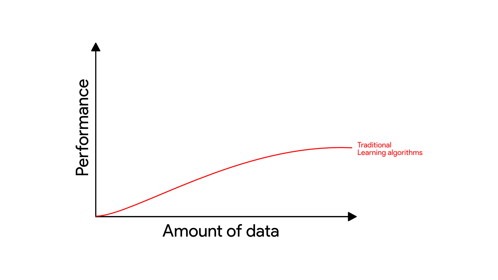
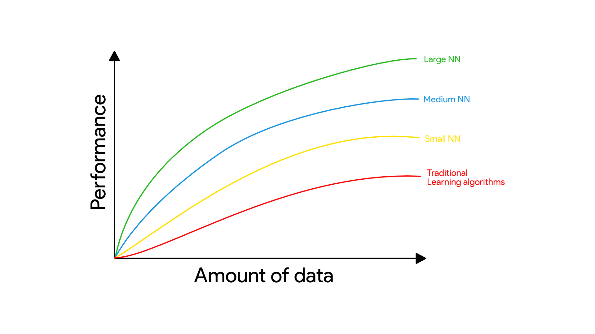
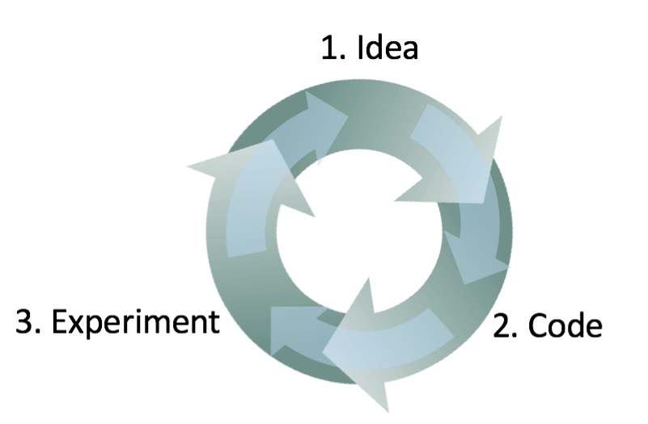
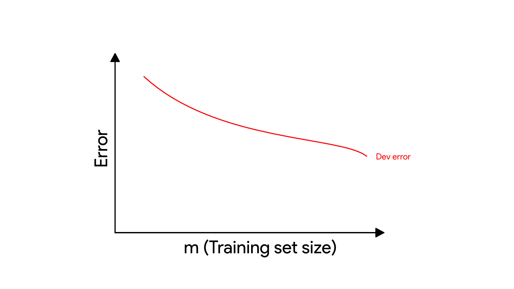
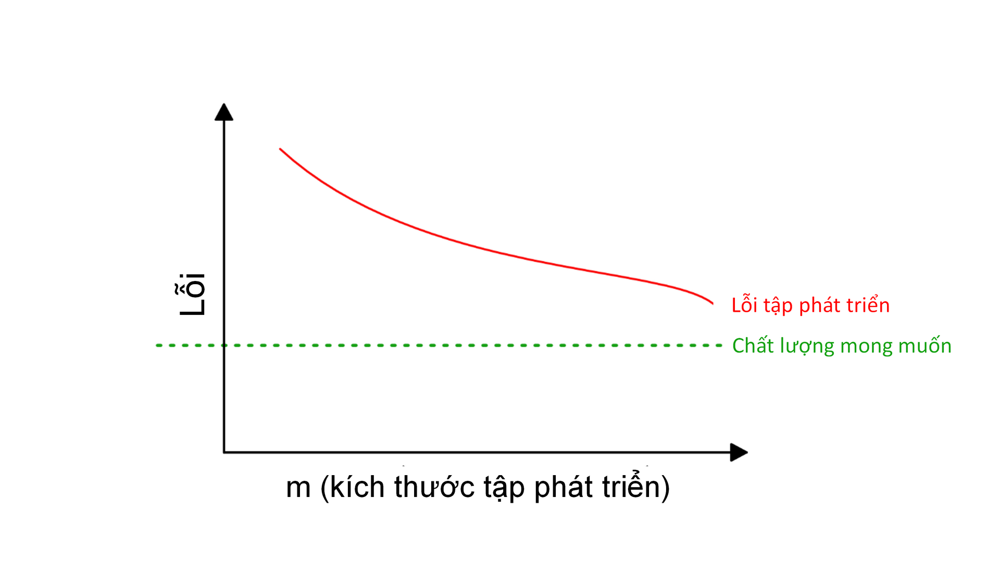
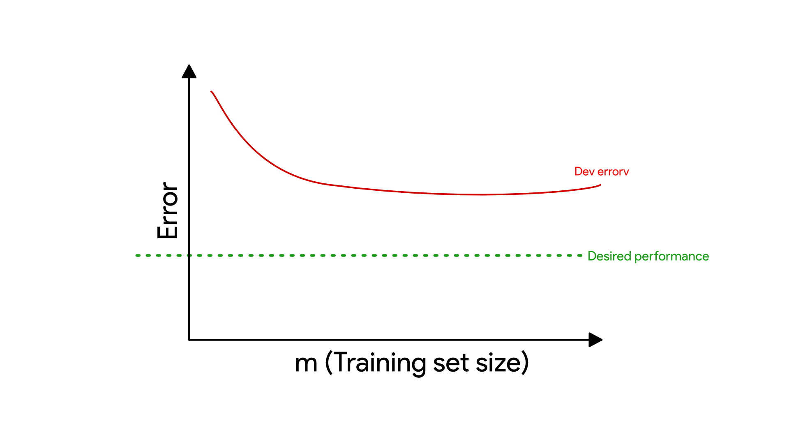
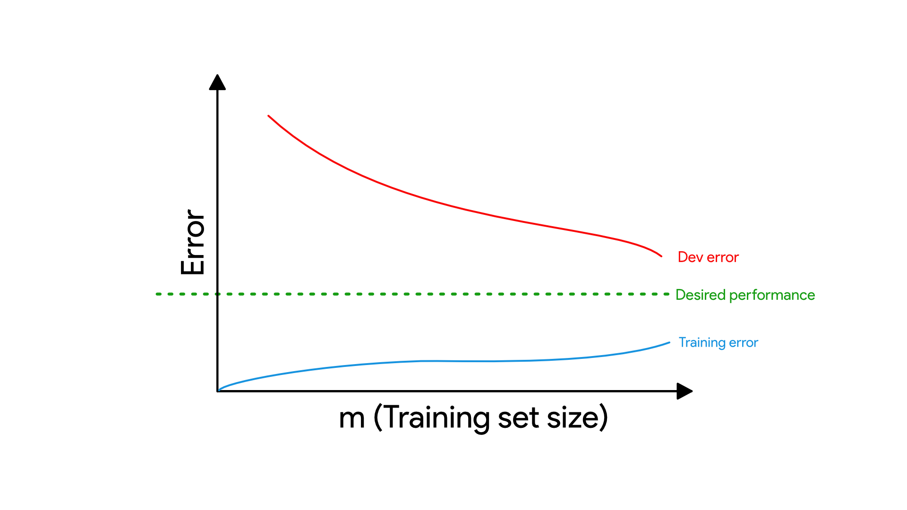

**MỤC LỤC**

* [1. Tại sao cần chiến lược Machine Learning](#1-tại-sao-cần-chiến-lược-machine-learning)
* [2. Cách sử dụng cuốn sách khi làm việc nhóm](#2-cách-sử-dụng-cuốn-sách-khi-làm-việc-nhóm)
* [3. Điều kiện tiên quyết và Ký hiệu](#3-điều-kiện-tiên-quyết-và-ký-hiệu)
* [4. Quy mô thúc đẩy quá trình phát triển machine learning](#4-quy-mô-thúc-đẩy-quá-trình-phát-triển-machine-learning)
* [5. Tập phát triển và tập kiểm tra](#5-tập-phát-triển-và-tập-kiểm-tra)
* [6. Tập phát triển và tập kiểm tra nên có cùng phân phối](#6-tập-phát-triển-và-tập-kiểm-tra-nên-có-cùng-phân-phối)
* [7. Tập phát triển/kiểm tra cần lớn đến mức nào?](#7-tập-phát-triểnkiểm-tra-cần-lớn-đến-mức-nào)
* [8. Thiết lập một phép đo đơn trị làm mục tiêu tối ưu](#8-thiết-lập-một-phép-đo-đơn-trị-làm-mục-tiêu-tối-ưu)
* [9. Phép đo tối ưu và phép đo thỏa mãn](#9-phép-đo-tối-ưu-và-phép-đo-thỏa-mãn)
* [10. Xây dựng một tập phát triển và một phép đo sẽ tăng tốc quá trình làm việc](#10-xây-dựng-một-tập-phát-triển-và-một-phép-đo-sẽ-tăng-tốc-quá-trình-làm-việc)
* [11. Khi nào cần thay đổi tập phát triển/kiểm tra và các phép đo](#11-khi-nào-cần-thay-đổi-tập-phát-triểnkiểm-tra-và-các-phép-đo)
* [12. Điều cần nhớ: Thiết lập các tập phát triển và kiểm tra](#12-điều-cần-nhớ-thiết-lập-các-tập-phát-triển-và-kiểm-tra)
* [13. Bạn mong muốn xây dựng một hệ thống phòng chống email rác mới. Nhóm của bạn có rất nhiều ý tưởng:](#13-bạn-mong-muốn-xây-dựng-một-hệ-thống-phòng-chống-email-rác-mới-nhóm-của-bạn-có-rất-nhiều-ý-tưởng)
* [14. Phân tích lỗi: đánh giá ý tưởng dựa trên tập phát triển](#14-phân-tích-lỗi-đánh-giá-ý-tưởng-dựa-trên-tập-phát-triển)
* [15. Đánh giá song song các ý tưởng trong quá trình phân tích lỗi](#15-đánh-giá-song-song-các-ý-tưởng-trong-quá-trình-phân-tích-lỗi)
* [16. Dọn dẹp những mẫu bị gán nhãn nhầm trong tập phát triển và tập kiểm tra](#16-dọn-dẹp-những-mẫu-bị-gán-nhãn-nhầm-trong-tập-phát-triển-và-tập-kiểm-tra)
* [17. Nếu bạn có một tập phát triển lớn, chia nó thành hai tập con và chỉ phân tích trên một tập](#17-nếu-bạn-có-một-tập-phát-triển-lớn,-chia-nó-thành-hai-tập-con-và-chỉ-phân-tích-trên-một-tập)
* [18. Tập phát triển Eyeball và Blackbox nên lớn như thế nào?](#18-tập-phát-triển-eyeball-và-blackbox-nên-lớn-như-thế-nào)
* [19. Điều cần nhớ: Phân tích lỗi cơ bản](#19-điều-cần-nhớ-phân-tích-lỗi-cơ-bản)
* [20. Độ chệch và Phương sai: Hai nguồn lớn của lỗi](#20-độ-chệch-và-phương-sai-hai-nguồn-lớn-của-lỗi)
* [21. Những ví dụ về Độ chệch và Phương sai](#21-những-ví-dụ-về-độ-chệch-và-phương-sai)
* [22. So sánh với tỉ lệ lỗi tối ưu](#22-so-sánh-với-tỉ-lệ-lỗi-tối-ưu)
* [23. Xử lý Độ chệch và Phương sai](#23-xử-lý-độ-chệch-và-phương-sai)
* [24. Sự đánh đổi giữa Độ chệch và Phương sai](#24-sự-đánh-đổi-giữa-độ-chệch-và-phương-sai)
* [25. Các kĩ thuật để giảm độ chệch có thể tránh được](#25-các-kĩ-thuật-để-giảm-độ-chệch-có-thể-tránh-được)
* [26. Phân tích lỗi trên tập huấn luyện](#26-phân-tích-lỗi-trên-tập-huấn-luyện)
* [27. Các kỹ thuật làm giảm phương sai](#27-các-kỹ-thuật-làm-giảm-phương-sai)
* [28. Chẩn đoán độ chệch và phương sai: Đồ thị quá trình học](#28-chẩn-đoán-độ-chệch-và-phương-sai-đồ-thị-quá-trình-học)
* [29. Vẽ đồ thị sai số huấn luyện](#29-vẽ-đồ-thị-sai-số-huấn-luyện)
------------------

# 1. Tại sao cần chiến lược Machine Learning 

Machine Learning là nền tảng cho hàng loạt ứng dụng quan trọng như tìm kiếm trang web, lọc thư điện tử spam, nhận dạng giọng nói, gợi ý sản phẩm, và nhiều ứng dụng khác nữa. Nếu bạn cùng các thành viên trong nhóm đang làm một dự án machine learning và rất muốn tiến triển nhanh chóng, thì quyển sách này là dành cho bạn.

 **Ví dụ: Xây dựng Startup về ảnh mèo** 

Giả sử bạn xây dựng công ty khởi nghiệp cung cấp không giới hạn ảnh mèo cho những người yêu thích. 

Bạn dùng mạng neural cho hệ thống thị giác máy nhận biết ảnh có hình mèo. Nhưng dở một cái là thuật toán bạn dùng chưa đủ độ chính xác. Bạn đang chịu rất nhiều áp lực để tăng chất lượng dự đoán tìm ảnh mèo. Bạn sẽ làm thế nào?

Nhóm bạn có thể đưa ra rất nhiều ý tưởng như:

* Lấy thêm dữ liệu: Sưu tầm thêm nhiều ảnh mèo.

* Lấy tập huấn luyện đa dạng hơn. Ví dụ như: ảnh mèo ở vị trí độc lạ, ảnh mèo với màu sắc khác thường, ảnh mèo được chụp với cấu hình máy ảnh khác nhau .v.v.

* Huấn luyện thuật toán lâu hơn bằng cách chạy nhiều vòng lặp gradient descent hơn. 
 

* Thử nghiệm mạng neural lớn hơn với nhiều tầng/nút ẩn/tham số hơn.

* Thử nghiệm mạng neural nhỏ hơn.

*  Thử nghiệm kỹ thuật regularization (ví dụ như L2 regularization)

*  Thay đổi kiến trúc mạng neural (ví dụ: hàm activation, số lượng nút ẩn, .v.v)

* ...

Nếu chọn đúng một trong những hướng kể trên, có thể bạn sẽ xây dựng nên một nền tảng ảnh mèo và startup thành công. Ngược lại, nếu chọn nhầm hướng, bạn có thể đánh mất cả tháng trời. Vậy phải làm như thế nào? 

Cuốn sách này sẽ giúp bạn trả lời câu hỏi đó. Phần lớn các vấn đề về machine learning đều có những dấu hiệu riêng ẩn chứa gợi ý về phương hướng giải quyết. Việc học để phát hiện ra những dấu hiệu đó sẽ giúp bạn tiết kiệm hàng tháng hay thậm chí hàng năm trời phát triển sản phẩm. 

------------------

# 2. Cách sử dụng cuốn sách khi làm việc nhóm

Sau khi đọc xong cuốn sách này, bạn sẽ hiểu sâu hơn về cách lựa chọn hướng giải quyết kỹ thuật cho đề tài machine learning. 

Nhưng có thể cộng sự của bạn không hiểu tại sao bạn lại chọn hướng đi như vậy. Có thể bạn muốn cả đội xác định và dùng một phép đo đơn trị, nhưng liệu tất cả thành viên đều đồng tình với quyết định đó? Và bạn sẽ làm gì để thuyết phục họ?

Đó là lý do tại sao tôi chủ tâm viết những chương rất ngắn. Bạn có thể dễ dàng thuyết phục quý đồng nghiệp bằng cách chia sẻ 1-2 trang bản in của chương liên quan.

Chỉ với một vài thay đổi nhỏ về thứ tự ưu tiên có thể tác động lớn tới năng suất công việc của cả nhóm. Và bằng những thay đổi đó, tôi hi vọng bạn sẽ sớm trở thành siêu nhân Machine Learning của cả đội!

------------------

# 3. Điều kiện tiên quyết và Ký hiệu

Nếu bạn đã từng học một lớp về Machine Learning ví dụ như lớp MOOC của tôi trên Coursera, hoặc bạn có kinh nghiệm áp dụng học có giám sát thì cuốn sách này sẽ dễ hiểu đối với bạn.

Tôi giả định rằng bạn đã quen thuộc với **học có giám sát**: học một hàm ánh xạ từ x tới y, sử dụng các cặp dữ liệu có nhãn (x,y). Các thuật toán học có giám sát bao gồm hồi quy tuyến tính, hồi quy logistic và mạng neural. Machine Learning có rất nhiều dạng tuy nhiên phần lớn các giá trị thực tiễn của nó hiện nay đến từ học có giám sát.

Tôi sẽ thường xuyên đề cập đến mạng neural (còn được biết đến là "deep learning"). Bạn chỉ cần nắm được một số khái niệm cơ bản về mạng neural là có thể hiểu được nội dung cuốn sách.

Nếu những khái niệm nêu trên còn mới với bạn thì bạn hãy xem các video ba tuần đầu tiên của khóa học Machine Learning trên Coursera tại http://ml-class.org

------------------

# 4. Quy mô thúc đẩy quá trình phát triển machine learning

Rất nhiều những ý tưởng của deep learning (mạng neural) đã xuất hiện từ hàng thập kỷ trước. Vậy tại sao tới bây giờ chúng mới bùng nổ như vậy?  

Hai nguyên nhân lớn nhất dẫn tới những phát triển gần đây của deep learning là:

* **Dữ liệu sẵn có**. Ngày nay, mọi người dành nhiều thời gian hơn bên những thiết bị số như máy tính xách tay, thiết bị di động, .v.v. Chính những thiết bị số này tạo ra nguồn dữ liệu cực lớn dùng cho những thuật toán học ngày nay.

* **Quy mô năng lực tính toán**. Cho tới một vài năm gần đây chúng ta mới có thể huấn luyện mạng neural đủ lớn để tận dụng những bộ dữ liệu khổng lồ này. 

Cho dù có thêm nhiều nhiều dữ liệu nữa, hiệu quả của thuật toán machine learning cổ điển như hồi quy logistic cũng không tăng. Nghĩa là đồ thị quá trình học chững lại và thuật toán ngừng cải thiện ngay cả khi có thêm dữ liệu:

Như thể thuật toán cổ điển không biết xử lý thế nào với tất cả lượng dữ liệu chúng ta đang có.

Nếu bạn huấn luyện một mạng neural nhỏ cho cùng một tác vụ học có giám sát thì bạn có thể đạt hiệu quả cao hơn một chút:

"Mạng neural nhỏ" ở đây có nghĩa là mạng neural với ít nút ẩn/tầng/tham số. Sau cùng, bạn có thể cải thiện chất lượng thêm nữa nếu dùng các mạng neural lớn hơn [1]: 

Vì thế bạn có thể đạt được kết quả tốt nhất khi (i) huấn luyện mạng neural rất lớn - tương ứng với đường chất lượng màu xanh lục và (ii) có lượng dữ liệu lớn. 

Nhiều chi tiết khác như kiến trúc mạng neural cũng rất quan trọng, và có nhiều sáng tạo trong lĩnh vực này. Tuy nhiên, một trong những cách đáng tin cậy hơn để tăng chất lượng thuật toán vẫn là (i) huấn luyện mạng lớn hơn và (ii) lấy thêm dữ liệu.

**Chú Thích**

[1] Mặc dù hình vẽ thể hiện mạng neural cho kết quả tốt hơn với tập dữ liệu nhỏ, nhưng hiện tượng này ít nhất quán hơn so với việc mạng neural hoạt động tốt với dữ liệu lớn. Với dữ liệu nhỏ, chất lượng thuật toán cổ điển có thể hoặc không tốt hơn mạng neural và phụ thuộc vào cách tạo đặc trưng thủ công. Nếu ta chỉ có 20 mẫu huấn luyện thì việc dùng hồi quy logistic hay mạng neural không khác biệt nhiều; việc xây dựng đặc trưng thủ công như thế nào sẽ mang lại sự khác biệt nhiều hơn so với việc chọn thuật toán. Còn nếu có một triệu mẫu, thì tôi sẽ chọn dùng mạng neural.

Quá trình đạt được (i) huấn luyện mạng lớn và (ii) tập dữ liệu lớn có thể phức tạp hơn bạn tưởng. Vấn đề này sẽ được thảo luận đầy đủ và chi tiết trong cuốn sách này. Chúng ta sẽ bắt đầu với các chiến lược chung, hữu ích cho cả thuật toán truyền thống lẫn mạng neural, và từ từ hình thành chiến lược mới nhất cho việc xây dựng các hệ thống deep learning.
------------------

# 5. Tập phát triển và tập kiểm tra

Trở lại với ví dụ bức ảnh mèo ở phần trước: khi bạn có một ứng dụng di động, và người dùng đang tải nhiều loại ảnh lên ứng dụng của bạn. Bạn muốn tự động tìm ra đâu là các bức ảnh mèo.

Nhóm của bạn có một tập dữ liệu lớn bằng cách tải các bức ảnh mèo (các mẫu dương) và các bức ảnh không có mèo (các mẫu âm) từ nhiều nguồn khác nhau. Tập dữ liệu này sau đó được chia 70%/30% thành tập huấn luyện và tập kiểm tra. Sử dụng tập dữ liệu này, bạn tạo ra một bộ nhận dạng mèo có thể hoạt động tốt ở cả tập huấn luyện và tập kiểm tra.

Tuy nhiên, khi triển khai bộ nhận dạng mèo này lên một ứng dụng di động, bạn lại thấy rằng kết quả rất tệ!

**Điều gì đã xảy ra?**

Bạn nhận ra rằng các bức ảnh được người dùng tải lên nhìn khác các bức ảnh mà bạn tải về từ trên mạng mà được dùng để xây dựng tập dữ liệu: do các bức ảnh được chụp bằng điện thoại thường có độ phân giải thấp hơn, bị nhòe (mờ) hoặc tối hơn. Do bộ nhận dạng được huấn luyện trên tập dữ liệu từ ảnh trên mạng nên nó không khái quát hóa tốt đến phân phối thực tế mà bạn cần nhắm đến: ảnh chụp từ điện thoại.

Trước kỷ nguyên big data, có một nguyên tắc chung trong machine learing là chia tập huấn luyện và kiểm tra ngẫu nhiên theo tỉ lệ 70%/30%. Cách chia này có thể hiệu quả, nhưng không phải là một ý tưởng tốt trong ngày càng nhiều ứng dụng nơi mà phân phối của tập huấn luyện (ảnh trên mạng trong ví dụ trên đây) khác với phân phối của dữ liệu bạn thực sự quan tậm (ảnh chụp từ điện thoại).

Chúng ta thường định nghĩa như sau:

* **Tập huấn luyện** — Là tập dữ liệu để chạy thuật toán học.

* **Tập phát triển** — Là tập dữ liệu được dùng để điều chỉnh lại các tham số, lựa chọn đặc trưng và quyết định các thay đổi liên quan đến thuật toán học. Đôi khi, nó còn được gọi là tập kiểm định chéo.

* **Tập kiểm tra** — Là tập dữ liệu dùng để đánh giá chất lượng của thuật toán học, nhưng không được dùng để quyết định các thay đổi liên quan đến thuật toán học hay các tham số.

Sau khi định nghĩa tập phát triển và tập kiểm tra, nhóm của bạn có thể thử nhiều ý tưởng khác nhau, ví dụ như các tham số khác nhau cho thuật toán học, để tìm ra ý tưởng tốt nhất. Tập phát triển và tập kiểm tra cho phép nhóm của bạn có thể đánh giá khả năng hoạt động của thuật toán một cách nhanh chóng.

Nói cách khác, **mục đích của tập phát triển và tập kiểm tra là hướng nhóm bạn tơí những thay đổi quan trọng nhất trong hệ thống machine learning**.

Vậy nên, bạn nên làm những điều sau đây:

Lựa chọn tập phát triển và tập kiểm tra sao cho có thể phản ánh dữ liệu bạn gặp phải trong tương lai và muốn hoạt động tốt trên nó.

Nói cách khác, tập kiểm tra không nên chỉ đơn thuần là 30% dữ liệu hiện có, đặc biệt là khi bạn mong đợi dữ liệu tương lai (ảnh chụp từ điện thoại) về bản chất sẽ khác với dữ liệu trong tập huấn luyện (ảnh từ trên mạng).

Khi ứng dụng di động chưa được triển khai thì bạn có thể chưa có người dùng nào cả, nên việc có thể có được dữ liệu phản ánh chính xác dữ liệu tương lai là rất khó. Nhưng bạn vẫn có thể thử làm gần giống dữ liệu đó. Ví dụ, bạn có thể nhờ bạn bè chụp những bức ảnh mèo bằng điện thoại và gửi cho bạn. Một khi ứng dụng được triển khai, bạn có thể cập nhật tập phát triển/kiểm tra bằng dữ liệu người dùng thực tế.

Nếu bạn thực sự không có cách nào để có được dữ liệu gần giống với dữ liệu tương lai thì bạn có thể sử dụng ảnh từ các trang web. Nhưng bạn nên nhận thức nguy cơ dẫn đến một hệ thống khái quát hóa không tốt.

Ta cần thẩm định để quyết định được cần phải tập trung bao nhiêu cho việc phát triển tập phát triển và tập kiểm tra. Tuy nhiên đừng đánh đồng phân phối giữa tập huấn luyện và tập kiểm tra. Hãy chọn ra những mẫu kiểm tra phản ánh cái mà bạn muốn thực hiện tốt, hơn là bất kì dữ liệu nào bạn tình cờ có được cho tập huấn luyện.

------------------
**Chương này đã được merge nhưng cần một lần chỉnh sửa văn phong nữa. Mong các bạn đóng góp bằng cách tạo Pull Request mới.**
-----------

# 6. Tập phát triển và tập kiểm tra nên có cùng phân phối

Dựa trên vị trí người dùng ứng dụng di động của bạn, tập dữ liệu ảnh mèo được tải lên từ bốn khu vực chính: (i) Hoa Kỳ, (ii) Trung Quốc, (iii) Ấn Độ, và (iv) Khu vực khác. Để tạo tập phát triển và tập kiểm tra, giả định như chúng ta lấy dữ liệu từ Hoa Kỳ và Ấn Độ để tạo tập phát triển; Trung Quốc và Khu vực khác để tạo tập kiểm tra. Nói cách khác, chúng ta có thể chọn ngẫu nhiên dữ liệu ảnh từ hai trong bốn khu vực trên làm tập phát triển, dữ liệu ảnh từ hai khu vực còn lại làm tập kiểm tra. Phân chia vậy liệu có đúng hay không?

Một khi bạn đã phân loại tập phát triển và tập kiểm tra, nhóm của bạn sẽ tập trung cải thiện kết quả trên tập phát triển. Bởi vậy, tập phát triển nên đại diện nhiệm vụ bạn muốn cải thiện nhiều nhất: hoạt động tốt trên dữ liệu không chỉ hai mà cả bốn thị trường.

Vấn đề thứ hai với việc tập phát triển và tập kiểm tra có phân phối khác nhau: Có khả năng nhóm của bạn xây dựng được một mô hình hoạt động tốt trên tập phát triển nhưng lại kém trên tập kiểm tra. Tôi đã từng thấy việc này (việc có phân phối khác nhau của hai tập dữ liệu) dẫn đến những kết quả đáng thất vọng và sự lãng phí về công sức. Hãy tránh để điều này xảy ra.

Ví dụ, nhóm của bạn phát triển một hệ thống hoạt động tốt trên tập phát triển nhưng kém trên tập kiểm tra. Nếu tập phát triển và tập kiểm tra có cùng một phân phối thì bạn có thể xác định ngay vấn đề: Mô hình của bạn đã overfit tập phát triển. Cách xử lý hiển nhiên nhất đó là bổ sung thêm dữ liệu cho tập phát triển.

Nhưng nếu tập phát triển và tập kiểm tra được tạo từ các phân phối khác nhau thì việc xác định vấn đề sẽ phức tạp hơn. Rất nhiều vấn đề có thể xảy ra:   

1. Bạn đã overfit tập phát triển.

2. Dữ liệu tập kiểm tra đa dạng (phức tạp) hơn tập phát triển. Thuật toán của bạn có thể đã hoạt động tốt trên tập phát triển, và không thể có thêm cải thiện đáng kể.

3. Tập kiểm tra có thể không khó hơn nhưng lại khác so với tập phát triển. Do đó mô hình có thể hoạt động tốt trên tập phát triển nhưng lại kém trên tập kiểm tra. Trong trường hợp này, việc cố gắng cải thiện mô hình để hoạt động tốt trên tập phát triển có thể trở nên vô nghĩa.

Nhiều vấn đề phức tạp có thể xảy ra khi làm việc với các ứng dụng machine learning. Tập phát triển và kiểm tra không nhất quán dẫn đến sự không chắc chắn về việc liệu rằng cải thiện hiệu quả trên tập phát triển có giúp cải thiện hiệu quả trên tập kiểm tra. Sự không nhất quán này khiến việc tìm ra nguyên nhân và sắp xếp hướng giải quyết trở nên khó khăn hơn vì không biết mô hình gặp vấn đề ở đâu. Tập phát triển và tập kiểm tra khác nhau cũng khiến cho việc xác định vấn đề trở nên khó khăn hơn, nhất là trong việc lựa chọn các công việc ưu tiên cần thiết để cải thiện mô hình.

Nếu bạn đang làm việc với một bài toán đánh giá xếp hạng của bên thứ ba, họ có thể cung cấp tập phát triển và tập kiểm tra có phân phối khác nhau. Nếu so sánh với bài toán có tập phát triển và tập kiểm tra đến từ cùng phân phối, bài toán này có kết quả phụ thuộc nhiều vào may mắn hơn là kỹ năng của bạn. Việc phát triển các thuật toán mà mô hình được huấn luyện trên một phân phối để khái quát hóa tốt trên một phân phối khác là một vấn đề quan trọng trong nghiên cứu. Tuy nhiên, nếu mục tiêu của bạn là cải thiện một ứng dụng machine learning cụ thể thay vì tạo ra tiến triển trong nghiên cứu, tôi khuyên bạn chọn tập phát triển và tập kiểm tra đến từ cùng phân phối. Điều này sẽ khiến nhóm bạn làm việc hiệu quả hơn.

------------------

# 7. Tập phát triển/kiểm tra cần lớn đến mức nào?

Tập phát triển phải đủ lớn để nhận ra sự khác biệt giữa các thuật toán đang thử nghiệm. Ví dụ, nếu bộ phân loại A có độ chính xác 90,0% và bộ phân loại B có độ chính xác 90,1%, thì một tập phát thiển có 100 mẫu sẽ không thể phát hiện sự khác biệt 0,1% này. So với các vấn đề khác trong machine learning mà tôi đã thấy, một tập phát triển chỉ với 100 mẫu là nhỏ. Các tập phát triển thường có từ 1.000 tới 10.000 mẫu. Với 10.000 mẫu, bạn sẽ có thể thấy sự cải thiện ở mức 0,1%. [2]

Trong các ứng dụng quan trọng và đã đã đưa vào khai thác -- ví dụ như quảng cáo, tìm kiếm trên web và gợi ý sản phẩm -- tôi đã thấy nhiều nhóm rất muốn cải thiện chất lượng thuật toán dù chỉ là 0,01%, vì nó có ảnh hưởng trực tiếp đến lợi nhuận của công ty. Trong trường hợp này, tập phát triển có thể lớn hơn 10.000 mẫu rất nhiều để có thể phát hiện ra những cải tiến thậm chí nhỏ hơn.

Vậy còn kích thước của tập kiểm tra thì sao? Nó cần đủ lớn để mang lại độ tin cậy cao về hiệu quả tổng thể của hệ thống. Một công thức thực nghiệm phổ biến là sử dụng 30% dữ liệu làm tập kiểm tra. Cách làm này hiệu quả với những tập dữ liệu với lượng mẫu khiêm tốn từ 100 tới 10.000. Tuy nhiên, trong kỷ nguyên big data với những bài toán machine learning đôi khi có nhiều hơn một tỷ mẫu, tỉ lệ dữ liệu dùng cho tập phất triển và tập kiểm tra đã giảm xuống đáng kể, mặc dù số lượng mẫu trong hai tập này vẫn tăng lên. Thực sự không cần có tập phát triển/kiểm tra lớn quá mức để đánh giá hiệu quả của các thuật toán.

**CHÚ THÍCH:**

[2] Trên lý thuyết, ta cũng có thể kiểm tra xem một thay đổi trong thuật toán có tạo ra sự khác biệt có ý nghĩa thống kê trên tập phát triển hay không. Trong thực tế, hầu hết mọi người đều không quan tâm đến điều này (trừ khi họ muốn công bố các các bài báo khoa học). Tôi thường thấy các bài kiểm định thống kê không mấy hữu ích trong việc đánh giá tiến độ phát triển.

------------------

# 8. Thiết lập một phép đo đơn trị làm mục tiêu tối ưu

Độ chính xác trong phân loại là ví dụ của **phép đo đơn trị** -- phép đo được biểu diễn bằng chỉ một con số. Khi chạy bộ phân loại trên một tập phát triển (hoặc tập kiểm tra), độ chính xác được tính bằng chỉ số thể hiện tỉ lệ mẫu được phân loại chính xác trên tổng số mẫu trong tập đó. Theo phép đo này, nếu độ chính xác của bộ phân loại A là 97% và của bộ phân loại B là 90% thì ta kết luận rằng bộ phân loại A cho kết quả tốt hơn.

Ngược lại, Precision và Recall[3] không phải là một phép đo đơn trị: có hai chỉ số được sử dụng để đánh giá bộ phân loại. Việc so sánh các thuật toán với nhau sẽ trở nên khó hơn với những phép đo đa trị -- những phép đo được biểu diễn bằng nhiều hơn một số. Giả sử thuật toán trả về kết quả như sau:

Ở đây, không bộ phân loại nào tốt hơn một cách rõ ràng, vì vậy dựa vào kết quả trên ta không thể ngay lập tức chọn ra một bộ phân loại tốt hơn.

| Bộ Phân Loại  | Precision | Recall |
| ----- | -------: | -------: |
| A  | 95%  | 90% |
| B  | 98%  | 85% |

Trong quá trình phát triển, nhóm bạn sẽ thử rất nhiều ý tưởng liên quan đến cấu trúc thuật toán, tham số mô hình, lựa chọn các đặc trưng, v.v.. Việc có một **phép đo đơn trị** như độ chính xác sẽ giúp xếp hạng các mô mình dựa theo những kết quả trả về qua phép đo đó, từ đó nhanh chóng quyết định mô hình nào hoạt động tốt nhất.

Nếu bạn thực sự quan tâm đến cả Precision lẫn Recall. Tôi gợi ý sử dụng một trong những cách tiêu chuẩn để kết hợp các chỉ số đó thành một chỉ số duy nhất. Ví dụ, một người có thể lấy giá trị trung bình của Precision và Recall rồi thu về một phép đo đơn trị. Hoặc thay vào đó, bạn có thể tính "chỉ số F1", một biến thể của trung bình cộng, thường hoạt động tốt hơn việc chỉ lấy giá trị trung bình.

Việc có một phép đo đơn trị sẽ giúp tăng tốc khả năng đưa ra quyết định của bạn khi bạn phải lựa chọn trong một số lượng lớn bộ phân loại. Phép đo đơn trị đưa ra ưu tiên rõ ràng trong việc phân hạng những thuật toán đó, tạo ra những đường hướng rõ ràng để phát triển. 

| Bộ Phân Loại | Precision | Recall | Chỉ số F1 |
| ----- | -------: | -------: | -----: |
| A  | 95%  | 90% | 92.4% |
| B  | 98%  | 85% | 91.0% |

Một ví dụ cuối cùng, giả sử bạn đang theo dõi riêng biệt về độ chính xác của bộ phân loại mèo trong bốn thị trường trọng điểm: (i) Mĩ, (ii) Trung Quốc, (iii) Ấn Độ, và (iv) những nước khác. Bạn sẽ thu về bốn phép đo. Bằng cách lấy giá trị trung bình hoặc giá trị trung bình có trọng số của bốn chỉ số này, bạn sẽ thu được một phép đo đơn trị. Tính toán giá trị trung bình hoặc giá trị trung bình có trọng số là một trong những cách phổ biển nhất để kết hợp nhiều phép đo thành một.

**CHÚ THÍCH:**

[3] Precision của một bộ phân loại mèo là tỉ lệ những ảnh được phân nhãn chính xác là mèo trong tập phát triển (hoặc tập kiểm tra) trên tổng số những ảnh được bộ phân loại phân nhãn mèo trong cùng tập đó. Recall của bộ phân loại đó là số phần trăm của tất cả ảnh mèo ở trong tập phát triển (hoặc tập kiểm tra) được phân loại chính xác là mèo trong cùng tập đó. Thường có một sự đánh đổi giữa việc có chỉ số precision cao và chỉ số recall cao.

[4] Nếu bạn muốn đọc thêm về chỉ số F1, xem [https://en.wikipedia.org/wiki/F1_score](https://en.wikipedia.org/wiki/F1_score). Chỉ số F1 là trung bình điều hoà của Precision và Recall, được tính bằng 2/((1/Precision) + (1/Recall))

------------------

# 9. Phép đo tối ưu và phép đo thỏa mãn

Đây là một cách khác để kết hợp nhiều phép đo.

Giả sử bạn quan tâm đến cả độ chính xác lẫn thời gian chạy của một thuật toán học nào đó. Bạn cần phải chọn trong ba bộ phân loại sau:

| Bộ phân loại  | Độ chính xác | Thời gian chạy |
| ----- | -------: | -------: |
| A  | 90%  | 80ms |
| B  | 92%  | 95ms |
| C  | 95%  | 1,500ms |

Việc tạo ra một phép đo đơn trị bằng cách đưa cả độ chính xác và thời gian chạy vào trong một công thức có vẻ không tự nhiên, ví dụ như:

Độ chính xác - 0.5*(Thời gian chạy)

Thay vào đó, bạn có thể làm như sau: Trước hết định nghĩa thế nào là một mốc thời gian chạy "chấp nhận được". Giả sử mốc dưới 100ms là chấp nhận được. Sau đó, hãy cực đại hóa độ chính xác, với ràng buộc là bộ phân loại đó vẫn đảm bảo yêu cầu về thời gian chạy. Ở đây, thời gian chạy là một "phép đo thỏa mãn" - bộ phân loại của bạn chỉ cần "đủ tốt" về mặt này (thời gian), theo nghĩa nó chỉ được phép chạy trong thời gian ít hơn 100ms. Độ chính xác mới là "phép đo tối ưu".

Nếu bạn phải cân bằng giữa N tiêu chí khác nhau, ví dụ như kích thước file nhị phân của mô hình (điều này quan trọng với các ứng dụng di động, vì người dùng không muốn tải về những ứng dụng có kích thước lớn), thời gian chạy, và độ chính xác, bạn có thể cân nhắc đặt N-1 trong số các tiêu chí là các phép đo "thỏa mãn". Có nghĩa là bạn chỉ cần yêu cầu chúng đạt giá trị nào đó. Sau đó coi tiêu chí còn lại là phép đo "tối ưu". Ví dụ như đặt mức ngưỡng chấp nhận được cho kích thước file nhị phân và thời gian chạy, sau đó tối ưu độ chính xác với điều kiện các ràng buộc trên vẫn được thỏa mãn.

Ví dụ cuối cùng, giả sử bạn cần xây dựng một thiết bị phần cứng có sử dụng microphone để nghe người dùng nói một từ "đánh thức" đặc biệt nào đó để đánh thức hệ thống. Ví dụ về từ đánh thức như Amazon Echo với "Alexa"; Apple Siri với "Hey Siri"; Android với "Hey Google" hay các ứng dụng của Baidu với "Hello Baidu". Bạn quan tâm đến cả tần suất dương tính giả (hay báo động nhầm) - tần suất mà hệ thống thức dậy khi không ai nói cụm đánh thức - cũng như tần suất âm tính giả (hay bỏ sót) - tần suất hệ thống không thức dậy khi có người nói cụm đánh thức. Một mục tiêu khả dĩ cho hệ thống này là tối thiểu hóa tần suất âm tính giả (phép đo tối ưu), trong ràng buộc rằng không có nhiều hơn một báo động nhầm cho mỗi 24 giờ hoạt động (phép đo thỏa mãn).

Một khi nhóm của bạn thống nhất về việc phép đo nào cần được tối ưu, cả nhóm sẽ đạt tiến độ nhanh hơn.

------------------

# 10. Xây dựng một tập phát triển và một phép đo sẽ tăng tốc quá trình làm việc

Thật sự rất khó để đoán trước phương án tiếp cận nào tốt nhất cho một vấn đề mới. Kể cả những nhà nghiên cứu Machine Learning dày dặn kinh nghiệm cũng thường thử nghiệm cả chục ý tưởng mới khám phá ra cái gì đó thỏa mãn. Khi xây dựng một hệ thống Machine Learnig, tôi thường: 

1. Bắt đầu với một vài ý tưởng xây dựng hệ thống.

2. Hiện thực hóa ý tưởng dưới dạng code.

3. Tiến hành một **thí nghiệm** cho đo tính khả thi của ý tưởng. (Thường thì một số ý tưởng đầu tiên sẽ không khả thi!) Từ những kết quả đó, chúng ta quay lại thử nghiệm thêm những ý tưởng mới và cứ thế lặp lại.

Đây là một quá trình lặp đi lặp lại. Hoàn thiện vòng lặp càng nhanh, thì càng sớm cải thiện kết quả. Đó là lý do tại sao có tập phát triển/thử nghiệm và một phép đo là rất quan trọng: Việc đánh giá chất lượng của mỗi ý tưởng trên tập phát triển giúp xác định liệu chúng ta có đi đúng hướng.

Ngược lại, giả sử bạn không có một tập phát triển và phép đo cụ thể. Như vậy mỗi khi nhóm của bạn phát triển một bộ phân loại mèo mới, bạn sẽ phải tích hợp nó vào ứng dụng, và ngồi thử nghiệm ứng dụng đó một vài tiếng để kiểm tra liệu bộ phân loại mới có cải thiện hay không. Quá trình này sẽ cực kì chậm! Đồng thời, nhóm của bạn sẽ rất khó nhận ra sự khác biệt nếu độ chính xác chỉ cải thiện từ 95.0% lên 95.1%, bạn sẽ không thể phát hiện sự cải thiện 0.1% đó chỉ qua việc ngồi thử nghiệm trên ứng dụng. Và hệ thống sau cùng là tích lũy của rất nhiểu bước cải thiện nhỏ 0.1%. Có một tập phát triển và phép đo cho phép bạn nhanh chóng phát hiện ra ý tưởng nào sẽ đem lại những cải tiến nhỏ (hoặc lớn), và từ đó bạn có thể quyết định những ý tưởng nào cần hoàn thiện thêm hoặc loại bỏ.

------------------

# 11. Khi nào cần thay đổi tập phát triển/kiểm tra và các phép đo

Khi bắt đầu một dự án, tôi luôn cố gắng chọn tập phát triển/kiểm tra thật nhanh để tạo một mục tiêu rõ ràng cho cả nhóm.

Tôi thường yêu cầu các nhóm của tôi xác định tập phát triển/kiểm tra và một phép đo ban đầu trong ít hơn một tuần, rất hiếm khi lâu hơn. Tốt hơn hết là có được những điều này, kể cả chưa hoàn hảo, và bắt đầu nhanh chóng hơn là suy nghĩ quá nhiều về chúng. Tuy nhiên, thời hạn một tuần không áp dụng với các ứng dụng đã phát triển. Ví dụ, chống thư rác là một ứng dụng deep learning đã phát triển. Tôi từng thấy những nhóm làm việc với những hệ thống đã phát triển dành hàng tháng để tạo được những tập phát triển/kiểm tra tốt hơn.

Nếu sau đó bạn nhận ra rằng tập phát triển/kiểm tra hoặc phép đo ban đầu không phù hợp với mục tiêu đặt ra, bằng mọi giá hãy thay đổi chúng một cách nhanh chóng. Chẳng hạn, nếu bộ phân loại A được đánh giá tốt hơn bộ phân loại B theo phép đo trên tập phát triển ban đầu, nhưng nhóm nghĩ rằng bộ phân loại B thực ra cho kết quả tốt hơn nhiều trên sản phẩm, điều này có thể là dấu hiệu cho thấy bạn cần thay đổi tập phát triển/kiểm tra hoặc phép đo.

Có ba nguyên nhân chính khiến việc tập phát triển/phép đo sai sót trong việc đánh giá bộ phân loại A cao hơn:

**1. Phân phối thực tế mà bạn cần làm tốt khác với phân phối của tập phát triển/kiểm tra.**

Giả sử tập phát triển/kiểm tra ban đầu chủ yếu có ảnh mèo trưởng thành. Sau khi chạy ứng dụng, bạn nhận ra rằng thành viên thường tải lên nhiều ảnh mèo con hơn dự tính. Khi đó, phân phối của tập phát triển/kiểm tra không đại diện cho phân phối thực tế mà cần bạn hướng tới. Trong trường hợp này, bạn cần cập nhật tập phát triển/kiểm tra sao cho chúng có tính đại diện hơn.

**2. Mô hình của bạn đã overfit tập phát triển.**

Quá trình lặp đi lặp lại việc đánh giá những ý tưởng trên tập phát triển khiến thuật toán dần "overfit" tập dữ liệu này. Sau quá trình phát triển, bạn sẽ đánh giá mô hình trên tập kiểm tra. Nếu bạn thấy rằng hiệu quả trên tập phát triển tốt hơn nhiều do với hiệu quả trên tập kiểm tra, đây là dấu hiệu bạn đã overfit tập phát triển. Trong trường hợp này, bạn hãy tạo một tập phát triển hoàn toàn mới.

Nếu bạn cần theo dõi tiến trình của nhóm, bạn cũng có thể đánh giá hệ thống thường xuyên -- chẳng hạn mỗi tuần hoặc mỗi tháng một lần -- trên tập kiểm tra. Tuy nhiên, không được sử dụng tập kiểm tra để ra quyết định thay đổi thuật toán, bao gồm việc quay lui về hệ thống trước đó. Nếu bạn làm vậy, bạn sẽ bắt đầu overfit tập kiểm tra, và không thể tiếp tục dựa vào nó để tạo ra một đánh giá hoàn toàn không thiên lệch cho hiệu quả của hệ thống (đánh giá này bạn sẽ cần nếu bạn xuất bản công trình nghiên cứu, hoặc có thể sử dụng phép đo này để ra những quyết định quan trọng trong kinh doanh).

**3. Phép đo không phù hợp với mục tiêu tối ưu của dự án.**

Giả sử trong ứng dụng mèo, phép đo của bạn là độ chính xác phân loại. Phép đo này hiện tại xếp hạng bộ phân loại A tốt hơn bộ phân loại B. Tuy nhiên, giả sử bạn thử cả hai thuật toán, và nhận ra rằng bộ phân loại A thi thoảng chấp nhận những bức ảnh khiêu dâm. Ngay cả khi bộ phân loại A chính xác hơn, ấn tượng xấu gây ra bởi một vài bức ảnh khiểu dâm đồng nghĩa với việc hiệu quả của nó là không chấp nhận được. Bạn sẽ làm gì?

Ở đây, phép đo thất bại trong việc xác định được thực tế Thuật toán B tốt hơn Thuật toán A trong sản phẩm của bạn. Bởi vậy, bạn không thể đặt niềm tin vào phép đo này để chọn thuật toán tốt nhất. Đây là lúc phải thay đổi phép đo. Ví dụ, bạn có thể thay đổi phép đo sao cho nó "phạt" thật nặng nếu một thuật toán chấp nhận ảnh khiêu dâm. Tôi khuyên bạn chọn một phép đo mới và sử dụng phép đo này để định nghĩa lại mục tiêu rõ ràng cho nhóm, hơn là tiếp tục chọn ra một cách thủ công trong số các bộ phân loại khi không có một phép đo đáng tin.

Việc thay đổi tập phát triển/kiểm tra hoặc phép đo trong một dự án là khá phổ biến. Có một tập phát triển/kiểm tra và phép đo ban đầu giúp bạn hoàn thành chu kỳ phát triển một cách nhanh chóng. Nếu bạn nhận ra rằng tập phát triển/kiểm tra hoặc phép đo không còn giúp nhóm đi đúng hướng, không sao cả! Chỉ cần thay chúng và đảm bảo nhóm biết về hướng đi mới.

------------------

# 12. Điều cần nhớ: Thiết lập các tập phát triển và kiểm tra

* Chọn tập phát triển và tập kiểm tra từ một phân phối phản ánh dữ liệu bạn dự tính nhận được trong tương lai và muốn hoạt động tốt trên nó. Phân phối này có thể không giống phân phối dữ liệu huấn luyện của bạn.

* Chọn tập phát triển và kiểm tra từ cùng một phân phối xác suất nếu có thể.

* Chọn một phép đo đơn trị để tối ưu hóa. Nếu có nhiều thông số cần quan tâm, hãy kết hợp chúng thành một công thức duy nhất (chẳng hạn như lấy trung bình của các phép đo) hoặc định nghĩa phép đo thỏa mãn và phép đo để tối ưu.

* Machine learning là một quá trình lặp đi lặp lại: Bạn có thể phải thử hàng tá ý tưởng trước khi tìm thấy một ý tưởng mà bạn hài lòng.

* Có tập phát triển/kiểm tra và một phép đo đơn trị giúp bạn nhanh chóng đánh giá các thuật toán và do đó lặp lại nhanh hơn.

* Khi bắt đầu trên một ứng dụng hoàn toàn mới, cố gắng thiết lập tập phát triển/kiểm tra và một phép đo một cách nhanh chóng, trong vòng chưa đầy một tuần. Với các ứng dụng đã được phát triển, quá trình này có thể kéo dài hơn.

* Việc chia dữ liệu huấn luyện/kiểm tra theo tỉ lệ 70%/30% không áp dụng cho các bài toán với nhiều dữ liệu; tập phát triển và kiểm tra có thể chiếm ít hơn con số 30% rất nhiều.

* Tập phát triển của bạn phải đủ lớn để phát hiện các thay đổi có ý nghĩa đối với độ chính xác của thuật toán, nhưng không nhất thiết phải lớn hơn nhiều. Tập kiểm tra phải đủ lớn để cung cấp cho bạn ước lượng đáng tin cậy về hiệu quả cuối cùng của hệ thống.

* Nếu tập phát triển và phép đo không còn chỉ cho nhóm của bạn đi đúng hướng, hãy nhanh chóng thay đổi chúng: (i) Nếu thuật toán đã overfit tập phát triển, hãy thu thập thêm dữ liệu cho tập này. (ii) Nếu phân phối xác suất thực tế mà bạn quan tâm khác với phân phối xác suất của tập phát triển/kiểm tra, hãy tạo tập phát triển và kiểm tra mới. (iii) Nếu phép đo không còn đo lường được điều quan trọng nhất với bạn, hãy thay đổi phép đo.

------------------

# 13. Bạn mong muốn xây dựng một hệ thống phòng chống email rác mới. Nhóm của bạn có rất nhiều ý tưởng:

Thu thập một tập huấn luyện lớn về email rác. Ví dụ như thiết lập một Honeypot (Mồi nhử): cố ý gửi các địa chỉ email giả đến những spammer đã biết, và bạn có thể thu thập các tin nhắn rác mà họ gửi đến địa chỉ đó một cách tự động.

Phát triển những tính năng để hiểu được nội dung văn bản trong email.

Phát triển những tính năng để hiểu được các đặc tính của phông thư/nhãn thư từ email nhằm hiển thị tập hợp các máy chủ internet mà thư đã đi qua.

* và nhiều hơn thế.

Mặc dù tôi đã kinh qua rất nhiều trong việc phòng chống email rác, tôi vẫn sẽ gặp khó khăn khi phải chọn một trong các hướng đi trên. Điều này sẽ còn khó hơn nếu bạn không phải là một chuyên gia trong lĩnh vực này.

Vì vậy, bạn không nên bắt đầu bằng việc thiết kế và xây dựng một hệ thống hoàn hảo. Thay vào đó, hãy xây dựng và huấn luyện nhanh một hệ thống cơ bản - có thể là trong vài ngày[5]. Ngay cả khi hệ thống cơ bản khác xa với hệ thống tốt nhất mà bạn có thể xây dựng, nó vẫn có giá trị để kiểm tra cách thức hoạt động của hệ thống cơ bản này: bạn sẽ nhanh chóng tìm ra được những dấu hiệu sẽ chỉ cho bạn những hướng đi hứa hẹn nhất để đầu tư thời gian của bạn. Trong những chương tiếp theo sẽ chỉ cho bạn cách tìm thấy những dấu hiệu này.

**CHÚ THÍCH:**

Lời khuyên này dành cho những độc giả có mong muốn xây dựng các ứng dụng AI, hơn là những người có mục tiêu là xuất bản những bài báo học thuật. Tôi sẽ quay trở lại với chủ đề nghiên cứu này sau.

------------------
# 14. Phân tích lỗi: đánh giá ý tưởng dựa trên tập phát triển 

Khi kiểm thử ứng dụng nhận dạng mèo, bạn thấy rẳng một số bức ảnh chó bị nhận nhầm. Nhìn chúng tương đối giống mèo!

Một thành viên trong nhóm đề xuất tích hợp vào hệ thống phần mềm của bên thứ ba. Việc kết hợp này có thể giúp hệ thống phân biệt tốt hơn các bức ảnh chó. Có thể mất một tháng để hoàn thành quá trình tích hợp và người đề xuất ý tưởng rất hào hứng. Liệu bạn có nên yêu cầu thành viên đó bắt đầu công việc? 

Trước khi bỏ ra một tháng thực hiện, bạn nên ước lượng công việc này có thể cải thiện độ chính xác của hệ thống tới mức nào. Từ đó,bạn sẽ có thể quyết định xem có đáng bỏ ra chừng đó thời gian vào việc phát triển hay là dành nó cho những việc khác. 

Cụ thể, bạn có thể làm theo các bước sau:
1. Thu thập 100 mẫu trong tập phát triển mà ứng dụng của bạn phân loại nhầm — không phải mèo nhưng được phân loại là mèo và ngược lại.
2. Nhìn vào những mẫu trên và đếm xem bao nhiêu trong số đó là ảnh chó.

Quá trình nhìn vào những mẫu bị phân loại nhầm được gọi là **phân tích lỗi**. Trong ví dụ này, nếu bạn nhận thấy rằng chỉ 5% lỗi là chó nhầm thành mèo thì cho dù cải thiện thuật toán theo hướng tích hợp phần mềm nhận dạng chó vào ứng dụng, bạn không thể loại bỏ quá 5% số ảnh bị nhận dạng sai. Nói cách khác, 5% là “cận trên” (số lượng tối đa có thể đạt được) cho mức độ cải thiện mà hướng đi trên có thể giúp cho hệ thống. Nếu như độ chính xác ban đầu của ứng dụng là 90% (10% lỗi), việc cải thiện chỉ làm cho hệ thống của bạn đạt được độ chính xác mới là 90.5% (9.5% lỗi, ít hơn 5% so với số lượng lỗi ban đầu). 

Ngược lại, nếu bạn nhận thấy rằng 50% lỗi là do chó bị nhầm thành mèo thì bạn có thể tự tin rằng phương án được đề xuất sẽ có tác động lớn. Nó có thể cải thiện đáng kể độ chính xác của hệ thống từ 90% lên 95% (giảm 50% tổng số lỗi, từ 10% xuống 5%). 

Cách phân tích lỗi đơn giản ở trên giúp bạn ước lượng nhanh hiệu quả của việc tích hợp phần mềm nhận dạng chó của bên thứ ba vào hệ thống nhận dạng mèo. Đây cũng là cơ sở định lượng để bạn lựa chọn xem có nên đi theo hướng này hay không.

Việc **phân tích lỗi** thường giúp bạn nhìn thấy được triển vọng của những hướng giải quyết khác nhau. Tôi thấy nhiều kỹ sư tiến hành phân tích lỗi môt cách miễn cưỡng. Dường như đối với họ ngay lập tức thực hiện một số ý tưởng sẽ thú vị hơn là tự hỏi xem ý tưởng đó có thật sự đáng để bạn bỏ thời gian thực hiện. Đây là một lỗi phổ biến: nó có thể gây lãng phí hàng tháng chỉ để nhận ra rằng sự cải thiện là không đáng kể.

Quan sát 100 mẫu để phân tích lỗi không tốn nhiều thời gian. Kể cả khi bạn bỏ ra một phút để kiểm tra từng ảnh, thời gian tổng cộng vẫn nhỏ hơn hai giờ. Nếu như ý tưởng kia không tốt, bỏ ra hai giờ phân tích lỗi này có thể giúp bạn tiết kiệm được một tháng.  

Việc phân tích lỗi là quá trình kiểm tra các mẫu trong tập phát triển bị phân loại nhầm, từ đó bạn có thể hiểu được nguyên nhân.  Hiểu rõ nguyên nhân tạo ra lỗi sẽ giúp bạn nhìn ra những hướng giải quyết mới mà chúng ta sẽ thảo luận ở phần sau. Một số chương tiếp theo sẽ trình bày những "best practices" được dùng để phân tích lỗi. 

------------------

# 15. Đánh giá song song các ý tưởng trong quá trình phân tích lỗi

Nhóm của bạn có một số ý tưởng cải thiện ứng dụng nhận dạng mèo:

* Sửa lỗi nhận dạng chó thành mèo trong thuật toán.

* Sửa lỗi nhận dạng thú họ mèo (sư tử, báo, v.v) thành mèo nhà (thú nuôi).

* Cải thiện hiệu quả của hệ thống trên ảnh mờ.

* ...

Bạn có thể đánh giá song song tất cả các ý kiến trên một cách hiệu quả. Tôi thường tạo một bảng và điền vào đó khi phân tích ~100 ảnh phân loại nhầm trong tập phát triển. Tôi cũng ghi chú ngắn gọn để ghi nhớ những trường hợp đặc biệt. Để minh họa cho quá trình này, bạn có thể tham khảo bảng được tạo ra từ một tập phát triển nhỏ với bốn mẫu dưới đây:

| Ảnh        | Chó       | Thú Họ Mèo | Ảnh Mờ    | Ghi chú                                    |
| :-------:  | :-------: | :-------:  | :-------: | :-------:                                  |
| 1          | ✔         |            |           | Chó pitbull có màu lạ                      |
| 2          |           |            | ✔         |                                            |
| 3          |           | ✔          | ✔         | Ảnh sư tử chụp ở sở thú trong một ngày mưa |
| 4          |           | ✔          |           | Một con báo bị khuất sau cây               |
| **Tổng %** | 25%       | 50%        | 50%       |                                            |

Bảng #3 ở trên có cả hai cột Thú Họ Mèo và Ảnh Mờ được đánh dấu. Thêm vào đó, bởi vì một mẫu có thể nằm ở nhiều hạng mục, tổng phần trăm của hàng cuối có thể không đạt 100%.

Mặc dù bạn có thể tạo các hạng mục (Chó, Thú Họ Mèo, Ảnh Mờ) từ trước và sau đó phân loại các mẫu thủ công, thực tế trong quá trình phân tích mẫu, bạn có thể có những ý tưởng mới để tạo thêm các hạng mục. Ví dụ: bạn phân loại hàng chục bức ảnh và nhận ra nhiều lỗi xảy ra ở những tấm ảnh chỉnh bởi bộ lọc Instagram. Bạn có thể quay lại và thêm cột "Instagram" vào bảng. Bằng cách nhìn vào từng mẫu mà thuật toán phân loại nhầm và đặt câu hỏi làm thế nào/liệu rằng con người có thể nhận dạng mẫu này một cách chính xác, nhiều khả năng là bạn sẽ tìm được các hạng mục lỗi và giải pháp mới.

Những hạng mục lỗi hữu ích nhất sẽ là những lỗi mà bạn có thể khắc phục. Ví dụ, hạng mục Instagram sẽ là hữu ích nhất để thêm vào nếu bạn biết cách "đảo ngược" bộ lọc Instagram và phục hồi ảnh gốc. Tuy nhiên bạn không nhất thiết phải giới hạn bản thân chỉ với những hạng mục mà bạn biết cách cải thiện; mục tiêu của quá trình này là xây dựng một góc nhìn rõ hơn về những đặc trưng tiềm năng mà bạn nên tập trung vào.

Phân tích lỗi là một quá trình lặp đi lặp lại. Đừng lo nếu bạn bắt đầu mà vẫn chưa nghĩ được hạng mục nào. Bạn sẽ có thêm ý tưởng về các hạng mục lỗi mới sau khi phân tích một vài tấm ảnh. Sau khi phân loại thủ công một số hình ảnh, bạn có thể nghĩ ra các hạng mục mới và đối chiếu lại các mẫu ảnh theo hạng mục mới đó.

Giả sử bạn hoàn thành việc phân tích lỗi 100 mẫu bị phân loại nhầm trên tập phát triển và có được kết quả như sau:

|  Ảnh  | Chó | Thú Họ Mèo | Ảnh Mờ | Ghi chú|
| :-----: | :-------: | :-------: |:-------: |:-------: |
| 1       |  x  |     |     | Chó pitbull có màu lạ|
| 2       |     |     |  x  |                      |
| 3       |     |  x  |  x  | Ảnh sư tử chụp ở sở thú trong một ngày mưa |
| 4       |     |  x  |     | Một con báo bị khuất sau cây |
| ...     | ... | ... | ... | ... |
| **Tổng %**  | 8% | 43% | 61% ||

Bạn thấy rằng việc khắc phục lỗi phân loại nhầm trên hạng mục Chó có thể loại bỏ tối đa 8% lỗi. Khắc phục các lỗi trên hạng mục Thú Họ Mèo và Ảnh Mờ có thể loại bỏ được nhiều lỗi hơn. Vì vậy bạn có thể chọn một trong hai hạng mục trên để tập trung vào. Nếu nhóm của bạn có đủ nhân lực để khắc phục nhiều hạng mục lỗi song song, bạn có thể phân công một số kỹ sư khắc phục lỗi trên hạng mục Thú Họ Mèo, những người còn lại khắc phục lỗi trên hạng mục Ảnh Mờ.

Phân tích lỗi không tạo ra một công thức toán học cứng nhắc cho bạn biết hạng mục nào có độ ưu tiên cao nhất. Bạn cũng cần đánh giá khả năng cải thiện có thể đạt được trên các hạng mục cũng như khối lượng công việc cần thiết để giải quyết từng hạng mục đó.

------------------

# 16. Dọn dẹp những mẫu bị gán nhãn nhầm trong tập phát triển và tập kiểm tra

Trong quá trình phân tích lỗi, bạn có thể nhận thấy rằng một vài mẫu trong trong tập phát triển đã bị gán nhãn nhầm. Khi tôi nói "bị gán nhãn nhầm" ở đây, ý tôi là những tấm ảnh đã bị gán nhãn nhầm bởi người dán nhãn trước cả khi được đưa vào thuật toán. Hay nói cách khác, nhãn lớp của một mẫu (x,y) có giá trị y sai. Ví dụ, có thể một số ảnh không chứa mèo bị gán nhãn nhầm thành có mèo và ngược lại. Nếu bạn nghi ngờ rằng tỷ lệ những ảnh bị gán nhãn nhầm là đáng kể, hãy thêm một hạng mục để theo dõi tỷ lệ các mẫu bị gán nhãn nhầm:

| Ảnh        | Chó        | Thú họ mèo | Ảnh mờ     | Dán nhãn sai |              Ghi chú                        |
|------------|:----------:|:----------:|:----------:|:------------:|---------------------------------------------|
| ...        |            |            |            |              |                                             |
| 98         |            |            |            | ✔            | Người dán nhãn đã bỏ qua con mèo ở phần nền |
| 99         |            | ✔          |            |              |                                             |
| 100        |            |            |            | ✔            | Bức vẽ của con mèo, không phải con mèo thật |
| **Tổng %** | 8%         | 43%        | 61%        | 6%           |                                             |

Vậy bạn có nên sửa lại những nhãn sai trong tập phát triển không? Hãy nhớ rằng mục tiêu của tập phát triển là giúp bạn nhanh chóng đánh giá những thuật toán nhờ đó bạn có thể biết liệu Thuật toán A hay Thuật toán B là tốt hơn. Nếu tỷ lệ bị gán nhãn nhầm trong tập phát triển cản trở khả năng ra những quyết định này của bạn, thì sẽ là đáng để bỏ thời gian ra để sửa lại những nhãn bị gán nhầm của tập phát triển.

Để ví dụ, giả sử hiệu quả bộ phân loại của bạn là:

* Độ chính xác tổng thể trên tập phát triển.................... 90% (10% lỗi tổng thể.)

* Những lỗi gây ra bởi các mẫu bị gán nhãn nhầm....... 0.6% (6% các lỗi trong tập phát triển.)

* Những lỗi do các nguyên nhân khác..................... 9.4% (94% các lỗi trong tập phát triển)

Ở đây, tỷ lệ 0,6% sai do gán nhầm nhãn có thể không quá đáng kể so với tỷ lệ 9,4% các lỗi mà bạn có thể cải thiện. Không có một tác hại nào trong việc sửa thủ công những ảnh bị gán nhẫn nhầm trong tập phát triển cả, nhưng nó không quá quan trọng để làm vậy: Việc bạn không biết liệu hệ thống của mình có 10% hay 9,4% lỗi chung là có thể chấp nhận được.

Giả sử bạn tiếp tục cải thiện bộ nhận dạng mèo và đạt kết quả:

* Độ chính xác tổng thể trên tập phát triển.................... 98.0% (2.0% lỗi tổng thể.)

* Những lỗi gây ra do các mẫu bị gán nhãn nhầm....... 0.6%. (30% các lỗi trong tập phát triển.)

* Những lỗi do các nguyên nhân khác..................... 1.4% (70% các lỗi trong tập phát triển)

30% lỗi của bạn đến từ những ảnh bị gán nhãn nhầm trong tập phát triển, việc này thêm một lượng đáng kể lỗi vào các đánh giá độ chính xác của bạn. Trong trường hợp này, cải thiện chất lượng của các nhãn trong tập phát triển là một việc đáng làm. Xử lý những mẫu bị gán nhãn nhầm sẽ giúp bạn biết được lỗi của bộ phân loại gần với 1.4% hay 2% -- một sự khác biệt đáng kể.

Việc bắt đầu xây dựng hệ thống với một vài nhãn sai trong tập phát triển/kiểm tra không phải là không phổ biến. Khi hệ thống được cải thiện, số mẫu bị gán nhãn sai dần chiếm tỷ lệ tương đối lớn trong tập lỗi, lúc này ta mới tiến hành sửa lại các nhãn đó.

Chương trước đã hướng dẫn cách bạn có thể cải thiện các hạng mục lỗi như Chó, Thú Họ Mèo và Ảnh Mờ qua những cải tiến về thuật toán. Bạn đã học trong chương này rằng bạn cũng có thể làm việc trên hạng mục Bị Gán Nhãn Sai nữa -- thông qua cải thiện các nhãn của dữ liệu.

Bất kể quy trình bạn áp dụng để sửa các nhãn trong tập huấn luyện là gì, hãy nhớ áp dụng cùng một quy trình cho các nhãn của tập kiểm tra, để đảm bảo tập phát triển và kiểm tra vẫn được lấy ra từ cùng một phân phối. Chỉnh sửa các tập phát triển và kiểm tra cùng nhau sẽ giúp tránh được những vấn đề chúng ta đã bàn trong Chương 6, khi nhóm của bạn tối ưu hiệu quả cho tập phát triển để rồi phát hiện ra sau đó là chúng đang được đánh giá dựa trên một tiêu chuẩn khác dựa trên một tập kiểm tra khác.

Nếu bạn quyết định cải thiện chất lượng nhãn, hãy xem xét việc kiểm tra kỹ các nhãn của những mẫu mà hệ thống của bạn đã phân loại nhầm cũng như các nhãn của những mẫu mà nó đã phân loại chính xác. Rất có thể là cả nhãn gốc và thuật toán học tập của bạn đều đã sai trên một mẫu. Nếu bạn chỉ sửa những nhãn của mẫu mà hệ thống đã phân loại nhầm, bạn có thể đã gây ra thiên lệch trong đánh giá. Nếu bạn có 1.000 mẫu trong tập phát triển, và nếu bộ phân loại của bạn có 98,0% độ chính xác, sẽ dễ hơn khi kiểm tra 20 mẫu đã bị phân loại nhầm hơn là cả 980 mẫu được phân loại chính xác. Bởi vì trên thực tế, sẽ dễ hơn khi chỉ kiểm tra những mẫu bị phân loại nhầm, do đó sự thiên lệch sẽ lẻn vào một vài tập phát triển. Sự thiên lệch này là chấp nhận được nếu bạn chỉ quan tâm vào việc phát triển một sản phẩm hay một ứng dụng, nhưng nó sẽ là một vấn đề nếu bạn định sử dụng kết quả trong một bài báo nghiên cứu khoa học hay cần một phép đo hoàn toàn không thiên lệch cho độ chính xác của tập kiểm tra.

------------------

# 17. Nếu bạn có một tập phát triển lớn, chia nó thành hai tập con và chỉ phân tích trên một tập

Giả sử bạn có một tập phát triển lớn gồm 5000 mẫu, thu về tỉ lệ lỗi là 20%. Ở đây, thuật toán của bạn đang phân loại nhầm khoảng 1000 mẫu ảnh của tập phát triển. Sẽ rất lâu để phân tích thủ công 1000 ảnh này, vì vậy, ta có thể không sử dụng tất cả 1000 ảnh đó trong phân tích lỗi. 

Trong trường hợp này, tôi sẽ chia tập phát triển thành hai tập con không giao nhau: một tập sẽ được phân tích thủ công, tập còn lại thì không. Thuật toán sẽ overfit phần được phân tích thủ công nhanh hơn tập còn lại. Phần còn lại có thể được sử dụng để điều chỉnh tham số.

Let's continue our example above, in which the algorithm is misclassifying 1,000 out of 5,000 dev set examples. Suppose we want to manually examine about 100 errors for error analysis (10% of the errors). You should randomly select 10% of the dev set and place that into what we'll call an **Eyeball dev set** to remind ourselves that we are looking at it with our eyes. (For a project on speech recognition, in which you would be listening to audio clips, perhaps you would call this set an Ear dev set instead). The Eyeball dev set therefore has 500 examples, of which we would expect our algorithm to misclassify about 100.

Hãy cùng tiếp tục với ví dụ ở trên: ví dụ thuật toán đang phân loại nhầm 1000 mẫu trên tổng số 5000 mẫu trong tập phát triển. Giả sử chúng ta muốn sử dụng 100 mẫu bị phân lọại nhầm để phân tích lỗi (10% tổng số lỗi). Bạn nên chọn ra 10% mẫu trong tập phát triển một cách ngẫu nhiên và đặt nó vào trong một tập mà chúng ta sẽ gọi là **tập phát triển Eyeball** để tự nhắc chúng ta rằng ta sẽ trực tiếp nhìn vào bằng mắt. (Đối với những dự án nhận diện giọng nói mà bạn phải nghe audio, có lẽ bạn sẽ gọi tập này là tập phát triển Ear). Tập phát triển Eyeball chứa 500 mẫu, trong đó chúng ta sẽ kỳ vọng thuật toán phân loại nhầm khoảng 100 mẫu.

Tập con thứ hai của tập phát triển, được gọi là **tập phát triển Blackbox**, sẽ chứa 4500 mẫu còn lại. Bạn có thể sử dụng tập phát triển Blackbox để đánh giá các bộ phân loại một cách tự động bằng cách đo tỉ lệ lỗi chúng. Bạn cũng có thể sử dụng tập này để lựa chọn thuật toán hoặc điều chỉnh tham số. Tuy nhiên, bạn nên tránh trực tiếp phân tích thủ công tập này. Chúng ta sử dụng thuật ngữ "Blackbox" vì chúng ta chỉ sử dụng tập con này để thu về những đánh giá "Blackbox" của bộ phân loại.

Tại sao chúng ta lại chia tập phát triển một cách riêng biệt thành tập phát triển Eyeball và tập phát triển Blackbox? Khi bạn hiểu rõ hơn về các mẫu trong tập phát triển Eyeball, bạn sẽ overfit tập phát triển đó nhanh hơn. Khi bạn thấy hiệu quả của mô hình trên tập phát triển Eyeball đang tăng nhanh hơn nhiều so với tập phát triển Blackbox, bạn đã overfit tập phát triển Eyeball. Trong trường hợp này, bạn có thể phải loại bỏ tập Eyeball đi, tìm một tập khác thay thế bằng cách chuyển các mẫu từ tập phát triển Blackbox sang tập phát triển Eyeball, hoặc thu về những mẫu có nhãn mới.

Việc phân chia tập phát triển thành hai tập riêng biệt-- tập phát triển Eyeball và tập phát triển Blackbox -- cho biết khi nào việc phân tích lỗi thủ công đang khiến tập Eyeball bị overfit.

------------------

# 18. Tập phát triển Eyeball và Blackbox nên lớn như thế nào?

Tập phát triển Eyeball phải đủ lớn để giúp bạn có cái nhìn về các hạng mục lỗi chính của thuật toán. Nếu bạn đang làm một tác vụ mà con người làm tốt (chẳng hạn như nhận diện mèo trong các ảnh), dưới đây là một vài hướng dẫn sơ bộ.

* Một tập phát triển Eyeball ở đó các bộ phân loại tạo ra 10 lỗi có thể được coi là rất nhỏ. Với chỉ 10 lỗi, rất khó để ước lượng chuẩn xác ảnh hưởng của những hạng mục lỗi khác nhau. Nhưng nếu bạn có rất ít dữ liệu và không thể tăng tập phát triển, việc này vẫn tốt hơn so với không làm gì và sẽ giúp ích đối với việc sắp xếp ưu tiên của dự án.

* Nếu bộ phân loại tạo ra khoảng 20 lỗi trong tập phát triển Eyeball, bạn sẽ bắt đầu cảm nhận được sơ bộ về các nguồn lỗi chính.

* Với khoảng 50 lỗi, bạn sẽ có cảm nhận tốt về các nguồn lỗi chính.

* Với khoảng 100 lỗi, bạn sẽ cảm nhận được rất tốt các nguồn lỗi chính. Tôi đã chứng kiến nhiều người phân tích thủ công thậm chí tới 500 lỗi. Điều đó không gây hại miễn là bạn có đủ dữ liệu.

Giả sử bộ phân loại của bạn có tỷ lệ lỗi 5%. Để đảm bảo bạn có khoảng 100 mẫu bị phân loại sai trong tập phát triển Eyeball, tập phát triển Eyeball sẽ phải có khoảng 2.000 mẫu (bởi vì 0,05 * 2.000 = 100). Tỷ lệ lỗi do bộ phân loại gây ra càng thấp, tập dữ liệu phát triển Eyeball càng phải lớn để có được một tập lỗi đủ lớn cho phân tích.

Nếu bạn đang làm việc trong một tác vụ mà ngay cả con người cũng không thể làm tốt, thì việc kiểm tra tập phát triển Eyeball sẽ không hữu ích vì khó hình dung tại sao thuật toán không phân loại mẫu một cách chính xác. Trong trường hợp này, bạn có thể bỏ qua việc thiết lập tập phát triển Eyeball. Chúng ta thảo luận hướng dẫn cho những vấn đề này trong một chương sau.

Tập phát triển Blackbox thì sao? Trước đây chúng ta đã khẳng định rằng các tập phát triển khoảng 1.000-10.000 mẫu là khá phổ biến. Để củng cố nhận định đó, một tập phát triển Blackbox gồm 1.000-10.000 mẫu thường cung cấp đủ dữ liệu để tinh chỉnh siêu tham số và lựa chọn mô hình, mặc dù có rất ít bất lợi khi có nhiều dữ liệu hơn. Một tập phát triển Blackbox kích thước 100 sẽ nhỏ nhưng vẫn hữu ích.

Nếu bạn có một tập phát triển nhỏ thì bạn có thể không đủ dữ liệu để phân chia thành tập phát triển Eyeball và tập phát triển Blackbox đủ lớn để đáp ứng mục đích sử dụng của chúng. Thay vào đó, toàn bộ tập phát triển của bạn có thể phải được sử dụng như là tập phát triển Eyeball, tức là bạn sẽ kiểm tra thủ công toàn bộ tập phát triển.

Giữa tập phát triển Eyeball và tập phát triển Blackbox, tôi cho rằng tập phát triển Eyeball quan trọng hơn (giả định bạn đang giải quyết một vấn đề mà con người có thể giải quyết tốt và việc kiểm tra mẫu giúp bạn hiểu rõ hơn). Nếu bạn chỉ có một tập phát triển Eyeball, bạn có thể thực hiện phân tích lỗi, lựa chọn mô hình và tinh chỉnh tất cả siêu tham số trên tập dữ liệu này. Nhược điểm của việc chỉ có một tập phát triển Eyeball là nguy cơ overfitting trên tập phát triển là lớn hơn.

Nếu bạn có quyền truy cập vào nhiều dữ liệu thì kích thước của tập phát triển Eyeball sẽ chủ yếu dựa trên bao nhiêu mẫu mà bạn có thời gian để phân tích thủ công. Ví dụ, tôi hiếm khi thấy ai phân tích thủ công hơn 1.000 lỗi.

------------------

# 19. Điều cần nhớ: Phân tích lỗi cơ bản

* Khi bạn bắt đầu một dự án mới, đặc biệt nếu bạn không phải là chuyên gia trong lĩnh vực đó, sẽ rất khó để đoán những hướng giải quyết triển vọng nhất.

* Vì vậy đừng cố bắt đầu với việc thiết kế và xậy dựng một hệ thống hoàn hảo. Thay vào đó hãy xây dựng và huấn luyện một hệ thống cơ bản một cách nhanh nhất có thể -- thậm chí chỉ trong một vài ngày. Sau đó, sử dụng phân tích lỗi để xác định những hướng đi triển vọng và từ đó lặp đi lặp lại việc cải thiện thuật toán của bạn.

* Thực hiện phân tích lỗi bằng cách kiểm tra thủ công khoảng 100 mẫu trong tập phát triển mà thuật toán phân loại sai và điểm qua những hạng mục lỗi chính. Sử dụng thông tin này để sắp xếp thứ tự ưu tiên các loại lỗi cần khắc phục.

* Xem xét việc tách tập phát triển thành một tập phát triển Eyeball cho việc kiểm tra thủ công, và một tập phát triển Blackblox mà bạn sẽ không kiểm tra thủ công. Nếu hiệu quả trên tập phát triển Eyeball tốt hơn rất nhiều so với trên tập phát triển Blackbox, bạn đã overfit tập phát triển Eyeball và nên xem xét việc thu thập thêm dữ liệu cho tập này.

* Tập phát triển Eyeball nên đủ lớn để số lượng mẫu mà thuật toán của bạn phân loại sai đủ cho bạn phân tích. Một tập phát triển Blackbox khoảng 1.000-10.000 mẫu là đủ cho rất nhiều những ứng dụng.

* Nếu tập phát triển của bạn không đủ lớn để tách ra theo cách này, hãy lấy toàn bộ tập phát triển làm một tập phát triển Eyeball dành cho việc phân tích lỗi thủ công, chọn mô hình, và điều chỉnh siêu tham số.

------------------

# 20. Độ chệch và Phương sai: Hai nguồn lớn của lỗi

Giả sử khi huấn luyện, tập phát triển và tập kiểm tra có cùng phân phối. Khi đó bạn cần luôn cố gắng thu thập thêm dữ liệu huấn luyện, vì dù sao điều đó cũng chỉ giúp cải thiện hiệu quả, đúng không?

Mặc dù có thêm dữ liệu không thể giảm hiệu quả, thật không may điều này không luôn luôn mang lại hiệu quả nhiều như bạn mong đợi. Việc thu thập thêm dữ liệu có thể trở nên lãng phí thời gian. Vậy làm thể nào để quyết định khi nào nên thêm dữ liệu, khi nào không nên?

Có hai nguồn chính dẫn đến lỗi trong machine learing: độ chệch và phương sai. Hiểu được chúng sẽ giúp bạn quyết định liệu rằng có đáng bỏ ra thời gian để thêm dữ liệu, cũng như các kỹ thuật khác để cải thiện hiệu quả của mô hình.

Giả sử bạn hy vọng xây dựng một bộ nhận dạng mèo với 5% lỗi. Hiện tại, tập huấn luyện của bạn có tỉ lệ lỗi là 15%, và tập phát triển có tỉ lệ lỗi là 16%. Trong trường hợp này, việc thêm dữ liệu có thể không giúp được gì nhiều. Bạn nên tập trung vào các thay đổi khác. Chắc chắn rằng việc tăng số mẫu cho tập huấn luyện chỉ khiến quá trình huấn luyện mô hình trên tập này trở nên khó khăn hơn. (Chúng tôi sẽ giải thích trong một chương sau.)

Nếu tỉ lệ lỗi trên tập huấn luyện là 15% (tức độ chính xác 85%), nhưng mục tiêu của bạn là 5% lỗi (độ chính xác 95%), thì vấn đề trước tiên cần giải quyết là cải thiện hiệu quả thuật toán của bạn trên tập huấn luyện. Hiệu quả trên tập phát triển/kiểm tra thường thấp hơn hiệu quả trên tập huấn luyện. Bởi vậy nếu bạn đang có độ chính xác 85% trên các mẫu mà thuật toán từng thấy, không có cách nào để đạt được độ chính xác 95% cho các mẫu mà thuật toán chưa thấy bao giờ.

Giả sử như trên rằng thuật toán của bạn có 16% lỗi (độ chính xác 84%) trên tập phát triển. Chúng ta tách 16% lỗi này ra hai thành phần:

* Thứ nhất, tỉ lệ lỗi của thuật toán trên tập huấn luyện, là 15% trong ví dụ này. Chúng ta tạm nghĩ giá trị này như **độ chệch** của thuật toán.

Thứ hai, hiệu quả của thuật toán trên tập phát triển (hoặc kiểm tra) kém hơn bao nhiêu so với trên tập huấn luyện. Trong ví dụ này, thuật toán làm việc kém hơn 1% trên tập phát triển so với tập huấn luyện. Chúng ta tạm coi giá trị này như **phương sai** của thuật toán [6].

Some changes to a learning algorithm can address the first component of error -- **bias** -- and improve its performance on the training set. Some changes address the second component -- **variance** -- and help it generalize better from the training set to the dev/test sets [7]. To select the most promising changes, it is incredibly useful to understand which of these two components of error is more pressing to address.

Một số thay đổi trong thuật toán học có thể giải quyết thành phần thứ nhất của lỗi -- **độ chệch** -- và cải thiện hiệu quả của nó trên tập huấn luyện. Một số thay đổi giải quyết thành phần thứ hai -- **phương sai** -- và giúp thuật toán tổng quát hóa tốt hơn từ tập huấn luyện tới tập phát triển/kiểm tra [7]. Để lựa chọn thay đổi tiềm năng nhất, sẽ rất hữu ích khi hiểu thành phần nào trong hai thành phần lỗi là đáng để giải quyết hơn.

Developing good intuition about Bias and Variance will help you choose effective changes for your algorithm.

Phát triển một trực giác tốt về Độ chệch và Phương sai sẽ giúp bạn chọn những thay đổi hữu hiệu cho thuật toán.

----------------

[6] Ngành thống kê có những định nghĩa chính thống hơn cho độ chệch và phương sai mà ở đây chúng ta không cần lưu tâm. Một cách xấp xỉ, độ chệch là tỉ lệ lỗi thuật toán của bạn trên tập huấn luyện khi tập này rất lớn. Phương sai là sự giảm hiệu quả trên tập kiểm tra so với tập huấn luyện trong thiết lập này. Khi phép đo lỗi là trung bình bình phương lỗi, bạn có thể viết được công thức tính hai đại lượng này, và chứng minh được rằng Tổng Lỗi = Độ Chệch + Phương Sai. Nhưng với mục đích xác định làm thế nào để tạo sự tiến triển trong một bài toán machine learning, định nghĩa ít chính thống hơn của độ chệch và phương sai như ở đây là đã đủ.

Cũng có một vài phương pháp có thể đồng thời giảm độ chệch và phương sai bằng cách tạo sự thay đổi lớn trong kiến trúc hệ thống. Tuy nhiên, những phương pháp này có xu hướng khó phát hiện và triển khai hơn.

------------------

# 21. Những ví dụ về Độ chệch và Phương sai

Hãy xem xét việc phân loại mèo của chúng ta. Một bộ phân loại "lý tưởng" (như con người) có thẻ đạt được hiệu suất gần như hoàn hảo cho việc này.

Giả sử thuật toán của bạn thực hiện như sau:

* Tỉ lệ lỗi huấn luyện = 1%

* Tỉ lệ lỗi phát triển = 11%

Nó gặp phải vấn đề gì? Áp dụng định nghĩa từ những chương trước, chúng ta ước tính độ chệch là 1% và phương sai là 10% (=11%-1%). Do đó, nó có **phương sai cao**. Bộ phân loại có lỗi huấn luyện rất thấp, nhưng nó lại không khái quát hoá được cho tập phát triển. Điều này cũng được gọi là **overfitting**.

Bây giờ hãy xem xét điều này:

* Tỉ lệ lỗi huấn luyện = 5%

Tỉ lệ lỗi phát triển = 16%

Chúng ta ước tính độ chệch là 15% và phương sai là 1%. Bộ phân loại này khớp khá kém với tập huấn luyện với 15% tỉ lệ lỗi, nhưng tỉ lệ lỗi ở tập phát triển chỉ cao hơn một chút so với tập huấn luyện. Do đó, bộ phân loại này có **độ chệch cao**, nhưng phương sai thấp. Chúng ta nói rằng thuật toán này là **underfitting**.

Bây giờ hãy xem xét điều này:

* Tỉ lệ lỗi huấn luyện = 15%

* Tỉ lệ lỗi phát triển = 30%

Chúng ta ước tính độ chệch là 15% và phương sai là 15%. Bộ phân loại này có **độ chệch cao và phương sai cao**: Nó hoạt động kém ở tập huấn luyện, và do đó có độ chệch cao, và hiệu suất của nó trên tập phát triển còn tệ hơn, do đó nó cũng có phương sai cao. Thuật ngữ overfitting/underfitting rất khó áp dụng ở đây vì bộ phân loại đồng thời bị overfitting và underfitting.

Cuối cùng, hãy xem xét điều này:

* Tỉ lệ lỗi huấn luyện = 0,5%

* Tỉ lệ lỗi phát triển = 1%

Bộ phân loại này đang hoạt động tốt, vì nó có độ chệch thấp và phương sai thấp. Chúc mừng bạn đã đạt được hiệu suất tuyệt vời!

------------------

# 22. So sánh với tỉ lệ lỗi tối ưu

Trong ví dụ nhận dạng mèo của chúng ta, tỉ lệ lỗi “lý tưởng” -- tỉ lệ có thể đạt được bởi một bộ phân loại “tối ưu” -- là gần với 0%. Gần như mọi lúc, một người nhìn vào bức ảnh có thể nhận ra có mèo trong đó hay không; do đó chúng ta có thể hy vọng máy móc cũng làm được điều tương tự.

Một số bài toán khác thì khó hơn. Ví dụ như chúng ta xây dựng một hệ thống nhận dạng giọng nói và nhận ra rằng 14% các clip âm thanh có quá nhiều nhiễu nền hoặc khó hiểu tới mức ngay cả con người cũng không thể nhận ra những gì được nói tới. Trong trường hợp này, ngay cả hệ thống “tối ưu” nhất cũng có thể có lỗi khoảng 14%.

Giả sử rằng với bài toán nhận dạng giọng nói này, thuật toán của bạn đạt được:

* Lỗi huấn luyện = 15%

* Lỗi phát triển = 30%

Hiệu quả trên tập huấn luyện đã gần với tỉ lệ lỗi tối ưu là 14%. Do đó, không có nhiều chỗ để cải thiện độ chệch  hoặc hiệu quả trên tập huấn luyện. Tuy nhiên, thuật toán này không tổng quát hoá tốt trên tập phát triển, do đó có rất nhiều chỗ để cải thiện lỗi do phương sai.

Ví dụ này tương tự như ví dụ thứ ba trong chương trước, ở đó lỗi huấn luyện là 15% và lỗi phát triển là 30%. Nếu tỉ lệ lỗi tối ưu là xấp xỉ 0%, 15% lỗi huấn luyện để lại nhiều chỗ để cải thiện. Điều này gợi ý cho chúng ra rằng những thay đổi làm giảm độ chệch có thể mang lại kết quả. Nhưng nếu tỉ lệ lỗi tối ưu là 14%, thì hiệu quả tương tự trên tập huấn luyện sẽ cho chúng ta biết rằng có rất ít chỗ để cải thiện độ chệch của bộ phân loại.

Với các bài toán trong đó tỉ lệ lỗi tối ưu khác xa 0%, đây là phân tích chi tiết hơn về lỗi của một thuật toán. Tiếp tục với ví dụ nhận dạng giọng nói của chúng ta ở trên, lỗi tổng cộng trên tập phát triển là 30% và nó có thể được chia nhỏ như sau (một phân tích tương tự có thể được áp dụng cho lỗi trên tập kiểm tra):

* **Tỉ lệ lỗi tối ưu (“độ chệch không tránh được”)**: 14%. Giả sử chúng ra quyết định rằng, ngay cả khi dùng hệ thống nhận dạng giọng nói tốt nhất trên thế giới, chúng ta vẫn phải chịu 14% lỗi. Chúng ta có thể coi lỗi đó là phần không tránh được của độ chệch của một thuật toán học máy.

* **Độ chệch có thể tránh được**: 1%. Hiệu giữa tỉ lệ lỗi huấn luyện và tỉ lệ lỗi tối ưu. [8]

* **Phương sai**: 15%. Hiệu giữa tỉ lệ  lỗi trên tập phát triển và tỉ lệ lỗi trên tập huấn luyện.

Để kết nối điều này với những định nghĩa trước kia, độ chệch và độ chệch có thể tránh được liên hệ với nhau như sau: [9]

Độ chệch = Tỉ lệ lỗi tối ưu (“độ chệch không thể tránh được”) + độ chệch có thể tránh được

“Độ chệch có thể tránh được” phản ánh thuật toán của bạn hoạt động kém bao nhiêu so với "bộ phân loại tối ưu".

Khái niệm phương sai giữ nguyên như trước. Theo lý thuyết, chúng ta luôn có thể giảm phương sai về gần 0 bằng cách huấn luyện trên một tập huấn luyện cực lớn. Do đó, tất cả phương sai là “có thể tránh được” khi tập dữ liệu đủ lớn, và không có cái gọi là “phương sai không thể tránh được”.

Xem xét thêm một ví dụ nữa, trong đó tỉ lệ lỗi tối ưu là 14%, chúng ta có:

* Lỗi huấn luyện = 15%

Lỗi phát triển = 16% 

Trong khi ở chương trước chúng ta gọi đây là một bộ phân loại có độ chệch cao, bây giờ chúng ta nói rằng lỗi từ độ chệch có thể tránh được là 1% và lỗi từ phương sai là khoảng 1%. Do đó, thuật toán của chúng ta đã là rất tốt và có rất ít cơ hội cải thiện. Nó chỉ kém đúng 2% so với tỉ lệ lỗi tối ưu.

Từ những ví dụ này chúng ta thấy rằng tỉ lệ lỗi tối ưu rất hữu ích cho việc định hướng các bước tiếp theo. Trong thống kê, tỉ lệ lỗi tối ưu được gọi là **tỉ lệ lỗi Bayes**, hay tỉ lệ Bayes.

Làm sao chúng ta biết được tỉ lệ lỗi tối ưu? Với những việc mà con người làm tốt, như nhận dạng ảnh hay phiên âm clip, bạn có thể nhờ ai đó gán nhãn sau đó đo độ chính xác của những nhãn này với tập huấn luyện của bạn. Điều này cung cấp con số ước tính của tỉ lệ lỗi tối ưu. Nếu bạn làm việc với một bài toán mà ngay cả con người cũng khó giải (ví dụ như dự đoán xem nên gợi ý bộ phim nào, hay hiện quảng cáo nào trước người dùng) thì khó để ước tính tỉ lệ lỗi tối ưu.

Trong phần “So sánh với hiệu quả cấp con người (chương 33 tới chương 35), tôi sẽ thảo luận chi tiết hơn quá trình so sánh hiệu quả một thuật toán học máy với hiệu quả cấp con người.

Trong một vài chương trước, bạn đã học cách ước tính phương sai và độ chệch có thể tránh được/không thể tránh được bằng cách xem xét tỉ lệ lỗi huấn luyện và phát triển. Chương tiếp theo sẽ thảo luận về cách bạn có thể sử dụng những hiểu biết sâu sắc từ phân tích như vậy để ưu tiên các kỹ thuật làm giảm độ chệch so với các kỹ thuật làm giảm phương sai. Có nhiều kỹ thuật khác nhau nên áp dụng, tuỳ thuộc vào vấn đề hiện tại trong dự án của bạn là độ chệch (có thể tránh được) cao hay phương sai cao. Đọc tiếp!

-
**CHÚ THÍCH:**

[8] Nếu con số này là âm, bạn đang làm tốt hơn ở trên tập huấn luyện so với tỉ lệ lỗi tối ưu. Điều này có nghĩa là bạn đang overfit tập huấn luyện và thuật toán đã ghi nhớ quá mức tập huấn luyện. Bạn nên tập trung vào các phương pháp giảm phương sai hơn là các phương pháp giảm sâu hơn độ chệch.

[9] Các định nghĩa này được chọn để truyền đạt cái nhìn sâu sắc về cách cải thiện thuật toán học máy của bạn. Các định nghĩa này khác với cách các nhà thống kê định nghĩa Độ chệch và Phương sai.  Về mặt kỹ thuật, những gì tôi định nghĩa là "Độ chệch" nên được gọi là “Lỗi chúng ta quy cho độ chệch”, và “Độ chệch có thể tránh được” nên là “Lỗi chúng ta quy cho độ chệch của thuật toán học mà lớn hơn tỉ lệ lỗi tối ưu” .

------------------

# 23. Xử lý Độ chệch và Phương sai

Đây là công thức đơn giản nhất để giải quyết các vấn đề độ chệch và phương sai:

* Nếu bạn có độ chệch cao có thể tránh được, hãy tăng kích thước mô hình của bạn (ví dụ: tăng kích thước của mạng neural bằng cách thêm các tầng/neurons)

* Nếu bạn có phương sai cao, hãy thêm dữ liệu vào tập huấn luyện của bạn.

Nếu bạn có thể tăng kích thước của mạng neural và dữ liệu huấn luyện lên vô hạn thì bạn sẽ có khả năng xử lý rất tốt trên nhiều bài toán machine learning.

Trong thực tế, việc tăng kích thước của mô hình cuối cùng sẽ khiến bạn gặp phải các vấn đề về tính toán bởi vì việc huấn luyện các mô hình cực lớn là rất chậm. Bạn cũng có thể cạn kiệt khả năng có được nhiều dữ liệu huấn luyện hơn. (Ngay cả trên internet, chỉ có một số lượng hữu hạn những hình ảnh mèo!)

Những kiến trúc mô hình khác nhau, ví dụ các kiến trúc mạng neural khác nhau, sẽ có các mức độ chệch/phương sai khác nhau cho vấn đề của bạn. Những nghiên cứu gần đây về deep learning đã phát triển nhiều kiến trúc mô hình sáng tạo. Vì vậy, nếu bạn đang sử dụng các mạng neural, những tài liệu học thuật có thể là một nguồn cảm hứng tuyệt vời. Ngoài ra còn có rất nhiều ứng dụng triển khai mã nguồn mở tuyệt vời trên GitHub. Nhưng kết quả của việc thử nghiệm các kiến trúc mới khó dự đoán hơn so với công thức đơn giản của việc tăng kích thước mô hình và thêm dữ liệu.

Việc tăng kích thuớc mô hình nhìn chung làm giảm độ chệch, nhưng nó cũng có thể làm tăng phuơng sai và tăng nguy cơ overfitting. Tuy nhiên, vấn đề overfitting này thuờng chỉ phát sinh khi bạn không sử dụng regularization. Nếu bạn thêm vào một phuơng pháp regularization đuợc thiết kế tốt, thì bạn thường có thể tăng kích thuớc mô hình một cách an toàn mà không tăng overfitting.

Giả sử bạn đang áp dụng deep learning, với L2 regularization hoặc dropout, với tham số regularization hoạt động tốt nhất tập phát triển. Nếu bạn tăng kích thuớc mô hình, thuờng thì hiệu quả của mô hình sẽ giữ nguyên hoặc cải thiện; nó thường không có khả năng xấu đi đáng kể. Lý do duy nhất để tránh sử dụng một mô hình lớn hơn là chi phí tính toán tăng lên.

------------------

# 24. Sự đánh đổi giữa Độ chệch và Phương sai

Bạn có thể đã nghe nói về "sự đánh đổi giữa Độ chệch và Phương sai". Trong các thay đổi bạn có thể thực hiện đối với hầu hết các thuật toán học, có một số cách giảm sai số độ chệch nhưng với chi phí phải trả là gia tăng phương sai và ngược lại. Điều này tạo ra một sự "đánh đổi" giữa độ chệch và phương sai.

Ví dụ việc tăng kích thước mô hình của bạn, thêm các neurons/tầng trong mạng neural hoặc thêm các đầu vào đặc trưng--nhìn chung sẽ làm giảm độ chệch nhưng có thể làm tăng phương sai. Một cách khác, việc thêm regularization thường làm tăng độ chệch nhưng giảm phương sai.

Ngày nay, chúng ta thường có thể truy cập vào nguồn dữ liệu phong phú và có thể sử dụng các mạng neural rất lớn (deep learning). Do đó, có ít đánh đổi hơn, và hiện có nhiều lựa chọn hơn để giảm độ chệch mà không làm ảnh hưởng phương sai, và ngược lại.

Ví dụ, bạn thường có thể tăng kích thước mạng neural và điều chỉnh phương thức regularization để giảm độ chệch mà không gia tăng đáng kể phương sai. Bằng cách thêm dữ liệu huấn luyện, bạn cũng thường có thể giảm phương sai mà không ảnh hưởng đến độ chệch.

Nếu bạn chọn một kiến trúc mô hình phù hợp với tác vụ của mình, bạn cũng có thể giảm đồng thời độ chệch và phương sai. Tuy nhiên sẽ khó khăn để chọn một kiến trúc như vậy.

Trong một vài chương tiếp theo, chúng ta sẽ thảo luận thêm các kỹ thuật cụ thể để giải quyết độ chệch và phương sai.

------------------

# 25. Các kĩ thuật để giảm độ chệch có thể tránh được

Nếu thuật toán học của bạn gặp vấn đề với *độ chệch có thể tránh được* lớn, bạn có thể thử những kĩ thuật sau:

* **Tăng kích thước mô hình** (ví dụ như số lượng neuron/tầng): Kĩ thuật này làm giảm độ chệch, vì nó cho phép fit tập huấn luyện tốt hơn. Nếu bạn thấy việc này làm tăng phương sai, hãy sử dụng regularization, vốn thường loại bỏ việc tăng phương sai.

* **Thay đổi các đặc trưng đầu vào dựa trên những nhận định có được từ việc phân tích lỗi **: Giả sử việc phân tích lỗi gợi ý rằng hãy tạo thêm những đặc trưng bổ sung nhằm giúp thuật toán loại bỏ một nhóm các lỗi đặc thù. (Chúng ta sẽ bàn vấn đề này kĩ hơn ở chương sau.) Những đặc trưng mới này có thể hiệu quả với cả độ chệch và phương sai. Theo lý thuyết, thêm đặc trưng có thể làm tăng phương sai; nhưng nếu bạn thấy đúng là điều đó xảy ra, hãy sử dụng regularization, vốn thường loại bỏ việc tăng phương sai.

* **Giảm hoặc loại bỏ regularization** (L2 regularization, L1 regularization, dropout): Việc này sẽ làm giảm độ chệch có thể tránh được, nhưng sẽ làm tăng phương sai.

* **Thay đổi kiến trúc mô hình** (ví dụ như kiến trúc mạng neural) để nó trở nên phù hợp hơn với bài toán của bạn: Kĩ thuật này có thể tác động đến cả độ chệch và phương sai.

Một phương pháp không hiệu quả:

* **Thêm dữ liệu huấn luyện**: Kĩ thuật này có ích với các vấn đề về phương sai, nhưng nó thường không có hiệu quả gì đáng kể với độ chệch.

------------------

# 26. Phân tích lỗi trên tập huấn luyện

Thuật toán của bạn phải hoạt động tốt trên tập huấn luyện trước khi bạn có thể mong đợi nó hoạt động tốt trên tập phát triển/kiểm tra.

Ngoài các kỹ thuật được mô tả trước đây để giải quyết độ chệch cao, đôi khi tôi cũng thực hiện phân tích lỗi trên *dữ liệu huấn luyện*, theo một giao thức tương tự như phân tích lỗi trên tập phát triển Eyeball. Điều này có thể hữu ích nếu thuật toán của bạn có độ chệch cao, ví dụ như nếu nó không fit tốt với tập huấn luyện.

Ví dụ: giả sử bạn đang xây dựng một hệ thống nhận dạng giọng nói cho một ứng dụng và đã thu thập một tập huấn luyện gồm các đoạn âm thanh từ các tình nguyện viên. Nếu hệ thống của bạn không hoạt động tốt trên tập huấn luyện, bạn có thể xem xét việc nghe một bộ ~100 mẫu mà thuật toán hoạt động kém để hiểu các hạng mục lỗi chính của tập huấn luyện. Tương tự như phân tích lỗi trên tập phát triển, bạn có thể đếm các lỗi trong các hạng mục khác nhau:

| Clip âm thanh | Nhiễu nền lớn         | Nguời dùng nói nhanh | Xa micro            | Bình luận                           |
| ----------:   | :-------------------: | :----------------:   | :-----------------: | :-------:                           |
| 1             | ✔                     |                      |                     | Tiếng ồn xe hơi                     |
| 2             | ✔                     |                      | ✔                   | Tiếng ồn nhà hàng                   |
| 3             |                       | ✔                    | ✔                   | Nguời dùng la hét khắp phòng khách? |
| 4             | ✔                     |                      |                     | Quán cà phê                         |
| % tổng thể    | 75%                   | 25%                  | 50%                 |                                     |

Trong ví dụ này, bạn có thể nhận ra rằng thuật toán của bạn đang gặp khó với các mẫu huấn luyện có nhiều nhiễu nền. Do đó, bạn có thể tập trung vào các kỹ thuật cho phép nó fit hơn với các ví dụ đào tạo với nhiễu nền.

Bạn cũng có thể kiểm tra kỹ xem liệu rằng một người có thể diễn dịch các đoạn âm thanh đầu vào cho thuật toán học của bạn. Nếu có quá nhiều nhiễu nền đến nỗi đơn giản là không ai có thể phát hiện ra những gì được nói, thì có thể sẽ bất hợp lý khi mong đợi bất kỳ thuật toán nào nhận ra chính xác những phát ngôn đó. Chúng ta sẽ thảo luận về lợi ích của việc so sánh thuật toán của bạn với hiệu quả cấp con người trong một phần sau.

------------------

# 27. Các kỹ thuật làm giảm phương sai

Nếu như thuật toán của bạn có phương sai lớn, bạn có thể thử các kỹ thuật sau:

* **Thêm dữ liệu huấn luyện**: Đây là cách đơn giản và đáng tin cậy nhất để giảm phương sai, miễn là bạn có thể  thu thập nhiều dữ liệu hơn một cách đáng kể và đủ sức mạnh tính toán để xử lý dữ liệu.

* **Thêm regularization** (L2 regularization, L1 regularization, dropout): Kỹ thuật này làm giảm phương sai nhưng tăng độ chệch.

* **Thêm kỹ thuật dừng sớm** (nghĩa là sớm dừng quá trình hạ dốc, dựa trên lỗi của tập phát triển): Kỹ thuật này làm giảm phương sai nhưng tăng độ chệch. Kỹ thuật dừng sớm hoạt động rất giống như các phương pháp regularization, và một số tác giả gọi đó là một kỹ thuật regularization.

* **Lựa chọn đặc trưng để giảm số lượng/kiểu đặc trưng đầu vào**: Kỹ thuật này có thể giúp giải quyết các vấn đề về phương sai, nhưng nó cũng có thể làm tăng độ chệch. Việc giảm một chút số lượng các đặc trưng (giả sử giảm từ 1.000 đặc trưng xuống còn 900 đặc trưng) dường như không có ảnh hưởng lớn đến độ chệch. Việc giảm đáng kể số đặc trưng (giả sử giảm từ 1.000 đặc trưng xuống còn 100 đặc trưng, tức là giảm 10 lần) nhiều khả năng có tác dụng đáng kể, miễn là bạn không loại trừ quá nhiều các đặc trưng hữu ích. Trong deep learning hiện đại, khi dữ liệu dồi dào, đã có những thay đổi từ việc lựa chọn đặc trưng và giờ đây hầu như chúng ta cung cấp tất cả các đặc trưng chúng ta có cho thuật toán và để thuật toán chọn ra những đặc trưng nào sẽ sử dụng dựa trên dữ liệu. Nhưng khi tập huấn luyện của bạn nhỏ, kỹ thuật lựa chọn đặc trưng vẫn có thể rất hữu ích.

* **Giảm kích thước mô hình** (chẳng hạn như số lượng neurons/tầng): *Sử dụng một cách thận trọng*. Kỹ thuật này có thể làm giảm phương sai, trong khi có thể làm tăng độ chệch. Tuy nhiên, tôi không khuyến khích sử dụng kỹ thuật này để giảm phương sai. Thêm regularization thường cho hiệu quả phân loại tốt hơn. Ưu điểm của việc giảm kích thước mô hình là giảm chi phí tính toán của bạn và do đó tăng tốc độ bạn huấn luyện mô hình. Nếu tăng tốc độ huấn luyện mô hình là hữu ích, thì bằng mọi cách hãy xem xét giảm kích thước mô hình. Nhưng nếu mục tiêu của bạn là giảm phương sai và bạn không quan tâm đến chi phí tính toán, thay vào đó, hãy xem xét việc thêm regularization.

Đây là hai chiến thuật bổ sung, được lặp lại từ chương trước về giải quyết độ chệch:

* **Thay đổi các đặc trưng đầu vào dựa trên hiểu biết sâu sắc từ phân tích lỗi**: Giả sử rằng việc phân tích lỗi của bạn truyền cảm hứng cho bạn để tạo các đặc trưng bổ sung giúp thuật toán của bạn loại bỏ một hạng mục lỗi cụ thể. Những đặc trưng mới này có thể giảm cả độ chệch và phương sai. Về lý thuyết, việc thêm nhiều đặc trưng có thể làm tăng phương sai; nhưng nếu bạn gặp trường hợp này, hãy sử dụng regularization, việc này thường sẽ loại bỏ sự gia tăng phương sai.

* **Thay đổi kiến trúc mô hình** (chẳng hạn như kiến trúc mạng neural) để phù hợp hơn với vấn đề của bạn: Kỹ thuật này có thể ảnh hưởng đến cả độ lệch và phương sai.

------------------

# 28. Chẩn đoán độ chệch và phương sai: Đồ thị quá trình học

Chúng ta đã thấy một số cách để ước tính có bao nhiêu lỗi tạo ra bởi độ chệch tránh được so với phương sai. Một trong số đó là dự đoán tỉ lệ lỗi tối ưu và tính toán lỗi của thuật toán trên tập huấn luyện và tập phát triển. Hãy cũng thảo luận về một kỹ thuật khác thậm chí còn mang lại nhiều thông tin hơn: biểu diễn một đồ thị quá trình học.

Một đồ thị quá trình học cho thấy sự tương quan giữa lỗi của tập phát triển so với số lượng các mẫu huấn luyện. Để biểu diễn nó, bạn cần áp dụng thuật toán của bạn với các tập huấn luyện có độ lớn khác nhau. Ví dụ, nếu bạn có 1,000 mẫu, bạn có thể huấn luyện riêng biệt các bản sao của thuật toán trên các tập 100, 200, 300, ..., 1000 mẫu. Sau đó bạn có thể biểu diễn sự thay đổi giữa lỗi của tập phát triển so với độ lớn của tập mẫu. Dưới đây là một ví dụ:

Khi số lượng mẫu tăng, lỗi của tập phát triển nên giảm.

Chúng ta thường sẽ có một số "tỉ lệ lỗi mong muốn" mà chúng ta hy vọng thuật toán của mình cuối cùng sẽ đạt được. Ví dụ:

* Nếu chúng ta hi vọng đạt được hiệu quả ở cấp độ con người, thì tỷ lệ lỗi của con người là "tỉ lệ lỗi mong muốn".

* Nếu thuật toán học của chúng ta phục vụ một số sản phẩm (ví dụ như cung cấp ảnh mèo), chúng ta có thể có một trực giác về mức hiệu quả cần thiết để người dùng có được trải nghiệm tốt nhất.

* Nếu bạn đã làm việc trên một ứng dụng quan trọng trong thời gian dài, thì bạn sẽ có trực giác về mức cải thiện hợp lý có thể đạt được trong quý/năm tới.

Thêm mức hiệu quả mong muốn vào đồ thị quá trình học của bạn:

Bạn có thể ngoại suy đường cong đỏ thể hiện "lỗi tập phát triển" để ước tính mức độ cải thiện có thể đạt được so với mức hiệu quả mong muốn bằng cách thêm vào dữ liệu. Ví dụ trên cho thấy bạn có thể đạt được mức hiệu quả mong muốn bằng cách tăng gấp đôi độ lớn tập huấn luyện.

Tuy nhiên nếu đường cong lỗi tập phát triển đã "bình ổn" (phẳng), thì bạn có thể hiểu ngay lập tức rằng việc thêm vào dữ liệu cũng sẽ không giúp bạn đạt được hiệu quả mong muốn:

Do đó nhìn vào đồ thị đường cong học tập có thể giúp bạn tránh khỏi việc dành hàng tháng trời thu thập một lượng dữ liệu lớn gấp đôi, chỉ để nhận ra rằng điều đó là vô ích.

Một nhược điểm của quá trình này là nếu bạn chỉ nhìn vào đường cong lỗi của tập phát triển, thì có thể bạn sẽ khó ngoại suy và dự đoán chính xác vị trí đường cong đỏ khi có thêm dữ liệu. Một đồ thị khác có thể giúp bạn dự đoán sự tác động của việc thêm dữ liệu đó là: đồ thị lỗi tập huấn luyện.

------------------

# 29. Vẽ đồ thị sai số huấn luyện

Sai số tập phát triển của bạn (và tập kiểm thử) thường giảm khi kích thước tập huấn luyện tăng lên. Nhưng sai số tập huấn luyện của bạn thường xuyên *tăng* khi kích thước tập huấn luyện tăng.

Chúng ta hãy mô tả ảnh hưởng này bằng một ví dụ. Giả sử tập huấn luyện của bạn chỉ 2 gồm mẫu: Một ảnh mèo và một ảnh không phải mèo. Khi đó rất dễ dàng để thuật toán học ghi nhớ cả 2 mẫu trong tập huấn luyện, và nhận 0% sai số huấn luyện. Thậm chí nếu cả 2 mẫu huấn luyện bị gán nhãn sai, vẫn khá dễ dàng cho thuật toán ghi nhớ cả 2 nhãn.

Bây giờ giả định tập huấn luyện có 100 mẫu. Thậm chí một vài mẫu bị gán nhãn sai, hoặc một vài hình ảnh là rất mơ hồ do bị mờ, nên ngay cả con người cũng không thể khẳng định đó là một chú mèo. Có lẽ thuật toán học vẫn có thể "ghi nhớ" được hầu hết tập huấn luyện, nhưng nó khó mà đạt được 100% độ chính xác vào lúc này. Bằng cách gia tăng tập huấn luyện từ 2 lên 100 mẫu, bạn sẽ nhận ra rằng độ chính xác của tập huấn luyện sẽ giảm một ít.

Cuối cùng, giả sử tập huấn luyện có 10,000 mẫu. Trong trường hợp này, sẽ khó hơn cho thuật toán fit hoàn hảo 10,000 mẫu, đặc biệt là nếu một vài mẫu mơ hồ hoặc bị gán nhãn sai. Do đó, thuật toán học của bạn sẽ hoạt động thậm chí là kém hơn trên tập huấn luyện.

Chúng ta hãy thêm một đồ thị sai số huấn luyện vào các hình trước đó:

Bạn có thể thấy rằng đồ thị sai số huấn luyện (training error) màu xanh lam tăng theo kích thước của tập huấn luyện. Thêm nữa, thuật toán của bạn thường hoạt động tốt trên tập huấn luyện hơn là tập phát triển; do đó đồ thị sai số tập phát triển hoàn toàn nằm trên đồ thị sai số huấn luyện.

Tiếp theo chúng ta sẽ thảo luận làm thế nào để diễn giải những đồ thị này.

