**MỤC LỤC**
* [Giới thiệu](#p00)
	* [1. Tại sao cần chiến lược Học Máy](#ch01)
	* [2. Cách sử dụng cuốn sách khi làm việc nhóm](#ch02)
	* [3. Kiến thức tiền đề và Ký hiệu](#ch03)
	* [4. Quy mô là động lực phát triển học máy](#ch04)
* [Phần 1: Chuẩn bị tập phát triển và tập kiểm tra](#p01)
	* [5. Tập phát triển và tập kiểm tra](#ch05)
	* [6. Tập phát triển và tập kiểm tra nên có cùng phân phối](#ch06)
	* [7. Tập phát triển/kiểm tra cần lớn đến mức nào?](#ch07)
	* [8. Thiết lập một phép đo đơn trị làm mục tiêu tối ưu](#ch08)
	* [9. Phép đo để tối ưu và phép đo thỏa mãn](#ch09)
	* [10. Xây dựng một tập phát triển và một phép đo sẽ tăng tốc quá trình làm việc](#ch10)
	* [11. Khi nào cần thay đổi tập phát triển/kiểm tra và các phép đo](#ch11)
	* [12. Điều cần nhớ: Thiết lập các tập phát triển và kiểm tra](#ch12)
* [Phần 2: Phân tích lỗi cơ bản](#p02)
	* [13. Bạn mong muốn xây dựng một hệ thống phòng chống email rác mới. Nhóm của bạn có rất nhiều ý tưởng:](#ch13)
	* [14. Phân tích lỗi: đánh giá ý tưởng dựa trên tập phát triển](#ch14)
	* [15. Đánh giá song song các ý tưởng trong quá trình phân tích lỗi](#ch15)
	* [16. Dọn dẹp những mẫu bị gán nhãn nhầm trong tập phát triển và tập kiểm tra](#ch16)
	* [17. Nếu bạn có một tập phát triển lớn, chia nó thành hai tập con và chỉ phân tích trên một tập](#ch17)
	* [18. Tập phát triển Eyeball và Blackbox nên lớn như thế nào?](#ch18)
	* [19. Điều cần nhớ: Phân tích lỗi cơ bản](#ch19)
* [Phần 3: Độ chệch và Phương sai](#p03)
	* [20. Độ chệch và Phương sai: Hai nguồn lớn của lỗi](#ch20)
	* [21. Những ví dụ về Độ chệch và Phương sai](#ch21)
	* [22. So sánh với tỉ lệ lỗi tối ưu](#ch22)
	* [23. Xử lý Độ chệch và Phương sai](#ch23)
	* [24. Đánh đổi giữa Độ chệch và Phương sai](#ch24)
	* [25. Kỹ thuật giảm độ chệch có thể tránh được](#ch25)
	* [26. Phân tích lỗi trên tập huấn luyện](#ch26)
	* [27. Các kỹ thuật giảm phương sai](#ch27)
* [Phần 4: Đồ thị quá trình học](#p04)
	* [28. Chẩn đoán độ chệch và phương sai: Đồ thị quá trình học](#ch28)
	* [29. Vẽ đồ thị sai số huấn luyện](#ch29)
	* [30. Diễn giải đồ thị quá trình học: Độ chệch cao](#ch30)
	* [31. Giải nghĩa các đồ thị quá trình học: Những trường hợp khác](#ch31)
	* [32. Vẽ đồ thị quá trình học](#ch32)
* [Phần 5: So sánh với chất lượng mức con người](#p05)
	* [33. Tại sao cần so sánh chất lượng mức con người?](#ch33)
	* [34. Cách xác định chất lượng mức con người](#ch34)
	* [35. Vượt qua chất lượng mức con người](#ch35)
* [Phần 6: Huấn luyện và kiểm tra trên các phân phối khác nhau](#p06)
	* [36. Khi nào bạn nên huấn luyện và kiểm tra trên những phân phối khác nhau](#ch36)
	* [37. Làm sao để quyết định có nên sử dụng toàn bộ dữ liệu?](#ch37)
	* [38. Làm thế nào để quyết định có nên bao gồm dữ liệu không nhất quán](#ch38)
	* [39. Đánh trọng số dữ liệu](#ch39)
	* [40. Tổng quát hóa từ tập huấn luyện đến tập phát triển](#ch40)
	* [41. Xác định lỗi về độ chệch, phương sai và dữ liệu không tương đồng](#ch41)
	* [42. Xử lý dữ liệu không tương đồng](#ch42)
	* [43. Tổng hợp dữ liệu nhân tạo](#ch43)
* [Phần 7: Gỡ lỗi các Thuật toán suy luận](#p07)
	* [44. Bài kiểm tra xác minh tối ưu](#ch44)
	* [45. Dạng tổng quát của bài kiểm tra xác minh tối ưu](#ch45)
	* [46. Ví dụ về Học tăng cường](#ch46)
* [Phần 8: Học sâu đầu-cuối](#p08)
	* [47. Sự trỗi dậy của học đầu-cuối](#ch47)
	* [48. Những ví dụ học đầu-cuối khác](#ch48)
	* [49. Ưu nhược điểm của học đầu-cuối](#ch49)
	* [50. Lựa chọn các thành phần cho pipeline: Tính sẵn có của dữ liệu](#ch50)
	* [51. Lựa chọn các thành phần cho pipeline: tính đơn giản của tác vụ](#ch51)
	* [52. Trực tiếp học những đầu ra phức tạp](#ch52)
* [Phần 9: Phân tích lỗi từng phần](#p09)
	* [53. Phân tích lỗi từng phần](#ch53)
	* [54. Quy lỗi cho một thành phần](#ch54)
	* [55. Trường hợp tổng quát của việc quy lỗi](#ch55)
	* [56. Phân tích lỗi từng phần và so sánh với chất lượng mức con người](#ch56)
	* [57. Phát hiện một pipeline học máy bị lỗi](#ch57)
* [Phần 10: Tổng kết](#p10)
	* [58. Xây dựng một biệt đội siêu anh hùng - Hãy để đồng đội của bạn đọc điều này](#ch58)
* [Lời cảm ơn](#ack)
<!-- ================= Insert ./chapters/p00_01_04.md ================= -->
<!-- Please do not edit this file directly, edit in ./chapters/p00_01_04.md instead -->

# Giới thiệu

<!-- ================= Insert ./chapters/ch01.md ================= -->
<!-- Please do not edit this file directly, edit in ./chapters/ch01.md instead -->

## 1. Tại sao cần chiến lược Học Máy 

Học Máy là nền tảng cho hàng loạt ứng dụng quan trọng như tìm kiếm trang web, lọc thư điện tử spam, nhận dạng giọng nói, gợi ý sản phẩm, và nhiều ứng dụng khác nữa. Nếu bạn cùng các thành viên trong nhóm đang làm một dự án học máy và rất muốn tiến triển nhanh chóng, thì quyển sách này là dành cho bạn.

 **Ví dụ: Xây dựng Startup về ảnh mèo** 

Giả sử bạn xây dựng công ty khởi nghiệp cung cấp không giới hạn ảnh mèo cho những người yêu thích. 

Bạn dùng mạng nơ-ron cho hệ thống thị giác máy nhằm phát hiện mèo trong ảnh. Nhưng dở một cái là thuật toán bạn dùng chưa đủ độ chính xác. Bạn đang chịu rất nhiều áp lực để tăng chất lượng bộ phát hiện mèo. Bạn sẽ làm thế nào?

Nhóm bạn có thể đưa ra rất nhiều ý tưởng như:

* Lấy thêm dữ liệu: Sưu tầm thêm nhiều ảnh mèo.

* Lấy tập huấn luyện đa dạng hơn. Ví dụ như: ảnh mèo ở vị trí độc lạ, ảnh mèo với màu sắc khác thường, ảnh mèo được chụp với cấu hình máy ảnh khác nhau .v.v.

* Huấn luyện thuật toán lâu hơn bằng cách chạy thêm nhiều vòng lặp hạ gradient.
 

* Thử nghiệm mạng nơ-ron lớn hơn với nhiều tầng/nút ẩn/tham số hơn.

* Thử nghiệm mạng nơ-ron nhỏ hơn.

*  Thử nghiệm kỹ thuật điều chuẩn -- _regularization_ (ví dụ như điều chuẩn L2)

*  Thay đổi kiến trúc mạng nơ-ron (ví dụ: hàm kích hoạt, số lượng nút ẩn, .v.v)

* ...

Nếu chọn đúng một trong những hướng kể trên, có thể bạn sẽ xây dựng nên một nền tảng ảnh mèo và startup thành công. Ngược lại, nếu chọn nhầm hướng, bạn có thể đánh mất cả tháng trời. Vậy phải làm như thế nào? 

Cuốn sách này sẽ giúp bạn trả lời câu hỏi đó. Phần lớn các vấn đề về học máy đều có những dấu hiệu riêng ẩn chứa gợi ý về phương hướng giải quyết. Việc học để phát hiện ra những dấu hiệu đó sẽ giúp bạn tiết kiệm hàng tháng hay thậm chí hàng năm trời phát triển sản phẩm. 

<!-- ================= Insert ./chapters/ch02.md ================= -->
<!-- Please do not edit this file directly, edit in ./chapters/ch02.md instead -->

## 2. Cách sử dụng cuốn sách khi làm việc nhóm

Sau khi đọc xong cuốn sách này, bạn sẽ hiểu sâu hơn về cách lựa chọn hướng giải quyết kỹ thuật cho đề tài học máy. 

Nhưng có thể cộng sự chưa rõ tại sao bạn lại chọn hướng đi như vậy. Ví dụ bạn muốn cả đội xác định và dùng một phép đo đơn trị, nhưng nếu mọi người không đồng tình, thì bạn sẽ làm gì để thuyết phục họ?

Đó là lý do tôi chủ tâm viết những chương rất ngắn. Bạn có thể dễ dàng thuyết phục quý đồng nghiệp bằng cách chia sẻ 1-2 trang của chương liên quan.

Chỉ với một vài thay đổi nhỏ về thứ tự ưu tiên có thể tác động lớn tới năng suất công việc của cả nhóm. Và bằng những thay đổi đó, tôi hi vọng bạn sẽ sớm trở thành siêu nhân Học Máy của cả đội!

<!-- ================= Insert ./chapters/ch03.md ================= -->
<!-- Please do not edit this file directly, edit in ./chapters/ch03.md instead -->

## 3. Kiến thức tiền đề và Ký hiệu

Nếu bạn đã từng học một lớp về Học Máy, ví dụ như lớp MOOC của tôi trên Coursera, hoặc bạn có kinh nghiệm áp dụng học có giám sát thì cuốn sách này sẽ dễ hiểu đối với bạn.

Tôi giả định rằng bạn đã quen thuộc với **học có giám sát**: học một hàm ánh xạ từ x tới y, sử dụng các cặp dữ liệu có nhãn (x,y). Các thuật toán học có giám sát bao gồm hồi quy tuyến tính, hồi quy logistic và mạng nơ-ron. Học Máy có rất nhiều dạng tuy nhiên phần lớn các giá trị thực tiễn của nó hiện nay đến từ học có giám sát.

Tôi sẽ thường xuyên đề cập đến mạng nơ-ron (còn được biết đến là "học sâu"). Bạn chỉ cần nắm được một số khái niệm cơ bản về mạng nơ-ron là có thể hiểu được nội dung cuốn sách.

Nếu những khái niệm nêu trên còn mới với bạn thì bạn hãy xem các video ba tuần đầu tiên của khóa học Machine Learning trên Coursera tại http://ml-class.org

<!-- ================= Insert ./chapters/ch04.md ================= -->
<!-- Please do not edit this file directly, edit in ./chapters/ch04.md instead -->

## 4. Quy mô là động lực phát triển học máy

Rất nhiều những ý tưởng của học sâu (mạng nơ-ron) đã xuất hiện từ hàng thập kỷ trước. Vậy tại sao tới bây giờ chúng mới bùng nổ như vậy?

Hai nguyên nhân chính là:

* **Sự sẵn có của dữ liệu.** Ngày nay, mọi người dành nhiều thời gian hơn bên những thiết bị số như máy tính xách tay, thiết bị di động, .v.v. Việc này tạo ra nguồn dữ liệu cực lớn dùng cho những thuật toán học máy.

* **Quy mô năng lực tính toán.** Chỉ tới một vài năm gần đây ta mới có thể huấn luyện mạng nơ-ron đủ lớn để tận dụng những bộ dữ liệu khổng lồ này.

Cho dù có thêm nhiều nhiều dữ liệu nữa, thường thì chất lượng của các thuật toán học máy cổ điển, như hồi quy logistic, cũng không tốt hơn. Nghĩa là đồ thị quá trình học chững lại và thuật toán ngừng cải thiện ngay cả khi có thêm dữ liệu:

Như thể thuật toán cổ điển không biết xử lý thế nào với tất cả lượng dữ liệu ta đang có.

Nếu bạn huấn luyện một mạng nơ-ron nhỏ cho cùng một tác vụ học có giám sát, bạn có thể đạt chất lượng cao hơn một chút:

"Mạng neural nhỏ" ở đây có nghĩa là mạng nơ-ron với ít nút ẩn/tầng/tham số. Sau cùng, bạn có thể cải thiện chất lượng thêm nữa nếu dùng các mạng nơ-ron lớn hơn [1]:

Như vậy bạn đạt được chất lượng tốt nhất khi (i) huấn luyện mạng nơ-ron rất lớn -- tương ứng với đường chất lượng màu xanh lục và (ii) có lượng dữ liệu lớn.

Nhiều chi tiết khác như kiến trúc mạng nơ-ron cũng rất quan trọng, và có nhiều phát kiến trong lĩnh vực này. Tuy nhiên, một trong những cách đáng tin cậy hơn để tăng chất lượng thuật toán vẫn là (i) huấn luyện mạng lớn hơn và (ii) lấy thêm dữ liệu.

**CHÚ THÍCH:**

[1] Mặc dù hình vẽ thể hiện mạng nơ-ron cho kết quả tốt hơn với tập dữ liệu nhỏ, hiện tượng này ít nhất quán so với việc mạng nơ-ron hoạt động tốt với dữ liệu lớn. Với dữ liệu nhỏ, chất lượng thuật toán cổ điển có thể tốt hoặc kém hơn mạng nơ-ron và phụ thuộc vào các đặc trưng thủ công. Nếu ta chỉ có 20 mẫu huấn luyện thì việc dùng hồi quy logistic hay mạng nơ-ron không khác biệt nhiều; chọn khéo các đặc trưng thủ công sẽ giúp ích nhiều hơn so với việc chọn thuật toán. Còn nếu có một triệu mẫu, thì tôi sẽ chọn dùng mạng nơ-ron.

Để đạt được (i) và (ii) là một quá trình đặc biệt phức tạp. Vấn đề này sẽ được thảo luận đầy đủ và chi tiết trong cuốn sách này. Ta sẽ bắt đầu với các chiến lược thông thường và hữu ích cho cả thuật toán truyền thống lẫn mạng nơ-ron, từ đó hình thành các chiến lược tân tiến nhất để xây dựng các hệ thống học sâu.

<!-- ================= Insert ./chapters/p01_05_12.md ================= -->
<!-- Please do not edit this file directly, edit in ./chapters/p01_05_12.md instead -->

# Phần 1: Chuẩn bị tập phát triển và tập kiểm tra
<!-- ================= Insert ./chapters/ch05.md ================= -->
<!-- Please do not edit this file directly, edit in ./chapters/ch05.md instead -->

## 5. Tập phát triển và tập kiểm tra

Trở lại với ví dụ bức ảnh mèo ở phần trước: khi bạn có một ứng dụng di động, và người dùng tải rất nhiều loại ảnh khác nhau lên ứng dụng của bạn. Bạn muốn tự động tìm ra đâu là các bức ảnh mèo.

Nhóm của bạn xây dựng một tập huấn luyện lớn bằng cách tải các bức ảnh mèo (các mẫu dương) và các bức ảnh không phải mèo (các mẫu âm) từ nhiều website khác nhau. Tập dữ liệu này sau đó được chia 70%/30% thành tập huấn luyện và tập kiểm tra. Sử dụng tập dữ liệu này, bạn tạo ra một bộ phát hiện mèo hoạt động tốt ở cả tập huấn luyện và tập kiểm tra.

Tuy nhiên, khi triển khai bộ phát hiện mèo này lên ứng dụng di động của bạn, bạn phát hiện ra chất lượng rất tệ!

**Điều gì đã xảy ra?**

Bạn nhận ra rằng các bức ảnh được người dùng tải lên có những tính chất khác so với những bức ảnh trên mạng mà bạn dùng để xây dựng tập huấn luyện: các bức ảnh được chụp bằng điện thoại có xu hướng có độ phân giải thấp hơn, bị nhòe (mờ) hoặc tối hơn. Do tập huấn luyện và tập kiểm tra của bạn được tạo lên từ ảnh trên mạng, nó không thể được sử dụng để khái quát tốt cho tính chất của phân phối mà bạn nhắm đến: ảnh chụp từ điện thoại.

Trước kỷ nguyên big data, có một nguyên tắc chung trong học máy là chia ngẫu nhiên tập huấn luyện và kiểm tra theo tỉ lệ 70%/30%. Tuy có thể dùng cách chia này, nhưng đây không phải là một ý hay vì ngày càng có nhiều ứng dụng với phân phối của tập huấn luyện (ảnh trên mạng trong ví dụ trên đây) khác phân phối mà bạn thực sự quan tâm (ảnh chụp từ điện thoại).

Chúng ta thường định nghĩa như sau:

* **Tập huấn luyện** — Là tập dữ liệu để chạy thuật toán học.

* **Tập phát triển** — Là tập dữ liệu được dùng để hiệu chỉnh các tham số, lựa chọn đặc trưng và quyết định các thay đổi liên quan đến thuật toán học. Đôi khi, nó còn được gọi là tập kiểm định chéo.

* **Tập kiểm tra** — Là tập dữ liệu dùng để đánh giá chất lượng của thuật toán học, nhưng không được dùng để quyết định các thay đổi liên quan đến thuật toán học hay các tham số.

Sau khi định nghĩa tập phát triển và tập kiểm tra, nhóm của bạn có thể thử nhiều ý tưởng khác nhau, ví dụ như các tham số khác nhau cho thuật toán học, để tìm ra ý tưởng tốt nhất. Tập phát triển và tập kiểm tra cho phép nhóm của bạn có thể đánh giá khả năng hoạt động của thuật toán một cách nhanh chóng.

Nói cách khác, **mục đích của tập phát triển và tập kiểm tra là hướng nhóm của bạn tới những thay đổi quan trọng nhất có thể làm để cải thiện trong hệ thống học máy**.

Vì vậy, bạn nên làm những điều sau đây:

Lựa chọn tập phát triển và tập kiểm tra để phản ánh đúng dữ liệu bạn sẽ gặp phải trong tương lai và muốn hoạt động tốt trên nó.

Nói cách khác, tập kiểm tra không nên chỉ đơn thuần là 30% dữ liệu hiện có, đặc biệt là khi dữ liệu tương lai (ảnh chụp từ điện thoại) về bản chất sẽ khác với dữ liệu trong tập huấn luyện (ảnh từ trên mạng).

Khi ứng dụng di động của bạn chưa được triển khai thì có thể bạn chưa có người dùng nào cả, nên việc có thể có được dữ liệu phản ánh chính xác dữ liệu tương lai là rất khó. Nhưng bạn vẫn có thể thử làm gần giống dữ liệu đó. Ví dụ, bạn có thể nhờ bạn bè chụp những bức ảnh mèo bằng điện thoại và gửi cho bạn. Một khi ứng dụng được triển khai, bạn có thể cập nhật tập phát triển/kiểm tra bằng dữ liệu người dùng thực tế.

Nếu bạn thực sự không có cách nào để có được dữ liệu gần giống với dữ liệu tương lai, có lẽ bạn có thể bắt đầu bằng việc sử dụng ảnh từ những trang web. Nhưng bạn nên nhận thức được nguy cơ việc này dẫn đến một hệ thống không có khả năng khái quát hóa tốt.

Vấn đề này đòi hỏi khả năng phán đoán để quyết định cần phải đầu tư bao nhiêu cho việc xây dựng tập phát triển và tập kiểm tra. Tuy nhiên đừng giả định phân phối của tập huấn luyện giống phân phối của tập kiểm tra. Hãy cố chọn ra những mẫu kiểm tra phản ánh điều mà bạn thực sự muốn thực hiện tốt, hơn là bất kì dữ liệu nào bạn tình cờ có được cho việc huấn luyện.

<!-- ================= Insert ./chapters/ch06.md ================= -->
<!-- Please do not edit this file directly, edit in ./chapters/ch06.md instead -->

## 6. Tập phát triển và tập kiểm tra nên có cùng phân phối

Bạn có thể chia tập dữ liệu của ứng dụng ảnh mèo dựa theo bốn thị trường lớn nhất: (i) Hoa Kỳ, (ii) Trung Quốc, (iii) Ấn Độ, và (iv) Khu vực khác. Chúng ta có thể lấy dữ liệu từ Hoa Kỳ và Ấn Độ làm tập phát triển trong khi lấy Trung Quốc và Khu vực khác làm tập kiểm tra. Nói cách khác, liệu việc chọn ngẫu nhiên dữ liệu ảnh từ hai trong bốn khu vực trên làm tập phát triển và hai khu vực còn lại làm tập kiểm tra có đúng hay không?

Một khi định nghĩa được tập phát triển và tập kiểm tra, nhóm của bạn sẽ tập trung cải thiện chất lượng trên tập phát triển. Bởi vậy, tập phát triển cần phản ánh tác vụ bạn muốn cải thiện nhất đó là: hoạt động tốt trên không chỉ hai mà cả bốn thị trường.

Có một vấn đề nữa với việc tập phát triển và tập kiểm tra có phân phối khác nhau: Có khả năng nhóm của bạn sẽ xây dựng một thuật toán nào đó hoạt động tốt trên tập phát triển nhưng lại kém trên tập kiểm tra. Tôi đã từng thấy việc này dẫn đến những hệ quả gây thất vọng và lãng phí công sức. Hãy cố gắng tránh để điều này xảy ra.

Ví dụ, nhóm của bạn phát triển một hệ thống hoạt động tốt trên tập phát triển nhưng kém trên tập kiểm tra. Nếu tập phát triển và tập kiểm tra có cùng một phân phối, thì bạn có thể xác định ngay vấn đề: Mô hình của bạn đã quá khớp (_overfit_) tập phát triển. Cách xử lý hiển nhiên nhất đó là bổ sung thêm dữ liệu cho tập phát triển.

Nhưng nếu tập phát triển và tập kiểm tra có phân phối khác nhau, thì việc xác định vấn đề sẽ phức tạp hơn. Rất nhiều vấn đề có thể xảy ra như:

1. Bạn đã quá khớp tập phát triển.

2. Tập kiểm tra khó hơn tập phát triển. Vì thế thuật toán của bạn có thể đã hoạt động tốt hết mức có thể và không thể có thiện thêm nhiều nữa.

3. Tập kiểm tra không nhất thiết khó hơn, nhưng lại khác biệt so với tập phát triển. Do đó, việc thuật toán hoạt động tốt trên tập phát triển và kém trên tập kiểm tra là dễ hiểu. Trong trường hợp này, bỏ quá nhiều công sức cố gắng cải thiện chất lượng trên tập phát triển có thể trở nên vô nghĩa.

Làm việc với các ứng dụng học máy vốn dĩ đã khó. Việc không nhất quán giữa tập phát triển và kiểm tra khiến bạn càng khó chắc chắn về "liệu cải thiện chất lượng trên tập phát triển có đồng nghĩa với tăng chất lượng trên tập kiểm tra hay không?". Việc không đồng nhất giữa tập phát triển và tập kiểm tra khiến việc xác định những kỹ thuật giúp cải tiến chất lượng khó khăn hơn từ đó khó xắp xếp thứ tự ưu tiên giữa các tác vụ.

Nếu bạn đang làm việc với một bài toán đánh giá xếp hạng của bên thứ ba, họ có thể đã chỉ định tập phát triển và tập kiểm tra có phân phối khác nhau. So với bài toán có tập phát triển và tập kiểm tra có cùng một phân phối, thì chất lượng thuật toán của bạn trên bài toán đánh giá xếp hạng ở trên phụ thuộc nhiều vào may mắn hơn là kỹ năng. Việc phát triển thuật toán học mà được huấn luyện trên một phân phối này mà có thể khái quát hóa tốt trên một phân phối khác là một chủ đề nghiên cứu quan trọng. Tuy nhiên, nếu mục tiêu của bạn là cải tiến một ứng dụng học máy cụ thể thay vì làm nghiên cứu, thì tôi khuyên bạn chọn tập phát triển và tập kiểm tra có cùng một phân phối. Điều này sẽ khiến nhóm của bạn làm việc hiệu quả hơn.

<!-- ================= Insert ./chapters/ch07.md ================= -->
<!-- Please do not edit this file directly, edit in ./chapters/ch07.md instead -->

## 7. Tập phát triển/kiểm tra cần lớn đến mức nào?

Tập phát triển phải đủ lớn để nhận ra sự khác biệt giữa các thuật toán bạn đang thử nghiệm. Ví dụ, nếu bộ phân loại A có độ chính xác 90,0% và bộ phân loại B có độ chính xác 90,1%, thì một tập phát triển có 100 mẫu sẽ không thể phát hiện sự khác biệt 0,1% này. So với các bài toán học máy khác mà tôi đã thấy, một tập phát triển chỉ với 100 mẫu là nhỏ. Các tập phát triển thường có từ 1.000 tới 10.000 mẫu. Với 10.000 mẫu, nhiều khả năng bạn sẽ thấy được mức cải thiện 0,1%. [2]

Trong các ứng dụng quan trọng và đã đã đưa vào khai thác -- ví dụ như quảng cáo, tìm kiếm trên web và gợi ý sản phẩm -- tôi đã thấy nhiều nhóm rất muốn cải thiện chất lượng thuật toán dù chỉ là 0,01%, vì nó có ảnh hưởng trực tiếp đến lợi nhuận của công ty. Trong trường hợp này, tập phát triển có thể lớn hơn 10.000 mẫu rất nhiều để có thể phát hiện ra những cải tiến thậm chí nhỏ hơn.

Vậy còn kích thước của tập kiểm tra thì sao? Nó cần đủ lớn để mang lại độ tin cậy cao về chất lượng tổng thể của hệ thống. Một công thức thực nghiệm phổ biến là sử dụng 30% dữ liệu làm tập kiểm tra. Cách làm này hiệu quả với những tập dữ liệu với lượng mẫu khiêm tốn từ 100 tới 10.000 mẫu. Tuy nhiên, trong kỷ nguyên big data với những bài toán học máy đôi khi có nhiều hơn một tỷ mẫu, tỉ lệ dữ liệu giữa tập phất triển và tập kiểm tra đã giảm xuống đáng kể, mặc dù số lượng mẫu trong hai tập này vẫn tăng lên. Thực sự không cần có tập phát triển/kiểm tra lớn quá mức để đánh giá chất lượng của các thuật toán.

**CHÚ THÍCH:**

[2] Trên lý thuyết, ta cũng có thể kiểm tra xem một thay đổi trong thuật toán có tạo ra sự khác biệt đáng kể về mặt thống kê trên tập phát triển hay không. Trong thực tế, hầu hết mọi người đều không quan tâm đến điều này (trừ khi họ muốn công bố các các bài báo khoa học). Tôi thường thấy các bài kiểm định thống kê không mấy hữu ích trong việc đánh giá tiến độ phát triển.

<!-- ================= Insert ./chapters/ch08.md ================= -->
<!-- Please do not edit this file directly, edit in ./chapters/ch08.md instead -->

## 8. Thiết lập một phép đo đơn trị làm mục tiêu tối ưu

Độ chính xác trong phân loại là ví dụ của **phép đo đơn trị** -- phép đo được biểu diễn bằng chỉ một con số. Khi chạy bộ phân loại trên một tập phát triển (hoặc tập kiểm tra), độ chính xác được tính bằng số mẫu được phân loại chính xác trên tổng số mẫu trong tập đó. Theo phép đo này, nếu độ chính xác của bộ phân loại A là 97% và của bộ phân loại B là 90% thì ta kết luận rằng bộ phân loại A cho kết quả tốt hơn.

Ngược lại, Precision và Recall[3] không phải là một phép đo đơn trị: chúng đưa ra hai chỉ số được sử dụng để đánh giá bộ phân loại. Việc so sánh các thuật toán với nhau sẽ trở nên khó hơn với những phép đo đa trị -- những phép đo được biểu diễn bằng nhiều hơn một số. Giả sử thuật toán trả về kết quả như sau:

Ở đây, không bộ phân loại nào tốt hơn một cách rõ ràng, vì vậy dựa vào kết quả trên ta không thể ngay lập tức chọn ra một bộ phân loại tốt hơn.

| Bộ Phân Loại  | Precision | Recall |
| ----- | -------: | -------: |
| A  | 95%  | 90% |
| B  | 98%  | 85% |

Trong quá trình phát triển, nhóm bạn sẽ thử rất nhiều ý tưởng liên quan đến cấu trúc thuật toán, tham số mô hình, lựa chọn các đặc trưng, v.v.. Việc có một **phép đo đơn trị** như độ chính xác sẽ giúp xếp hạng các mô mình dựa theo những chất lượng trả về qua phép đo đó, từ đó nhanh chóng quyết định mô hình nào hoạt động tốt nhất.

Nếu bạn thực sự quan tâm đến cả Precision lẫn Recall. Tôi gợi ý sử dụng một trong những cách tiêu chuẩn để kết hợp các chỉ số đó thành một chỉ số duy nhất. Ví dụ, có thể lấy giá trị trung bình của Precision và Recall rồi thu về một phép đo đơn trị. Hoặc thay vào đó, bạn có thể tính "chỉ số F1", một biến thể của trung bình cộng và hoạt động tốt hơn việc chỉ lấy giá trị trung bình.

Việc có một phép đo đơn trị sẽ giúp tăng tốc khả năng đưa ra quyết định của bạn khi bạn phải lựa chọn một trong số lượng lớn các bộ phân loại. Phép đo đơn trị đưa ra một thứ hạng ưu tiên rõ ràng giữa những thuật toán đó, tạo ra một đường hướng rõ ràng để phát triển. 

| Bộ Phân Loại | Precision | Recall | Chỉ số F1 |
| ----- | -------: | -------: | -----: |
| A  | 95%  | 90% | 92.4% |
| B  | 98%  | 85% | 91.0% |

Một ví dụ cuối cùng, giả sử bạn đang theo dõi riêng biệt độ chính xác của bộ phân loại mèo trong bốn thị trường trọng điểm: (i) Mỹ, (ii) Trung Quốc, (iii) Ấn Độ, và (iv) những nước khác. Bạn sẽ thu về bốn phép đo. Bằng cách lấy giá trị trung bình hoặc giá trị trung bình có trọng số của bốn chỉ số này, bạn sẽ thu được một phép đo đơn trị. Tính toán giá trị trung bình hoặc giá trị trung bình có trọng số là một trong những cách phổ biển nhất để kết hợp nhiều phép đo thành một.

**CHÚ THÍCH:**

[3] Precision của một bộ phân loại mèo là tỉ lệ chính xác trong số ảnh được phân loại (là mèo) trong tập phát triển (hoặc tập kiểm tra). Trong khi đó Recall là tỉ lệ của số ảnh mèo ở trong tập phát triển (hoặc tập kiểm tra) được phân loại chính xác (là mèo). Thường có một sự đánh đổi giữa việc có chỉ số precision cao và chỉ số recall cao.

[4] Nếu bạn muốn đọc thêm về chỉ số F1, xem [https://en.wikipedia.org/wiki/F1_score](https://en.wikipedia.org/wiki/F1_score). Chỉ số F1 là "trung bình điều hoà" của Precision và Recall, được tính bằng 2/((1/Precision) + (1/Recall))

<!-- ================= Insert ./chapters/ch09.md ================= -->
<!-- Please do not edit this file directly, edit in ./chapters/ch09.md instead -->

## 9. Phép đo để tối ưu và phép đo thỏa mãn

Đây là một cách khác để kết hợp nhiều phép đánh giá.

Giả sử bạn quan tâm đến cả độ chính xác lẫn thời gian chạy của một thuật toán học. Bạn cần phải chọn trong ba bộ phân loại sau:

| Bộ phân loại  | Độ chính xác | Thời gian chạy |
| ----- | -------: | -------: |
| A  | 90%  | 80ms |
| B  | 92%  | 95ms |
| C  | 95%  | 1,500ms |

Việc tạo ra một phép đo đơn trị bằng cách gộp độ chính xác và thời gian chạy vào trong cùng một công thức khá là gượng ép, chẳng hạn:

Độ chính xác - 0.5*(Thời gian chạy)

Thay vào đó, bạn có thể: Trước hết, hãy định nghĩa thời gian chạy như thế nào là "chấp nhận được" - ví dụ mức dưới 100ms. Sau đó hãy cực đại hóa độ chính xác, với ràng buộc là bộ phân loại vẫn đảm bảo yêu cầu về thời gian chạy. Ở đây, thời gian chạy là một "phép đo thỏa mãn" —- bộ phân loại chỉ cần "đủ tốt" trên thang đo này, tức chỉ tốn tối đa 100ms để chạy xong. Độ chính xác mới là "phép đo để tối ưu".

Nếu bạn phải cân bằng giữa N tiêu chí khác nhau, ví dụ như kích thước file nhị phân của mô hình (điều này quan trọng với các ứng dụng di động vì người dùng không muốn tải các ứng dụng có kích thước lớn), thời gian chạy, và độ chính xác, bạn có thể cân nhắc đặt N-1 trong số đó làm các phép đo cần "thỏa mãn". Tức là bạn chỉ cần yêu cầu chúng đạt tới một giá trị xác định. Sau đó coi tiêu chí còn lại là phép đo để "tối ưu". Ví dụ như đặt mức ngưỡng chấp nhận được cho kích thước file nhị phân và thời gian chạy, sau đó tối ưu độ chính xác mà vẫn thỏa mãn các điều kiện các ràng buộc trên.

Ví dụ cuối cùng, giả sử bạn cần xây dựng một thiết bị phần cứng có microphone để nghe người dùng nói một từ "đánh thức" đặc biệt nào đó để đánh thức hệ thống. Ví dụ về từ đánh thức có: Amazon Echo với "Alexa"; Apple Siri với "Hey Siri"; Android với "Hey Google" hay các ứng dụng của Baidu với "Hello Baidu". Bạn quan tâm đến cả tần suất dương tính giả (hay báo động nhầm) -- tần suất mà hệ thống thức dậy khi không ai nói cụm đánh thức -- cũng như tần suất âm tính giả (hay bỏ sót) -- tần suất hệ thống không thức dậy khi có người nói cụm đánh thức. Một mục tiêu khả dĩ cho hệ thống này là tối thiểu hóa tần suất âm tính giả (phép đo để tối ưu), với điều kiện chỉ có tối đa một báo động nhầm cho mỗi 24 giờ hoạt động (phép đo thỏa mãn).

Một khi nhóm của bạn đã thống nhất phép đánh giá nào cần được tối ưu, cả nhóm sẽ đạt tiến độ nhanh hơn.

<!-- ================= Insert ./chapters/ch10.md ================= -->
<!-- Please do not edit this file directly, edit in ./chapters/ch10.md instead -->

## 10. Xây dựng một tập phát triển và một phép đo sẽ tăng tốc quá trình làm việc

Thật sự rất khó để biết trước phương án tiếp cận nào là tốt nhất cho một vấn đề mới. Kể cả những nhà nghiên cứu học máy dày dặn kinh nghiệm cũng thường thử nghiệm cả chục ý tưởng mới khám phá ra một hướng đi thoả đáng. Khi xây dựng một hệ thống học máy, tôi thường: 

1. Bắt đầu bằng một vài *ý tưởng* về cách xây dựng hệ thống đó.

2. Hiện thực hóa ý tưởng dưới dạng code.

3. Tiến hành một **thí nghiệm** để đo mức hiệu quả của ý tưởng. (Thường thì những ý tưởng đầu tiên của tôi sẽ không hoạt động!) Học được từ những kết quả đó, tôi quay lại thử nghiệm thêm những ý tưởng mới, và cứ thế lặp lại cả quy trình.

Đây là một quy trình lặp đi lặp lại. Bạn thực hiện vòng lặp này càng nhanh thì tốc độ cải tiến kết quả càng cao. Đó là lý do tại sao có tập phát triển/thử nghiệm và một phép đo là rất quan trọng: Việc đánh giá chất lượng của mỗi ý tưởng trên tập phát triển giúp ta xác định được liệu mình có đang đi đúng hướng.

Ngược lại, giả sử bạn không có một tập phát triển và phép đo nào cụ thể. Như vậy mỗi khi nhóm của bạn phát triển một bộ phân loại mèo mới, bạn sẽ lại phải tích hợp nó vào ứng dụng, và thử nghiệm ứng dụng đó một vài tiếng để kiểm tra liệu bộ phân loại mới có tốt hơn hay không. Như vậy sẽ cực kì chậm! Đồng thời, nhóm của bạn sẽ rất khó nhận ra sự khác biệt nếu độ chính xác chỉ cải thiện từ 95.0% lên 95.1%, bạn sẽ không thể nhận ra những cải tiến 0.1% đó chỉ qua việc dùng thử ứng dụng. Thế nhưng, phần lớn những cải tiến đến từ việc tích lũy nhiều bước cải thiện 0.1% này. Việc có một tập phát triển và phép đo cho phép bạn nhanh chóng phát hiện ra ý tưởng nào đang đem lại những cải tiến nhỏ (hoặc lớn) và giúp bạn ra quyết định ý tưởng nào cần cải thiện thêm hoặc loại bỏ.

<!-- ================= Insert ./chapters/ch11.md ================= -->
<!-- Please do not edit this file directly, edit in ./chapters/ch11.md instead -->

## 11. Khi nào cần thay đổi tập phát triển/kiểm tra và các phép đo

Khi bắt đầu một dự án, tôi luôn cố gắng chọn tập phát triển/kiểm tra thật nhanh để tạo một mục tiêu rõ ràng cho cả nhóm.

Tôi thường yêu cầu các nhóm của tôi xác định tập phát triển/kiểm tra và một phép đo ban đầu hiếm khi lâu hơn một tuần. Tốt hơn hết là có được tập phát triển/kiểm tra và phép đánh giá đơn trị, dù là chưa hoàn hảo để bắt đầu nhanh chóng, hơn là suy nghĩ quá nhiều về chúng. Tuy nhiên, thời hạn một tuần không áp dụng với các ứng dụng đã phát triển. Ví dụ, chống thư rác là một ứng dụng học sâu đã phát triển. Tôi từng thấy các nhóm làm việc với những hệ thống đã phát triển dành hàng tháng để tạo được những tập phát triển/kiểm tra tốt hơn.

Nếu sau đó bạn nhận ra rằng tập phát triển/kiểm tra hoặc phép đo ban đầu không phù hợp với mục tiêu đặt ra, bằng mọi giá hãy thay đổi chúng một cách nhanh chóng. Chẳng hạn, nếu phép đo trên tập phát triển xếp hạng bộ phân loại A tốt hơn bộ phân loại B, nhưng nhóm nghĩ rằng bộ phân loại B thực ra lại tốt hơn cho sản phẩm của bạn, đây có thể là dấu hiệu cần thay đổi tập phát triển/kiểm tra hoặc phép đánh giá.

Ba nguyên nhân chính khiến tập phát triển/phép đánh giá xếp hạng bộ phân loại A cao hơn:

**1. Phân phối thực tế mà bạn cần làm tốt khác với phân phối của tập phát triển/kiểm tra.**

Giả sử tập phát triển/kiểm tra ban đầu chứa chủ yếu ảnh mèo trưởng thành. Sau khi ra mắt ứng dụng, bạn nhận ra rằng người dùng lại tải lên ảnh mèo con nhiều hơn dự tính. Khi đó, phân phối của tập phát triển/kiểm tra không đại diện cho phân phối thực tế mà cần bạn hướng tới. Trong trường hợp này, bạn cần cập nhật tập phát triển/kiểm tra sao cho chúng có tính đại diện hơn.

**2. Mô hình của bạn đã quá khớp tập phát triển.**

Quá trình đánh giá ý tưởng trên tập phát triển được lặp đi lặp lại khiến thuật toán dần "quá khớp" tập dữ liệu này. Sau khi phát triển xong, bạn sẽ đánh giá mô hình trên tập kiểm tra. Nếu bạn thấy rằng chất lượng trên tập phát triển tốt hơn nhiều so với chất lượng trên tập kiểm tra, đây là dấu hiệu bạn đã quá khớp tập phát triển. Trong trường hợp này, bạn hãy tạo một tập phát triển mới hoàn toàn.

Nếu bạn cần theo dõi tiến độ của nhóm, bạn cũng có thể đánh giá hệ thống trên tập kiểm tra thường xuyên, chẳng hạn mỗi tuần hoặc mỗi tháng một lần. Tuy nhiên, không được sử dụng tập kiểm tra để đưa ra bất kì quyết định nào liên quan tới thuật toán, bao gồm việc quay lui về hệ thống trước đó. Nếu làm vậy, bạn sẽ bắt đầu quá khớp tập kiểm tra và không thể tiếp tục dựa vào nó để tạo ra một đánh giá hoàn toàn không thiên lệch cho chất lượng của hệ thống (bạn sẽ cần đánh giá như vậy khi bạn xuất bản công trình nghiên cứu hoặc là để đưa ra những quyết định kinh doanh quan trọng dựa trên phép đo này).

**3. Phép đo không phù hợp với mục tiêu tối ưu của dự án.**

Giả sử trong ứng dụng mèo, phép đo của bạn là độ chính xác phân loại. Phép đo này hiện tại xếp hạng bộ phân loại A tốt hơn bộ phân loại B. Tuy nhiên, giả sử bạn thử cả hai thuật toán, và nhận ra rằng bộ phân loại A thi thoảng chấp nhận những bức ảnh khiêu dâm. Ngay cả khi bộ phân loại A chính xác hơn, ấn tượng xấu gây ra bởi một vài bức ảnh khiêu dâm đồng nghĩa với việc chất lượng của nó là không chấp nhận được. Bạn sẽ làm gì?

Ở đây, phép đo thất bại trong việc xác định được thực tế Thuật toán B tốt hơn Thuật toán A cho sản phẩm của bạn. Bởi vậy, bạn không thể dựa vào phép đo này để chọn thuật toán tốt nhất. Đây là lúc phải thay đổi phép đo. Ví dụ, bạn có thể thay đổi phép đo sao cho nó "phạt" thật nặng nếu một thuật toán chấp nhận ảnh khiêu dâm. Tôi khuyên bạn chọn một phép đo mới và sử dụng nó để định nghĩa lại thật rõ ràng mục tiêu của nhóm, hơn là cứ tiếp tục chọn thủ công trong số các bộ phân loại khi không có một phép đo đáng tin cậy.

Việc thay đổi tập phát triển/kiểm tra hoặc phép đo giữa dự án khá là phổ biến. Có một tập phát triển/kiểm tra và phép đo ban đầu giúp bạn hoàn thành chu kỳ phát triển một cách nhanh chóng. Nếu bạn nhận ra rằng tập phát triển/kiểm tra hoặc phép đo không còn giúp nhóm đi đúng hướng, không sao cả! Chỉ cần thay chúng và đảm bảo cả nhóm đều biết về hướng đi mới này.

<!-- ================= Insert ./chapters/ch12.md ================= -->
<!-- Please do not edit this file directly, edit in ./chapters/ch12.md instead -->

## 12. Điều cần nhớ: Thiết lập các tập phát triển và kiểm tra

* Chọn tập phát triển và kiểm tra từ một phân phối phản ánh được dữ liệu bạn dự tính sẽ cần xử lý trong tương lai và muốn hoạt động tốt với chúng. Phân phối này có thể không giống phân phối trên dữ liệu huấn luyện của bạn.

* Nếu có thể, hãy chọn tập phát triển và kiểm tra từ cùng một phân phối xác suất.

* Hãy chọn một phép đo đơn trị để tối ưu hóa. Nếu có nhiều mục tiêu cần quan tâm đến, hãy kết hợp chúng thành một công thức duy nhất (chẳng hạn như lấy trung bình các phép đo sai số) hoặc xác định ra phép đo thỏa mãn và phép đo để tối ưu.

* Học máy là một quá trình lặp đi lặp lại: Bạn có thể phải thử hàng tá ý tưởng trước khi tìm thấy một ý tưởng mà bạn hài lòng.

* Có tập phát triển/kiểm tra và một phép đo đơn trị giúp bạn nhanh chóng đánh giá các thuật toán và do đó lặp lại nhanh hơn.

* Khi bắt đầu trên một ứng dụng hoàn toàn mới, hãy nhanh chóng thiết lập tập phát triển/kiểm tra và một phép đo trong vòng một tuần. Với các ứng dụng đã phát triển, quá trình này có thể kéo dài hơn.

* Cách chia dữ liệu huấn luyện/kiểm tra với tỉ lệ 70%/30% theo kinh nghiệm cũ không áp dụng cho các bài toán với nhiều dữ liệu; tập phát triển và kiểm tra có thể chiếm ít hơn con số 30% rất nhiều.

* Tập phát triển của bạn phải đủ lớn để phát hiện các thay đổi có ý nghĩa đối với độ chính xác của thuật toán, nhưng không nhất thiết phải lớn hơn nhiều. Tập kiểm tra phải đủ lớn để cung cấp cho bạn ước lượng đáng tin cậy về chất lượng cuối cùng của hệ thống.

* Nếu tập phát triển và phép đo không còn chỉ cho nhóm của bạn đi đúng hướng, hãy nhanh chóng thay đổi chúng: (i) Nếu thuật toán đã quá khớp tập phát triển, hãy thu thập thêm dữ liệu cho tập này. (ii) Nếu phân phối xác suất thực tế mà bạn quan tâm khác với phân phối xác suất của tập phát triển/kiểm tra, hãy tạo tập phát triển và kiểm tra mới. (iii) Nếu phép đo không còn đo lường được điều quan trọng nhất với bạn, hãy thay đổi phép đo.

<!-- ================= Insert ./chapters/p02_13_19.md ================= -->
<!-- Please do not edit this file directly, edit in ./chapters/p02_13_19.md instead -->

# Phần 2: Phân tích lỗi cơ bản
<!-- ================= Insert ./chapters/ch13.md ================= -->
<!-- Please do not edit this file directly, edit in ./chapters/ch13.md instead -->

## 13. Bạn mong muốn xây dựng một hệ thống phòng chống email rác mới. Nhóm của bạn có rất nhiều ý tưởng:

Thu thập một tập huấn luyện lớn về email rác. Ví dụ như thiết lập một Honeypot (Mồi nhử): cố ý gửi các địa chỉ email giả đến những spammer đã biết, và bạn có thể thu thập các tin nhắn rác mà họ gửi đến địa chỉ đó một cách tự động.

Phát triển những tính năng để hiểu được nội dung văn bản trong email.

Phát triển những tính năng để hiểu được các đặc tính của phông thư/nhãn thư từ email nhằm hiển thị tập hợp các máy chủ internet mà thư đã đi qua.

* và nhiều hơn thế.

Mặc dù tôi đã kinh qua rất nhiều trong việc phòng chống email rác, tôi vẫn sẽ gặp khó khăn khi phải chọn một trong các hướng đi trên. Điều này sẽ còn khó hơn nếu bạn không phải là một chuyên gia trong lĩnh vực này.

Vì vậy, bạn không nên bắt đầu bằng việc thiết kế và xây dựng một hệ thống hoàn hảo. Thay vào đó, hãy xây dựng và huấn luyện nhanh một hệ thống cơ bản -- có thể là trong vài ngày[5]. Ngay cả khi hệ thống cơ bản khác xa với hệ thống tốt nhất mà bạn có thể xây dựng, khám phá cách thức hoạt động của hệ thống cơ bản này vẫn đem lại nhiều giá trị: bạn sẽ nhanh chóng tìm ra được những dấu hiệu cho những hướng đi hứa hẹn nhất để đầu tư thời gian. Trong những chương tiếp theo sẽ chỉ cho bạn cách tìm thấy những dấu hiệu này.

**CHÚ THÍCH:**

Lời khuyên này dành cho những độc giả có mong muốn xây dựng các ứng dụng AI, hơn là những người có mục tiêu là xuất bản những bài báo học thuật. Tôi sẽ quay trở lại với chủ đề nghiên cứu này sau.

<!-- ================= Insert ./chapters/ch14.md ================= -->
<!-- Please do not edit this file directly, edit in ./chapters/ch14.md instead -->

## 14. Phân tích lỗi: đánh giá ý tưởng dựa trên tập phát triển 

Khi kiểm thử ứng dụng nhận dạng mèo, bạn thấy rẳng một số bức ảnh chó bị nhận nhầm. Nhìn chúng tương đối giống mèo!

Một thành viên trong nhóm đề xuất tích hợp phần mềm của bên thứ ba nhằm giúp hệ thống phân biệt tốt hơn các bức ảnh chó. Có thể mất một tháng để hoàn thành quá trình tích hợp và người đề xuất rất hào hứng. Liệu bạn có nên yêu cầu thành viên đó bắt đầu công việc? 

Trước khi đầu tư cả một tháng, bạn nên ước lượng việc này có thể cải thiện độ chính xác của hệ thống tới mức nào. Từ đó, bạn sẽ có thể quyết định xem có đáng bỏ ra chừng đó thời gian vào việc phát triển hay là dành nó cho những việc khác. 

Cụ thể, bạn có thể làm theo các bước sau:
1. Thu thập 100 mẫu trong tập phát triển mà ứng dụng của bạn phân loại nhầm — không phải mèo nhưng được phân loại là mèo và ngược lại.
2. Nhìn vào những mẫu trên và đếm xem bao nhiêu trong số đó là ảnh chó.

Quá trình nhìn vào những mẫu bị phân loại nhầm được gọi là **phân tích lỗi**. Trong ví dụ này, nếu bạn nhận thấy rằng chỉ 5% lỗi là chó nhầm thành mèo thì cho dù cải thiện thuật toán theo hướng tích hợp phần mềm nhận dạng chó vào ứng dụng, bạn không thể loại bỏ quá 5% số ảnh bị nhận dạng sai. Nói cách khác, 5% là "cận trên" (số lượng tối đa có thể đạt được) cho mức độ cải thiện mà hướng đi trên có thể giúp cho hệ thống. Nếu như độ chính xác ban đầu của ứng dụng là 90% (10% lỗi), việc cải thiện chỉ làm cho hệ thống của bạn đạt được độ chính xác mới là 90,5% (9,5% lỗi, ít hơn 5% so với số lượng lỗi ban đầu). 

Ngược lại, nếu bạn nhận thấy rằng 50% lỗi là do chó bị nhầm thành mèo thì bạn có thể tự tin rằng phương án được đề xuất sẽ có tác động lớn. Nó có thể cải thiện đáng kể độ chính xác của hệ thống từ 90% lên 95% (giảm 50% tổng số lỗi, từ 10% xuống 5%). 

Cách phân tích lỗi đơn giản ở trên giúp bạn ước lượng nhanh hiệu quả của việc tích hợp phần mềm nhận dạng chó của bên thứ ba vào hệ thống nhận dạng mèo. Đây cũng là cơ sở định lượng để bạn lựa chọn xem có nên đi theo hướng này hay không.

Việc **phân tích lỗi** thường giúp bạn nhìn thấy được triển vọng của những hướng giải quyết khác nhau. Tôi thấy nhiều kỹ sư tiến hành phân tích lỗi môt cách miễn cưỡng. Dường như đối với họ ngay lập tức thực hiện một số ý tưởng sẽ thú vị hơn là tự hỏi xem ý tưởng đó có thật sự đáng để bạn bỏ thời gian thực hiện. Đây là một lỗi phổ biến: nó có thể gây lãng phí hàng tháng chỉ để nhận ra rằng sự cải thiện là không đáng kể.

Quan sát 100 mẫu để phân tích lỗi không tốn nhiều thời gian. Kể cả khi bạn bỏ ra một phút để kiểm tra từng ảnh, thời gian tổng cộng vẫn nhỏ hơn hai giờ. Nếu như ý tưởng kia không tốt, bỏ ra hai giờ phân tích lỗi này có thể giúp bạn tiết kiệm được một tháng.  

Việc phân tích lỗi là quá trình kiểm tra các mẫu trong tập phát triển bị phân loại nhầm, từ đó bạn có thể hiểu được nguyên nhân.  Hiểu rõ nguyên nhân tạo ra lỗi sẽ giúp bạn nhìn ra những hướng giải quyết mới mà chúng ta sẽ thảo luận ở phần sau. Một số chương tiếp theo sẽ trình bày những "best practices" được dùng để phân tích lỗi. 

<!-- ================= Insert ./chapters/ch15.md ================= -->
<!-- Please do not edit this file directly, edit in ./chapters/ch15.md instead -->

## 15. Đánh giá song song các ý tưởng trong quá trình phân tích lỗi

Nhóm của bạn có một số ý tưởng cải thiện bộ phát hiện mèo:

* Sửa lỗi nhận dạng chó thành mèo trong thuật toán.

* Sửa lỗi nhận dạng thú họ mèo (sư tử, báo, v.v) thành mèo nhà (thú nuôi).

* Cải thiện chất lượng của hệ thống trên ảnh mờ.

* ...

Bạn có thể đánh giá song song tất cả các ý kiến trên một cách hiệu quả. Tôi thường tạo một bảng và điền vào đó khi phân tích ~100 ảnh phân loại nhầm trong tập phát triển. Tôi cũng ghi chú ngắn gọn để ghi nhớ những trường hợp đặc biệt. Để minh họa cho quá trình này, bạn có thể tham khảo bảng được tạo ra từ một tập phát triển nhỏ với bốn mẫu dưới đây:

| Ảnh        | Chó       | Thú Họ Mèo | Ảnh Mờ    | Ghi chú                                    |
| :-------:  | :-------: | :-------:  | :-------: | :-------:                                  |
| 1          | ✔         |            |           | Chó pitbull có màu lạ                      |
| 2          |           |            | ✔         |                                            |
| 3          |           | ✔          | ✔         | Ảnh sư tử chụp ở sở thú trong một ngày mưa |
| 4          |           | ✔          |           | Một con báo bị khuất sau cây               |
| **Tổng %** | 25%       | 50%        | 50%       |                                            |

Ảnh #3 ở trên có cả hai cột Thú Họ Mèo và Ảnh Mờ được đánh dấu. Thêm vào đó, bởi vì một mẫu có thể nằm ở nhiều hạng mục, tổng phần trăm của hàng cuối có thể không đạt 100%.

Mặc dù bạn có thể tạo từ trước các hạng mục (Chó, Thú Họ Mèo, Ảnh Mờ) và sau đó phân loại các mẫu thủ công, trong quá trình phân tích mẫu, bạn có thể nảy ra những ý tưởng về các hạng mục mới. Ví dụ: bạn phân loại hàng chục bức ảnh và nhận ra nhiều lỗi xảy ra ở những tấm ảnh chỉnh bởi bộ lọc Instagram. Bạn có thể quay lại và thêm cột "Instagram" vào bảng. Bằng cách nhìn vào từng mẫu mà thuật toán phân loại nhầm và đặt câu hỏi làm thế nào/liệu rằng con người có thể nhận dạng mẫu này một cách chính xác, nhiều khả năng là bạn sẽ tìm được các hạng mục lỗi và giải pháp mới.

Những hạng mục lỗi hữu ích nhất sẽ là những lỗi mà bạn có thể khắc phục. Ví dụ, hạng mục Instagram sẽ là hữu ích nhất để thêm vào nếu bạn biết cách "đảo ngược" bộ lọc Instagram và phục hồi ảnh gốc. Tuy nhiên bạn không nhất thiết phải giới hạn bản thân chỉ với những hạng mục mà bạn biết cách cải thiện; mục tiêu của quá trình này là xây dựng một góc nhìn rõ hơn về những đặc trưng tiềm năng mà bạn nên tập trung vào.

Phân tích lỗi là một quá trình lặp đi lặp lại. Đừng lo nếu bạn bắt đầu mà vẫn chưa nghĩ được hạng mục nào. Bạn sẽ có thêm ý tưởng về các hạng mục lỗi mới sau khi phân tích một vài tấm ảnh. Sau khi phân loại thủ công một số hình ảnh, bạn có thể nghĩ ra các hạng mục mới và đối chiếu lại các mẫu ảnh theo hạng mục mới đó.

Giả sử bạn hoàn thành việc phân tích lỗi 100 mẫu bị phân loại nhầm trên tập phát triển và có được kết quả như sau:

|  Ảnh        | Chó   | Thú Họ Mèo | Ảnh Mờ | Ghi chú                                   |
| :---------: |:-----:| :--------: |:-----: |:-----------------------------------------:|
| 1           |  ✔    |            |        | Chó pitbull có màu lạ                     |
| 2           |       |            |  ✔     |                                           |
| 3           |       |  ✔         |  ✔     | Ảnh sư tử chụp ở sở thú trong một ngày mưa|
| 4           |       |  ✔         |        | Một con báo bị khuất sau cây              |
| ...         | ...   | ...        | ...    | ...                                       |
| **Tổng %**  | 8%    | 43%        | 61%    |                                           |

Bạn thấy rằng việc khắc phục lỗi phân loại nhầm trên hạng mục Chó có thể loại bỏ tối đa 8% lỗi. Khắc phục các lỗi trên hạng mục Thú Họ Mèo và Ảnh Mờ có thể loại bỏ được nhiều lỗi hơn. Vì vậy bạn có thể chọn một trong hai hạng mục trên để tập trung vào. Nếu nhóm của bạn có đủ nhân lực để khắc phục nhiều hạng mục lỗi song song, bạn có thể phân công một số kỹ sư khắc phục lỗi trên hạng mục Thú Họ Mèo, những người còn lại khắc phục lỗi trên hạng mục Ảnh Mờ.

Phân tích lỗi không tạo ra một công thức toán học cứng nhắc cho bạn biết hạng mục nào có độ ưu tiên cao nhất. Bạn cũng cần đánh giá khả năng cải thiện có thể đạt được trên các hạng mục cũng như khối lượng công việc cần thiết để giải quyết từng hạng mục đó.

<!-- ================= Insert ./chapters/ch16.md ================= -->
<!-- Please do not edit this file directly, edit in ./chapters/ch16.md instead -->

## 16. Dọn dẹp những mẫu bị gán nhãn nhầm trong tập phát triển và tập kiểm tra

Trong quá trình phân tích lỗi, bạn có thể nhận thấy rằng một vài mẫu trong trong tập phát triển bị gán nhãn nhầm. Khi nói "bị gán nhãn nhầm", ý tôi là những tấm ảnh đã bị gán nhãn nhầm bởi người dán nhãn trước cả khi chạy thuật toán. Hay nói cách khác, nhãn lớp của một mẫu (x,y) có giá trị y sai. Ví dụ, có thể một số ảnh không chứa mèo bị gán nhãn nhầm thành có mèo và ngược lại. Nếu bạn nghi ngờ rằng tỷ lệ những ảnh bị gán nhãn nhầm là đáng kể, hãy thêm một hạng mục để theo dõi tỷ lệ các mẫu bị gán nhãn nhầm:

| Ảnh        | Chó        | Thú họ mèo | Ảnh mờ     | Dán nhãn sai |              Ghi chú                        |
|------------|:----------:|:----------:|:----------:|:------------:|---------------------------------------------|
| ...        |            |            |            |              |                                             |
| 98         |            |            |            | ✔            | Người dán nhãn đã bỏ qua con mèo ở phần nền |
| 99         |            | ✔          |            |              |                                             |
| 100        |            |            |            | ✔            | Bức vẽ của con mèo, không phải con mèo thật |
| **Tổng %** | 8%         | 43%        | 61%        | 6%           |                                             |

Vậy bạn có nên sửa lại những nhãn sai trong tập phát triển không? Hãy nhớ rằng mục tiêu của tập phát triển là giúp bạn nhanh chóng đánh giá các thuật toán nhờ đó bạn có thể biết liệu Thuật toán A hay Thuật toán B là tốt hơn. Nếu tỷ lệ bị gán nhãn nhầm trong tập phát triển cản trở khả năng ra những quyết định này của bạn, thì sẽ đáng để bỏ thời gian ra để sửa lại những nhãn bị gán nhầm của tập phát triển.

Để ví dụ, giả sử chất lượng bộ phân loại của bạn là:

* Độ chính xác tổng thể trên tập phát triển.................... 90% (10% lỗi tổng thể.)

* Những lỗi gây ra bởi các mẫu bị gán nhãn nhầm....... 0,6% (6% các lỗi trong tập phát triển.)

* Những lỗi do các nguyên nhân khác..................... 9,4% (94% các lỗi trong tập phát triển)

Ở đây, tỷ lệ 0,6% sai do gán nhầm nhãn có thể không quá đáng kể so với tỷ lệ 9,4% các lỗi mà bạn có thể cải thiện. Không có một tác hại nào trong việc sửa thủ công những ảnh bị gán nhẫn nhầm trong tập phát triển cả, nhưng nó không quá quan trọng để làm vậy: Việc bạn không biết liệu hệ thống của mình có 10% hay 9,4% lỗi chung là có thể chấp nhận được.

Giả sử bạn tiếp tục cải thiện bộ nhận dạng mèo và đạt chất lượng:

* Độ chính xác tổng thể trên tập phát triển.................... 98,0% (2,0% lỗi tổng thể.)

* Những lỗi gây ra do các mẫu bị gán nhãn nhầm....... 0,6%. (30% các lỗi trong tập phát triển.)

* Những lỗi do các nguyên nhân khác..................... 1,4% (70% các lỗi trong tập phát triển)

30% lỗi của bạn đến từ những ảnh bị gán nhãn nhầm trong tập phát triển, việc này thêm một lượng đáng kể lỗi vào các đánh giá độ chính xác của bạn. Trong trường hợp này, cải thiện chất lượng của các nhãn trong tập phát triển là một việc đáng làm. Xử lý những mẫu bị gán nhãn nhầm sẽ giúp bạn biết được lỗi của bộ phân loại gần với 1,4% hay 2% -- một sự khác biệt đáng kể.

Thông thường, trong giai đoạn đầu, bỏ qua một vài nhãn sai trong tập phát triển/kiểm tra là chấp nhận được. Khi hệ thống được cải thiện, số mẫu bị gán nhãn sai dần chiếm tỷ lệ tương đối lớn trong tập lỗi, lúc này ta mới tiến hành sửa lại các nhãn đó.

Chương trước đã hướng dẫn cách bạn có thể cải thiện các hạng mục lỗi như Chó, Thú Họ Mèo và Ảnh Mờ qua những cải tiến về thuật toán. Bạn đã học trong chương này rằng bạn cũng có thể xử lý thêm hạng mục Bị Gán Nhãn Sai nữa -- thông qua cải thiện các nhãn của dữ liệu.

Bất kể quy trình bạn áp dụng để sửa các nhãn trong tập huấn luyện là gì, hãy nhớ áp dụng cùng một quy trình cho các nhãn của tập kiểm tra, để đảm bảo tập phát triển và kiểm tra vẫn được lấy ra từ cùng một phân phối. Chỉnh sửa các tập phát triển và kiểm tra cùng nhau sẽ giúp tránh được những vấn đề chúng ta đã bàn trong Chương 6, khi nhóm của bạn tối ưu chất lượng cho tập phát triển để rồi phát hiện ra sau đó là chúng đang được đánh giá dựa trên một tiêu chuẩn khác dựa trên một tập kiểm tra khác.

Nếu bạn quyết định cải thiện chất lượng nhãn, hãy xem xét việc kiểm tra kỹ các nhãn của những mẫu mà hệ thống của bạn đã phân loại nhầm cũng như các nhãn của những mẫu mà nó đã phân loại chính xác. Rất có thể là cả nhãn gốc và thuật toán học máy của bạn đều đã sai trên một mẫu. Nếu bạn chỉ sửa những nhãn của mẫu mà hệ thống đã phân loại nhầm, bạn có thể đã gây ra thiên lệch trong đánh giá. Nếu bạn có 1.000 mẫu trong tập phát triển, và nếu bộ phân loại của bạn có 98,0% độ chính xác, sẽ dễ hơn khi kiểm tra 20 mẫu đã bị phân loại nhầm hơn là cả 980 mẫu được phân loại chính xác. Bởi vì trên thực tế, sẽ dễ hơn khi chỉ kiểm tra những mẫu bị phân loại nhầm, do đó sự thiên lệch sẽ lẻn vào một vài tập phát triển. Sự thiên lệch này là chấp nhận được nếu bạn chỉ quan tâm vào việc phát triển một sản phẩm hay một ứng dụng, nhưng nó sẽ là một vấn đề nếu bạn định sử dụng kết quả trong một bài báo nghiên cứu khoa học hay cần một phép đo hoàn toàn không thiên lệch cho độ chính xác của tập kiểm tra.

<!-- ================= Insert ./chapters/ch17.md ================= -->
<!-- Please do not edit this file directly, edit in ./chapters/ch17.md instead -->

## 17. Nếu bạn có một tập phát triển lớn, chia nó thành hai tập con và chỉ phân tích trên một tập

Giả sử bạn có một tập phát triển lớn gồm 5000 mẫu, với tỉ lệ lỗi là 20%. Ở đây, thuật toán của bạn đang phân loại nhầm khoảng 1000 mẫu ảnh của tập phát triển. Sẽ rất lâu để phân tích thủ công 1000 ảnh này, vì vậy, chúng ta có thể quyết định không sử dụng tất cả 1000 ảnh đó trong phân tích lỗi. 

Trong trường hợp này, tôi sẽ chia tập phát triển thành hai tập con riêng biệt: một tập sẽ được phân tích thủ công (bằng cách nhìn vào từng mẫu), tập còn lại thì không. Thuật toán sẽ quá khớp phần được phân tích thủ công nhanh hơn. Phần còn lại có thể được sử dụng để điều chỉnh tham số.

Hãy cùng tiếp tục với ví dụ ở trên: ví dụ thuật toán đang phân loại nhầm 1000 mẫu trên tổng số 5000 mẫu trong tập phát triển. Giả sử chúng ta muốn kiểm tra một cách thủ công 100 mẫu bị phân lọại nhầm để phân tích lỗi (10% tổng số lỗi). Bạn nên chọn ra 10% mẫu trong tập phát triển một cách ngẫu nhiên và đặt nó vào trong một tập mà chúng ta sẽ gọi là **tập phát triển Eyeball** để tự nhắc chúng ta rằng chúng ta sẽ trực tiếp nhìn vào bằng mắt. (Đối với những dự án nhận diện giọng nói mà bạn phải nghe các clip audio, có lẽ bạn sẽ gọi tập này là tập phát triển Ear). Tập phát triển Eyeball chứa 500 mẫu, trong đó chúng ta kỳ vọng thuật toán sẽ phân loại nhầm khoảng 100 mẫu.

Tập con thứ hai của tập phát triển, được gọi là **tập phát triển Blackbox**, sẽ chứa 4500 mẫu còn lại. Bạn có thể sử dụng tập phát triển Blackbox để đánh giá các bộ phân loại một cách tự động bằng cách đo tỉ lệ lỗi của chúng. Bạn cũng có thể sử dụng tập này để lựa chọn giữa các thuật toán hoặc điều chỉnh các siêu tham số. Tuy nhiên, bạn nên tránh trực tiếp phân tích thủ công trên tập này. Chúng ta sử dụng thuật ngữ "Blackbox" vì chúng ta chỉ sử dụng tập con này để thu về những đánh giá "Blackbox" của các bộ phân loại.

Tại sao chúng ta lại chia tập phát triển một cách riêng biệt thành tập phát triển Eyeball và tập phát triển Blackbox? Bởi vì bạn sẽ hiểu rõ hơn về các mẫu trong tập phát triển Eyeball, bạn sẽ bắt đầu quá khớp tập phát triển đó nhanh hơn. Nếu bạn thấy chất lượng của mô hình trên tập phát triển Eyeball đang tăng nhanh hơn nhiều so với trên tập phát triển Blackbox, bạn đã quá khớp tập phát triển Eyeball. Trong trường hợp này, bạn có thể phải loại bỏ tập Eyeball đi, tìm một tập Eyeball khác thay thế bằng cách chuyển các mẫu từ tập phát triển Blackbox thành tập phát triển Eyeball mới, hoặc thu thập những mẫu có nhãn mới.

Việc phân chia tập phát triển thành hai tập riêng biệt -- tập phát triển Eyeball và tập phát triển Blackbox -- cho bạn biết khi nào việc phân tích lỗi thủ công đang khiến bạn quá khớp tập Eyeball.

<!-- ================= Insert ./chapters/ch18.md ================= -->
<!-- Please do not edit this file directly, edit in ./chapters/ch18.md instead -->

## 18. Tập phát triển Eyeball và Blackbox nên lớn như thế nào?

Tập phát triển Eyeball phải đủ lớn để giúp bạn có cái nhìn về các hạng mục lỗi chính của thuật toán. Nếu bạn đang làm một tác vụ mà con người làm tốt (chẳng hạn như nhận diện mèo trong các ảnh), dưới đây là một vài hướng dẫn sơ bộ.

* Một tập phát triển Eyeball ở đó các bộ phân loại tạo ra 10 lỗi có thể được coi là rất nhỏ. Với chỉ 10 lỗi, rất khó để ước lượng chuẩn xác ảnh hưởng của những hạng mục lỗi khác nhau. Nhưng nếu bạn có rất ít dữ liệu và không thể tăng số mẫu trong tập phát triển Eyeball, việc này vẫn tốt hơn so với không có gì và sẽ giúp ích đối với việc sắp xếp ưu tiên của dự án.

* Nếu bộ phân loại tạo ra khoảng 20 lỗi trong tập phát triển Eyeball, bạn sẽ bắt đầu cảm nhận được sơ bộ về các nguồn lỗi chính.

* Với khoảng 50 lỗi, bạn sẽ có cảm nhận tốt về các nguồn lỗi chính.

* Với khoảng 100 lỗi, bạn sẽ cảm nhận được rất tốt các nguồn lỗi chính. Tôi đã chứng kiến nhiều người phân tích thủ công nhiều lỗi hơn, đôi khi tới 500 lỗi. Điều đó không gây hại miễn là bạn có đủ dữ liệu.

Giả sử bộ phân loại của bạn có tỷ lệ lỗi 5%. Để đảm bảo bạn có khoảng 100 mẫu bị phân loại sai trong tập phát triển Eyeball, tập phát triển Eyeball sẽ phải có khoảng 2.000 mẫu (bởi vì 0,05 * 2.000 = 100). Tỷ lệ lỗi do bộ phân loại gây ra càng thấp, tập phát triển Eyeball càng phải lớn để có được một tập lỗi đủ lớn cho phân tích.

Nếu bạn đang làm việc trong một tác vụ mà ngay cả con người cũng không thể làm tốt, thì việc kiểm tra tập phát triển Eyeball sẽ không hữu ích như trong trường hợp trên vì khó hình dung tại sao thuật toán không phân loại mẫu một cách chính xác. Trong trường hợp này, bạn có thể bỏ qua việc thiết lập tập phát triển Eyeball. Chúng ta thảo luận hướng dẫn cho những vấn đề này trong một chương sau.

Tập phát triển Blackbox thì sao? Trước đây chúng ta đã khẳng định rằng các tập phát triển khoảng 1.000-10.000 mẫu là khá phổ biến. Để củng cố nhận định đó, một tập phát triển Blackbox gồm 1.000-10.000 mẫu thường cung cấp đủ dữ liệu để tinh chỉnh siêu tham số và lựa chọn giữa các mô hình, mặc dù có ít bất lợi khi có nhiều dữ liệu hơn. Một tập phát triển Blackbox với 100 mẫu sẽ nhỏ nhưng vẫn hữu ích.

Nếu bạn có một tập phát triển nhỏ thì bạn có thể không đủ dữ liệu để phân chia thành tập phát triển Eyeball và tập phát triển Blackbox đủ lớn để đáp ứng mục đích sử dụng của chúng. Thay vào đó, toàn bộ tập phát triển của bạn có thể phải được sử dụng như là tập phát triển Eyeball, tức là bạn sẽ kiểm tra thủ công toàn bộ tập phát triển.

Giữa tập phát triển Eyeball và tập phát triển Blackbox, tôi cho rằng tập phát triển Eyeball quan trọng hơn (giả định bạn đang giải quyết một vấn đề mà con người có thể giải quyết tốt và việc kiểm tra mẫu giúp bạn hiểu rõ hơn). Nếu bạn chỉ có một tập phát triển Eyeball, bạn có thể thực hiện phân tích lỗi, lựa chọn mô hình và tinh chỉnh siêu tham số, tất cả trên tập dữ liệu này. Nhược điểm của việc chỉ có một tập phát triển Eyeball là nguy cơ quá khớp trên tập phát triển là lớn hơn.

Nếu bạn có quyền truy cập vào nhiều dữ liệu thì kích thước của tập phát triển Eyeball sẽ chủ yếu dựa trên bao nhiêu mẫu mà bạn có thời gian để phân tích thủ công. Ví dụ, tôi hiếm khi thấy ai phân tích thủ công hơn 1.000 lỗi.

<!-- ================= Insert ./chapters/ch19.md ================= -->
<!-- Please do not edit this file directly, edit in ./chapters/ch19.md instead -->

## 19. Điều cần nhớ: Phân tích lỗi cơ bản

* Khi bạn bắt đầu một dự án mới, đặc biệt nếu bạn không phải là chuyên gia trong lĩnh vực đó, sẽ rất khó để đoán chính xác những hướng giải quyết triển vọng nhất.

* Vì vậy đừng cố bắt đầu với việc thiết kế và xây dựng một hệ thống hoàn hảo. Thay vào đó, hãy xây dựng và huấn luyện một hệ thống cơ bản một cách nhanh nhất có thể -- thậm chí chỉ trong một vài ngày. Sau đó, sử dụng phân tích lỗi để xác định những hướng đi triển vọng và từ đó lặp đi lặp lại việc cải thiện thuật toán của bạn.

* Thực hiện phân tích lỗi bằng cách kiểm tra thủ công khoảng 100 mẫu trong tập phát triển mà thuật toán phân loại sai và điểm qua những hạng mục lỗi chính. Sử dụng thông tin này để sắp xếp thứ tự ưu tiên các loại lỗi cần khắc phục.

* Xem xét việc tách tập phát triển thành một tập phát triển Eyeball cho việc kiểm tra thủ công, và một tập phát triển Blackblox mà bạn sẽ không kiểm tra thủ công. Nếu chất lượng trên tập phát triển Eyeball tốt hơn rất nhiều so với trên tập phát triển Blackbox, bạn đã quá khớp tập phát triển Eyeball và nên xem xét việc thu thập thêm dữ liệu cho tập này.

* Tập phát triển Eyeball nên đủ lớn để số lượng mẫu mà thuật toán của bạn phân loại sai đủ cho bạn phân tích. Một tập phát triển Blackbox khoảng 1.000-10.000 mẫu là đủ cho rất nhiều những ứng dụng.

* Nếu tập phát triển của bạn không đủ lớn để tách ra theo cách này, hãy lấy toàn bộ tập phát triển làm một tập phát triển Eyeball dành cho việc phân tích lỗi thủ công, chọn mô hình, và điều chỉnh siêu tham số.

<!-- ================= Insert ./chapters/p03_20_27.md ================= -->
<!-- Please do not edit this file directly, edit in ./chapters/p03_20_27.md instead -->

# Phần 3: Độ chệch và Phương sai
<!-- ================= Insert ./chapters/ch20.md ================= -->
<!-- Please do not edit this file directly, edit in ./chapters/ch20.md instead -->

## 20. Độ chệch và Phương sai: Hai nguồn lớn của lỗi

Giả sử khi huấn luyện, tập phát triển và tập kiểm tra có cùng phân phối. Khi đó bạn cần luôn cố gắng thu thập thêm dữ liệu huấn luyện, vì dù sao điều đó cũng chỉ giúp cải thiện chất lượng, đúng không?

Mặc dù có thêm dữ liệu không gây ảnh hưởng xấu, thì thật không may, điều này không phải lúc nào cũng mang lại hiệu quả nhiều như mong đợi. Việc thu thập thêm dữ liệu có thể trở nên lãng phí thời gian. Vậy làm thế nào để quyết định khi nào nên hoặc không nên thêm dữ liệu?

Có hai nguồn lỗi chính trong học máy: độ chệch và phương sai. Hiểu được chúng sẽ giúp bạn quyết định liệu việc thêm dữ liệu hay áp dụng các kỹ thuật khác để cải thiện chất lượng của mô hình có đáng để bỏ thời gian ra không.

Giả sử bạn hy vọng xây dựng được một bộ nhận dạng mèo với 5% lỗi. Hiện tại, tập huấn luyện và tập phát triển có tỉ lệ lỗi lần lượt là 15% và 16%. Trong trường hợp này, việc thêm dữ liệu có thể không giúp được gì nhiều. Bạn nên tập trung vào các thay đổi khác. Chắc chắn rằng việc tăng số mẫu cho tập huấn luyện chỉ khiến quá trình huấn luyện mô hình trên tập này trở nên khó khăn hơn. (Lý do sẽ được giải thích trong chương sau.)

Nếu tỉ lệ lỗi trên tập huấn luyện là 15% (tức độ chính xác 85%), nhưng mục tiêu của bạn là 5% lỗi (độ chính xác 95%), thì vấn đề trước tiên cần giải quyết là cải thiện chất lượng thuật toán trên tập huấn luyện. Chất lượng trên tập phát triển/kiểm tra thường thấp hơn trên tập huấn luyện. Bởi vậy, nếu bạn đang có độ chính xác 85% trên các mẫu mà thuật toán từng thấy, thì không thể nào đạt được độ chính xác 95% cho các mẫu mà thuật toán chưa thấy bao giờ.

Giả sử như trên rằng thuật toán của bạn có 16% lỗi (độ chính xác 84%) trên tập phát triển. Chúng ta tách 16% lỗi này ra hai thành phần:

* Thứ nhất, tỉ lệ lỗi của thuật toán trên tập huấn luyện, là 15% trong ví dụ này. Chúng ta tạm coi giá trị này như **độ chệch** của thuật toán.

* Thứ hai, chất lượng của thuật toán trên tập phát triển (hoặc kiểm tra) kém hơn bao nhiêu so với trên tập huấn luyện. Trong ví dụ này, thuật toán làm việc kém hơn 1% trên tập phát triển so với tập huấn luyện. Chúng ta tạm coi giá trị này như **phương sai** của thuật toán [6].

Một số thay đổi trong thuật toán học có thể giải quyết thành phần thứ nhất của lỗi -- **độ chệch** -- và cải thiện chất lượng của nó trên tập huấn luyện. Một số thay đổi giải quyết thành phần thứ hai -- **phương sai** -- và giúp thuật toán tổng quát hóa tốt hơn từ tập huấn luyện tới tập phát triển/kiểm tra [7]. Việc nắm được thành phần nào trong hai thành phần lỗi trên là đáng giải quyết hơn sẽ rất hữu ích để trong việc chọn ra những thay đổi tiềm năng nhất.

Phát triển trực giác tốt về Độ chệch và Phương sai sẽ giúp bạn chọn những thay đổi hữu hiệu cho thuật toán.

----------------

[6] Ngành thống kê có những định nghĩa chính thống hơn cho độ chệch và phương sai mà ở đây chúng ta không cần lưu tâm. Đại khái, độ chệch là tỉ lệ lỗi của thuật toán trên tập huấn luyện khi tập này rất lớn. Phương sai là độ giảm chất lượng trên tập kiểm tra so với tập huấn luyện trong thiết lập này. Khi phép đo lỗi là sai số toàn phương trung bình, bạn có thể viết ra công thức tính hai đại lượng này và chứng minh được rằng Tổng Lỗi = Độ Chệch + Phương Sai. Nhưng với mục đích xác định làm thế nào để tạo sự tiến triển trong một bài toán học máy, thì định nghĩa ít chính thống hơn của độ chệch và phương sai như trình bày ở đây là đã đủ.

[7] Cũng có một vài phương pháp có thể đồng thời giảm độ chệch và phương sai bằng các thay đổi lớn trong kiến trúc hệ thống. Tuy nhiên, những phương pháp này có xu hướng khó phát hiện và triển khai hơn.

<!-- ================= Insert ./chapters/ch21.md ================= -->
<!-- Please do not edit this file directly, edit in ./chapters/ch21.md instead -->

## 21. Những ví dụ về Độ chệch và Phương sai

Hãy xem xét việc phân loại mèo của chúng ta. Một bộ phân loại "lý tưởng" (như con người) có thể đạt được hiệu suất gần như hoàn hảo cho việc này.

Giả sử thuật toán của bạn đạt được:

* Lỗi huấn luyện = 1%

* Lỗi phát triển = 11%

Vậy vấn đề gặp phải là gì? Áp dụng các định nghĩa từ những chương trước, chúng ta ước tính độ chệch là 1% và phương sai là 10% (=11%-1%). Do đó, thuật toán có **phương sai cao**. Tuy bộ phân loại có lỗi huấn luyện rất thấp, nhưng nó lại không khái quát hoá được cho tập phát triển. Hiện tượng này cũng được gọi là **quá khớp**.

Bây giờ hãy xem xét trường hợp sau:

* Lỗi huấn luyện = 15%

* Lỗi phát triển = 16%

Chúng ta ước tính độ chệch là 15% và phương sai là 1%. Bộ phân loại này khớp kém với tập huấn luyện với 15% lỗi nhưng lỗi ở tập phát triển chỉ cao hơn một chút so với tập huấn luyện. Do đó, bộ phân loại này có **độ chệch cao** nhưng phương sai thấp. Chúng ta nói thuật toán này đang **dưới khớp** (_underfit_).

Bây giờ hãy xem xét trường hợp sau:

* Lỗi huấn luyện = 15%

* Lỗi phát triển = 30%

Chúng ta ước tính độ chệch là 15% và phương sai là 15%. Bộ phân loại này có **độ chệch cao và phương sai cao**: Nó hoạt động kém ở tập huấn luyện, do đó có độ chệch cao, và chất lượng của nó trên tập phát triển còn tệ hơn, do đó nó cũng có phương sai cao. Thuật ngữ quá khớp/dưới khớp rất khó áp dụng ở đây vì bộ phân loại đồng thời bị quá khớp và dưới khớp.

Cuối cùng, hãy xem xét điều này:

* Lỗi huấn luyện = 0,5%

* Lỗi phát triển = 1%

Bộ phân loại này đang hoạt động tốt vì nó có độ chệch thấp và phương sai thấp. Chúc mừng bạn đã đạt được một hiệu suất tuyệt vời!

<!-- ================= Insert ./chapters/ch22.md ================= -->
<!-- Please do not edit this file directly, edit in ./chapters/ch22.md instead -->

## 22. So sánh với tỉ lệ lỗi tối ưu

Trong ví dụ nhận dạng mèo của chúng ta, tỉ lệ lỗi "lý tưởng" -- tỉ lệ có thể đạt được bởi một bộ phân loại "tối ưu" -- là gần với 0%. Gần như mọi lúc, một người nhìn vào bức ảnh có thể nhận ra có mèo trong đó hay không; do đó chúng ta có thể hy vọng máy móc cũng làm được điều tương tự.

Một số bài toán khác thì khó hơn. Ví dụ như chúng ta xây dựng một hệ thống nhận dạng giọng nói và nhận ra rằng 14% các đoạn âm thanh có quá nhiều nhiễu nền hoặc khó hiểu tới mức ngay cả con người cũng không thể nghe được những gì được nói. Trong trường hợp này, ngay cả hệ thống "tối ưu" nhất cũng có thể có lỗi khoảng 14%.

Giả sử rằng với bài toán nhận dạng giọng nói này, thuật toán của bạn đạt được:

* Lỗi huấn luyện = 15%

* Lỗi phát triển = 30%

Chất lượng trên tập huấn luyện hiện đã gần với tỉ lệ lỗi tối ưu là 14%. Do đó, không có nhiều chỗ để cải thiện độ chệch hoặc chất lượng trên tập huấn luyện. Tuy nhiên, thuật toán này không tổng quát hoá tốt trên tập phát triển; do đó có rất nhiều chỗ để cải thiện lỗi do phương sai.

Ví dụ này tương tự như ví dụ thứ ba trong chương trước, cũng có lỗi huấn luyện là 15% và lỗi phát triển là 30%. Nếu tỉ lệ lỗi tối ưu là xấp xỉ 0%, thì 15% lỗi huấn luyện để lại nhiều khả năng cải thiện. Điều này gợi ý rằng những thay đổi làm giảm độ chệch có thể mang lại nhiều kết quả. Nhưng nếu tỉ lệ lỗi tối ưu là 14%, thì chất lượng tương tự trên tập huấn luyện cho thấy có rất ít cơ hội để cải thiện độ chệch của bộ phân loại.

Với các bài toán trong đó tỉ lệ lỗi tối ưu lớn hơn nhiều mức 0%, thì có một cách phân tích chi tiết hơn về lỗi của thuật toán. Tiếp tục với ví dụ nhận dạng giọng nói ở trên, lỗi tổng cộng trên tập phát triển là 30% có thể được chia nhỏ như sau (phân tích tương tự có thể áp dụng cho lỗi trên tập kiểm tra):

* **Tỉ lệ lỗi tối ưu ("độ chệch không tránh được")**: 14%. Giả sử chúng ra quyết định rằng, ngay cả khi dùng hệ thống nhận dạng giọng nói tốt nhất trên thế giới, thì ta vẫn phải chịu 14% lỗi. Ta có thể coi lỗi đó là phần "không tránh được" trong độ chệch của thuật toán học máy.

* **Độ chệch tránh được**: 1%. Hiệu giữa lỗi huấn luyện và lỗi tối ưu. [8]

* **Phương sai**: 15%. Hiệu giữa lỗi trên tập phát triển và lỗi trên tập huấn luyện.

Từ những định nghĩa trước, thì mối liên hệ giữa Độ chệch và Độ chệch tránh được là:[9]

Độ chệch = Tỉ lệ lỗi tối ưu ("độ chệch không tránh được") + Độ chệch tránh được

"Độ chệch tránh được" phản ánh thuật toán của bạn hoạt động kém hơn bao nhiêu so với "bộ phân loại tối ưu".

Khái niệm phương sai vẫn giữ nguyên như trước. Theo lý thuyết, chúng ta luôn có thể giảm phương sai về gần bằng không bằng cách huấn luyện trên một tập huấn luyện cực lớn. Do đó, tất cả phương sai là "tránh được" khi tập dữ liệu đủ lớn và không có cái gọi là "phương sai không tránh được".

Xem xét thêm một ví dụ nữa, trong đó tỉ lệ lỗi tối ưu là 14%, ta có:

* Lỗi huấn luyện = 15%

* Lỗi phát triển = 16% 

Trong khi ở chương trước chúng ta gọi đây là một bộ phân loại có độ chệch cao, bây giờ chúng ta nói rằng lỗi từ độ chệch tránh được là 1% và lỗi từ phương sai là khoảng 1%. Do đó, thuật toán của chúng ta đã là rất tốt và có rất ít khoảng trống để cải thiện. Nó chỉ kém đúng 2% so với tỉ lệ lỗi tối ưu.

Từ những ví dụ này chúng ta thấy rằng tỉ lệ lỗi tối ưu rất hữu ích cho việc định hướng các bước tiếp theo. Trong thống kê, tỉ lệ lỗi tối ưu còn được gọi là **tỉ lệ lỗi Bayes** hay tỉ lệ Bayes.

Làm sao chúng ta biết được tỉ lệ lỗi tối ưu? Với những việc mà con người làm tốt, như nhận dạng ảnh hay  phiên thoại các đoạn âm thanh, bạn có thể nhờ ai đó gán nhãn sau đó đo độ chính xác của những nhãn này với tập huấn luyện. Điều này sẽ cung cấp một con số ước tính của tỉ lệ lỗi tối ưu. Nếu bạn làm việc với một bài toán mà ngay cả con người cũng khó giải (ví dụ như dự đoán xem nên gợi ý bộ phim nào, hay hiện quảng cáo nào trước người dùng), thì có thể sẽ khó để ước tính được tỉ lệ lỗi tối ưu.

Trong phần "So sánh với chất lượng mức con người (chương 33 tới chương 35)", tôi sẽ thảo luận chi tiết hơn quá trình so sánh chất lượng một thuật toán học máy với chất lượng mức con người.

Trong một vài chương trước, bạn đã học cách tính phương sai và độ chệch tránh được/không tránh được bằng cách xem xét tỉ lệ lỗi huấn luyện và tỉ lệ lỗi phát triển. Chương tiếp theo sẽ thảo luận về cách bạn có thể sử dụng những hiểu biết sâu sắc từ phân tích đó để ưu tiên các kỹ thuật làm giảm độ chệch hoặc các kỹ thuật làm giảm phương sai. Có nhiều kỹ thuật khác nhau nên áp dụng tuỳ thuộc vào vấn đề hiện tại trong dự án của bạn là độ chệch (tránh được) cao hay phương sai cao. Hãy đọc tiếp!

**CHÚ THÍCH:**

[8] Nếu con số này là âm, bạn đang làm tốt hơn ở trên tập huấn luyện so với tỉ lệ lỗi tối ưu. Điều này có nghĩa là bạn đang quá khớp tập huấn luyện và thuật toán đã ghi nhớ quá mức tập huấn luyện. Bạn nên tập trung vào các phương pháp giảm phương sai hơn là các phương pháp giảm độ chệch khác.

[9] Những định nghĩa này được chọn để truyền đạt cái nhìn sâu sắc về cách cải thiện thuật toán học máy của bạn. Những định nghĩa này khác với cách các nhà thống kê định nghĩa Độ chệch và Phương sai. Về mặt kỹ thuật, những gì tôi định nghĩa là "Độ chệch" nên được gọi là "Lỗi chúng ta quy cho độ chệch" và "Độ chệch tránh được" nên là "Lỗi chúng ta quy cho độ chệch của thuật toán học mà lớn hơn tỉ lệ lỗi tối ưu" .

<!-- ================= Insert ./chapters/ch23.md ================= -->
<!-- Please do not edit this file directly, edit in ./chapters/ch23.md instead -->

## 23. Xử lý Độ chệch và Phương sai

Đây là công thức đơn giản nhất để giải quyết các vấn đề độ chệch và phương sai:

* Nếu bạn có độ chệch tránh được cao, hãy tăng kích thước mô hình (ví dụ: tăng kích thước của mạng nơ-ron bằng cách thêm các tầng/nơ-ron).

* Nếu bạn có phương sai cao, hãy thêm dữ liệu vào tập huấn luyện.

Nếu bạn có thể tăng kích thước của mạng nơ-ron và dữ liệu huấn luyện lên vô hạn, thì bạn sẽ có khả năng xử lý rất tốt trên nhiều bài toán học máy.

Trong thực tế, việc tăng kích thước của mô hình cuối cùng sẽ khiến bạn gặp phải các vấn đề về tính toán bởi vì việc huấn luyện các mô hình cực lớn là rất chậm. Bạn có thể cũng sẽ làm cạn kiệt khả năng có được nhiều dữ liệu huấn luyện hơn. (Ngay cả trên mạng internet cũng chỉ có một số lượng hữu hạn hình ảnh mèo!)

Những kiến trúc mô hình khác nhau -- ví dụ, các kiến trúc mạng nơ-ron khác nhau -- sẽ có các mức độ chệch/phương sai khác nhau cho vấn đề của bạn. Những nghiên cứu gần đây về học sâu đã phát triển nhiều kiến trúc mô hình đột phá. Vì vậy, nếu bạn đang sử dụng mạng nơ-ron, những tài liệu học thuật có thể là một nguồn cảm hứng tuyệt vời. Ngoài ra còn có rất nhiều cài đặt mã nguồn mở tuyệt vời trên GitHub. Nhưng kết quả của việc thử nghiệm các kiến trúc mới khó dự đoán hơn so với công thức đơn giản của việc tăng kích thước mô hình và thêm dữ liệu.

Nhìn chung, việc tăng kích thuớc mô hình làm giảm độ chệch, nhưng nó cũng có thể làm tăng phuơng sai và tăng nguy cơ quá khớp. Tuy nhiên, vấn đề quá khớp này thuờng chỉ phát sinh khi bạn không sử dụng điều chuẩn (_regularization_). Nếu bạn thêm vào một phuơng pháp điều chuẩn được thiết kế tốt, thì bạn thường có thể tăng kích thuớc mô hình một cách an toàn mà không tăng quá khớp.

Giả sử bạn đang áp dụng học sâu, với điều chuẩn L2 hoặc dropout, với tham số điều chuẩn hoạt động tốt nhất tập phát triển. Nếu bạn tăng kích thuớc mô hình, thuờng thì chất lượng của mô hình sẽ giữ nguyên hoặc cải thiện; nó thường không có khả năng xấu đi đáng kể. Lý do duy nhất của việc tránh sử dụng một mô hình lớn hơn là phần chi phí tính toán tăng thêm.

<!-- ================= Insert ./chapters/ch24.md ================= -->
<!-- Please do not edit this file directly, edit in ./chapters/ch24.md instead -->

## 24. Đánh đổi giữa Độ chệch và Phương sai

Bạn có thể đã nghe về "sự đánh đổi giữa Độ chệch và Phương sai". Trong các thay đổi khả dĩ đối với hầu hết các thuật toán học, có một số phương pháp giúp giảm sai số độ chệch nhưng với phải trả giá bằng việc tăng phương sai và ngược lại. Đây là sự "đánh đổi" giữa độ chệch và phương sai.

Ví dụ việc tăng kích thước mô hình -- như thêm các nơ-ron/tầng trong mạng nơ-ron hoặc thêm các đầu vào đặc trưng -- nhìn chung sẽ giảm độ chệch nhưng có thể làm tăng phương sai. Ngoài ra, việc thêm điều chuẩn thường làm tăng độ chệch nhưng giảm phương sai.

Ngày nay, chúng ta có thể truy cập vào nguồn dữ liệu phong phú và có thể sử dụng các mạng nơ-ron rất lớn (trong học sâu). Vì thế mà ta ít phải đánh đổi hơn. Hiện có nhiều lựa chọn hơn để giảm độ chệch mà không làm ảnh hưởng phương sai và ngược lại.

Ví dụ, bạn thường có thể tăng kích thước mạng nơ-ron và điều chỉnh phương thức điều chuẩn để giảm độ chệch mà không làm tăng đáng kể phương sai. Bằng cách thêm dữ liệu huấn luyện, bạn cũng thường có thể giảm phương sai mà không ảnh hưởng đến độ chệch.

Nếu bạn chọn một kiến trúc mô hình phù hợp với tác vụ của mình, bạn cũng có thể giảm đồng thời độ chệch và phương sai. Tuy nhiên sẽ rất khó để tìm ra một kiến trúc như vậy.

Trong một vài chương tới, chúng ta sẽ thảo luận thêm về các kỹ thuật cụ thể để giải quyết các vấn đề liên quan tới độ chệch và phương sai.

<!-- ================= Insert ./chapters/ch25.md ================= -->
<!-- Please do not edit this file directly, edit in ./chapters/ch25.md instead -->

## 25. Kỹ thuật giảm độ chệch có thể tránh được

Nếu thuật toán học gặp vấn đề với *độ chệch có thể tránh được* lớn, bạn có thể thử những kỹ thuật sau:

* **Tăng kích thước mô hình** (ví dụ như số lượng nơ-ron/tầng): Kĩ thuật này giúp giảm độ chệch vì nó cho phép khớp (fit) tập 
huấn luyện tốt hơn. Nếu thấy việc này làm tăng phương sai, bạn hãy dùng điều chuẩn (_regularization_) -- thường dùng để giảm trừ việc tăng 
phương sai.

* **Thay đổi các đặc trưng đầu vào dựa trên những nhận định từ phân tích lỗi**: Giả sử việc phân tích lỗi gợi ý rằng nên tạo thêm các đặc trưng bổ sung nhằm giúp thuật toán loại bỏ một nhóm các lỗi đặc thù. (Chúng ta sẽ bàn vấn đề này chi tiết hơn ở chương sau.) Những đặc trưng mới này có thể hiệu quả với cả độ chệch và phương sai. Theo lý thuyết, thêm đặc trưng có thể làm tăng phương sai; tuy nhiên nếu thấy đúng là phương sai bị tăng, thì bạn hãy dùng điều chuẩn -- thường dùng để loại bỏ việc tăng phương sai.

* **Giảm hoặc loại bỏ điều chuẩn** (điều chuẩn L2, điều chuẩn L1, dropout): Việc này sẽ làm giảm độ chệch có thể tránh được, nhưng sẽ đồng thời làm tăng phương sai.

* **Thay đổi kiến trúc mô hình** (ví dụ như kiến trúc mạng nơ-ron) để phù hợp hơn với bài toán của bạn. Lưu ý rằng, kỹ thuật này có thể tác động đến cả độ chệch và phương sai.

Một phương pháp không hữu ích:

* **Thêm dữ liệu huấn luyện**: Kỹ thuật này hữu ích với các vấn đề về phương sai nhưng thường không có tác động đáng kể đến độ chệch.

<!-- ================= Insert ./chapters/ch26.md ================= -->
<!-- Please do not edit this file directly, edit in ./chapters/ch26.md instead -->

## 26. Phân tích lỗi trên tập huấn luyện

Thuật toán của bạn phải hoạt động tốt trên tập huấn luyện trước khi bạn có thể mong đợi nó hoạt động tốt trên tập phát triển/kiểm tra.

Ngoài các kỹ thuật giải quyết độ chệch cao được mô tả trước đây, đôi khi tôi cũng thực hiện phân tích lỗi trên *dữ liệu huấn luyện*, theo một quá trình tương tự như phân tích lỗi trên tập phát triển Eyeball. Điều này có thể hữu ích nếu thuật toán của bạn có độ chệch cao, ví dụ như nếu nó không khớp tốt với tập huấn luyện.

Ví dụ: giả sử bạn đang xây dựng một hệ thống nhận dạng giọng nói cho một ứng dụng nào đó và đã thu thập một tập huấn luyện gồm nhiều đoạn âm thanh từ các tình nguyện viên. Nếu hệ thống không hoạt động tốt trên tập huấn luyện, bạn có thể xem xét việc nghe thử một bộ khoảng 100 mẫu mà thuật toán hoạt động kém để hiểu các hạng mục lỗi chính trên tập huấn luyện. Tương tự như phân tích lỗi trên tập phát triển, bạn có thể đếm các lỗi theo các hạng mục như sau:

| Đoạn âm thanh | Nhiễu nền lớn | Đoạn nói nhanh       | Mic  ở xa|      Chi tiết thêm             |
| ------------: | :-----------: | :------------------: | :----: | :---------------------------------: |
|             1 |       ✔       |                      |        |           Tiếng ồn xe hơi           |
|             2 |       ✔       |                      |   ✔    |          Tiếng ồn nhà hàng          |
|             3 |               |          ✔           |   ✔    | Người dùng la hét khắp phòng khách? |
|             4 |       ✔       |                      |        |             Quán cà phê             |
|        % tổng |      75%      |         25%          |  50%   |                                     |

Trong ví dụ này, bạn có thể nhận ra rằng thuật toán đang gặp khó khăn với các mẫu huấn luyện có nhiều nhiễu nền. Do đó, bạn có thể tập trung vào các kỹ thuật cho phép thuật toán khớp hơn với các mẫu huấn luyện có nhiễu nền.

Bạn cũng có thể kiểm tra kỹ xem, liệu một người có thể diễn dịch với cùng các đoạn âm thanh đầu vào cho thuật toán học hay không. Nếu có quá nhiều nhiễu nền, nhiều đến nỗi không ai có thể nghe ra những gì được nói, thì có thể không hợp lý khi hy vọng bất kỳ thuật toán nào có thể nhận ra chính xác những phát ngôn đó. Chúng ta sẽ thảo luận về lợi ích của việc so sánh thuật toán với chất lượng mức con người trong phần sau.

<!-- ================= Insert ./chapters/ch27.md ================= -->
<!-- Please do not edit this file directly, edit in ./chapters/ch27.md instead -->

## 27. Các kỹ thuật giảm phương sai

Nếu như thuật toán có phương sai lớn, bạn có thể thử các kỹ thuật sau:

* **Thêm dữ liệu huấn luyện**: Đây là cách đơn giản và đáng tin cậy nhất để giảm phương sai, miễn là bạn có thể lấy dữ liệu nhiều hơn đáng kể và đủ năng lực tính toán để xử lý dữ liệu.

* **Thêm điều chuẩn** (điều chuẩn L2, điều chuẩn L1, dropout): Kỹ thuật này làm giảm phương sai nhưng cũng làm tăng độ chệch.

* **Thêm kỹ thuật dừng sớm** (nghĩa là dừng sớm quá trình hạ gradient, dựa vào lỗi trên tập phát triển): Kỹ thuật này giúp giảm phương sai nhưng làm tăng độ chệch. Kỹ thuật dừng sớm hoạt động rất giống các phương pháp điều chuẩn và một số tác giả cũng coi nó là một kỹ thuật điều chuẩn.

* **Chọn đặc trưng để giảm số lượng/kiểu đặc trưng đầu vào**:
Kỹ thuật này có thể giúp giải quyết các vấn đề về phương sai, nhưng nó cũng có thể làm tăng độ chệch.
Việc giảm một ít số lượng các đặc trưng (giả sử từ 1.000 xuống 900 đặc trưng) dường như không có ảnh hưởng lớn đến độ chệch.
Việc giảm đáng kể số đặc trưng (giả sử từ 1.000 xuống còn 100 đặc trưng, hay giảm 10 lần) nhiều khả năng mang lại tác dụng đáng kể, miễn là bạn không loại trừ quá nhiều các đặc trưng hữu ích.
Trong học sâu hiện đại, khi dữ liệu dồi dào, đã có những thay đổi từ việc lựa chọn đặc trưng.
Giờ đây, hầu như chúng ta dùng tất cả các đặc trưng hiện có cho thuật toán và để nó tự chọn ra những đặc trưng sẽ sử dụng dựa trên chính tập dữ liệu đó.
Nhưng khi tập huấn luyện nhỏ, kỹ thuật lựa chọn đặc trưng vẫn có thể rất hữu ích.

* **Giảm kích thước mô hình** (chẳng hạn như số lượng nơ-ron/tầng): *Sử dụng một cách thận trọng*. Kỹ thuật này có thể làm giảm phương sai, trong khi có thể làm tăng độ chệch.
Tuy nhiên, tôi không khuyến khích sử dụng kỹ thuật này để giảm phương sai.
Thêm điều chuẩn thường cho chất lượng phân loại tốt hơn.
Ưu điểm của việc giảm kích thước mô hình là giảm chi phí tính toán và do đó tăng tốc độ huấn luyện mô hình.
Nếu việc tăng tốc độ huấn luyện mô hình là hữu ích, thì hãy xem xét việc giảm kích thước mô hình bằng mọi cách.
Nhưng nếu mục tiêu là giảm phương sai và bạn không quan tâm đến chi phí tính toán, thì thay vào đó bạn hãy xem xét việc thêm điều chuẩn.

Dưới đây là hai chiến thuật bổ sung, được lặp lại từ chương trước về giải quyết độ chệch:

* **Thay đổi các đặc trưng đầu vào dựa trên nhận định từ phân tích lỗi**: Giả sử việc phân tích lỗi gợi ý rằng nên tạo thêm các đặc trưng bổ sung nhằm giúp thuật toán loại bỏ một nhóm các lỗi đặc thù. Những đặc trưng mới này có thể hiệu quả với cả độ chệch và phương sai. Theo lý thuyết, thêm đặc trưng có thể làm tăng phương sai; nhưng nếu bạn thấy đúng là phương sai bị tăng, thì hãy sử dụng điều chuẩn -- thường dùng để giảm trừ việc tăng phương sai.

* **Thay đổi kiến trúc mô hình** (ví dụ như kiến trúc mạng nơ-ron) để phù hợp hơn với bài toán của bạn: Kỹ thuật này có thể tác động đến cả độ lệch và phương sai.

<!-- ================= Insert ./chapters/p04_28_32.md ================= -->
<!-- Please do not edit this file directly, edit in ./chapters/p04_28_32.md instead -->

# Phần 4: Đồ thị quá trình học
<!-- ================= Insert ./chapters/ch28.md ================= -->
<!-- Please do not edit this file directly, edit in ./chapters/ch28.md instead -->

## 28. Chẩn đoán độ chệch và phương sai: Đồ thị quá trình học

Chúng ta đã xem qua một số cách ước tính số lượng lỗi tạo ra bởi độ chệch tránh được so với phương sai. Một trong số đó là ước lượng tỉ lệ lỗi tối ưu và tính toán lỗi của thuật toán trên tập huấn luyện và tập phát triển. Hãy cũng thảo luận một kỹ thuật khác thậm chí còn mang lại nhiều thông tin hơn: biểu diễn một đồ thị quá trình học.

Một đồ thị quá trình học cho thấy sự tương quan giữa lỗi của tập phát triển so với số lượng các mẫu huấn luyện. Để biểu diễn nó, bạn cần áp dụng thuật toán của bạn với các tập huấn luyện có độ lớn khác nhau. Ví dụ, nếu bạn có 1.000 mẫu, bạn có thể huấn luyện riêng biệt các bản sao của thuật toán trên các tập 100, 200, 300, ..., 1.000 mẫu. Sau đó bạn có thể biểu diễn sự thay đổi giữa lỗi của tập phát triển so với độ lớn của tập huấn luyện. Dưới đây là một ví dụ:

Khi kích thước tập huấn luyện tăng, lỗi của tập phát triển nên giảm.

Chúng ta thường sẽ có một số "tỉ lệ lỗi mong muốn" mà chúng ta hy vọng thuật toán của mình cuối cùng sẽ đạt được. Ví dụ:

* Nếu chúng ta hy vọng đạt được chất lượng ở cấp độ con người, thì tỷ lệ lỗi của con người là "tỉ lệ lỗi mong muốn".

* Nếu thuật toán học của chúng ta được dùng trong một sản phẩm nào đó (ví dụ như cung cấp ảnh mèo), chúng ta có thể có một trực giác về mức chất lượng cần thiết để người dùng có được trải nghiệm tốt nhất.

* Nếu bạn đã làm việc trên một ứng dụng quan trọng trong thời gian dài, thì bạn sẽ có trực giác về mức cải thiện hợp lý có thể đạt được trong quý/năm tới.

Thêm mức chất lượng mong muốn vào đồ thị quá trình học của bạn:

Bạn có thể ngoại suy đường cong "lỗi tập phát triển" (màu đỏ) để ước tính mức độ cải thiện có thể đạt được so với mức chất lượng mong muốn bằng cách thêm dữ liệu vào. Ví dụ trên cho thấy bạn có thể đạt được mức chất lượng mong muốn bằng cách tăng gấp đôi độ lớn tập huấn luyện.

Tuy nhiên nếu đường cong lỗi tập phát triển đã "nằm ngang" (phẳng), thì bạn có thể hiểu ngay lập tức rằng việc thêm vào dữ liệu cũng sẽ không giúp bạn đạt được mục tiêu:

Do đó nhìn vào đồ thị đường cong học tập có thể giúp bạn tránh khỏi việc dành hàng tháng trời thu thập một lượng dữ liệu lớn gấp đôi, chỉ để nhận ra rằng điều đó là vô ích.

Một nhược điểm của quá trình này là nếu bạn chỉ nhìn vào đường cong lỗi của tập phát triển, thì có thể bạn sẽ khó ngoại suy và dự đoán chính xác vị trí đường cong đỏ khi có thêm dữ liệu. Một đồ thị khác có thể giúp bạn dự đoán sự tác động của việc thêm dữ liệu đó là: đồ thị lỗi tập huấn luyện.

<!-- ================= Insert ./chapters/ch29.md ================= -->
<!-- Please do not edit this file directly, edit in ./chapters/ch29.md instead -->

## 29. Vẽ đồ thị sai số huấn luyện

Sai số tập phát triển (và tập kiểm tra) thường giảm khi kích thước tập huấn luyện tăng lên. Nhưng sai số tập huấn luyện lại thường xuyên *tăng* khi kích thước tập huấn luyện tăng.

Chúng ta hãy mô tả ảnh hưởng này bằng một ví dụ. Giả sử tập huấn luyện chỉ gồm 2 mẫu: Một ảnh mèo và một ảnh không phải mèo. Khi đó thuật toán học máy có thể dễ  dàng ghi nhớ cả 2 mẫu trong tập huấn luyện, và cho 0% sai số huấn luyện. Thậm chí nếu cả 2 mẫu huấn luyện bị gán nhãn sai, thuật toán vẫn ghi nhớ dễ dàng cả 2 nhãn.

Bây giờ giả định tập huấn luyện có 100 mẫu. Một vài mẫu thậm chí bị gán nhãn sai, hoặc một vài hình ảnh thì không rõ ràng do bị mờ, nên ngay cả con người cũng không thể khẳng định đó là một chú mèo. Có lẽ thuật toán học vẫn có thể "ghi nhớ" được hầu hết tập huấn luyện, nhưng nó khó mà đạt được 100% độ chính xác vào lúc này. Bằng cách gia tăng tập huấn luyện từ 2 lên 100 mẫu, bạn sẽ nhận ra rằng độ chính xác của tập huấn luyện sẽ giảm một ít.

Cuối cùng, giả sử tập huấn luyện có 10.000 mẫu. Trong trường hợp này, sẽ khó hơn cho thuật toán khớp hoàn hảo 10.000 mẫu, đặc biệt là nếu có một vài mẫu không rõ ràng hoặc bị gán sai nhãn. Do đó, trên tập huấn luyện thuật toán của bạn sẽ hoạt động càng kém hơn trước.

Chúng ta hãy thêm một đồ thị sai số huấn luyện vào các hình trước đó:

Bạn có thể thấy rằng đồ thị "sai số huấn luyện" (màu xanh lam) tăng theo kích thước của tập huấn luyện. Thêm nữa, thuật toán của bạn thường hoạt động tốt trên tập huấn luyện hơn là tập phát triển; do đó đồ thị sai số tập phát triển (màu đỏ) hoàn toàn nằm trên đồ thị sai số huấn luyện.

Tiếp theo chúng ta sẽ thảo luận làm thế nào để diễn giải những đồ thị này.

<!-- ================= Insert ./chapters/ch30.md ================= -->
<!-- Please do not edit this file directly, edit in ./chapters/ch30.md instead -->

## 30. Diễn giải đồ thị quá trình học: Độ chệch cao

Giả sử đường cong sai số trên tập phát triển có dạng như sau:

Như đã thảo luận, nếu đường cong sai số trên tập phát triển đã nằm ngang, việc chỉ thêm dữ liệu sẽ khó có thể đem về hiệu suất ta mong muốn.

Tuy nhiên, sẽ thật khó để ngoại suy chính xác đường cong sai số trên tập phát triển (màu đỏ) sẽ trông như thế nào. Trong trường hợp tập phát triển nhỏ, việc dự đoán chính xác sẽ càng trở nên khó khăn bởi khi đó đường cong này sẽ có khả năng bị nhiễu.

Giả sử chúng ta thêm đường cong sai số tập huấn luyện vào biểu đồ như hình dưới:

Lúc này, bạn có thể hoàn toàn chắc chắn việc chỉ thêm dữ liệu là không đủ. Tại sao vậy? Hãy nhớ hai nhận định sau:

Khi chúng ta thêm dữ liệu huấn luyện, sai số huấn luyện chỉ có thể tăng lên. Vì vậy, đường cong chỉ sai số huấn luyện (màu xanh lam) chỉ có thể giữ nguyên hoặc hướng cao lên. Bởi vậy, đường cong đó chỉ có thể cách xa hơn hiệu suất mong đợi (màu xanh lục).

Đường cong sai số tập phát triển (màu đỏ) thường cao hơn so với đường cong sai số tập huấn luyện (màu xanh lam). Vì vậy, việc lấy thêm dữ liệu không thể nào giảm đường cong sai số tập phát triển xuống mức hiệu suất mong muốn khi ngay cả sai số trên tập huấn luyện vẫn còn lớn hơn mức đó.

Đánh giá cả đường cong sai số tập phát triển lẫn đường cong sai số tập huấn luyện trên cùng một biểu đồ giúp những ngoại suy về đường cong sai số tập phát triển có độ tin cậy cao hơn.

Để dễ thảo luận, giả sử hiệu suất mong muốn chính là ước lượng của tỉ lệ lỗi tối ưu. Đồ thị trên trở thành ví dụ chuẩn "sách giáo khoa" về hình dáng của một đồ thị quá trình học với độ chệch có thể tránh lớn: Khi tập huấn luyện có kích cỡ lớn nhất -- tương ứng với tất cả dữ liệu trong tập huấn luyện - có một khoảng cách lớn giữa sai số huấn luyện và hiệu suất mong muốn. Đây chính là dấu hiệu của độ chệch có thể tránh lớn. Ngược lại, lúc này, khoảng cách nhỏ giữa đường cong của tập huấn luyện và đường cong của tập phát triển tương ứng với phương sai nhỏ.

Trước kia, chúng ta chỉ đo sai số tập huấn luyện và sai số tập phát triển tại điểm ngoài cùng bên phải của đồ thị, tương ứng với việc sử dụng tất cả dữ liệu trong tập huấn luyện. Biểu diễn đầy đủ đồ thị quá trình học sẽ cho chúng ta một bức tranh tổng thể hơn về chất lượng của những thuật toán trên các kích cỡ tập huấn luyện khác nhau.

<!-- ================= Insert ./chapters/ch31.md ================= -->
<!-- Please do not edit this file directly, edit in ./chapters/ch31.md instead -->

## 31. Giải nghĩa các đồ thị quá trình học: Những trường hợp khác

Hãy xem xét đồ thị quá trình học này:

Đồ thị này thể hiện độ chệch lớn, phương sai lớn hay cả hai?

Đường cong lỗi huấn luyện (màu xanh lam) tương đối thấp và đường cong lỗi phát triển (màu đỏ) cao hơn nhiều so với lỗi huấn luyện. Do đó, độ chệch nhỏ, nhưng phương sai lớn. Thêm dữ liệu huấn luyện có thể giúp thu hẹp khoảng cách giữa lỗi phát triển và lỗi huấn luyện.

Bây giờ, hãy xem xét đồ thị này:

Lần này, lỗi huấn luyện lớn, vì nó cao hơn nhiều so với mức chất lượng mong muốn. Lỗi phát triển cũng lớn hơn nhiều so với lỗi huấn luyện. Vì vậy, bạn có độ chệch đáng kể và phương sai cũng đáng kể. Bạn sẽ phải tìm cách giảm cả độ chệch và phương sai trong thuật toán của mình.

<!-- ================= Insert ./chapters/ch32.md ================= -->
<!-- Please do not edit this file directly, edit in ./chapters/ch32.md instead -->

## 32. Vẽ đồ thị quá trình học

Giả sử bạn có một tập huấn luyện rất nhỏ gồm 100 mẫu. Bạn huấn luyện thuật toán của mình bằng cách sử dụng một tập hợp con được chọn ngẫu nhiên gồm 10 mẫu, sau đó 20 mẫu, sau đó 30, lên đến 100, tăng số lượng mẫu theo các khoảng mười. Sau đó, bạn sử dụng 10 điểm dữ liệu này để vẽ đồ thị quá trình học. Bạn có thể thấy rằng đồ thị trông hơi nhiễu (có nghĩa là các giá trị cao hơn/thấp hơn dự kiến) ở kích thước tập huấn luyện nhỏ hơn.

Khi huấn luyện chỉ với 10 mẫu được chọn ngẫu nhiên, bạn có thể không may mắn và có một tập huấn luyện đặc biệt "xấu", chẳng hạn như một tập có nhiều mẫu không rõ ràng/bị gán nhãn sai. Hoặc, bạn có thể gặp may mắn và nhận được một tập huấn luyện đặc biệt "tốt". Có một tập huấn luyện nhỏ đồng nghĩa với lỗi trên tập phát triển và tập huấn luyện có thể dao động ngẫu nhiên.

Nếu ứng dụng học máy của bạn bị lệch nhiều về một lớp: chẳng hạn như nhiệm vụ phân loại mèo mà số mẫu âm (không phải mèo) lớn hơn nhiều số mẫu dương (là mèo). Hoặc, nếu nó có một số lượng lớn các lớp (chẳng hạn như nhận dạng 100 loài động vật khác nhau), khi đó xác suất chọn một tập huấn luyện rất không "mang tính đại diện" hoặc xấu cũng lớn hơn. Ví dụ: nếu 80% mẫu của bạn là mẫu âm (y = 0), và chỉ 20% là mẫu dương (y = 1), thì có khả năng một tập huấn luyện gồm 10 mẫu chỉ chứa các mẫu âm, thì rất khó để thuật toán học được điều gì đó có ý nghĩa.

Nếu nhiễu trong đồ thị quá trình học khiến bạn khó nhìn thấy xu hướng thực sự, thì đây là hai giải pháp:

* Thay vì chỉ huấn luyện một mô hình trên 10 mẫu, hãy chọn ra ngẫu nhiên một vài (ví dụ 3-10) tập huấn luyện khác nhau gồm 10 mẫu bằng cách lấy mẫu có hoàn lại [10] từ bộ dữ liệu 100 mẫu ban đầu. Huấn luyện mô hình khác nhau trên mỗi tập đó và tính toán lỗi huấn luyện, lỗi phát triển của từng mô hình sau khi huấn luyện xong. Tính toán và vẽ đồ thị lỗi trung bình trên tập huấn luyện và lỗi trung bình trên tập phát triển.

* Nếu tập huấn luyện của bạn bị lệch về một lớp, hoặc nếu nó có nhiều lớp, hãy chọn một tập hợp con "cân bằng" thay vì chọn ngẫu nhiên 10 trên 100 mẫu huấn luyện. Ví dụ, bạn có thể chắc chắn rằng 2/10 các mẫu là các mẫu dương và 8/10 là âm. Tổng quát hơn, bạn có thể đảm bảo tỷ lệ các mẫu trong mỗi lớp càng gần với tỉ lệ trong tập huấn luyện ban đầu.

Nếu bạn đã thử vẽ các đồ thị quá trình học và kết luận rằng các đường cong quá nhiễu để nhìn thấy các xu hướng cơ bản, thì hãy sử dụng một trong những kỹ thuật trên. Nếu tập huấn luyện của bạn có quy mô lớn, ví dụ hơn 10.000 mẫu, và phân phối lớp của bạn không bị lệch nhiều, có lẽ bạn không cần các kỹ thuật này.

Cuối cùng, vẽ đồ thị quá trình học có thể tốn kém về mặt tính toán: Ví dụ: bạn có thể phải huấn luyện mười mô hình với 1.000, rồi 2.000, cho đến 10.000 mẫu. Huấn luyện các mô hình với các bộ dữ liệu nhỏ nhanh hơn nhiều so với huấn luyện các mô hình với các bộ dữ liệu lớn. Do đó, thay vì cách đều các kích thước tập huấn luyện theo tỷ lệ tuyến tính như trên, bạn có thể huấn luyện các mô hình với 1.000, 2.000, 4.000, 6.000 và 10.000 mẫu. Điều này vẫn sẽ cung cấp cho bạn một cảm giác rõ ràng về các xu hướng trong các đồ thị quá trình học. Tất nhiên, kỹ thuật này chỉ thích hợp nếu chi phí tính toán để huấn luyện tất cả các mô hình bổ sung là đáng kể.

**CHÚ THÍCH**

[10] Ở đây, việc lấy mẫu *có hoàn lại* có nghĩa là: Bạn sẽ chọn ngẫu nhiên 10 mẫu khác nhau trong số 100 để tạo thành tập huấn luyện đầu tiên của mình. Sau đó để tạo tập huấn luyện thứ hai, bạn sẽ lại lấy 10 mẫu ngẫu nhiên trong 100 mẫu ban đầu. Vì vậy, có thể một mẫu cụ thể xuất hiện trong cả tập huấn luyện thứ nhất và thứ hai. Ngược lại, nếu bạn lấy mẫu *không hoàn lại*, tập huấn luyện thứ hai sẽ chỉ được chọn từ 90 mẫu không được chọn ở lần đầu tiên. Trong thực tế, sử dụng lấy mẫu có hoàn lại hoặc không hoàn lại không tạo ra sự khác biệt lớn, nhưng lấy mẫu có hoàn lại là cách làm phổ biến.

<!-- ================= Insert ./chapters/p05_33_35.md ================= -->
<!-- Please do not edit this file directly, edit in ./chapters/p05_33_35.md instead -->

# Phần 5: So sánh với chất lượng mức con người
<!-- ================= Insert ./chapters/ch33.md ================= -->
<!-- Please do not edit this file directly, edit in ./chapters/ch33.md instead -->

## 33. Tại sao cần so sánh chất lượng mức con người?

Nhiều hệ thống học máy hướng tới tự động hóa những thứ con người làm tốt. Ví dụ như nhận dạng hình ảnh, nhận dạng giọng nói, và phân loại thư rác. Các thuật toán học cũng đã được cải thiện rất nhiều, đến mức vượt qua chất lượng mức con người trong ngày càng nhiều tác vụ.

Hơn nữa, có rất nhiều lý do khiến việc xây dựng một hệ thống học máy dễ dàng hơn nếu bạn đang giải quyết một tác vụ mà con người có thể làm tốt:

1. **Dễ dàng thu thập dữ liệu từ người gán nhãn**. Ví dụ, con người nhận diện hình ảnh mèo tốt, nên tất nhiên việc dùng người để gán nhãn sẽ cung cấp nhãn có độ chính xác cao cho thuật toán học.

2. **Phân tích lỗi có thể dựa vào trực giác của con người**. Giả sử rằng một thuật toán nhận dạng giọng nói hoạt động kém hơn so với con người. Giả dụ nó ghi nhầm một đoạn âm thanh thành "This recipe calls for a *pear* of apples," (dịch là "công thức nấu ăn này cần một quả lê của táo") với lỗi từ "pair" trở thành "pear". Bạn có thể dựa vào trực giác và cố gắng hiểu thông tin nào mà con người dùng để nghe ra được bản ghi thoại chuẩn và dùng thông tin này để điều chỉnh thuật toán.

3. **Sử dụng chất lượng mức con người để ước tính tỷ lệ lỗi tối ưu cũng như đặt ra một "tỷ lệ lỗi mong muốn."** Giả sử thuật toán của bạn trả về 10% lỗi trong một tác vụ, nhưng con người chỉ lỗi 2%. Dựa vào đó, chúng ta biết rằng tỷ lệ lỗi tối ưu bằng hoặc nhỏ hơn 2% và độ chệch có thể tránh được ở mức nhỏ nhất là 8%. Vì vậy, bạn nên thử các kỹ thuật giảm độ chệch.

Mặc dù mục số 3 dường như không quan trọng, tôi thấy rằng việc đặt mục tiêu về tỷ lệ lỗi ở mức hợp lý sẽ giúp đẩy nhanh tiến độ của nhóm. Việc biết thuật toán của bạn có độ chệch cao có thể tránh được là vô cùng có giá trị và mở ra nhiều tùy chọn để thử nghiệm.

Có những tác vụ mà ngay cả con người cũng làm không tốt. Ví dụ, chọn một cuốn sách để giới thiệu cho bạn; hoặc chọn một tin quảng cáo để hiển thị cho người dùng trên một trang web; hoặc dự đoán thị trường chứng khoán. Máy tính đã làm việc hiệu quả hơn hầu hết mọi người trong những tác vụ này. Với các ứng dụng này, chúng ta gặp phải các vấn đề sau:

* Khó khăn hơn khi gán nhãn. Ví dụ, người gán nhãn khó có thể dán nhãn một cơ sở dữ liệu người dùng cho tác vụ "tối ưu" việc gợi ý sách. Nếu đang vận hành một trang web hoặc ứng dụng bán sách, bạn có thể lấy dữ liệu bằng cách hiển thị sách cho người dùng và xem những gì họ mua. Nếu không vận hành một trang web như vậy, bạn cần tìm những cách sáng tạo hơn để lấy dữ liệu.

* Khó tin tưởng trực giác của con người. Ví dụ, gần như không ai có thể dự đoán được thị trường chứng khoán. Vì thế, nếu thuật toán dự đoán cổ phiếu của chúng ta không tốt hơn dự đoán ngẫu nhiên, thì thật khó để tìm ra cách cải thiện nó.

* Khó tìm ra tỷ lệ lỗi tối ưu và tỷ lệ lỗi mong muốn hợp lý. Giả sử bạn đã có một hệ thống giới thiệu sách đang hoạt động khá tốt. Làm thế nào để bạn biết mình có thể cải thiện nó thêm bao nhiêu nếu không có giải pháp cấp con người?

<!-- ================= Insert ./chapters/ch34.md ================= -->
<!-- Please do not edit this file directly, edit in ./chapters/ch34.md instead -->

## 34. Cách xác định chất lượng mức con người

Giả sử bạn đang làm việc trên một ứng dụng hình ảnh y tế mà tự động đưa ra chẩn đoán từ ảnh X quang. Với tác vụ chuẩn đoán này, một người bình thường không có nền tảng y học nào ngoài một số đào tạo cơ bản có mức 15% lỗi. Một bác sĩ trẻ mới ra trường có mức 10% lỗi. Một bác sĩ dày dặn kinh nghiệm đạt được mức 5% lỗi. Và một nhóm nhỏ các bác sĩ cùng trao đổi và thảo luận từng ảnh đạt được mức 2% lỗi. Vậy cái nào trong những tỉ lệ lỗi này được định nghĩa là "chất lượng mức con người"?

Trong trường hợp này, tôi sẽ lấy 2% làm "chất lượng mức con người" cho tỉ lệ lỗi tối ưu của chúng ta. Bạn cũng có thể đặt 2% làm mức chất lượng mong muốn vì nó thỏa mãn cả ba lý do (trình bày ở chương trước) để so sánh với chất lượng mức con người:

* **Dễ dàng lấy dữ liệu từ người gán nhãn.** Bạn có thể nhờ một nhóm bác sĩ dán nhãn cho bạn với tỉ lệ lỗi 2%.

* **Phân tích lỗi dựa vào trực giác.** Bằng cách thảo luận hình ảnh với một nhóm các bác sĩ, bạn có thể dựa vào trực giác của họ để phân tích lỗi.

* **Dùng chất lượng mức con người để ước tính tỉ lệ lỗi tối ưu cũng như đặt ra "tỉ lệ lỗi mong muốn" khả thi.** Việc dùng mức 2% làm ước lượng về tỉ lệ lỗi tối ưu là hợp lý. Tỉ lệ lỗi tối ưu thậm chí có thể thấp hơn 2%, nhưng không thể lớn hơn, vì một nhóm bác sĩ có thể đạt được mức 2% lỗi. Ngược lại, sẽ không hợp lý khi sử dụng 5% hoặc 10% làm ước lượng cho tỉ lệ lỗi tối ưu, vì chúng ta biết các mức ước tính này quá lớn.

Khi lấy dữ liệu được gán nhãn, có thể bạn không muốn thảo luận về mọi bức ảnh với toàn bộ đội ngũ bác sĩ vì thời gian của họ rất đáng giá. Nhưng bạn có thể nhờ một bác sĩ trẻ mới ra trường gán nhãn cho phần lớn các trường hợp và chỉ dành những trường hợp khó hơn cho các bác sĩ có kinh nghiệm hơn hoặc cho đội ngũ bác sĩ.

Nếu hệ thống hiện tại của bạn có mức 40% lỗi, thì việc nhờ một bác sĩ mới ra trường (10% lỗi) hay một bác sĩ có kinh nghiệm (5% lỗi) để gán nhãn và đưa ra những phán đoán trực giác không đem lại nhiều khác biệt. Nhưng nếu hệ thống của bạn đang có 10% lỗi, thì việc xác định chất lượng mức con người ở mức 2% sẽ cho bạn các công cụ tốt hơn để tiếp tục cải thiện hệ thống của mình.

<!-- ================= Insert ./chapters/ch35.md ================= -->
<!-- Please do not edit this file directly, edit in ./chapters/ch35.md instead -->

## 35. Vượt qua chất lượng mức con người

Bạn đang làm về nhận dạng giọng nói và có một tập dữ liệu là các đoạn âm thanh. Giả sử, tập dữ liệu đó có nhiều đoạn âm thanh nhiễu mà thậm chí con người cũng mắc phải 10% lỗi. Giả sử, hệ thống của bạn đã đạt được 8% lỗi. Liệu bạn có thể sử dụng bất kỳ kỹ thuật nào trong ba kỹ thuật được mô tả trong Chương 33 để tiếp tục tiến bộ nhanh chóng không?

Nếu có thể xác định một tập dữ liệu con mà con người đạt chất lượng cao hơn đáng kể so với hệ thống của bạn, thì bạn vẫn có thể sử dụng các kỹ thuật đó để thúc đẩy tiến trình nhanh chóng. Ví dụ, giả sử hệ thống của bạn tốt hơn nhiều so với con người trong việc nhận dạng giọng nói trong âm thanh nhiễu, nhưng con người vẫn tốt hơn trong việc ghi lại lời nói rất nhanh.

Đối với tập dữ liệu con với lời nói nhanh, bạn có thể:

1. lấy bản ghi thoại từ con người với chất lượng cao hơn so với đầu ra thuật toán của bạn.

2. dựa vào trực giác để hiểu lý do tại sao họ nghe chính xác một phát ngôn nhanh khi hệ thống của bạn chưa thể.

3. dùng chất lượng mức con người trên lời nói nhanh như một mục tiêu chất lượng mong muốn.

Tổng quát hơn, miễn là có các mẫu trong tập phát triển mà con người làm đúng và thuật toán của bạn làm sai, thì rất nhiều kỹ thuật được mô tả trước đây sẽ áp dụng được. Điều này vẫn đúng ngay cả khi chất lượng thật toán của bạn (tính trung bình trên toàn bộ tập phát triển/kiểm tra) đã vượt qua chất lượng mức con người.

Có nhiều ứng dụng học máy quan trọng mà máy đã vượt qua chất lượng mức con người. Ví dụ, máy làm tốt hơn trong việc dự đoán xếp hạng phim, ước lượng thời gian di chuyển của một chiếc xe giao hàng hoặc có chấp nhận hồ sơ vay vốn hay không. Chỉ một phần những kỹ thuật này là áp dụng được một khi con người còn gặp khó khăn trong việc xác định các mẫu mà thuật toán còn rõ ràng đang làm sai. Do đó, tiến độ thường chậm hơn trong các vấn đề mà máy đã vượt qua chất lượng mức con người, và ngược lại, nhanh hơn khi máy vẫn đang cố gắng bắt kịp con người.

<!-- ================= Insert ./chapters/p06_36_43.md ================= -->
<!-- Please do not edit this file directly, edit in ./chapters/p06_36_43.md instead -->

# Phần 6: Huấn luyện và kiểm tra trên các phân phối khác nhau
<!-- ================= Insert ./chapters/ch36.md ================= -->
<!-- Please do not edit this file directly, edit in ./chapters/ch36.md instead -->

## 36. Khi nào bạn nên huấn luyện và kiểm tra trên những phân phối khác nhau

Người dùng ứng dụng ảnh mèo của bạn đã đăng tải 10.000 tấm ảnh mà sau đó bạn đã gán nhãn có mèo hoặc không có mèo cho tất cả một cách thủ công. Bạn cũng có một tập ảnh lớn hơn gồm 200.000 tấm bạn đã tải từ trên mạng về. Bạn nên tạo tập huấn luyện/phát triển/kiểm tra như thế nào?

Vì 10.000 tấm ảnh của người dùng phản ánh chính xác phân bố xác suất của dữ liệu mà bạn muốn hệ thống hoạt động tốt trong tương lai, bạn có thể sử dụng chúng cho tập phát triển và kiểm tra. Nếu bạn đang huấn luyện một thuật toán học sâu "đói" dữ liệu, bạn có thể đưa thêm 200.000 tấm ảnh trên mạng cho việc huấn luyện. Do vậy, tập huấn luyện và tập phát triển/kiểm tra sẽ đến từ những phân phối khác nhau. Điều này ảnh hưởng thế nào tới công việc của bạn?

Thay vì phân chia dữ liệu của chúng ta ra thành tập huấn luyện/phát triển/kiểm tra, chúng ta có thể lấy hết 210.000 tấm ảnh mà ta có, và trộn một cách ngẫu nhiên vào các tập huấn luyện/phát triển/kiểm tra. Trong trường hợp này, tất cả dữ liệu đều đến từ cùng một phân phối. Nhưng tôi không ủng hộ phương pháp này, bởi vì khoảng 205.000/210.000 ≈ 97,6% dữ liệu phát triển/kiểm tra đến từ những ảnh trên mạng nên nó không phản ánh được phân phối thật mà bạn muốn hệ thống đạt được chất lượng cao. Hãy nhớ lời khuyên này khi chọn tập phát triển/kiểm tra:

_Chọn tập phát triển và kiểm tra phản ánh dữ liệu bạn mong muốn hệ thống hoạt động tốt trong tương lai._

Đa số các tài liệu học thuật về học máy đều giả định tập huấn luyện, tập phát triển và tập kiểm tra đến từ cùng một phân phối [11]. Trong những ngày đầu của học máy, dữ liệu rất khan hiếm. Ta thường chỉ có một bộ dữ liệu được lấy ra từ một phân bố xác suất nào đó. Bởi vậy, ta thường phân tách một cách ngẫu nhiên dữ liệu đó thành tập huấn luyện/phát triển/kiểm tra, và việc mặc định tất cả các dữ liệu đến từ cùng một nguồn thường được thỏa mãn.

Nhưng trong thời đại của dữ liệu lớn, ta nay đã có thể tiếp cận với những tập huấn luyện khổng lồ, chẳng hạn như những tấm ảnh mèo trên mạng. Kể cả khi tập huấn luyện đến từ một phân phối khác với tập phát triển/kiểm tra, ta vẫn muốn sử dụng chúng cho quá trình học bởi vì chúng có thể cung cấp rất nhiều thông tin.

Với ví dụ về bộ nhận diện mèo, thay vì bỏ toàn bộ 10.000 tấm ảnh do người dùng đăng tải vào tập phát triển/kiểm tra, thay vào đó ta chỉ bỏ 5.000 tấm vào tập phát triển/kiểm tra. Còn lại 5.000 tấm do người dùng đăng tải, ta có thể bỏ vào tập huấn luyện. Bằng cách này, tập huấn luyện gồm 205.000 mẫu sẽ chứa một vài dữ liệu đến từ phân phối của tập phát triển/kiểm tra cùng với 200.000 tấm từ internet. Chúng ta sẽ bàn thêm trong chương sau lý do vì sao phương pháp này lại hữu dụng.

Hãy xem xét một ví dụ thứ hai. Giả sử bạn đang xây dựng một hệ thống nhận diện giọng nói để phiên thoại địa chỉ đường cho một ứng dụng bản đồ/định vị trên di động điều khiển bằng giọng nói. Bạn có 20.000 mẫu của người dùng nói về địa chỉ đường. Nhưng bạn cũng có 500.000 mẫu là những bản ghi âm khác của người dùng đang nói về những chủ đề khác. Bạn có thể lấy 10.000 mẫu nói về địa chỉ đường cho tập phát triển/kiểm tra, và sử dụng 10.000 mẫu còn lại, cộng thêm 500.000 mẫu, cho việc huấn luyện.

Chúng ta sẽ tiếp tục giả định rằng dữ liệu phát triển và dữ liệu kiểm tra của bạn đến từ cùng một phân phối. Nhưng cũng quan trọng khi hiểu rằng phân bố tập huấn luyện và phát triển/kiểm tra khác nhau sẽ dẫn tới một vài thách thức đặc biệt.

**CHÚ THÍCH:**

[11] Có một vài nghiên cứu khoa học về việc huấn luyện và kiểm tra trên các phân phối khác nhau. Những ví dụ bao gồm "thích ứng miền", "học chuyển tiếp" và "học đa nhiệm". Tuy nhiên vẫn còn một khoảng cách lớn giữa lý thuyết và thực hành. Nếu bạn huấn luyện trên bộ dữ liệu A và kiểm tra trên một vài kiểu dữ liệu rất khác B, may mắn sẽ có ảnh hưởng rất lớn tới việc thuật toán của bạn hoạt động tốt thế nào. (Ở đây, "may mắn" bao gồm những đặc trưng được tạo thủ công cho một bài toán nhất định của người làm nghiên cứu, cũng như một vài nhân tố khác mà chúng ta vẫn chưa hiểu rõ.) Điều này làm cho đề tài nghiên cứu khoa học của việc huấn luyện và kiểm tra trên những phân phối khác nhau khó có thể hoàn thành một cách có hệ thống.

<!-- ================= Insert ./chapters/ch37.md ================= -->
<!-- Please do not edit this file directly, edit in ./chapters/ch37.md instead -->

## 37. Làm sao để quyết định có nên sử dụng toàn bộ dữ liệu?

Giả sử tập huấn luyện của bộ nhận diện mèo có 10.000 hình ảnh do người dùng tải lên. Dữ liệu này đến từ cùng phân phối với một tập phát triển/kiểm tra riêng biệt. Chúng đại diện cho phân phối dữ liệu mà bạn muốn hệ thống đạt được chất lượng cao với nó. Bạn cũng có thêm 20.000 ảnh được tải xuống từ internet. Bạn có nên cung cấp tất cả 20.000 + 10.000 = 30.000 ảnh cho thuật toán học dưới dạng tập huấn luyện, hay nên loại bỏ 20.000 ảnh từ internet để tránh làm chệch đi thuật toán học của bạn?

Khi sử dụng các thuật toán học thế hệ trước (chẳng hạn như các đặc trưng thị giác máy tính được thiết kế thủ công, theo sau là một bộ phân loại tuyến tính đơn giản), sẽ có rủi ro khi kết hợp cả hai loại dữ liệu sẽ khiến chất lượng của hệ thống tệ đi. Do đó, một số kỹ sư sẽ cảnh báo bạn đừng thêm 20.000 ảnh internet vào.

Nhưng ngày nay với các thuật toán học linh hoạt và mạnh mẽ -- chẳng hạn như các mạng nơ-ron lớn -- rủi ro này đã giảm đi rất nhiều. Nếu bạn có đủ khả năng để xây dựng một mạng nơ-ron với số lượng đơn vị và tầng ẩn đủ lớn, bạn có thể an toàn thêm 20.000 hình ảnh vào tập huấn luyện. Việc thêm nhiều hình ảnh học có khả năng giúp hệ thống nâng cao chất lượng.

Nhận định này dựa trên thực tế là có một số ánh xạ x -> y hoạt động tốt cho cả hai loại dữ liệu. Nói cách khác, vẫn tồn tại một số hệ thống nhận đầu vào là ảnh internet hoặc ảnh từ ứng dụng di động và dự đoán nhãn ảnh một cách đáng tin cậy, ngay cả khi không biết nguồn gốc của nó.

Thêm vào 20.000 hình ảnh bổ sung có những ảnh hưởng sau:

1. Nó cung cấp cho mạng nơ-ron của bạn nhiều mẫu hơn về những gì giống/không giống mèo. Điều này rất hữu ích, vì hình ảnh trên internet và hình ảnh từ ứng dụng di động do người dùng tải lên có chung một số điểm tương đồng. Mạng nơ-ron của bạn có thể áp dụng một số kiến thức thu được từ hình ảnh internet vào hình ảnh ứng dụng di động.

2. Nó buộc mạng nơ-ron phải sử dụng một số nguồn lực của nó để tìm hiểu về các thuộc tính dành riêng cho hình ảnh trên internet (chẳng hạn như độ phân giải cao hơn, các phân phối khác nhau về cách các hình ảnh được đóng khung, v.v.) Nếu các thuộc tính này khác nhiều so với hình ảnh ứng dụng di động, nó sẽ "sử dụng hết" khả năng biễu diễn của mạng nơ-ron. Vì vậy khả năng nhận biết dữ liệu trên phân phối ảnh ứng dụng di động sẽ ít hơn, trong khi đó mới là điều bạn thực sự quan tâm. Trên lý thuyết, điều này có thể gây tổn thương đến chất lượng thuật toán của bạn.

Để mô tả ảnh hưởng thứ hai theo các thuật ngữ khác nhau, chúng ta có thể mượn nhân vật hư cấu Sherlock Holmes, người nói rằng bộ não của bạn giống như một căn gác; nó chỉ có một không gian hữu hạn. Anh ta nói rằng "mỗi lần bổ sung kiến thức, bạn sẽ quên đi những điều mà bạn biết trước đây. Do đó, điều quan trọng bậc nhất là không để những thông tin vô dụng lấn át những thông tin hữu ích." [12]

May mắn thay, nếu bạn có đủ khả năng tính toán để xây dựng một mạng nơ-ron lớn -- nói như trên là có một căn gác đủ lớn -- thì đây không phải là một vấn đề nghiêm trọng. Bạn có đủ năng lực để học từ cả hình ảnh internet và từ hình ảnh ứng dụng di động mà không có sự cạnh tranh về dung lượng giữa hai loại dữ liệu. "Bộ não" của thuật toán cần đủ lớn để bạn không phải lo lắng về việc hết không gian căn gác.

Nhưng nếu bạn không có một mạng nơ-ron đủ lớn (hoặc một thuật toán học rất linh hoạt nào đó), thì bạn nên chú ý hơn đến dữ liệu huấn luyện tương đồng với phân phối trên tập phát triển/kiểm tra của bạn.

Nếu bạn nghĩ rằng dữ liệu nào đó không giá trị, bạn nên loại bỏ dữ liệu đó vì khả năng tính toán là có hạn. Ví dụ: giả sử tập huấn luyện/kiểm tra của bạn chứa chủ yếu là hình ảnh thông thường về người, địa điểm, địa danh, động vật. Giả sử bạn cũng có một bộ sưu tập lớn bản scan các tài liệu lịch sử:

Những tài liệu này nhìn không có gì giống mèo cả. Chúng cũng trông hoàn toàn không giống như tập phân phối phát triển/kiểm tra của bạn. Hoàn toàn không có ý nghĩa gì khi giữ lại dữ liệu này để làm mẫu thử âm tính vì lợi ích thứ nhất như nêu ở trên là không đáng kể -- mạng nơ-ron hầu như không thể học được gì từ dữ liệu này để có thể áp dụng cho phân phối tập phát triển/kiểm tra của bạn. Giữ lại chúng sẽ lãng phí tài nguyên tính toán và khả năng biễu diễn của mạng nơ-ron.

**CHÚ THÍCH:**

[12] Trích từ "A Study in Scarlet" của Arthur Conan Doyle

<!-- ================= Insert ./chapters/ch38.md ================= -->
<!-- Please do not edit this file directly, edit in ./chapters/ch38.md instead -->

## 38. Làm thế nào để quyết định có nên bao gồm dữ liệu không nhất quán

Giả sử bạn có thuật toán học dự đoán giá nhà ở Thành phố New York. Với kích thước của một ngôi nhà (đặc trưng đầu vào x), bạn muốn dự đoán mức giá (nhãn mục tiêu y).

Giá nhà ở Thành phố New York rất cao. Giả sử bạn có bộ dữ liệu thứ hai về giá nhà đất ở Detroit, Michigan, nơi giá nhà đất thấp hơn nhiều. Bạn có nên bao gồm dữ liệu này trong tập huấn luyện của bạn không?

Với cùng kích thước x, giá của ngôi nhà y rất khác nhau tùy thuộc vào việc nó ở Thành phố New York hay ở Detroit. Nếu bạn chỉ quan tâm đến việc dự đoán giá nhà ở Thành phố New York, việc đặt hai bộ dữ liệu lại với nhau sẽ làm tổn hại đến hiệu suất của bạn. Trong trường hợp này, tốt hơn hết là bỏ qua dữ liệu không nhất quán ở Detroit. [13]

Ví dụ về Thành phố New York và Detroit này khác gì so với ví dụ về ảnh mèo từ ứng dụng di động và ảnh trên internet?

Ví dụ về ảnh mèo khác trường hợp trên bởi vì, với một ảnh đầu vào x, ta có thể dự đoán một cách đáng tin cậy nhãn y liệu có mèo trong ảnh hay không mà không cần biết hình ảnh đó là từ internet hay từ ứng dụng di động. Nghĩa là, có một hàm f(x) ánh xạ đáng tin cậy từ đầu vào x đến đầu ra mục tiêu y, ngay cả khi không biết nguồn gốc của x. Do đó, nhiệm vụ nhận dạng hình ảnh từ internet là nhiệm vụ nhất quán với nhiệm vụ nhận dạng hình ảnh từ ứng dụng di động. Điều này có nghĩa là có rất ít nhược điểm (ngoài chi phí tính toán) khi bao gồm tất cả các dữ liệu nhưng lại có thể có những ưu điểm lơn. Ngược lại, dữ liệu của Thành phố New York với Detroit và Michigan không nhất quán. Cho cùng một x (kích thước của ngôi nhà), giá nhà rất khác nhau tùy thuộc vào vị trí ngôi nhà.

**CHÚ THÍCH:**

[13] Có một cách để giải quyết vấn đề dữ liệu Detroit không nhất quán với dữ liệu của Thành phố New York, đó là thêm một đặc trưng biểu diễn thành phố. Cho một đầu vào x mà có chứa thêm đặc trưng biểu diễn thành phố, giá trị mục tiêu y bây giờ không còn mập mờ nữa. Tuy nhiên, trong thực tế tôi không thấy điều này được thực hiện thường xuyên.

<!-- ================= Insert ./chapters/ch39.md ================= -->
<!-- Please do not edit this file directly, edit in ./chapters/ch39.md instead -->

## 39. Đánh trọng số dữ liệu

Giả sử bạn có 200.000 hình ảnh từ internet và 5.000 hình ảnh từ người dùng ứng dụng di động của bạn. Tỷ lệ kích thước giữa các bộ dữ liệu này là 40:1. Về lý thuyết, miễn là bạn xây dựng một mạng nơ-ron khổng lồ và huấn luyện nó đủ lâu trên tất cả 205.000 hình ảnh thì sẽ không có vấn đề gì khi cố gắng làm cho thuật toán hoạt động tốt trên cả hình ảnh từ internet và hình ảnh từ di động.

Nhưng trên thực tế, việc có hình ảnh từ internet gấp 40 lần so với hình ảnh từ ứng dụng di động có thể nghĩa là bạn cần phải sử dụng 40 lần (hoặc nhiều hơn) tài nguyên tính toán để mô hình hóa cả hai, so với nếu bạn chỉ đào tạo trên 5.000 hình ảnh.

Nếu bạn không có tài nguyên tính toán khổng lồ, bạn có thể thoả hiệp bằng cách gán trọng số với giá trị thấp hơn đáng kể cho các hình ảnh từ internet.

Ví dụ, giả sử mục tiêu tối ưu của bạn là sai số bình phương (Đây không phải là một lựa chọn tốt cho một tác vụ phân loại, nhưng nó sẽ đơn giản hóa lời giải thích của chúng ta.) Vì vậy, thuật toán học tập của chúng ta cố gắng tối ưu hóa:

Tổng đầu tiên phía trên là trên 5.000 hình ảnh từ di động và tổng thứ hai là trên 200.000 hình ảnh từ internet. Bạn cũng có thể tối ưu với một tham số bổ sung ​𝛽​:

  
Nếu bạn chọn trọng số ​𝛽​ = 1/40, thuật toán sẽ đối xử với 5.000 hình ảnh từ di động tương đương với 200.000 hình ảnh từ internet. Bạn cũng có thể chọn các giá trị khác cho ​𝛽​, chẳng hạn như tinh chỉnh theo tập phát triển.

Khi giảm trọng số các hình ảnh được bổ sung từ Internet, bạn không cần phải xây dựng một mạng nơ-ron khổng lồ để đảm bảo thuật toán thực hiện tốt trên cả hai tác vụ. Việc đánh lại trọng số này chỉ cần thiết khi bạn nghi ngờ dữ liệu bổ sung (hình ảnh từ internet) có phân phối rất khác so với tập phát triển/kiểm tra, hoặc nếu dữ liệu bổ sung lớn hơn nhiều so với dữ liệu mà có cùng phân phối với tập phát triển/kiểm tra (hình ảnh từ di động).

<!-- ================= Insert ./chapters/ch40.md ================= -->
<!-- Please do not edit this file directly, edit in ./chapters/ch40.md instead -->

## 40. Tổng quát hóa từ tập huấn luyện đến tập phát triển

Giả sử bạn đang áp dụng học máy cho một ứng dụng mà phân phối của tập huấn luyện và tập phát triển/kiểm tra khác nhau. Tập huấn luyện chứa ảnh Internet + ảnh Điện Thoại trong khi tập phát triển/kiểm tra chỉ chứa ảnh Điện Thoại. Tuy nhiên, thuật toán của bạn không hoạt động tốt: Mức lỗi trên tập phát triển/kiểm tra cao hơn nhiều con số mong muốn. Một số nguyên nhân có thể gây ra vấn đề trên là:

1. Thuật toán không hoạt động tốt trên tập huấn luyện. Đây là vấn đề của độ chệnh cao (tránh được) trên phân phối của tập huấn luyện.

2. Thuật toán hoạt động tốt trên tập huấn luyện, nhưng không tổng quát hóa tốt trên dữ liệu được trích xuất *từ cùng phân phối với tập huấn luyện* mà thuật toán chưa thấy trước đó. Trường hợp này là phương sai cao.

3. Thuật toán tổng quát hóa tốt với dữ liệu mới, được trích xuất từ cùng phân phối với tập huấn luyện, nhưng không tốt với dữ liệu trích xuất từ phân phối của tập phát triển/kiểm tra. Chúng ta gọi vấn đề này là **dữ liệu không tương đồng** bởi dữ liệu của tập huấn luyện khớp kém so với dữ liệu của tập phát triển/kiểm tra.

Ví dụ, giả sử con người đạt chất lượng hoàn hảo trong việc nhận dạng mèo. Thuật toán của bạn đạt được các kết quả như sau:

* 1% lỗi trên tập huấn luyện

* 1.5% lỗi trên dữ liệu trích xuất từ cùng phân phối với tập huấn luyện mà thuật toán chưa thấy trước đó

* 10% lỗi trên tập phát triển

Trường hợp này, bạn rõ ràng có vấn đề về dữ liệu không tương đồng. Để khắc phục, bạn có thể cố gắng xử lý dữ liệu huấn luyện sao cho giống hơn với dữ liệu trên tập phát triển/kiểm tra. Chúng ta sẽ bàn luận các kỹ thuật xử lý vấn đề này về sau.

Để chẩn đoán mức độ tác động tới thuật toán từ mỗi vần đề 1-3 ở trên, việc sở hữu một bộ dữ liệu khác sẽ rất hữu ích. Cụ thể, thay vì áp dụng thuật toán với toàn bộ dữ liệu huấn luyện, bạn có thể chia nó thành hai tập con: Tập huấn luyện thực tế mà thuật toán sẽ huấn luyện và một tập riêng, ở đây chúng tôi gọi là tập "phát triển huấn luyện" và nó sẽ không được dùng cho việc huấn luyện.

Bạn giờ đây có bốn tập con dữ liệu:

* Tập huấn luyện: Đây là dữ liệu mà thuật toán sẽ học từ nó (ví dụ: ảnh Internet + ảnh Điện Thoại). Tập dữ liệu này không nhất thiết phải được trích xuất từ cùng phân phối như là đối với tập phát triển/kiểm tra.

* Tập phát triển huấn luyện: Đây là dữ liệu trích xuất từ cùng phân phối với tập huấn luyện (ví dụ: ảnh Internet + ảnh Điện Thoại). Tập dữ liệu này thường nhỏ hơn tập huấn luyện và chỉ cần đủ lớn để có thể đánh giá và theo dõi quá trình học của thuật toán.

* Tập phát triển: Đây là dữ liệu trích xuất từ cùng phân phối với tập kiểm tra, nó phản ánh phân phối dữ liệu mà chúng ta mong muốn thuật toán thực hiện tốt nhất. (Ví dụ: ảnh điện thoại)

* Tập kiểm tra: Đây là dữ liệu trích xuất từ cùng phân phối với tập phát triển. (Ví dụ: ảnh điện thoại)

Được trang bị với bốn tập dữ liệu riêng biệt, bạn giờ đây có thể đánh giá:

* Lỗi huấn luyện, bằng cách đánh giá tập huấn luyện.

* Khả năng tổng quát hóa của thuật toán đối với dữ liệu mới, được trích xuất từ cùng phân phối với tập huấn luyện, bằng cách đánh giá tập phát triển huấn luyện.

* Đánh giá chất lượng của thuật toán ở tác vụ mà bạn quan tâm trên tập phát triển và/hoặc tập kiểm tra.

Phần lớn những hướng dẫn ở Chương 5-7 về lựa chọn kích thước của tập phát triển có thể áp dụng được với tập phát triển huấn luyện.

<!-- ================= Insert ./chapters/ch41.md ================= -->
<!-- Please do not edit this file directly, edit in ./chapters/ch41.md instead -->

## 41. Xác định lỗi về độ chệch, phương sai và dữ liệu không tương đồng

Giả sử con người đạt được chất lượng gần như hoàn hảo (lỗi ≈0%) trong việc phát hiện mèo và do vậy tỷ lệ lỗi tối ưu là khoảng 0%. Giả sử bạn có:

* 1% lỗi trên tập huấn luyện.

* 5% lỗi trên tập phát triển huấn luyện.

* 5% lỗi trên tập phát triển.

Như vậy nói lên được điều gì? Ở đây, bạn biết rằng mình đang có phương sai cao. Bạn có thể cải tiến thêm với các kỹ thuật giảm phương sai được mô tả trước đây.

Bây giờ, giả sử thuật toán của bạn đạt được:

* 10% lỗi trên tập huấn luyện.

* 11% lỗi trên tập phát triển huấn luyện.

* 12% lỗi trên tập phát triển.

Điều này cho bạn biết rằng bạn có độ chệch tránh được cao trên tập huấn luyện. Tức là, thuật toán đang hoạt động kém trên tập huấn luyện. Kỹ thuật giảm độ chệch sẽ có ích trong trường hợp này.

Trong hai ví dụ trên, thuật toán chỉ có vấn đề về độ chệch tránh được cao hoặc phương sai cao. Một thuật toán có thể mắc phải một hoặc nhiều vấn đề về độ chệch tránh được cao, phương sai cao hoặc dữ liệu không tương đồng. Ví dụ như:

* 10% lỗi trên tập huấn luyện.

* 11% lỗi trên tập phát triển huấn luyện.

* 20% lỗi trên tập phát triển.

Thuật toán này có độ chệch tránh được cao và lỗi dữ liệu không tương đồng. Tuy nhiên, nó không có vấn đề phương sai cao trong phân phối tập huấn luyện.

Để dễ hiểu hơn, mối quan hệ giữa các loại lỗi được trình bày trong bảng sau:

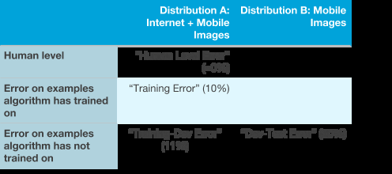

Tiếp tục với ví dụ về bộ phát hiện hình ảnh mèo, bạn có thể thấy rằng có hai phân phối dữ liệu khác nhau trên trục x. Trên trục y, chúng ta có ba loại lỗi: lỗi ở mức con người, lỗi trên các mẫu mà thuật toán đã được học và lỗi trên các mẫu mà thuật toán chưa được học. Chúng ta có thể điền vào các ô với các loại lỗi khác nhau đã được xác định được trong chương trước.

Nếu muốn, bạn cũng có thể điền vào hai ô còn lại: Bạn có thể điền vào ô phía trên bên phải (Chất lượng mức con người trên Hình ảnh tải lên từ điện thoại) bằng cách nhờ một vài người dán nhãn dữ liệu ảnh mèo tải lên từ điện thoại và đo mức lỗi gán nhãn của họ. Bạn có thể điền vào ô kế tiếp bằng cách bỏ một phần nhỏ những tấm ảnh mèo chụp từ điện thoại (có Phân phối B) vào tập huấn luyện để mạng nơ-ron cũng có thể học theo chúng. Sau đó, bạn đo lỗi của mô hình đã học trên tập dữ liệu con đó. Việc điền thêm vào hai mục này đôi khi có thể cung cấp cái nhìn sâu sắc hơn về những gì thuật toán đang thực hiện trên các phân phối dữ liệu khác nhau (Phân phối A và B).

Bằng cách hiểu được loại lỗi mà thuật toán đang gặp nhiều nhất, bạn sẽ ở vị thế tốt hơn để quyết định nên tập trung vào việc giảm độ chệch, giảm phương sai hay giảm độ không tương đồng của dữ liệu.

<!-- ================= Insert ./chapters/ch42.md ================= -->
<!-- Please do not edit this file directly, edit in ./chapters/ch42.md instead -->

## 42. Xử lý dữ liệu không tương đồng

Giả sử, bạn đã phát triển một hệ thống nhận dạng giọng nói hoạt động rất tốt trên tập huấn luyện và tập phát triển huấn luyện. Tuy nhiên, hệ thống đó lại hoạt động kém trên tập phát triển: Bạn có vấn đề về dữ liệu không tương đồng. Bạn có thể làm gì?

Tôi đề xuất bạn nên: (i) Cố gắng hiểu những thuộc tính của dữ liệu mà khác biệt giữa phân phối của tập huấn luyện và tập phát triển. (ii) Cố gắng lấy thêm dữ liệu huấn luyện tương đồng hơn với các mẫu trong tập phát triển mà thuật toán của bạn đang gặp vấn đề.

Giả sử bạn thực hiện phân tích lỗi nhận dạng giọng nói trên tập phát triển: Bạn nghe thủ công qua 100 mẫu và cố gắng hiểu xem thuật toán đang mắc lỗi ở những đâu. Bạn phát hiện rằng, hệ thống của bạn hoạt động kém vì hầu hết những đoạn âm thanh trong tập phát triển được thu bên trong xe hơi, trong khi hầu hết các ví dụ để huấn luyện được thu trong môi trường yên tĩnh. Tiếng ồn từ động cơ và đường phố làm ảnh hưởng nghiêm trọng đến chất lượng của hệ thống. Trong trường hợp này, bạn có thể cố gắng thu thập thêm dữ liệu huấn luyện bao gồm các đoạn âm thanh được thu trong xe hơi. Mục đích của việc phân tích lỗi là để hiểu những khác biệt nào là đáng kể giữa tập huấn luyện và tập phát triển, đây vốn là nguyên nhân dẫn đến dữ liệu không tương đồng.

Nếu tập huấn luyện và tập phát triển huấn luyện của bạn chứa những đoạn âm thanh thu trong xe hơi, bạn nên kiểm tra kĩ lưỡng chất lượng của hệ thống trên tập con dữ liệu này. Nếu hệ thống hoạt động tốt với dữ liệu xe hơi trong tập huấn luyện nhưng không tốt với dữ liệu xe hơi trong tập phát triển huấn luyện, điều đó càng khẳng định giả thuyết rằng lấy thêm dữ liệu xe hơi sẽ có ích. Đó là lí do tại sao chúng ta thảo luận trong chương trước về khả năng thêm một số dữ liệu lấy từ tập phát triển/tập kiểm tra với cùng phân phối vào trong dữ liệu huấn luyện. Làm như vậy cho phép bạn so sánh chất lượng [hệ thống] trên tập huấn luyện so với trên tập phát triển/kiểm tra.

Đáng tiếc là không có một sự bảo đảm nào trong quá trình này. Ví dụ, nếu bạn không có cách nào để có thể lấy thêm dữ liệu huấn luyện tương đồng với dữ liệu trong tập phát triển, bạn có thể không định ra được một lộ trình rõ ràng để cải thiện chất lượng hệ thống.

**GHI CHÚ:**

[14] Cũng có một số nghiên cứu về "thích ứng miền" -- làm sao để huấn luyện một thuật toán trên một phân phối mà vẫn tổng quát hóa được trên một phân phối khác. Những phương pháp này thường chỉ ứng dụng được với một số loại bài toán đặc biệt và ít được sử dụng hơn nhiều so với những ý tưởng đã được trình bày trong chương này.

<!-- ================= Insert ./chapters/ch43.md ================= -->
<!-- Please do not edit this file directly, edit in ./chapters/ch43.md instead -->

## 43. Tổng hợp dữ liệu nhân tạo

Hệ thống giọng nói của bạn cần thêm dữ liệu nghe giống như được lấy từ trong xe hơi. Thay vì thu thập nhiều dữ liệu trong khi lái xe, bạn có thể lấy chúng dễ dàng hơn bằng tổng hợp nhân tạo.

Giả sử bạn có một số lượng lớn đoạn âm thanh tiếng ồn xe hơi/đường phố. Bạn có thể tải dữ liệu này từ một số trang web. Giả sử bạn cũng có một tập huấn luyện lớn của tiếng người đang nói trong một căn phòng yên tĩnh. Nếu bạn lấy đoạn âm thanh của một người đang nói và "thêm" vào một đoạn âm thanh tiếng ồn xe hơi/đường phố, thì bạn sẽ có được một đoạn âm thanh nghe như thể người đó đang nói trong một chiếc xe ồn ào. Theo quy trình này, bạn có thể "tổng hợp" lượng dữ liệu khổng lồ mà nghe như thể được ghi âm bên trong một chiếc xe hơi.

Tổng quát hơn, có một số trường hợp mà tổng hợp dữ liệu nhân tạo cho phép bạn tạo một tập dữ liệu khổng lồ phù hợp với tập phát triển. Hãy sử dụng bộ nhận dạng ảnh mèo làm ví dụ thứ hai. Bạn nhận thấy rằng, những ảnh của tập phát triển hay bị mờ chuyển động nhiều hơn bởi vì chúng thường do người dùng điện thoại di động tải lên -- họ thường hơi di chuyển điện thoại khi chụp ảnh. Bạn có thể lấy những ảnh không bị mờ từ tập huấn luyện của ảnh Internet và thêm vào mô phỏng của hiệu ứng mờ chuyển động cho giống với tập phát triển hơn.

Hãy nhớ rằng tổng hợp dữ liệu nhân tạo có những thách thức của nó: đôi khi dễ dàng tạo ra dữ liệu tổng hợp có vẻ giống thật với người hơn là tạo dữ liệu có vẻ giống thật với máy tính. Giả sử bạn có 1.000 giờ dữ liệu huấn luyện giọng nói, nhưng chỉ có một giờ tiếng ồn xe hơi. Nếu bạn liên tục sử dụng cùng một giờ tiếng ồn xe hơi với các phần khác nhau từ 1.000 giờ dữ liệu huấn luyện ban đầu, bạn sẽ nhận được với một tập dữ liệu tổng hợp trong đó tiếng ồn xe hơi giống nhau lặp đi lặp lại. Mặc dù một người nghe âm thanh này có thể sẽ không thể phân biệt được -- với phần lớn mọi người thì tất cả tiếng ồn của xe hơi đều giống nhau -- nhưng có thể thuật toán học sẽ "quá khớp" một giờ tiếng ồn của xe hơi đó. Do đó, thuật toán có thể khái quát kém khi gặp một đoạn âm thanh mới với tiếng ồn xe hơi khác.

Ngoài ra, giả sử bạn có 1.000 giờ tiếng ồn xe hơi khác biệt, nhưng tất cả đều được lấy từ 10 chiếc xe khác nhau. Trong trường hợp này, thuật toán có thể "quá khớp" 10 chiếc xe này và đạt chất lượng kém nếu được thử nghiệm trên âm thanh từ một chiếc xe khác. Đáng tiếc là những vấn đề này thường khó phát hiện.

Lấy một ví dụ nữa, giả sử bạn đang xây dựng một hệ thống thị giác máy để nhận diện xe hơi. Giả sử bạn hợp tác với một công ty sản xuất game có mô hình đồ họa máy tính của một số xe hơi. Để huấn luyện thuật toán, bạn sử dụng các mô hình này để tạo ra hình ảnh xe hơi. Ngay cả khi các hình ảnh tổng hợp trông rất giống thật, phương pháp này (đã được nhiều người độc lập đề xuất) có thể sẽ không hoạt động tốt. Trong toàn bộ game có thể có gần ~20 thiết kế xe hơi. Việc xây dựng một mô hình 3D của một chiếc xe hơi rất tốn kém; Nếu bạn từng chơi game, thì có lẽ bạn có thể nhận thấy rằng phần lớn xe hơi trong game là giống nhau và có lẽ chỉ khác nhau về màu sơn. Tức là, dữ liệu này tuy trông rất giống thật với bạn, nhưng so với tập hợp tất cả các xe hơi trên đường phố (hay những gì bạn có thể thấy trong tập phát triển/kiểm tra), thì bộ 20 chiếc xe được tổng hợp này chỉ chiếm một phần rất nhỏ trong phân phối xe hơi trên toàn thế giới. Do đó, nếu 100.000 mẫu huấn luyện của bạn đều đến từ 20 chiếc xe này, hệ thống của bạn sẽ "quá khớp" với 20 thiết kế xe cụ thể này và sẽ không thể khái quát tốt cho các tập phát triển/kiểm tra bao gồm các thiết kế xe khác.

Khi tổng hợp dữ liệu, hãy suy nghĩ kỹ xem bạn có thực sự tổng hợp được một tập các mẫu mang tính đại diện hay không. Cố gắng tránh đưa ra các thuộc tính dữ liệu tổng hợp mà thuật toán học có thể phân biệt được mẫu nào là được tổng hợp với mẫu nào không. Ví dụ, nếu tất cả dữ liệu được tổng hợp đến từ một trong 20 thiết kế xe hơi hoặc tất cả âm thanh được tổng hợp chỉ từ một giờ tiếng ồn xe hơi. Lời khuyên này đôi khi là rất khó để làm theo.

Khi làm việc về tổng hợp dữ liệu, các nhóm của tôi đôi khi phải mất hàng tuần trời để tạo ra dữ liệu với các chi tiết đủ gần giống với phân phối thực tế để có thể cho hiệu quả rõ rệt. Nhưng nếu bạn có thể có được các chi tiết này đúng, bạn có thể tức thì có được một tập huấn luyện lớn hơn nhiều so với trước đấy.

<!-- ================= Insert ./chapters/p07_44_46.md ================= -->
<!-- Please do not edit this file directly, edit in ./chapters/p07_44_46.md instead -->

# Phần 7: Gỡ lỗi các Thuật toán suy luận
<!-- ================= Insert ./chapters/ch44.md ================= -->
<!-- Please do not edit this file directly, edit in ./chapters/ch44.md instead -->

## 44. Bài kiểm tra xác minh tối ưu

Giả sử bạn đang xây dựng một hệ thống nhận dạng giọng nói. Hệ thống hoạt động bằng cách nhập một đoạn âm thanh *A*, và tính toán một giá trị ĐiểmA(*S*) cho mỗi câu đầu ra khả dĩ *S*. Ví dụ: bạn có thể thử ước tính ĐiểmA(*S*) = P(*S*|*A*), tức xác suất bản ghi thoại đầu ra chính xác là câu *S* với điều kiện âm thanh đầu vào là *A*.

Khi có cách tính ĐiểmA(*S*), bạn vẫn phải tìm câu tiếng Anh *S* để tối đa hóa nó:

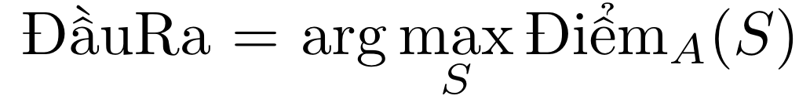

Làm thế nào để tính toán được "arg max" ở trên? Nếu tiếng Anh có 50.000 từ thì sẽ có (50.000)N câu khả dĩ có độ dài *N* -- quá nhiều để liệt kê một cách triệt để.

Vì vậy, bạn cần áp dụng thuật toán tìm kiếm gần đúng, để cố gắng tìm giá trị *S* nhằm tối ưu hóa (tối đa hóa) ĐiểmA(*S*). Ví dụ, với thuật toán tìm kiếm chùm tia (beam search), thuật toán này chỉ giữ *K* ứng viên hàng đầu trong quá trình tìm kiếm. (Đối với mục đích của chương này, bạn không cần phải hiểu chi tiết về tìm kiếm chùm tia.) Các thuật toán như thế này không đảm bảo được việc tìm giá trị của *S* mà tối đa hóa ĐiểmA(*S*).

Giả sử rằng một đoạn âm thanh *A* ghi lại một người nào đó nói rằng "Tôi yêu thích học máy". Tuy nhiên, thay vì xuất ra bản ghi thoại chính xác, hệ thống của bạn lại đưa ra một phiên bản không chính xác "Tôi yêu thích người máy". Có hai khả năng giải thích cho việc thiếu chính xác này:

1. **Vấn đề về thuật toán tìm kiếm**. Thuật toán tìm kiếm gần đúng (tìm kiếm chùm tia) không thể tìm thấy giá trị *S* thỏa mãn việc tối đa hóa ĐiểmA(*S*).

2. **Vấn đề về hàm mục tiêu (hàm tính điểm).** Ước lượng của chúng ta về ĐiểmA(*S*) = P(*S*|*A*) không chính xác. Cụ thể, việc chọn cách tính ĐiểmA(*S*) thất bại trong việc xác định "Tôi yêu thích học máy" là bản ghi thoại chính xác.

Tùy thuộc vào nguyên nhân nào dẫn đến thất bại mà bạn ưu tiên tập trung vào các hướng giải quyết khác nhau. Nếu #1 là vấn đề, bạn nên cải thiện thuật toán tìm kiếm. Nếu #2 là vấn đề, bạn nên làm việc với thuật toán học ước lượng ĐiểmA(*S*).

Đối mặt với tình huống này, một số nhà nghiên cứu sẽ ngẫu nhiên quyết định làm việc trên thuật toán tìm kiếm; những người khác sẽ ngẫu nhiên làm việc theo cách tốt hơn để thuật toán học các giá trị cho ĐiểmA(*S*). Nhưng nếu bạn không biết nguyên nhân nào trong số này là nguyên nhân cơ bản tạo nên lỗi, nỗ lực của bạn có thể trở nên lãng phí. Làm thế nào bạn có thể quyết định nên làm gì một cách có hệ thống hơn?

Đặt Sout là bản ghi thoại đầu ra ("Tôi yêu thích người máy"). Đặt S\* là bản ghi thoại chính xác ("Tôi yêu thích học máy"). Để hiểu vấn đề #1 hay #2 ở trên là nguyên nhân, bạn có thể thực hiện **Bài kiểm tra xác minh tối ưu**: Đầu tiên, tính ĐiểmA(*S*\*) và ĐiểmA(*S*out). Sau đó kiểm tra xem ĐiểmA(*S*\*) > ĐiểmA(*S*out) có đúng hay không. Có hai khả năng:

Trường hợp 1: Điểm A(*S*\*) > Điểm A(*S*out)

Trong trường hợp này, thuật toán học của bạn đã tính S\* cao hơn Sout. Tuy nhiên, thuật toán tìm kiếm gần đúng đã chọn Sout thay vì S\*. Điều này cho bạn biết rằng thuật toán tìm kiếm gần đúng của bạn có lỗi trong việc chọn giá trị S tối đa hóa ĐiểmA(*S*). Trong trường hợp này, Bài kiểm tra xác minh tối ưu cho bạn biết rằng bạn có vấn đề về thuật toán tìm kiếm và nên tập trung vào đó. Ví dụ, bạn có thể thử tăng độ rộng chùm tia của tìm kiếm chùm tia.

Trường hợp 2: ĐiểmA(*S*\*) ≤ ĐiểmA(*S*out)

Trong trường hợp này, bạn biết việc bạn tính toán ĐiểmA(.) có lỗi: Không thể cho điểm đầu ra chính xác *S*\* cao hơn hẳn so với Sout không chính xác. Bài kiểm tra xác minh tối ưu cho bạn biết rằng bạn có vấn đề về hàm mục tiêu (tính điểm). Vì vậy, bạn nên tập trung vào việc cải thiện thuật toán học hoặc cách xấp xỉ ĐiểmA(*S*) cho các câu *S* khác nhau.

Thảo luận của chúng ta tới giờ mới chỉ tập trung vào một ví dụ duy nhất. Để áp dụng Bài kiểm tra xác minh tối ưu trong thực tế, bạn nên kiểm tra lỗi trong tập phát triển của mình. Với mỗi lỗi, bạn sẽ kiểm tra xem liệu ĐiểmA(*S*\*) > ĐiểmA(*S*out) không. Mỗi ví dụ trong tập phát triển mà bất đẳng thức này thoả mãn được đánh dấu là lỗi gây ra bởi thuật toán tối ưu. Mỗi ví dụ không thỏa mãn (ĐiểmA(S\*) ≤ ĐiểmA(Sout)) được đánh dấu là một lỗi do cách tính ĐiểmA(.).

Ví dụ, giả sử bạn tìm ra rằng 95% các lỗi là do hàm tính điểm ĐiểmA(.) và chỉ 5% có nguyên do từ phía thuật toán tối ưu. Giờ bạn biết rằng dù có cải thiện quá trình tối ưu thế nào thì bạn cũng chỉ có thể loại bỏ được khoảng 5% lỗi. Thay vào đó, bạn nên tập trung cải thiện cách ước lượng ĐiểmA(.).

<!-- ================= Insert ./chapters/ch45.md ================= -->
<!-- Please do not edit this file directly, edit in ./chapters/ch45.md instead -->

## 45. Dạng tổng quát của bài kiểm tra xác minh tối ưu

Bạn có thể áp dụng Bài kiểm tra xác minh tối ưu khi, với đầu vào *x*, bạn biết cách tính Điểm\*(*y*) dùng để thể hiện mức độ phản hồi *y* tốt như thế nào với *x*. Hơn nữa, bạn đang sử dụng thuật toán gần đúng để cố gắng tìm arg maxy Điểm\*(*y*), nhưng nghi ngờ rằng thuật toán tìm kiếm đôi khi không tìm thấy giá trị lớn nhất. Trong ví dụ nhận dạng giọng nói trước đây, *x=A* là một đoạn âm thanh và đầu ra *y=S* là bản ghi thoại.

Giả sử y\* là đầu ra "chính xác" nhưng thuật toán thay vào đó tìm ra yout. Khi đó bài kiểm tra then chốt là đo xem liệu Điểm\*(y\*) > Điểm\*(yout) có đúng hay không. Nếu bất đẳng thức này đúng thì chúng ta coi lỗi là do thuật toán tối ưu. Tham khảo chương trước để đảm bảo bạn hiểu logic đằng sau điều này. Ngược lại, chúng ta coi lỗi thuộc về cách tính Điểm\*(y).

Xem xét một ví dụ nữa. Giả sử bạn đang xây dựng một hệ thống dịch máy từ tiếng Trung sang tiếng Anh. Hệ thống của bạn nhận một câu tiếng Trung *C* và tính giá trị ĐiểmC(*E*) cho mỗi bản dịch khả dĩ E. Ví dụ, bạn có thể sử dụng ĐiểmC(*E*) = P(*E*|*C*), xác suất dịch ra E với câu đầu vào *C*.

Thuật toán của bạn dịch các câu bằng cách cố gắng tính:

Tuy nhiên, tập hợp các câu tiếng Anh khả dĩ *E* quá lớn nên bạn dựa vào thuật toán tìm kiếm thực nghiệm.

Giả sử thuật toán cho ra một bản dịch không chính xác *E*out thay vì một bản dịch chính xác E\* nào đó. Khi đó bài kiểm tra xác minh tối ưu sẽ yêu cầu bạn tính toán xem liệu ĐiểmC(*E\**) > ĐiểmC(*E*out) đúng hay không. Nếu bất đẳng thức này đúng thì cách tính ĐiểmC(.) đã nhận dạng chính xác E\* tốt hơn so với *E*out; do đó, bạn sẽ coi lỗi này là do thuật toán tìm kiếm gần đúng. Ngược lại, bạn coi lỗi này thuộc về cách tính ĐiểmC(.)

Đây là một “mẫu thiết kế” rất phổ biến trong AI khi đầu tiên học một hàm tính điểm gần đúng Điểm\*(.), sau đó sử dụng một thuật toán tối đa xấp xỉ. Nếu bạn có thể phát hiện ra kiểu mẫu này, bạn sẽ có thể sử dụng Bài kiểm tra xác minh tối ưu để hiểu nguồn gốc lỗi của mình.

<!-- ================= Insert ./chapters/ch46.md ================= -->
<!-- Please do not edit this file directly, edit in ./chapters/ch46.md instead -->

## 46. Ví dụ về Học tăng cường

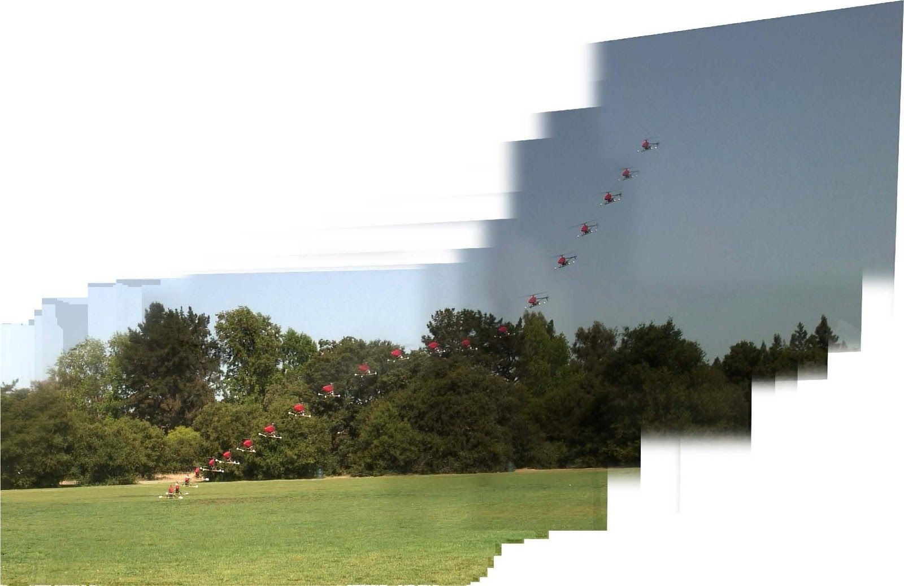

Giả sử như bạn đang sử dụng học máy để dạy trực thăng bay theo những chuyển động phức tạp. Đây là một tấm ảnh time-lapse của một chiếc trực thăng được máy tính điều khiển thực hiện việc hạ cánh khi động cơ đã tắt.

Đây được gọi là kĩ thuật "quay tự động". Nó cho phép trực thăng hạ cánh ngay cả khi động cơ bị hỏng ngoài dự kiến. Phi công thực hành kĩ thuật bay này như một phần trong công tác huấn luyện bay. Nhiệm vụ của bạn là sử dụng một thuật toán học tập để lái chiếc trực thăng qua một quỹ đạo *T* và kết thúc với một pha hạ cánh an toàn.

Để áp dụng học tăng cường, bạn phải phát triển một "hàm điểm thưởng" *R*(.) trả về một chỉ số đánh giá mức độ tốt của mỗi quỹ đạo *T*. Lấy ví dụ, nếu *T* kết thúc bằng việc trực thăng bị rơi, thì có thể nhận điểm thưởng *R(T)* = -1.000 -- một điểm thưởng âm rất lớn. Một quỹ đạo *T* kết thúc bằng việc trực thăng hạ cánh an toàn có thể sẽ cho *R(T)* dương với giá trị chính xác phụ thuộc vào việc hạ cánh êm ái như thế nào. Hàm điểm thưởng *R*(.) thường được chọn thủ công để định lượng mức độ mong muốn của những quỹ đạo *T* khác nhau. Nó phải đánh đổi giữa những đặc tính như độ xóc khi hạ cánh, trực thăng có hạ cánh đúng vị trí mong muốn không, quá trình hạ độ cao có nhiều biến động đối với hành khách không, cùng nhiều yếu tố khác. Thiết kế hàm điểm thưởng tốt là một việc không hề dễ dàng.

Với một hàm điểm thưởng *R(T)* cho trước, công việc của thuật toán học tăng cường là điều khiển trực thăng sao cho nó đạt được điểm thưởng cao nhất max*T**R(T)*. Tuy nhiên, thuật toán học tăng cường có nhiều phép xấp xỉ và có thể sẽ không thành công trong việc tối ưu này.

Giả sử bạn đã có một hàm điểm thưởng *R(.)* nào đó và đã chạy thuật toán học của bạn. Tuy nhiên, chất lượng của nó còn thua xa chất lượng của người lái (ví dụ: hạ cánh xóc hơn và có vẻ kém an toàn hơn so với chất lượng của phi công). Làm sao để bạn biết được liệu đó có phải là lỗi của thuật toán học tăng cường -- được dùng để tính toán một quỹ đạo để tối đa max*T**R(T)* -- hay là lỗi của hàm điểm thưởng -- được dùng để đo cũng như xác định mức đánh đổi lý tưởng giữa độ xóc của chuyến bay và độ chính xác của vị trí hạ cánh?

Để áp dụng Bài kiểm tra xác minh tố ưu, cho *T*người là quỹ đạo bay của phi công và cho *T*ra là quỹ đạo đạt được của thuật toán. Dựa theo mô tả phía trên, *T*người là quỹ đạo tốt hơn so với *T*ra. Do vậy, bài kiểm tra then chốt là:
Liệu có đúng không khi *R*(*T*người) > *R*(*T*ra)?

Trường hợp 1: Nếu bất đẳng thức này đúng, thì hàm điểm thưởng *R(.)* đang đánh giá đúng rằng *T*người vượt trội hơn so với *T*ra. Nhưng vậy thì thuật toán học tăng cường đang tìm *T*ra kém hơn. Điều này gợi ý rằng bỏ công sức để cải thiện thuật toán học tăng cường là xứng đáng.

Trường hợp 2: Bất đẳng thức trên không đúng: *R*(*T*người) ≤ *R*(*T*ra). Tức là *R(.)* đang gán cho *T*người một điểm số tệ hơn dù cho nó là quỹ đạo tốt hơn. Bạn nên cải thiện *R(.)* để có thể nắm bắt việc đánh đổi giữa các tiêu chí tương đương với một cú hạ cánh tốt.

Nhiều ứng dụng machine learning có chung "khuôn mẫu" là tối ưu xấp xỉ một hàm tính điểm Điểmx(.) sử dụng một thuật toán tìm kiếm xấp xỉ. Đôi khi, cũng không tồn tại một đầu vào *x* được chỉ định trước vậy nên hàm chỉ còn là Điểm(.). Trong ví dụ trên, hàm tính điểm chính là hàm điểm thưởng Điểm(*T*) = R(*T*) và thuật toán tối ưu là thuật toán học tăng cường đang cố thực thi một quỹ đạo bay *T* tốt.

Một điểm khác biệt so với những ví dụ trước là, thay vì so sánh với một kết quả "tối ưu", bạn so sánh với chất lượng mức con người *T*người. Chúng ta giả sử *T*người khá là tốt, dù có thể không tối ưu. Nhìn chung, miễn là bạn có kết quả y* (trong ví dụ này, *T*người) tốt hơn so với thuật toán học hiện thời -- mặc dù có thể nó không phải là kết quả "tối ưu" -- thì Bài kiểm tra xác minh tối ưu có thể chỉ ra liệu cải thiện thuật toán tối ưu hay cải thiện hàm tính điểm sẽ hứa hẹn hơn.

<!-- ================= Insert ./chapters/p08_47_52.md ================= -->
<!-- Please do not edit this file directly, edit in ./chapters/p08_47_52.md instead -->

# Phần 8: Học sâu đầu-cuối
<!-- ================= Insert ./chapters/ch47.md ================= -->
<!-- Please do not edit this file directly, edit in ./chapters/ch47.md instead -->

## 47. Sự trỗi dậy của học đầu-cuối

Giả sử bạn muốn xây dựng một hệ thống để kiểm tra các đánh giá trực tuyến cho sản phẩm và tự động cho biết liệu người viết đánh giá có thích sản phẩm đó hay không. Ví dụ, bạn muốn hệ thống đó phân loại phản hồi dưới đây là tích cực:

"Cây lau nhà này thật tuyệt!"

và phản hồi dưới đây là tiêu cực:

"Cây lau nhà này thật kém chất lượng -- Tôi hối hận vì đã mua nó."

Bài toán về nhận dạng quan điểm tích cực hoặc tiêu cực được gọi là "phân loại cảm xúc". Để xây dựng hệ thống này, bạn có thể tạo một "pipeline" gồm hai phần:

1. Bộ phân tích cú pháp: Một hệ thống tạo chú thích văn bản trích xuất thông tin từ những từ quan trọng nhất [15]. Ví dụ, bạn có thể sử dụng bộ phân tích cú pháp để tạo nhãn cho tất cả tính từ và danh từ. Từ đó có được đoạn chú thích như sau:

Cây lau nhàDanh Từ này thật tuyệtTính từ!

2. Bộ phân loại cảm xúc: Một thuật toán học sử dụng đầu vào là văn bản đã chú thích để dự đoán cảm xúc tổng thể. Những chú thích của bộ phân tích cú pháp có thể giúp ích thuật toán học này rất nhiều: Bằng việc tập trung hơn vào các tính từ, thuật toán có thể nhanh chóng xác định các từ quan trọng như "tuyệt", và lờ đi những từ ít quan trọng hơn như "này".

Chúng ta có thể hình dung "pipeline" của hai thành phần này như sau:

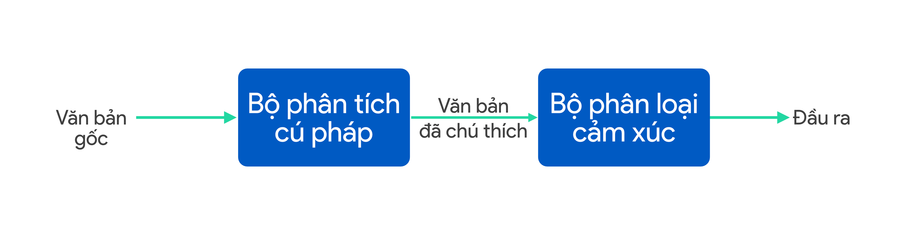

Xu hướng gần đây là thay đổi hệ thống pipeline bởi một thuật toán duy nhất. Một **thuật toán học đầu-cuối** cho tác vụ này chỉ cần nhận vào đoạn văn bản gốc "Cây lau nhà này thật tuyệt!", rồi cố gắng trực tiếp nhận ra cảm xúc từ văn bản gốc đó:

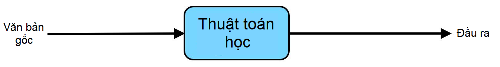

Mạng nơ-ron được sử dụng phổ biến trong các hệ thống đầu-cuối. Thuật ngữ "đầu-cuối" phản ánh việc chúng ta yêu cầu thuật toán chạy trực tiếp từ đầu vào cho đến đầu ra mong muốn: Thuật toán học trực tiếp nhận "đầu vào" và trả về "đầu ra" của hệ thống.

Với các bài toán có dữ diệu dồi dào, hệ thống đầu-cuối hoạt động khá hiệu quả. Tuy nhiên, không phải lúc nào các hệ thống đầu-cuối cũng là lựa chọn tốt. Các chương tiếp theo sẽ cung cấp thêm một số ví dụ về hệ thống đầu-cuối cũng như lời khuyên để bạn biết thời điểm nào nên hoặc không nên sử dụng chúng.

**GHI CHÚ**

[15] Bộ phân tích cú pháp có thể cung cấp nhiều hơn các chú thích cho văn bản, tuy nhiên định nghĩa giản lược này là đủ để giải thích hệ thống học sâu đầu-cuối.

<!-- ================= Insert ./chapters/ch48.md ================= -->
<!-- Please do not edit this file directly, edit in ./chapters/ch48.md instead -->

## 48. Những ví dụ học đầu-cuối khác

Giả sử bạn muốn xây dựng một hệ thống nhận dạng giọng nói. Bạn có thể xây dựng hệ thống với ba thành phần sau:

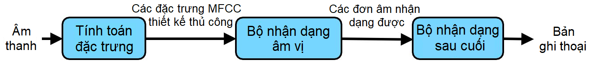

Các thành phần sẽ hoạt động như sau:

1. Tính toán đặc trưng: Trích xuất các đặc trưng được thiết kế thủ công, ví dụ như đặc trưng MFCC (Hệ số Mel-frequency cepstrum), được sử dụng để nắm bắt nội dung của đoạn phát biểu trong khi bỏ qua những thuộc tính ít liên quan hơn như âm sắc của người nói.

2. Bộ nhận dạng âm vị: Một số nhà ngôn ngữ học tin rằng trong ngôn ngữ có các đơn vị cơ bản gọi là "âm vị." Ví dụ, âm bắt đầu "k" trong từ "keep" thì phát âm giống âm "c" trong từ "cake". Hệ thống này sẽ cố gắng để nhận diện các âm vị trong các đoạn âm thanh.

3. Bộ nhận dạng sau cuối: Dùng các chuỗi âm vị đã được nhận dạng và cố gắng xâu chuỗi chúng với nhau thành một bản ghi thoại ở đầu ra.

Ngược lại, một hệ thống đầu-cuối có thể nhận đầu vào là một đoạn âm thanh, và cố gắng trả về trực tiếp một bản ghi thoại:

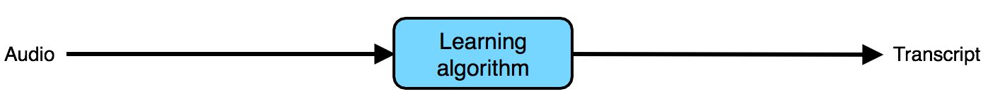

Cho đến giờ, chúng ta chỉ mới mô tả các "pipeline" học máy hoàn toàn tuyến tính: đầu ra được truyền tuần tự từ thành phần này sang thành phần khác. Nhiều pipeline có thể phức tạp hơn như trong ví dụ về một hệ thống xe tự lái đơn giản sau:

Hệ thống bao gồm ba thành phần: Một thành phần phát hiện những xe khác qua những hình ảnh từ máy quay; Một thành phần khác phát hiện người đi bộ; thành phần cuối cùng hoạch định một lộ trình giúp xe tránh những xe khác và người đi bộ.

Không phải tất cả thành phần trong pipeline đều cần được huấn luyện. Ví dụ, trong các nghiên cứu về "hoạch định chuyển động của robot" đã có rất nhiều thuật toán cho bước hoạch định lộ trình của chiếc xe. Trong đó có nhiều thuật toán không cần phải huấn luyện.

Ngược lại, hướng tiếp cận đầu-cuối có thể cố gắng lấy đầu vào là những tín hiệu từ cảm biến và trực tiếp trả về hướng bẻ lái:

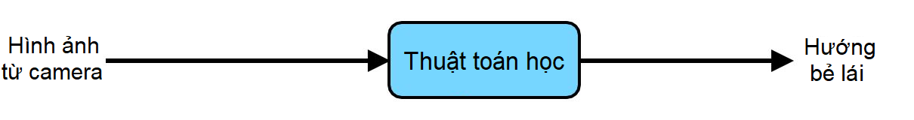

Mặc dù phương pháp học đầu-cuối đã đạt được nhiều kết quả tốt, nó không luôn là hướng đi tốt nhất. Ví dụ, phương pháp nhận dạng giọng nói đầu-cuối đạt kết quả tốt nhưng tôi không tin tưởng việc sử dụng học đầu-cuối cho xe tự lái. Những chương kế tiếp sẽ giải thích tại sao.

<!-- ================= Insert ./chapters/ch49.md ================= -->
<!-- Please do not edit this file directly, edit in ./chapters/ch49.md instead -->

## 49. Ưu nhược điểm của học đầu-cuối

Xét một ví dụ về pipeline nhận dạng tiếng nói trong các chương trước:

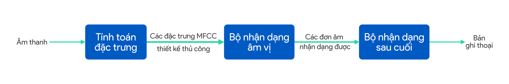

Rất nhiều thành phần của pipeline này được "thiết kế thủ công".

* MFCCs là một tập hợp các đặc trưng âm thanh được thiết kế thủ công. Mặc dù chúng cung cấp một tóm tắt khá hợp lý cho dữ liệu âm thanh đầu vào, chúng cũng đã đơn giản hóa tín hiệu đầu vào bằng cách loại bỏ một số thông tin.

* Hệ âm vị, một phát kiến của ngành ngôn ngữ học, là một biểu diễn không hoàn hảo của âm thanh thoại. Trong những trường hợp mà hệ âm vị là một xấp xỉ kém của thực tế, áp đặt một thuật toán sử dụng biểu diễn âm vị sẽ giới hạn chất lượng của hệ thống tiếng nói.

Các thành phần được thiết kế thủ công này giới hạn chất lượng tiềm năng của hệ thống tiếng nói. Tuy nhiên, việc sử dụng các thành phần được thiết kế thủ công cũng có một vài ưu điểm:

* Đặc trưng MFCC có tính kháng tốt đối với một vài thuộc tính không ảnh hưởng tới nội dung của tiếng nói, chẳng hạn như cao độ của giọng nói. Bởi vậy, chúng giúp đơn giản hóa vấn đề cho thuật toán học.

* Xét theo hướng hệ âm vị là một biểu diễn hợp lý của tiếng nói, chúng cũng có thể giúp thuật toán học hiểu được các thành phần cơ bản của âm thanh và vì vậy cải thiện chất lượng của hệ thống.

Có nhiều thành phần được thiết kế thủ công hơn nhìn chung cho phép một hệ thống tiếng nói có thể học với ít dữ liệu hơn. Đặc trưng được thiết kế thủ công bởi MFCC và âm vị "bù đắp" thông tin thuật toán lấy được từ dữ liệu. Các đặc trưng này rất hữu ích khi chúng ta không có nhiều dữ liệu.

Bây giờ, xét hệ thống đầu-cuối sau:

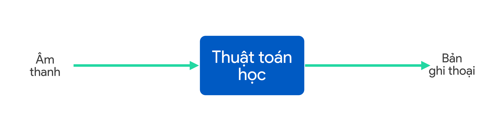

Hệ thống này thiếu đặc trưng được thiết kế thủ công. Bởi vậy, khi tập huấn luyện nhỏ, nó có thể có chất lượng tệ hơn pipeline với đặc trưng được thiết kế thủ công.

Tuy nhiên, khi tập huấn luyện lớn, nó không bị cản trở bởi giới hạn biểu diễn của MFCC hay hệ âm vị. Nếu thuật toán học là một mạng nơ-ron đủ lớn và được huấn luyện trên dữ liệu đủ lớn, nó có tiềm năng hoạt động tốt và còn có thể đạt được tỉ lệ lỗi tối ưu.

Hệ thống học đầu-cuối có xu hướng làm việc tốt khi có nhiều dữ liệu được gán nhãn cho "cả hai đầu" -- đầu vào và đầu ra. Trong ví dụ này, chúng ta cần một tập dữ liệu lớn các cặp (âm thanh, bản ghi). Khi chúng ta không có dữ liệu kiểu này, cần đặc biệt lưu ý khi sử dụng học đầu-cuối.

Nếu bạn đang làm việc với một bài toán học máy mà tập huấn luyện rất nhỏ, hầu hết các đặc trưng cho thuật toán phải đến từ hiểu biết của con người: Từ các thành phần được "thiết kế thủ công".

Nếu bạn chọn không sử dụng hệ thống đầu-cuối, bạn sẽ phải quyết định từng bước trong pipeline và cách chúng được kết nối với nhau. Trong một vài chương tiếp theo, chúng tôi sẽ cung cấp một vài gợi ý khi thiết kế các pipeline dạng này.

<!-- ================= Insert ./chapters/ch50.md ================= -->
<!-- Please do not edit this file directly, edit in ./chapters/ch50.md instead -->

## 50. Lựa chọn các thành phần cho pipeline: Tính sẵn có của dữ liệu

Khi xây dựng một hệ thống pipeline không phải đầu-cuối, các thành phần nào là những ứng viên tốt cho pipeline? Cách bạn thiết kế pipeline sẽ có tác động lớn tới toàn bộ chất lượng của hệ thống. Một nhân tố quan trọng là liệu rằng bạn có thể dễ dàng thu thập dữ liệu để huấn luyện mỗi thành phần.

Ví dụ, xét kiến trúc xe tự hành dưới đây:

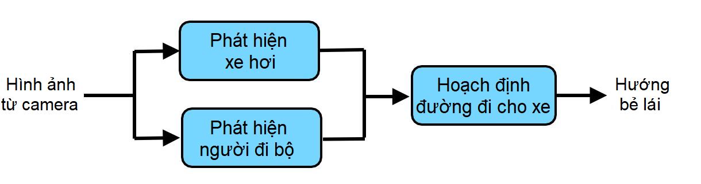

Bạn có thể sử dụng học máy để phát hiện xe và người đi bộ. Hơn nữa, không khó để thu thập những dữ liệu này: Có vô vàn tập dữ liệu thị giác máy tính với lượng lớn xe hơi và người đi bộ đã được gán nhãn. Bạn cũng có thể dùng các dịch vụ cộng đồng (Amazon Mechanical Turk chẳng hạn) để có được những tập dữ liệu thậm chí lớn hơn. Bởi vậy khá dễ để thu thập dữ liệu huấn luyện cho việc xây dựng một bộ phát hiện xe hơi và phát hiện người đi bộ.

Ngược lại, xét một hướng tiếp cận thuần đầu-cuối:

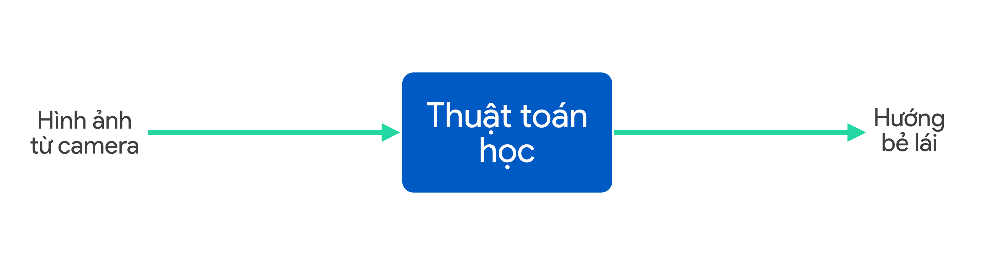

Để huấn luyện hệ thống này, chúng ta sẽ cần một tập dữ liệu lớn các cặp (Ảnh, Hướng Bẻ Lái). Sẽ rất mất thời gian và tiền của để thu thập dữ liệu hướng bẻ lái bằng cách cho người lái xe trên đường. Bạn cần những chiếc xe được gắn các thiết bị đặc biệt để thu thập một lượng lớn dữ liệu đảm bảo bao quát đầy đủ các tình huống khả dĩ. Việc này khiến hệ thống đầu-cuối rất khó để huấn luyện. Việc thu thập một tập dữ liệu lớn với ảnh xe hơi và người đi bộ thường đơn giản hơn rất nhiều. 

Tổng quát hơn, nếu có rất nhiều dữ liệu sẵn có để huấn luyện "các mô-đun trung gian" của một pipeline (chẳng hạn như một bộ phát hiện xe hơi và một bộ phát hiện người đi bộ), thì bạn có thể xem xét sử dụng một pipeline với nhiều bước. Kiến trúc này có thể ưu việt bởi vì bạn có thể sử dụng tất cả dữ liệu sẵn có để huấn luyện các mô-đun trung gian.

Cho tới khi có thêm nhiều dữ liệu đầu-cuối hơn nữa, tôi tin rằng hướng tiếp cận không phải đầu-cuối vẫn có tiềm năng đáng kể hơn cho xe tự hành: Kiến trúc của nó phù hợp hơn với tính sẵn có của dữ liệu.

<!-- ================= Insert ./chapters/ch51.md ================= -->
<!-- Please do not edit this file directly, edit in ./chapters/ch51.md instead -->

## 51. Lựa chọn các thành phần cho pipeline: tính đơn giản của tác vụ

Ngoài sự sẵn có của dữ liệu, bạn cũng nên xem xét một nhân tố thứ hai khi lựa chọn các thành phần của một pipeline: Việc giải quyết từng tác vụ bằng các thành phần riêng lẻ đơn giản đến mức nào? Bạn nên cố gắng chọn những thành phần pipeline có thể dễ dàng xây dựng hay học riêng lẻ. Nhưng các thành phần "dễ" học nghĩa là gì?

Xét những tác vụ học máy này, được liệt kê theo thứ tự độ khó tăng dần:

1. Phân loại bức ảnh có bị phơi sáng quá mức hay không (như trong ví dụ trên)

2. Phân loại bức ảnh được chụp trong nhà hay ngoài trời

3. Phân loại bức ảnh có chứa một con mèo hay không

4. Phân loại bức ảnh có chứa một con mèo khoang đen trắng hay không

5. Phân loại bức ảnh có chứa một con mèo Xiêm (tên một loại mèo) hay không

Mỗi tác vụ trên là một bài toán phân loại ảnh nhị phân: từ một bức ảnh đầu vào, mô hình phải cho ra giá trị 0 hoặc 1. Nhưng những tác vụ đầu tiên trong danh sách này có vẻ quá "dễ" đối với một mạng nơ-ron. Bạn sẽ có thể huấn luyện những tác vụ dễ hơn với ít mẫu huấn luyện hơn.

Học máy chưa có một định nghĩa chính thức nào về một tác vụ là dễ hay khó[16]. Với sự phát triển của học sâu và mạng nơ-ron đa tầng, chúng ta nói một tác vụ là "dễ" nếu có có thể được thực hiện với ít bước tính toán hơn (ứng với mạng nơ-ron nông), và "khó" nếu nó đòi hỏi nhiều bước tính toán hơn (đòi hỏi một mạng nơ-ron sâu hơn). Nhưng đây đều là các định nghĩa không chính thức.

Nếu bạn có thể lấy một tác vụ phức tạp, và chia nhỏ nó thành những tác vụ con đơn giản hơn. Sau đó bằng cách viết mã nguồn cụ thể cho từng tác vụ con đó, bạn đang cung cấp cho thuật toán một tri thức tiền đề giúp nó học một tác vụ hiệu quả hơn.

Giả sử bạn đang xây dựng bộ phát hiện một con mèo Xiêm. Dưới đây là một kiến trúc thuần đầu-cuối:

Ngược lại, bạn cũng có thể sử dụng một pipeline với hai bước sau:

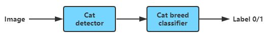

Bước đầu tiên (bộ phát hiện mèo) tìm tất cả con mèo trong bức ảnh.

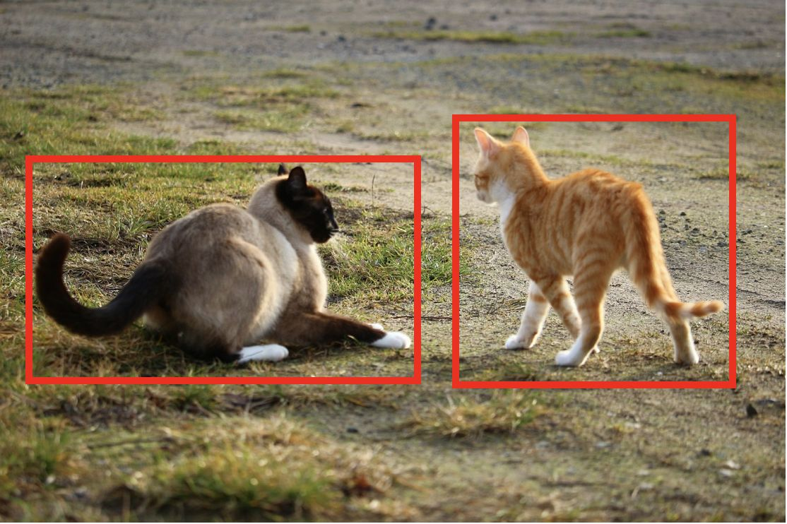

Bước thứ hai đưa những phần ảnh được cắt ra từ bộ phát hiện mèo (từng phần một) vào bộ phân loại mèo, và cuối cùng đưa ra 1 nếu có một phần bất kỳ được xác định là một con mèo Xiêm.

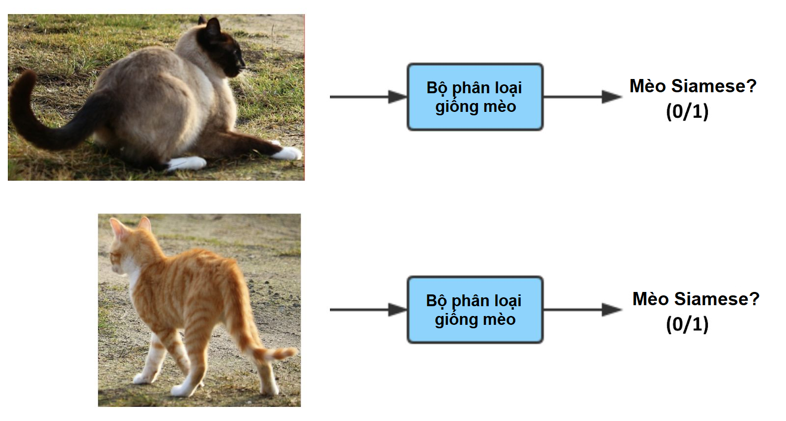

So với việc huấn luyện bộ phân loại thuần đầu-cuối chỉ sử dụng nhãn 0/1, từng phần của pipeline -- bộ phát hiện mèo và bộ phân loại mèo -- có vẻ dễ hơn nhiều để học và đòi hỏi lượng dữ liệu ít hơn[17].

Ví dụ cuối cùng, cùng nhìn lại pipeline xe tự lái:

Bằng cách sử dụng pipeline này, bạn đang chỉ cho thuật toán rằng có 3 bước chính để lái xe: (1) Phát hiện những chiếc xe hơi khác, (2) Phát hiện người đi bộ và (3) Hoạch định đường đi cho xe của bạn. Ngoài ra, mỗi bước này là một hàm số tương đối đơn giản hơn -- và có thể được học với ít dữ liệu hơn -- so với hướng tiếp cận thuần đầu-cuối.

Tóm lại, khi lựa chọn các thành phần cho một pipeline, hãy cố gắng xây dựng một pipeline mà mỗi thành phần là một hàm số tương đối "đơn giản" sao cho nó có thể học được từ chỉ một lượng dữ liệu vừa phải.

**CHÚ THÍCH:**

[16] Lý thuyết thông tin có khái niệm về "Độ phức tạp Kolmogorov", lý thuyết này nói rằng độ phức tạp của hàm số học được đo bằng độ dài của chương trình máy tính ngắn nhất để tính toán hàm số đó. Tuy nhiên, khái niệm lý thuyết này ít có ứng dụng thực tế trong trí tuệ nhân tạo. Xem thêm https://en.wikipedia.org/wiki/Kolmogorov_complexity

[17] Nếu bạn quen với các thuật toán thực tế về phát hiện vật thể, bạn sẽ nhận ra rằng chúng không chỉ học với ảnh có nhãn 0/1 mà thay vào đó được huấn luyện với các khung chứa từ dữ liệu huấn luyện. Thảo luận về vấn đề đó nằm ngoài phạm vi của chương này. Tham khảo khóa "Deep Learning specialization" trên Coursera (http://deeplearning.ai) nếu bạn muốn học thêm về thuật toán đó.

<!-- ================= Insert ./chapters/ch52.md ================= -->
<!-- Please do not edit this file directly, edit in ./chapters/ch52.md instead -->

## 52. Trực tiếp học những đầu ra phức tạp

Một thuật toán phân loại sẽ nhận đầu vào là một ảnh x rồi trả về một số nguyên thể hiện nhãn phân loại của đồ vật trong ảnh đó. Thay vào đó, liệu một thuật toán có thể đưa ra một câu mô tả hoàn chỉnh cho bức ảnh đó? 

Ví dụ:

*x* = 

*y* = "Một chiếc xe buýt màu vàng đang đi xuống một con đường với nền xanh của cây cỏ."

Những ứng dụng truyền thống của các thuật toán học có giám sát học một hàm *h: X→Y*, trong đó đầu ra y thường là một số nguyên hoặc một số thực. Ví dụ:

| Bài toán                 | X                                    | Y                         |
| :----------------------- | :----------------------              | :------------------       |
| Phân loại email rác      | Email                                | email rác/ không rác(0/1) |
| Nhận dạng ảnh            | Ảnh                                  | Nhãn số nguyên            |
| Dự đoán giá nhà đất      | Đặc trưng của căn nhà                | Giá theo Đô-la            |
| Gợi ý sản phẩm           | Đặc trưng của sản phẩm và người dùng | Xác suất mua sản phẩm     |

Một trong những hướng phát triển thú vị nhất của học sâu đầu-cuối là nó cho phép chúng ta trực tiếp học những kết quả phức tạp hơn rất nhiều so với đầu ra của việc học truyền thống. Trong ví dụ chú thích hình ảnh ở trên, bạn có thể cho hình ảnh (*x*) vào một mạng nơ-ron và trực tiếp thu về một câu chú thích miêu tả hình ảnh đó (*y*)

Dưới đây là một số ví dụ khác:

| Bài toán               | X                      | Y                  | Trích dẫn ví dụ           |
| :------------------    | :--------------------  | :------------      | :------------------------ |
| Chú thích hình ảnh     | Ảnh                    | Văn bản            | Mao et al., 2014          |
| Dịch máy               | Văn bản tiếng Anh      | Văn bản tiếng Pháp | Suskever et al., 2014     |
| Hỏi đáp                | Cặp (Văn bản, Câu hỏi) | Văn bản trả lời    | Bordes et al., 2015       |
| Nhận dạng giọng nói    | Âm thanh               | Bản ghi thoại      | Hannun et al., 2015       |
| Văn bản sang giọng nói | Đặc trưng văn bản      | Âm thanh           | van der Oord et al., 2016 |

Đây là một xu hướng đang ngày càng phát triển trong học sâu. Với các cặp có nhãn (đầu vào, đầu ra) phù hợp, đôi khi bạn có thể học đầu-cuối ngay cả khi đầu ra là một câu, hình ảnh, âm thanh hoặc các đầu ra khác phức tạp hơn nhiều thay vì chỉ một con số.

<!-- ================= Insert ./chapters/p09_53_57.md ================= -->
<!-- Please do not edit this file directly, edit in ./chapters/p09_53_57.md instead -->

# Phần 9: Phân tích lỗi từng phần
<!-- ================= Insert ./chapters/ch53.md ================= -->
<!-- Please do not edit this file directly, edit in ./chapters/ch53.md instead -->

## 53. Phân tích lỗi từng phần

Giả sử hệ thống của bạn được xây dựng dựa trên một pipeline học máy phức tạp và bạn muốn cải thiện chất lượng của nó. Bạn nên cải thiện phần nào trong pipeline này? Bạn có thể sắp xếp thứ tự ưu tiên công việc bằng cách quy lỗi cụ thể cho từng phần trong pipeline.

Hãy sử dụng ví dụ bộ phân loại mèo Xiêm của chúng ta:

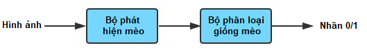

Phần đầu tiên, bộ phát hiện mèo xác định vị trí của mèo và cắt chúng ra khỏi tấm ảnh. Phần thứ hai, bộ phân loại giống mèo xác định xem đó có phải là một con mèo Xiêm hay không. Việc cải thiện bất kì bộ phận nào trong pipeline này cũng có thể tốn tới hàng năm trời. Làm sao để bạn quyết định được (những) bộ phận nào cần tập trung cải thiện?

Bằng việc thực hiện **phân tích lỗi từng phần**, bạn có thể cố quy trách nhiệm cho một (hoặc đôi khi là cả hai) phần trong pipeline trên từng dự đoán sai của thuật toán. Ví dụ, thuật toán phân loại sai tấm ảnh này không có một con mèo Xiêm ở trong đó (y=0) mặc dù nhãn chính xác là y=1.

Hãy kiểm chứng một cách thủ công xem hai bước của thuật toán đã làm gì. Giả sử bộ phát hiện mèo Xiêm đã phát hiện ra một chú mèo như dưới đây: 

Tức là bộ phân loại giống mèo được đưa cho tấm hình sau:

Sau đó, bộ phân loại giống mèo xác định chính xác rằng tấm hình này không có mèo Xiêm. Vậy nên, bộ phân loại giống mèo không có lỗi: Nó được đưa cho cho xem một đống đá và trả ra nhãn y=0 rất hợp lý. Vì trên thực tế, con người cũng phân loại tấm ảnh toàn đá ở trên là không có mèo mà thôi -- y=0. Do vậy, bạn rõ ràng có thể quy lỗi này cho bộ phát hiện mèo.

Mặt khác, nếu giả sử bộ phát hiện mèo có cho ra kết quả khung chứa như dưới đây:

thì bạn sẽ kết luận rằng bộ phát hiện mèo đã hoàn thành công việc của nó, và lỗi là do bộ phân loại giống mèo mà ra.

Giả sử bạn kiểm chứng 100 tấm ảnh bị phân loại nhầm trong tập phát triển và nhận ra rằng 90 trong số đó là do lỗi của bộ phát hiện mèo, chỉ có 10 tấm là do lỗi của bộ phân loại giống mèo. Bạn có thể an toàn kết luận rằng mình nên tập trung nhiều hơn vào việc cải thiện bộ phát hiện mèo.   

Ngoài ra, bạn cũng đã tìm ra 90 mẫu mà bộ phát hiện mèo trả về khung chứa chưa chính xác. Bạn có thể sử dụng 90 mẫu này để thực hiện việc phân tích lỗi kĩ hơn trên bộ phát hiện mèo và tìm cách cải thiện nó.

Việc làm thế nào để quy lỗi cho một phần của pipeline vẫn đang được mô tả một cách không hợp thức: bạn nhìn vào đầu ra của mỗi phần để xem liệu có thể quyết định phần nào gây ra lỗi. Phương pháp không hợp thức này có thể là đủ với bạn. Tuy nhiên ở chương sau, bạn sẽ thấy một cách hợp thức hơn của việc quy lỗi.

<!-- ================= Insert ./chapters/ch54.md ================= -->
<!-- Please do not edit this file directly, edit in ./chapters/ch54.md instead -->

## 54. Quy lỗi cho một thành phần

Cùng tiếp tục với ví dụ này:

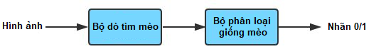

Giả sử bộ phát hiện mèo cho kết quả khung chứa như sau:

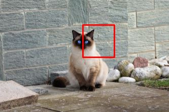

Khi đó bộ phân loại giống mèo nhận một vùng ảnh, và cho kết quả không chính xác là y=0, tức là không có con mèo nào trong hình.

Bộ phát hiện mèo đã hoạt động không tốt. Tuy nhiên, một người giàu kinh nghiệm vẫn có thể nhận dạng mèo Xiêm từ bức ảnh bị cắt lệch. Trường hợp này chúng ta nên quy lỗi cho bộ phát hiện mèo, bộ phân loại giống mèo, hay là cả hai? Có sự không rõ ràng ở đây.

Nếu số lượng các trường hợp không rõ ràng là nhỏ, thì bất kỳ quyết định nào mà bạn lựa chọn đều sẽ đạt kết quả tương đương. Tuy nhiên một bài kiểm tra hợp thức hơn sẽ giúp bạn quy lỗi chính xác cho một thành phần:

1. Thay đầu ra của bộ phát hiện mèo bằng một khung chứa thủ công:

2. Nạp ảnh bị cắt tương ứng vào bộ phân loại giống mèo. Nếu bộ phân loại giống mèo vẫn phân loại sai thì quy lỗi cho bộ phân loại giống mèo. Ngược lại thì quy lỗi cho bộ phát hiện mèo.

Nói cách khác, thực hiện thử nghiệm mà ở đó bạn cung cấp cho bộ phân loại giống mèo một đầu vào "hoàn hảo". Hai trường hợp có thể xảy ra:

* Trường hợp 1: Kể cả với một khung chứa "hoàn hảo", bộ phân loại giống mèo vẫn đưa ra kết quả không chính xác y=0. Trong trường hợp này rõ ràng là bộ phân loại giống mèo có lỗi.

* Trường hợp 2: Với một khung chứa "hoàn hảo", bộ phân loại giống mèo đưa ra kết quả chính xác y=1. Điều này cho thấy nếu bộ phát hiện mèo có thể đưa ra khung chứa chính xác hơn, thì kết quả tổng thể của toàn hệ thống sẽ được cải thiện. Trong trường hợp này bộ phát hiện mèo có lỗi.

Bằng cách phân tích các ảnh bị phân loại sai trên tập phát triển, bạn có thể quy lỗi chính xác cho một thành phần. Điều này cho phép bạn ước tính tỉ lệ lỗi cho từng thành phần của pipeline, từ đó quyết định thành phần cần tập trung khắc phục.

<!-- ================= Insert ./chapters/ch55.md ================= -->
<!-- Please do not edit this file directly, edit in ./chapters/ch55.md instead -->

## 55. Trường hợp tổng quát của việc quy lỗi

Đây là những bước tổng quát cho việc quy lỗi. Giả sử một pipeline có ba thành phần A, B và C; trong đó A cung cấp thông tin trực tiếp cho B, và B cung cấp thông tin trực tiếp cho C.

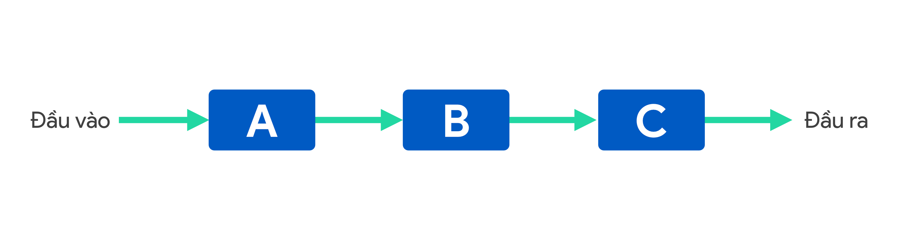

Với từng lỗi của hệ thống trên tập phát triển: 

1. Thử điều chỉnh thủ công kết quả đầu ra ở A cho "hoàn hảo" (ví dụ, một khung chứa hình mèo "hoàn hảo"), và sau đó tiến hành chạy thuật toán cho pipeline gồm có B và C với đầu ra này. Nếu thuật toán trả về kết quả cuối cùng chính xác, điều đó chỉ ra rằng, thuật toán sẽ cho ra kết quả chính xác nếu A trả về kết quả tốt hơn. Vậy ta có thể quy lỗi cho A. Nếu không, ta sẽ kiểm chứng thêm ở bước 2.  

2. Thử điều chỉnh thủ công kết quả đầu ra ở công đoạn B cho "hoàn hảo". Nếu thuật toán cho ra kết quả đầu ra cuối cùng chính xác, ta có thể quy lỗi cho B. Ngược lại, ta tiến hành bước 3.

3. Quy lỗi cho thành phần C. 

Chúng ta hãy cùng tìm hiểu một ví dụ phức tạp hơn sau đây:

Xe tự lái của bạn sử dụng pipeline như trên. Bạn sẽ sử dụng kỹ thuật phân tích lỗi từng phần như thế nào để quyết định (những) thành phần nào cần tập trung cải thiện?

Bạn có thể gọi tên ba thành phần trong hệ thống là A, B, C tương ứng với các chức năng như sau: 
A: Phát hiện xe hơi 
B: Phát hiện người đi bộ  
C: Hoạch định đường đi cho xe

Với hệ thống xe tự hành mô tả như trên, giả sử bạn kiểm tra xe của bạn trên một cung đường kín và xác định trường hợp nào xe chọn hướng bẻ lái giật nhiều hơn so với một người lái có kinh nghiệm điều khiển. Trong lĩnh vực lái xe tự động, một trường hợp như thế thường được gọi là "tình huống". Bạn cần thực hiện:

1. Thử điều chỉnh thủ công kết quả đầu ra của thành phần A (phát hiện xe hơi) sao cho "hoàn hảo" (ví dụ, cho xe biết vị trí của những chiếc xe khác). Sau đó tiếp tục chạy phần còn lại của pipeline gồm có B, C, nhưng cho phép C (hoạch định đường đi) sử dụng đầu ra đã hoàn hảo của A. Nếu thuật toán hoạch định đường đi cho xe tốt hơn, điều đó cho thấy rằng, kết quả cuối cùng của thuật toán tự lái sẽ được cải thiện nếu mà A trả về kết quả tốt hơn. Như vậy, bạn có thể quy lỗi cho A. Nếu không, ta tiếp tục bước 2. 

2. Thử điều chỉnh thủ công kết quả đầu ra ở công đoạn B (phát hiện người đi bộ) cho "hoàn hảo". Nếu thuật toán cho kết quả đầu ra cuối cùng chính xác, ta có thể quy lỗi cho B. Ngược lại, ta tiến hành bước 3.

3. Quy lỗi cho thành phần C. 

Các thành phần của một mô hình học máy dạng pipeline nên được sắp xếp theo Đồ thị có hướng không chu trình (Directed Acyclic Graph - DAG), nghĩa là bạn có thể tính toán chúng theo thứ tự cố định từ trái sang phải nào đó, và các thành phần sau chỉ nên phụ thuộc vào đầu ra của các thành phần trước đó. Miễn là việc xâu chuỗi các thành phần theo thứ tự A->B->C tuân thủ theo quy tắc DAG, thì việc phân tích lỗi sẽ diễn ra tốt đẹp. Bạn có thể nhận được các kết quả hơi khác nhau nếu hoán chuyển vị trí của A và B cho nhau như sau:

A: Phát hiện người đi bộ (trước đây là *Phát hiện xe*)

B: Phát hiện xe (trước đây là *Phát hiện người đi bộ*)

C: Hoạch định đường đi cho xe

Nhưng các kết quả của việc phân tích lỗi sẽ vẫn hợp lệ và cho ta định hướng tới những thành phần nào cần tập trung cải thiện.

<!-- ================= Insert ./chapters/ch56.md ================= -->
<!-- Please do not edit this file directly, edit in ./chapters/ch56.md instead -->

## 56. Phân tích lỗi từng phần và so sánh với chất lượng mức con người

Thực hiện phân tích lỗi của thuật toán học giống với việc sử dụng khoa học dữ liệu phân tích lỗi của hệ thống học máy để biết chính xác những việc cần làm kế tiếp. Cơ bản nhất, phân tích lỗi từng phần sẽ cho ta biết được chất lượng của (những) phần nào cần được cải thiện.

Giả sử bạn có bộ dữ liệu về khách hàng mua đồ trên một trang mạng. Một nhà khoa học dữ liệu có thể có rất nhiều cách khác nhau để phân tích dữ liệu đó. Người đó có thể đưa ra nhiều kết luận khác nhau như có nên tăng giá, giá trị vòng đời khách hàng đạt được thông qua các chiến dịch tiếp thị khác nhau, v.v. Không có một việc phân tích dữ liệu "chuẩn mực" nào, và có thể có rất nhiều kết luận hữu ích có thể rút ra. Tương tự, không chỉ có một cách "chuẩn mực" cho việc thực hiện phân tích lỗi. Thông qua các chương này bạn đã học được những cách phổ biến nhất để rút ra những nhận định chính xác về hệ thống học máy của bạn, nhưng bạn cũng nên thử nghiệm những phương pháp phân tích lỗi khác.

Chúng ta hãy quay trở lại ứng dụng xe tự lái, trong đó thuật toán phát hiện xe đưa ra vị trí (có thể có thêm vận tốc) của những chiếc xe gần đó, thuật toán phát hiện người đi bộ đưa ra vị trí của người đi bộ gần đó, và hai đầu ra này cuối cùng được sử dụng để hoạch định đường đi cho xe.

Để kiểm tra lỗi pipeline này, thay vì tuân thủ nghiêm ngặt quy trình đã thấy trong chương trước, bạn nên đặt những câu hỏi như:

1. Cách biệt về khả năng xác định xe giữa thuật toán và con người là bao xa?

2. Cách biệt về khả năng phát hiện người đi bộ giữa thuật toán và con người là bao xa?

3. Cách biệt giữa khả năng của toàn hệ thống và con người tới cỡ nào? Ở đây, chất lượng của con người được giả sử là cách con người tính đường đi cho xe chỉ dựa vào kết quả đầu ra từ hai thành phần trước đó trong pipeline (thay vì dựa vào hình ảnh camera). Nói cách khác, với cùng thông tin đầu vào, khả năng ước lượng đường đi của thuật toán so với con người sẽ như thế nào?

Nếu bạn thấy rằng một trong những thành phần này thua xa chất lượng mức con người, thì bây giờ bạn biết phần nào cần được cải thiện. Hãy tập trung vào việc cải thiện chất lượng của phần đó.

Nhiều quy trình phân tích lỗi hoạt động tốt nhất khi chúng ta cố gắng tự động hóa một thứ gì đó mà con người có thể làm, do đó có thể so sánh với con người. Hầu hết các ví dụ trước của chúng ta ngầm giả định điều này. Nếu bạn đang xây dựng một hệ thống học máy trong đó đầu ra hoặc một số thành phần trung gian đang làm những việc mà thậm chí con người không thể làm tốt, thì một trong số những quy trình này sẽ không được áp dụng.

Đây là một thuận lợi của việc giải quyết các vấn đề mà con người có thể giải quyết--bạn có các công cụ mạnh mẽ để phân tích lỗi, do đó bạn có thể ưu tiên các công việc trong nhóm một cách hiệu quả hơn.

<!-- ================= Insert ./chapters/ch57.md ================= -->
<!-- Please do not edit this file directly, edit in ./chapters/ch57.md instead -->

## 57. Phát hiện một pipeline học máy bị lỗi

Nếu mỗi thành phần đơn lẻ trong pipeline học máy của bạn đều hoạt động ở chất lượng mức con người hoặc gần mức con người, nhưng pipeline tổng thể lại kém xa mức con người thì sao? Điều này thường có nghĩa là pipeline có lỗi và cần được thiết kế lại. Việc phân tích lỗi có thể giúp bạn nhận định liệu bạn có cần thiết kế lại pipeline của mình.

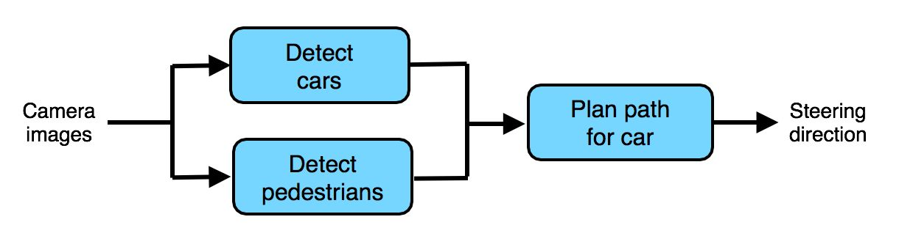

Trong chương trước, chúng ta đã đặt câu hỏi liệu mỗi trong số ba thành phần có ở chất lượng mức con người. Giả sử câu trả lời cho cả ba câu hỏi là có. Điều đó có nghĩa là:

1. Thành phần Phát hiện xe hơi đạt chất lượng (xấp xỉ) mức con người trong việc phát hiện xe hơi từ ảnh camera.

2. Thành phần Phát hiện người đi bộ đạt chất lượng (xấp xỉ) mức con người trong việc phát hiện xe hơi từ ảnh camera.

3. *So sánh với một người phải lập kế hoạch đường đi cho xe khi chỉ dựa trên đầu ra của hai thành phần pipeline trước đó (thay vì được tiếp cận với hình ảnh từ camera)*, thành phần Lập kế hoạch có chất lượng ở mức tương đương.

Tuy nhiên, chiếc xe tự lái tổng thể của bạn lại hoạt động kém hơn chất lượng mức con người một cách rõ rệt. Có nghĩa là, con người được tiếp cận hình ảnh từ camera có thể dự tính những đường đi tốt hơn nhiều cho xe. Bạn có thể rút ra kết luận gì?

Kết luận khả dĩ duy nhất là pipeline học máy đã bị lỗi. Trong trường hợp này, thành phần Lên kế hoạch đã hoạt động ở mức tốt nhất có thể *với những đầu vào của nó*, nhưng đầu vào không chứa đủ thông tin. Bạn nên tự hỏi liệu những thông tin nào khác, ngoài đầu ra của hai thành phần pipeline trước, là cần thiết cho việc lên kế hoạch đường đi thật tốt cho xe tự lái. Nói cách khác, những thông tin nào mà một người lái xe có kinh nghiệm cần đến?

Ví dụ, giả sử bạn nhận ra rằng người lái xe cũng cần biết vị trí của vạch kẻ làn đường. Điều này gợi ý rằng bạn nên thiết kế lại pipeline như sau:

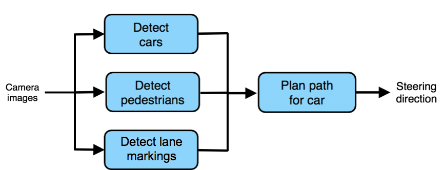

Cuối cùng, nếu bạn không nghĩ rằng pipeline hoàn chỉnh sẽ đạt chất lượng mức con người, ngay cả khi mỗi thành phần đơn lẻ đạt chất lượng mức con người (nhớ rằng bạn đang so sánh với một người được cung cấp cùng một đầu vào như các thành phần), có nghĩa là pipeline có lỗi và cần được thiết kế lại.

**GHI CHÚ:**

[18] Trong ví dụ về xe tự hành ở trên, theo lý thuyết ta có thể giải quyết vấn đề bằng cách cũng cho hình ảnh thô từ camera vào thành phần lên kế hoạch. Tuy nhiên, điều đó sẽ vi phạm nguyên tắc thiết kế "Tính đơn giản của tác vụ" đã được trình bày ở Chương 51, vì thành phần lên kế hoạch đường đi giờ đây cần có đầu vào là ảnh thô và có một tác vụ rất phức tạp để giải quyết. Thế nên thêm một thành phần Phát hiện giải phân cách là một lựa chọn tốt hơn -- giúp lấy thêm những thông tin quan trọng vốn thiếu về làn đường cho khối lên kế hoạch đường đi, đồng thời bạn cũng tránh được việc làm bất cứ mô-đun nào trở nên quá phức tạp để xây dựng/huấn luyện.

<!-- ================= Insert ./chapters/p10_58.md ================= -->
<!-- Please do not edit this file directly, edit in ./chapters/p10_58.md instead -->

# Phần 10: Tổng kết
<!-- ================= Insert ./chapters/ch58.md ================= -->
<!-- Please do not edit this file directly, edit in ./chapters/ch58.md instead -->

## 58. Xây dựng một biệt đội siêu anh hùng - Hãy để đồng đội của bạn đọc điều này

Chúc mừng bạn đã hoàn thành quyển sách này!

Trong chương 2, chúng ta đã nói về việc quyển sách này có thể giúp bạn trở thành siêu anh hùng trong nhóm của bạn.

Điều duy nhất tuyệt vời hơn trở thành một siêu anh hùng là trở thành một phần của một biệt đội siêu anh hùng. Tôi hy vọng bạn sẽ giới thiệu bản sao của quyển sách này cho bạn bè và đồng đội của bạn và tạo ra những siêu anh hùng khác.

# Lời cảm ơn

**Dự án dịch sách này không thể thành công nếu không có sự đóng góp của cộng đồng.**

Việc thiết lập repo đầu tiên với dịch những chương đầu và kêu gọi.

Lời cuối cùng xin gửi lời cảm ơn tới cộng đồng Machine Learning Cơ Bản đã theo dõi và ủng hộ suốt quá trình dự án.
Hy vọng quyển sách này sẽ trở thành một sổ tay Học Máy hữu ích cho các độc giả. Và hi vọng đây sẽ là dự án đầu tiên đặt nền móng cho các dự án *open book* -- sách mở khác.

Thông tin chi tiết đóng góp các thành viên cho dự án "Machine Learning Yearning" - "Khát khao học máy". Các đóng góp dịch, phản biệt, hiệu đính được thống kê dựa trên tên tài khoản Github cùng đường dẫn tới các repo tương ứng.   

### Giai đoạn 1
Đây là giai đoạn dịch từ bản tiếng Anh sang bản tiếng Việt lần đầu tiên. Bản dịch này phải đảm bảo ý nghĩa của bản dịch sát với bản gốc, việc trau chuốt ngôn từ sẽ được làm kỹ hơn ở giai đoạn 2.

| Chương | Thảo luận | Dịch | Phản biện |
| ---    |  ---      | ---  | ---    |
| [1. ](./chapters/ch01.md) | [#40](http://tinyurl.com/v3s2sxq) | ngcthuong 	| tiepvupsu |
| [2. ](./chapters/ch02.md) | [#54](http://tinyurl.com/wcx6h8b) | ngcthuong 	| tiepvupsu, SumoBBQ, sonvx |
| [3. ](./chapters/ch03.md) | [#90](http://tinyurl.com/sbvug2x) | quangnhat185 	| ngcthuong, tiepvupsu |
| [4. ](./chapters/ch04.md) | [#83](http://tinyurl.com/r3qqqrf) | ngcthuong 	| tiepvupsu, 1612628, SumoBBQ, quangnhat185, lkhphuc, duythanhvn |
| [5. ](./chapters/ch05.md) | [#82](http://tinyurl.com/qtvf6kn) | habom2310 	| ngcthuong, tiepvupsu, SumoBBQ, 1612628, vudaoanhtuan |
| [6. ](./chapters/ch06.md) | [#91](http://tinyurl.com/vtzttht) [#262](https://github.com/aivivn/Machine-Learning-Yearning-Vietnamese-Translation/pull/262) | quangnhat185, ngcthuong| tiepvupsu, ngcthuong, SumoBBQ, 1612628, freeloneman|
| [7. ](./chapters/ch07.md) | [#70](http://tinyurl.com/woxabbu) | lkhphuc 		| tiepvupsu, ngcthuong, SumoBBQ 	|
| [8. ](./chapters/ch08.md) | [#80](http://tinyurl.com/s53zss8) | khoapip 		| ngcthuong, tiepvupsu, 1612628 |
| [9. ](./chapters/ch09.md) | [#77](http://tinyurl.com/s95vvzs) | naml3i 		| ngcthuong, tiepvupsu |
| [10. ](./chapters/ch10.md) | [#117](http://tinyurl.com/u4u4fdm) | patrickphatnguyen | ngcthuong, damminhtien, xuantubk, 1612628 |
| [11. ](./chapters/ch11.md) | [#150](http://tinyurl.com/vqpvcyo) | tiepvupsu 	| 1612628, sonvx, freeloneman |
| [12. ](./chapters/ch12.md) | [#113](http://tinyurl.com/t8vegqq) | tiena2cva 	| kiemrong08, sonvx, tiepvupsu |
| [13. ](./chapters/ch13.md) | [#160](http://tinyurl.com/to6e8x5) | duythanhvn 	| 1612628, naml3i, william-vu, thhung|
| [14. ](./chapters/ch14.md) | [#140](http://tinyurl.com/vll654u) | william-vu  | tiepvupsu, ngcthuong |
| [15. ](./chapters/ch15.md) | [#161](http://tinyurl.com/wg2jjvv) | quangnhat185| duythanhvn, william-vu, 1612628, SumoBBQ, thhung|
| [16. ](./chapters/ch16.md) | [#164](http://tinyurl.com/uqbgx5u) | rootonchair| william-vu, naml3i, tiepvupsu, 1612628, SumoBBQ |
| [17. ](./chapters/ch17.md) | [#168](http://tinyurl.com/rtazeaa) | khoapip 	| william-vu, 1612628, ngcthuong, tiepvupsu |
| [18. ](./chapters/ch18.md) | [#156](http://tinyurl.com/qsxqc9h) | phamdinhkhanh| tiepvupsu, khoapip, thhung, william-vu|
| [19. ](./chapters/ch19.md) | [#169](http://tinyurl.com/yx2qboe8)| seanphan 	| tiepvupsu, william-vu, ngcthuong |
| [20. ](./chapters/ch20.md) | [#172](http://tinyurl.com/vo728jr) | tiepvupsu 	| thhung, william-vu, 1612628 |

| Chương | Thảo luận | Dịch | Phản biện |
| ---    |  ---      | ---  | ---    |
| [21. ](./chapters/ch21.md) | [#173](http://tinyurl.com/v3lxdwz) | seanphan 	| tiepvupsu |
| [22. ](./chapters/ch22.md) | [#181](http://tinyurl.com/v6lycgv) | william-vu  | tiepvupsu |
| [23. ](./chapters/ch23.md) | [#175](http://tinyurl.com/vdgcwnn) | seanphan    | tiepvupsu, duythanhvn, ngcthuong, thhung |
| [24. ](./chapters/ch24.md) | [#192](http://tinyurl.com/vnpudhb) | seanphan    | phamdinhkhanh, ngcthuong |
| [25. ](./chapters/ch25.md) | [#195](http://tinyurl.com/w4gkkus) | naml3i      | ngcthuong, william-vu, tiepvupsu, sonvx |
| [26. ](./chapters/ch26.md) | [#193](http://tinyurl.com/qvxraqu) | seanphan    | william-vu, tiepvupsu |
| [27. ](./chapters/ch27.md) | [#211](http://tinyurl.com/vul9xo3) | thhung      | william-vu, tiepvupsu, sonvx |
| [28. ](./chapters/ch28.md) | [#234](http://tinyurl.com/tebym9x) | quangnhat185| sonvx, tiepvupsu, khoapip |
| [29. ](./chapters/ch29.md) | [#225](http://tinyurl.com/txkbesg) | phamdinhkhanh| tiepvupsu, 1612628 |
| [30. ](./chapters/ch30.md) | [#228](http://tinyurl.com/s65vxyf) | khoapip     | tiepvupsu, 1612628, william-vu, SumoBBQ, ngcthuong |
| [31. ](./chapters/ch31.md) | [#248](http://tinyurl.com/sban6v9) | thhung 		| tiepvupsu |
| [32. ](./chapters/ch32.md) | [#251](http://tinyurl.com/r35jhno) | william-vu  | 1612628, sonvx, SumoBBQ, naml3i, ngcthuong |
| [33. ](./chapters/ch33.md) | [#247](http://tinyurl.com/rujwwhp) | honghanhh    | tiepvupsu, 1612628, naml3i, phamdinhkhanh |
| [34. ](./chapters/ch34.md) | [#254](http://tinyurl.com/u7ysnq3) | seanphan 	| tiepvupsu, thhung, naml3i, lkhphuc, ngcthuong |
| [35. ](./chapters/ch35.md) | [#276](http://tinyurl.com/vyg95k4) | duythanhvn  | lkhphuc, ngcthuong, hungvminh |
| [36. ](./chapters/ch36.md) | [#273](http://tinyurl.com/ukpzv6k) | rootonchair| lkhphuc, tiepvupsu, william-vu |
| [37. ](./chapters/ch37.md) | [#279](http://tinyurl.com/yx42q9ln) | seanphan    | quangnhat185, sonvx, 1612628, ngcthuong |
| [38. ](./chapters/ch38.md) | [#302](http://tinyurl.com/seotxz5) | honghanhh    | tiepvupsu, phamdinhkhanh|
| [39. ](./chapters/ch39.md) | [#258](http://tinyurl.com/r6jpbak) | honghanhh    | naml3i, lkhphuc, tiena2cva, tiepvupsu|

| Chương | Thảo luận | Dịch | Phản biện |
| ---    |  ---      | ---  | ---    |
| [40. ](./chapters/ch40.md) | [#282](http://tinyurl.com/w677y7q) | quangnhat185| seanphan, rootonchair, ngcthuong, honghanhh, tiepvupsu|
| [41. ](./chapters/ch41.md) | [#278](http://tinyurl.com/syy5q4l) | lkhphuc     | sonvx, ngcthuong, tiepvupsu|
| [42. ](./chapters/ch42.md) | [#298](http://tinyurl.com/yxxlkgyr) | naml3i      | tiepvupsu|
| [43. ](./chapters/ch43.md) | [#296](http://tinyurl.com/vwbseyy) | seanphan 	| tiepvupsu, ngcthuong, rootonchair|
| [44. ](./chapters/ch44.md) | [#301](http://tinyurl.com/vzjamd5), [#312](http://tinyurl.com/qsd3n4l) | honghanhh, tiepvupsu | tiepvupsu|
| [45. ](./chapters/ch45.md) | [#304](http://tinyurl.com/ttpb9wf) | tiena2cva   | rootonchair, tiepvupsu, ngcthuong, 1612628, lkhphuc|
| [46. ](./chapters/ch46.md) | [#329](http://tinyurl.com/vf5vmgu) | lkhphuc     | sonvx, ngcthuong, tiepvupsu |
| [47. ](./chapters/ch47.md) | [#333](http://tinyurl.com/rsx35j4), [#336](http://tinyurl.com/qmaat9c) | rootonchair, quangnhat185| tiepvupsu |
| [48. ](./chapters/ch48.md) | [#360](http://tinyurl.com/rus2xdz) | nerophung   | lkhphuc, tiepvupsu |
| [49. ](./chapters/ch49.md) | [#340](http://tinyurl.com/rjppzme) | tiepvupsu   | lkhphuc, rootonchair|
| [50. ](./chapters/ch50.md) | [#342](http://tinyurl.com/wjd78jk) | tiepvupsu   | william-vu, lkhphuc, rootonchair, 1612628 |
| [51. ](./chapters/ch51.md) | [#349](http://tinyurl.com/w5mhy63) | tiepvupsu   | william-vu, lkhphuc, ngcthuong, nmdang |
| [52. ](./chapters/ch52.md) | [#363](http://tinyurl.com/vffydte) | khoapip     | tiepvupsu, lkhphuc, thhung |
| [53. ](./chapters/ch53.md) | [#355](http://tinyurl.com/sxgfq2v) | lkhphuc     | tiepvupsu, rootonchair|
| [54. ](./chapters/ch54.md) | [#352](http://tinyurl.com/yxx3ugx4) | quangnhat185| tiepvupsu |
| [55. ](./chapters/ch55.md) | [#364](http://tinyurl.com/wk5w9h3) | goldenretriever2015| tiepvupsu, lkhphuc, nmdang, ngcthuong |
| [56. ](./chapters/ch56.md) | [#362](http://tinyurl.com/yxxtmguk) | ffyyytt     | van-tienhoang, ngdthanhcs, tiepvupsu |
| [57. ](./chapters/ch57.md) | [#392](http://tinyurl.com/tvrdwyh) | naml3i      | nmdang |
| [58. ](./chapters/ch58.md) | [#317](http://tinyurl.com/twb7dec) | tuanbieber  | tiepvupsu|

Tổng hợp đóng góp dịch và phản biện giai đoạn một dưới dạng biểu đồ sau.  

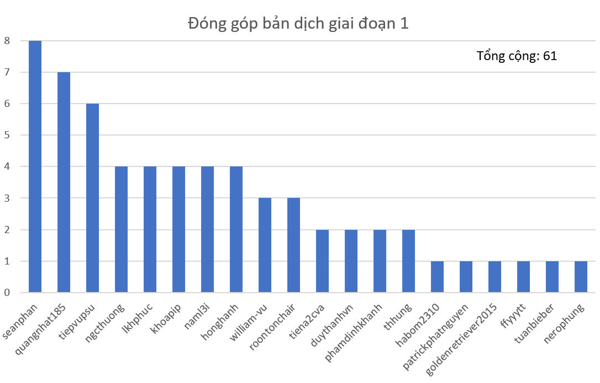

Mỗi chương được một hai bạn dịch chính sau đó các thành viên khác đóng góp phản biện.

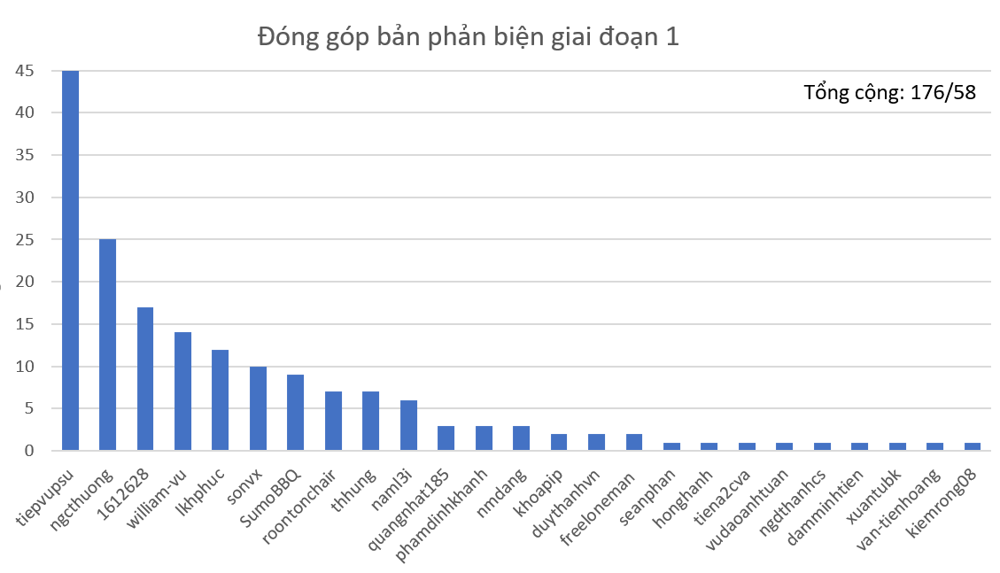

Trung bình mỗi chương có ba phản biện với tổng số 176 phản biện trên 58 chương sách.

### Giai đoạn 2
Trong giai đoạn này, các chương sẽ được trau chuốt hơn về mặt ngôn từ, cách diễn đạt.

| Chương | Dịch | Phản biện |
| ---    | ---  | ---       |
| [1 - 4](https://github.com/aivivn/Machine-Learning-Yearning-Vietnamese-Translation/pull/386)   | nmdang 		| tiepvupsu, ngcthuong, sonvx |
| [5 - 8](https://github.com/aivivn/Machine-Learning-Yearning-Vietnamese-Translation/pull/414)   | ngdthanhcs 	| tiepvupsu, ngcthuong |
| [9 - 12](https://github.com/aivivn/Machine-Learning-Yearning-Vietnamese-Translation/pull/409)  | lkhphuc 	    | tiepvupsu, ngcthuong |
| [13 - 16](https://github.com/aivivn/Machine-Learning-Yearning-Vietnamese-Translation/pull/413) | nmdang 	    | tiepvupsu |
| [17 - 19](https://github.com/aivivn/Machine-Learning-Yearning-Vietnamese-Translation/pull/408) | thhung 		| tiepvupsu |
| [20 - 23](https://github.com/aivivn/Machine-Learning-Yearning-Vietnamese-Translation/pull/415) | rootonchair  | tiepvupsu, ngcthuong |
| [24 - 27](https://github.com/aivivn/Machine-Learning-Yearning-Vietnamese-Translation/pull/431) | ngcthuong    | tiepvupsu, william-vu |
| [28 - 32](https://github.com/aivivn/Machine-Learning-Yearning-Vietnamese-Translation/pull/386) | nmdang       | samthehai, lkhphuc  |
| [33 - 35](https://github.com/aivivn/Machine-Learning-Yearning-Vietnamese-Translation/pull/443) | ngcthuong    | lkhphuc, samthehai, tiepvupsu  |
| [36 - 39](https://github.com/aivivn/Machine-Learning-Yearning-Vietnamese-Translation/pull/446) | lkhphuc      | tiepvupsu, samthehai  |
| [40 - 43](https://github.com/aivivn/Machine-Learning-Yearning-Vietnamese-Translation/pull/460) | ngcthuong    | lkhphuc, rootonchair  |
| [44 - 46](https://github.com/aivivn/Machine-Learning-Yearning-Vietnamese-Translation/pull/456) | rootonchair  | lkhphuc   |
| [47 - 49](https://github.com/aivivn/Machine-Learning-Yearning-Vietnamese-Translation/pull/460) | khoapip      | tiepvupsu, lkhphuc, ngcthuong, rootonchair |
| [50 - 52](https://github.com/aivivn/Machine-Learning-Yearning-Vietnamese-Translation/pull/448) | tiepvupsu    | samthehai, quangnhat185, ngcthuong|
| [53 - 55](https://github.com/aivivn/Machine-Learning-Yearning-Vietnamese-Translation/pull/453) | duythanhvn   | quangnhat185, ngcthuong, tiepvupsu  |
| [56 - 58](https://github.com/aivivn/Machine-Learning-Yearning-Vietnamese-Translation/pull/452) | tiepvupsu    | ngcthuong, lkhphuc  |

Giai đoạn hai được hoàn thành với 16 bài hiệu đính (mỗi bài từ 3 - 4 chương) và 35 đóng góp phản biện. Tính trung bình, có 2.2 phản biện trên một hiệu đính. Chi tiết đóng góp như sau

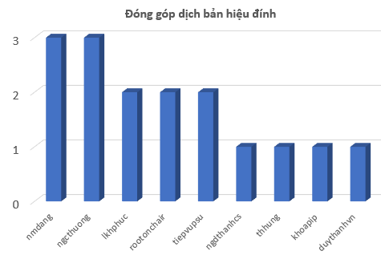

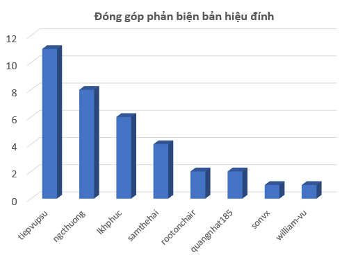

### Thuật ngữ

Còn rất nhiều các đóng góp từ các bạn dịch, phản biện cũng như thảo luận về các thuật ngữ tiếng Anh trong [Bảng thuật ngữ](glossary.md) với một số từ khóa điển hình được hoàn thiện trong quá trình dịch như:

| English                           | Tiếng Việt (Nếu bạn bổ sung thì KHÔNG căn chỉnh các dòng khác) | Thảo luận tại                                                |
|-----------------------------------|----------------------------------------------------------------|--------------------------------------------------------------|
| artificial data synthesis         | tổng hợp dữ liệu nhân tạo                                      | [#297](http://bit.ly/2PVhv5V)                                |
| background noise                  | nhiễu nền                                                      | [#193](http://bit.ly/31ObyKI)                                |
| benchmark                         | đánh giá xếp hạng                                              | [#87](http://bit.ly/2BvfPYA)                                 |
| bias (bias as variance)           | độ chệch                                                       | [#125](http://bit.ly/32HJI3S)                                |
| data mismatch                     | dữ liệu không tương đồng                                       | [#305](http://bit.ly/2PRYVLV)                                |
| domain adaptation                 | thích ứng miền                                                 | [#256](http://bit.ly/2ZoBtJ7)                                |
| Eyeball dev set                   | Tập phát triển Eyeball                                         | [#162](http://bit.ly/2MVHcl7)                                |
| human-level performance           | chất lượng mức con người                                       | [#259](http://bit.ly/36IzQcB), [#287](http://bit.ly/33CJfjX) |
| learning curve                    | đồ thị quá trình học                                           | [#87](http://bit.ly/2BvfPYA)                                 |
| multiple-number evaluation metric | phép đo đa trị                                                 | [#305](http://bit.ly/2PRYVLV)                                |
| multitask learning                | học đa nhiệm                                                   | [#256](http://bit.ly/2ZoBtJ7)                                |
| negative sample/example           | mẫu âm                                                         |                                                              |
| neural network                    | mạng nơ-ron                                                    | [#87](http://bit.ly/2BvfPYA) [#115](http://bit.ly/2MAkizG)   |
| optimizing metric                 | phép đo để tối ưu                                              | [#87](http://bit.ly/2BvfPYA)                                 |
| overfit                           | overfit                                                        | [#87](http://bit.ly/2BvfPYA)                                 |
| performance                       | chất lượng                                                     | [#259](http://bit.ly/36IzQcB)                                |
| plateau (danh từ)                 | vùng nằm ngang                                                 | [#260](http://bit.ly/35XznCO)                                |
| plateau (động từ)                 | nằm ngang                                                      | [#260](http://bit.ly/35XznCO)                                |
| pipeline                          | pipeline                                                       | [#334](http://bit.ly/2OyYuEf)                                |
| positive sample/example           | mẫu dương                                                      |                                                              |
| sampling with replacement         | lấy mẫu có hoàn lại                                            | [#251](http://bit.ly/34wQuKr)                                |
| sampling without replacement      | lấy mẫu không hoàn lại                                         | [#251](http://bit.ly/34wQuKr)                                |
| satisficing metric                | phép đo thỏa mãn                                               | [#87](http://bit.ly/2BvfPYA)                                 |
| single-number evaluation metric   | phép đo đơn trị                                                |                                                              |
| training dev set                  | tập phát triển huấn luyện                                      | [#305](http://bit.ly/2PRYVLV)                                |
| unavoidable bias                  | độ chệch không tránh được                                      |                                                              |
| underfit                          | underfit                                                       | [#87](http://bit.ly/2BvfPYA)                                 |
| variance (bias as variance)       | phương sai                                                     | [#125](http://bit.ly/32HJI3S)                                |

Chi tiết xem thêm tại Bảng thuật ngữ.

### Các đóng góp khác
Ngoài các đóng góp về bài dịch, phản biện, cũng như hiệu đính tuyệt vời nêu trên, cũng không thể không nêu những đóng góp thầm lặng khác cho đề tài như

| STT | Nội dung                         | Đóng góp                                         |
| --- | ---                              | ---                                              |
| 1   | Định dạng thư mục, tệp hướng dẫn | tiepvupsu, xuantubk                              |
| 2   | Sao chép và định dạng bản dịch   | duythanhvn, tiepvupsu, ngcthuong                 |
| 3   | Sao chép và chỉnh sửa hình vẽ    | samthehai, quangnhat185, rootonchair, duythanhvn |
| 4   | Sao chép và chỉnh sửa bảng biểu  | tiena2cva                                        |
| 5   | Tạo tệp pdf cho bản đầy đủ       | quangnhat185, rootonchair, duythanhvn, tiepvupsu |
| 6   | Thiết kế bìa bản tiếng Việt      | duythanhvn                                       |
| 7   | Tổng hợp nội dung, lời cảm ơn    | ngcthuong, tiepvupsu                             |

### Tên các thành viên  

Chi tiết tên và tài khoản github các thành viên có đóng góp cho đề tài không theo thứ tự nào cả.   

| GitHub ID     | Họ & Tên             |
| ------------- | -------------------- |
| tiepvupsu     | Vũ Hữu Tiệp          |
| ngcthuong     | Nguyễn Cảnh Thướng   |
| lkhphuc       | Lê Khắc Hồng Phúc    |
| sonvx         | Vũ Xuân Sơn          |
| rootonchair   | Phạm Hồng Vinh       |
| william-vu    | Vũ Đình Quyền        |
| SumoBBQ       | Phạm Chí Thành       |
| quangnhat185  | Nguyễn Lê Quang Nhật |
| seanphan      | Phan Duy Khánh       |
| duythanhvn    | Đoàn Võ Duy Thanh    |
| nmdang        | Đặng Ngọc Minh       |
| khoapip       | Ngô Thế Anh Khoa     |
| honghanhh     | Trần Thị Hồng Hạnh   |
| tiena2cva     | Ngọc Việt Tiến       |
| xuantubk      | Nguyễn Xuân Tú       |
| 1612628       |                      |
| phamdinhkhanh |                      |
| thhung        |                      |
| naml3i        |                      |
| vudaoanhtuan  |                      |
| ngdthanhcs    |                      |
| damminhtien   |                      |
| van-tienhoang |                      |
| kiemrong08    |                      |
| freeloneman   |                      |

**Mọi đóng góp của các bạn đều được lưu lại trong lịch sử của trang này.**
các bạn chưa có tên đầy đủ, hoặc tên đóng góp trong trang này xin vui lòng liên hệ lại với nhóm để lưu lại những đóng góp của các bạn.

