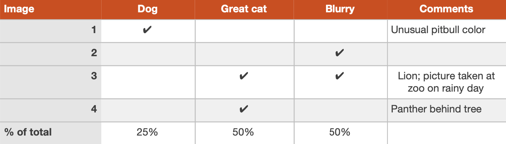
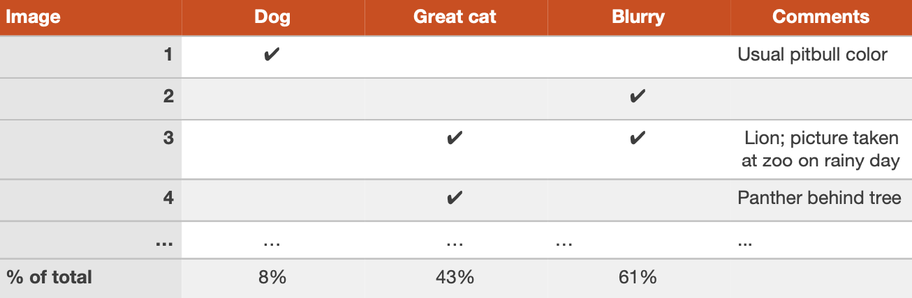

# Your team has several ideas for improving the cat detector:
->

* Fix the problem of your algorithm recognizing ​dogs​ as cats.
->

* Fix the problem of your algorithm recognizing ​great cats​ (lions, panthers, etc.) as house cats (pets).
->

* Improve the system’s performance on ​blurry​ images.
->

* ...
->

You can efficiently evaluate all of these ideas in parallel. I usually create a spreadsheet and fill it out while looking through ~100 misclassified dev set images. I also jot down comments that might help me remember specific examples. To illustrate this process, let’s look at a spreadsheet you might produce with a small dev set of four examples:
->

Image #3 above has both the Great Cat and the Blurry columns checked. Furthermore, because it is possible for one example to be associated with multiple categories, the percentages at the bottom may not add up to 100%.
->

Although you may first formulate the categories (Dog, Great cat, Blurry) then categorize the examples by hand, in practice, once you start looking through examples, you will probably be inspired to propose new error categories. For example, say you go through a dozen images and realize a lot of mistakes occur with Instagram-filtered pictures. You can go back and add a new “Instagram” column to the spreadsheet. Manually looking at examples that the algorithm misclassified and asking how/whether you as a human could have labeled the picture correctly will often inspire you to come up with new categories of errors and solutions.
->

The most helpful error categories will be ones that you have an idea for improving. For example, the Instagram category will be most helpful to add if you have an idea to “undo” Instagram filters and recover the original image. But you don’t have to restrict yourself only to error categories you know how to improve; the goal of this process is to build your intuition about the most promising areas to focus on.
->

Error analysis is an iterative process. Don’t worry if you start off with no categories in mind. After looking at a couple of images, you might come up with a few ideas for error categories. After manually categorizing some images, you might think of new categories and re-examine the images in light of the new categories, and so on.
->

Suppose you finish carrying out error analysis on 100 misclassified dev set examples and get the following:
->

You now know that working on a project to address the Dog mistakes can eliminate 8% of the errors at most. Working on Great Cat or Blurry image errors could help eliminate more errors. Therefore, you might pick one of the two latter categories to focus on. If your team has enough people to pursue multiple directions in parallel, you can also ask some engineers to work on Great Cats and others to work on Blurry images.
->

Error analysis does not produce a rigid mathematical formula that tells you what the highest priority task should be. You also have to take into account how much progress you expect to make on different categories and the amount of work needed to tackle each one.
->

