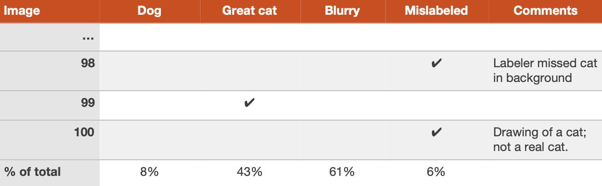

# 16. Cleaning up mislabeled dev and test set examples
->
# 16. Dọn dẹp những mẫu bị gán nhãn nhầm trong tập phát triển và tập kiểm tra

During error analysis, you might notice that some examples in your dev set are mislabeled. When I say “mislabeled” here, I mean that the pictures were already mislabeled by a human labeler even before the algorithm encountered it. I.e., the class label in an example ​(x,y)​ has an incorrect value for ​y.​ For example, perhaps some pictures that are not cats are mislabeled as containing a cat, and vice versa. If you suspect the fraction of mislabeled images is significant, add a category to keep track of the fraction of examples mislabeled:
->
Trong quá trình phân tích lỗi, bạn có thể nhận thấy rằng một vài mẫu trong trong tập phát triển đã bị gán nhãn nhầm. Khi tôi nói "bị gán nhãn nhầm" ở đây, ý tôi là những tấm ảnh đã bị gán nhãn nhầm bởi người dán nhãn trước cả khi thuật toán thuật toán gặp nó. Hay nói cách khác, nhãn lớp của một mẫu (x,y) có một giá trị sai cho y.  Ví dụ, có thể một số ảnh không chứa mèo bị gán nhãn nhầm thành có mèo, và ngược lại. Nếu bạn nghi ngờ rằng tỷ lệ những ảnh bị gán nhãn nhầm là quan trọng, hãy thêm một hạng mục để theo dõi tỷ lệ các mẫu bị gán nhãn nhầm:

Should you correct the labels in your dev set? Remember that the goal of the dev set is to help you quickly evaluate algorithms so that you can tell if Algorithm A or B is better. If the fraction of the dev set that is mislabeled impedes your ability to make these judgments, then it is worth spending time to fix the mislabeled dev set labels.
->
Bạn có nên sửa lại những nhãn trong tập phát triển không? Hãy nhớ rằng mục tiêu của tập phát triển là giúp bạn nhanh chóng đánh giá những thuật toán nhờ đó bạn có thể biết Thuật toán A hay Thuật toán B là tốt hơn. Nếu tỷ lệ bị gán nhãn nhầm trong tập phát triển cản trở khả năng ra những quyết định này của bạn, thì sẽ là đáng bỏ thời gian ra để sửa lại những nhãn bị gán nhầm của tập phát triển.

For example, suppose your classifier’s performance is:
->
Để ví dụ, giả sử hiệu suất bộ phân loại của bạn là:

* Overall accuracy on dev set.................... 90% (10% overall error.)
->
* Độ chính xác chung trên tập phát triển.................... 90% (10% lỗi chung.)

* Errors due to mislabeled examples....... 0.6% (6% of dev set errors.)
->
* Những lỗi gây ra bởi các mẫu bị gán nhãn nhầm....... 0.6% (6% các lỗi trong tập phát triển.)

* Errors due to other causes..................... 9.4% (94% of dev set errors)
->
* Những lỗi do những nguyên nhân khác..................... 9.4% (94% các lỗi trong tập phát triển)

Here, the 0.6% inaccuracy due to mislabeling might not be significant enough relative to the 9.4% of errors you could be improving. There is no harm in manually fixing the mislabeled images in the dev set, but it is not crucial to do so: It might be fine not knowing whether your system has 10% or 9.4% overall error.
->
Ở đây, tỷ lệ 0.6% sai do gán nhầm nhãn có thể không quan trọng bằng với tỷ lệ 9.4% các lỗi mà bạn có thể cải thiện. Không có một tác hại nào trong việc sửa thủ công những ảnh bị gán nhẫn nhầm trong tập phát triển cả, những nó không quá quan trọng để làm vậy: Có thể là ổn khi không biết liệu hệ thống của bạn có 10% hay 9.4% lỗi chung:

Suppose you keep improving the cat classifier and reach the following performance:
->
Giả sử bạn tiếp tục cải tiến bộ phân loại mèo và đạt được những hiệu suất sau:

* Overall accuracy on dev set.................... 98.0% (2.0% overall error.)
->
* Độ chính xác chung trên tập phát triển.................... 98.0% (2.0% lỗi chung.)

* Errors due to mislabeled examples....... 0.6%. (30% of dev set errors.)
->
* Những lỗi gây ra do các mẫu bị gán nhãn nhầm....... 0.6%. (30% các lỗi trong tập phát triển.)

* Errors due to other causes..................... 1.4% (70% of dev set errors)
->
* Những lỗi do những nguyên nhân khác..................... 1.4% (70% các lỗi trong tập phát triển)

30% of your errors are due to the mislabeled dev set images, adding significant error to your estimates of accuracy. It is now worthwhile to improve the quality of the labels in the dev set. Tackling the mislabeled examples will help you figure out if a classifier’s error is closer to 1.4% or 2%—a significant relative difference.
->
30% những lỗi của bạn là do những ảnh bị gán nhãn nhầm trong tập phát triển gây ra, thêm vào một lượng lớn lỗi cho các đánh giá độ chính xác của bạn. Bây giờ, nó rất đáng giá khi cải thiện chất lượng của các nhãn trong tập phát triển. Tấn công vào những mẫu bị gán nhãn nhầm sẽ giúp bạn hình dung được nếu lỗi của một bộ phân loại gần hơn với 1.4% hay 2%—một sự khác biệt đáng kể.

It is not uncommon to start off tolerating some mislabeled dev/test set examples, only later to change your mind as your system improves so that the fraction of mislabeled examples grows relative to the total set of errors.
->
Nó không bất bình thường khi bắt đầu bạn bỏ qua một vài mẫu bị gán nhãn nhầm của tập phát triển/tập kiểm tra, chỉ sau này bạn nên thay đổi suy nghĩ của bạn khi hệ thống của bạn phát triển dẫn tới tỷ lệ những mẫu bị gán nhãn nhầm tăng theo toàn bộ tập các lỗi.

The last chapter explained how you can improve error categories such as Dog, Great Cat and Blurry through algorithmic improvements. You have learned in this chapter that you can work on the Mislabeled category as well—through improving the data’s labels.
->
Chương cuối đã giải thích bằng cách nào bạn có thể cải thiện các hạng mục lỗi như Dog, Great Cat và Blurry qua những cải tiến về thuật toán. Bạn đã học trong chương này rằng bạn cũng có thể làm việc trên hạng mục Mislabeled nữa—thông qua cải thiện các nhãn của dữ liệu.

Whatever process you apply to fixing dev set labels, remember to apply it to the test set labels too so that your dev and test sets continue to be drawn from the same distribution. Fixing your dev and test sets together would prevent the problem we discussed in Chapter 6, where your team optimizes for dev set performance only to realize later that they are being judged on a different criterion based on a different test set.
->
Bất kể quá trình bạn áp dụng để sửa các nhãn trong tập huấn luyện là gì, hãy nhớ áp dụng nó cho các nhãn của tập kiểm tra luôn, nhờ vậy các tập phát triển và kiểm tra liên tục được lấy ra từ cùng một phân phối. Chỉnh sửa các tập phát triển và huấn luyện cùng nhau sẽ ngăn cản sự xuất hiện của vấn đề chúng ta đã bàn trong Chương 6, khi nhóm của bạn tối ưu hiệu suất cho tập phát triển chỉ để phát hiện ra sau đó là chúng đang được đánh giá dựa trên một tiêu chuẩn khác dựa trên một tập kiểm tra khác.

If you decide to improve the label quality, consider double-checking both the labels of examples that your system misclassified as well as labels of examples it correctly classified. It is possible that both the original label and your learning algorithm were wrong on an example. If you fix only the labels of examples that your system had misclassified, you might introduce bias into your evaluation. If you have 1,000 dev set examples, and if your classifier has 98.0% accuracy, it is easier to examine the 20 examples it misclassified than to examine all 980 examples classified correctly. Because it is easier in practice to check only the misclassified examples, bias does creep into some dev sets. This bias is acceptable if you are interested only in developing a product or application, but it would be a problem if you plan to use the result in an academic research paper or need a completely unbiased measure of test set accuracy.
->
Nếu bạn quyết định cải thiện chất lượng nhãn, hãy xem xét việc kiểm tra kỹ cả các nhãn của những mẫu mà hệ thống của bạn đã phân loại nhầm lẫn các nhãn của những mẫu mà nó đã phân loại chính xác. Rất có thể là cả nhãn gốc và thuật toán học tập của bạn đều đã sai trên một mẫu. Nếu bạn chỉ sửa mỗi những nhãn của mẫu mà hệ thống của bạn đã phân loại nhầm, bạn có thể đã gây ra thiên vị trong đánh giá của bạn. Nếu bạn có 1,000 mẫu trong tập phát triển, và nếu bộ phân loại của bạn có 98.0% độ chính xác, nó sẽ dễ hơn khi kiểm tra 20 mẫu đã bị phân loại nhầm hơn là cả 980 mẫu được phân loại chính xác. Bởi vì trên thực tế, sẽ dễ hơn để kiểm tra những mẫu bị phân loại nhầm, nên thiên vị sẽ lẻn vào một vài tập phát triển. Sự thiên vị này là chấp nhận được nếu bạn chỉ quan tâm vào việc phát triển một sản phẩm hay một ứng dụng, nhưng nó sẽ là một vấn đề nếu bạn định sử dụng kết quả trong một bài báo nghiên cứu khoa học hay cần một phép đo hoàn toàn không thiên vị cho độ chính xác của tập kiểm tra.

