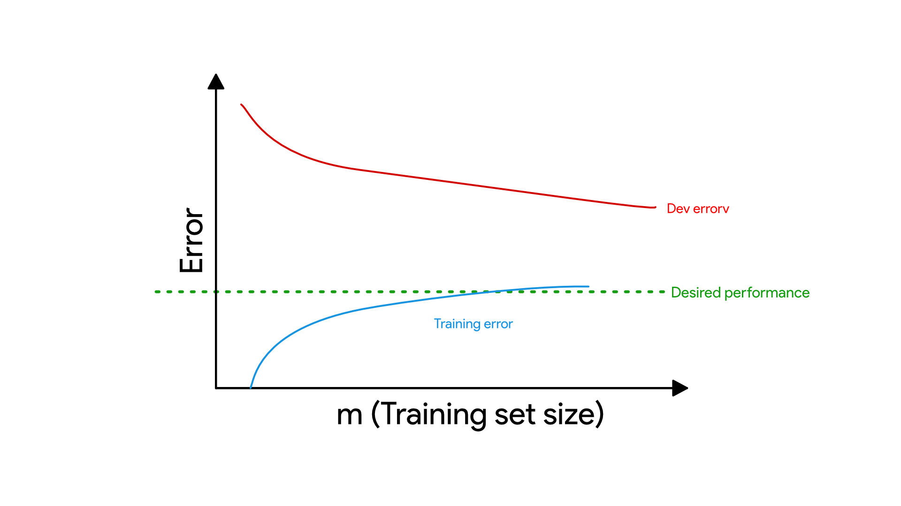
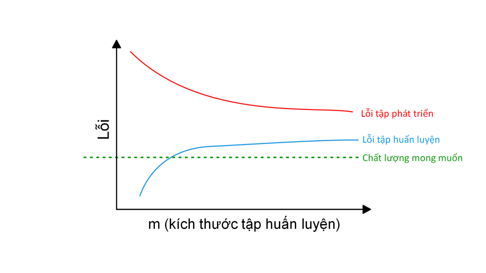

> # 31. Interpreting learning curves: Other cases

# 31. Giải nghĩa các đồ thị quá trình học: Những trường hợp khác

> Consider this learning curve:

Hãy xem xét đồ thị quá trình học này:

> Does this plot indicate high bias, high variance, or both?

Đồ thị này thể hiện độ chệch lớn, phương sai lớn hay cả hai?

> The blue training error curve is relatively low, and the red dev error curve is much higher than the blue training error. Thus, the bias is small, but the variance is large. Adding more training data will probably help close the gap between dev error and training error.

Đường cong lỗi huấn luyện màu xanh lam tương đối thấp và đường cong lỗi phát triển màu đỏ cao hơn nhiều so với lỗi huấn luyện màu xanh lam. Do đó, độ chệch nhỏ, nhưng phương sai lớn. Thêm dữ liệu huấn luyện (nhiều khả năng) sẽ giúp thu hẹp khoảng cách giữa lỗi phát triển và lỗi huấn luyện.

> Now, consider this:

Bây giờ, hãy xem xét đồ thị này:

> This time, the training error is large, as it is much higher than the desired level of performance. The dev error is also much larger than the training error. Thus, you have significant bias and significant variance. You will have to find a way to reduce both bias and variance in your algorithm.

Lần này, lỗi huấn luyện lớn, vì nó cao hơn nhiều so với mức hiệu quả mong muốn. Lỗi phát triển cũng lớn hơn nhiều so với lỗi huấn luyện. Vì vậy, bạn có độ chệch đáng kể và phương sai cũng đáng kể. Bạn sẽ phải tìm cách giảm cả độ chệch và phương sai trong thuật toán của mình.
