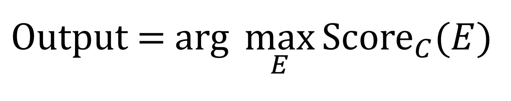

> # 45. General form of Optimization Verification test

 # 45. Dạng chung của thử nghiệm Xác minh tối ưu

> You can apply the Optimization Verification test when, given some input ​*x​*, you know how to compute Score​\*​(*y​*) that indicates how good a response ​*y​* is to an input ​*x*.​ Furthermore, you are using an approximate algorithm to try to find arg max​y​ Score​\*​(*y​*), but suspect that the search algorithm is sometimes failing to find the maximum. In our previous speech recognition example, ​*x=A​* was an audio clip, and ​*y=S​* was the output transcript.

Bạn có thể áp dụng thử nghiệm Xác minh tối ưu khi, với một số đầu vào *x*, bạn biết cách tính Điểm\* (*y*) dùng để thể hiện mức độ phản hồi *y* tốt như thế nào với *x*. Hơn nữa, bạn đang sử dụng thuật toán gần đúng để cố gắng tìm arg max yĐiểm\*(*y*), nhưng nghi ngờ rằng thuật toán tìm kiếm đôi khi không tìm thấy giá trị lớn nhất. Trong ví dụ nhận dạng giọng nói trước đây của chúng tôi, *x=A* là một đoạn âm thanh và *y=S* là bản ghi đầu ra.

> Suppose y\* is the "correct" output but the algorithm instead outputs y​out​. Then the key test is to measure whether Score​\*​(y*) > Score​\*​(y​out). If this inequality holds, then we blame the optimization algorithm for the mistake. Refer to the previous chapter to make sure you understand the logic behind this. Otherwise, we blame the computation of Score​\*​(y).

Giả sử y\* là đầu ra "chính xác" nhưng thuật toán thay vào đó tìm ra yout. Sau đó, bài kiểm tra chính là đo xem liệu Điểm\*(y\*) > Điểm\*(yout) hay không. Nếu bất đẳng thức này đúng, thì chúng ta đổ lỗi cho thuật toán tối ưu cho kết quả sai. Tham khảo chương trước để đảm bảo bạn hiểu logic đằng sau điều này. Ngược lại, chúng ta đổ lỗi cho cách tính Điểm\*(y).

> Let’s look at one more example. Suppose you are building a Chinese-to-English machine translation system. Your system works by inputting a Chinese sentence ​*C*,​ and computing some Score​C​(​*E*)​ for each possible translation ​E.​ For example, you might use Score​C​(​*E*)​ = P(*E*|*C*), the probability of the translation being E given that the input sentence was ​*C*.

Xem xét một ví dụ nữa. Giả sử bạn đang xây dựng một hệ thống dịch máy từ tiếng Trung sang tiếng Anh. Hệ thống của bạn hoạt động bằng cách nhập một câu tiếng Trung *C* và tính toán một gía trị ĐiểmC(*E*) cho mỗi bản dịch khả dĩ E. Ví dụ, bạn có thể sử dụng ĐiểmC(*E*) = P(*E*|*C*), xác suất dịch được E cho rằng câu đầu vào là *C*.

> Your algorithm translates sentences by trying to compute:

Thuật toán của bạn dịch các câu bằng cách cố gắng tính toán:

> However, the set of all possible English sentences *E* is too large, so you rely on a heuristic search algorithm.

Tuy nhiên, tập hợp các câu tiếng Anh có thể *E* quá lớn nên bạn dựa vào thuật toán tìm kiếm thực nghiệm.

> Suppose your algorithm outputs an incorrect translation ​*E​*out​ rather than some correct translation ​E​*. Then the Optimization Verification test would ask you to compute whether Score​C​(*E*\*) > Score​C​(*E*out). If this inequality holds, then the Score​C​(.) correctly recognized E\* as a superior output to *E​*out​; thus, you would attribute this error to the approximate search algorithm. Otherwise, you attribute this error to the computation of Score​C​(.).

Giả sử thuật toán của bạn dịch ra một bản không chính xác *E*out thay vì một số bản dịch chính xác E*. Sau đó, bài kiểm tra Xác minh tối ưu sẽ yêu cầu bạn tính toán xem liệu ĐiểmC(*E\**) > ĐiểmC(*E*out) không. Nếu bất bình đẳng này đúng thì ĐiểmC(.) đã nhận dạng chính xác E\* là đầu ra vượt trội hơn so với *E*out; do đó, bạn sẽ gán lỗi này cho thuật toán tìm kiếm gần đúng. Ngược lại, bạn gán lỗi này cho tính toán ĐiểmC(.)

> It is a very common "design pattern" in AI to first learn an approximate scoring function Score\*(.), then use an approximate maximization algorithm. If you are able to spot this pattern, you will be able to use the Optimization Verification test to understand your source of errors.

Đây là một “mẫu thiết kế” rất phổ biến trong AI khi học một hàm tính điểm gần đúng Điểm\*(.), sau đó sử dụng một thuật toán tối đa xấp xỉ. Nếu bạn có thể phát hiện ra kiểu mẫu này, bạn sẽ có thể sử dụng thử nghiệm Xác minh tối ưu để hiểu nguồn gốc lỗi của mình.
