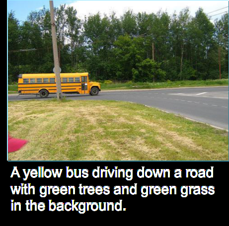

> # 52. Directly learning rich outputs

# 52. Trực tiếp học những đầu ra phức tạp.

> An image classification algorithm will input an image ​x,​ and output an integer indicating the object category. Can an algorithm instead output an entire sentence describing the image?

Một thuật toán phân loại sẽ nhận đầu vào là một ảnh x rồi trả về một số nguyên thể hiện nhãn phân loại của đồ vật trong ảnh đó. Thay vào đó, liệu một thuật toán có thể có đầu ra là một câu văn miêu tả nội dung của hình ảnh không? 

> For example:

Ví dụ:

> *x* = 

> *y* = "A yellow bus driving down a road with green trees and green grass in the background."

*y* = "Một chiếc xe buýt màu vàng đang đi xuống một con đường với cây xanh và cỏ xanh ở nền."

> Traditional applications of supervised learning learned a function ​*h:​ ​X​→​Y*,​ where the output y​ was usually an integer or a real number. For example:

Những ứng dụng truyền thống của các thuật toán học có giám sát học một hàm *h:​ ​X​→​Y*, trong đó đầu ra y thường là một số nguyên hoặc một số thực. Ví dụ:

> |        Problem           |           X             |           Y         |
> | :----------------------- | :---------------------- | :------------------ |
> | Spam classification      | Email                   | Spam/Not spam (0/1) |
> | Image recognition        | Image                   | Integer label       |
> | Housing price prediction | Features of house       | Price in dollars    |
> | Product recommendation   | Product & user features | Chance of purchase  |

> One of the most exciting developments in end-to-end deep learning is that it is letting us directly learn ​*y​* that are much more complex than a number. In the image-captioning example above, you can have a neural network input an image (​*x*)​ and directly output a caption (​*y​*).

> |        Bài toán            |           X             |           Y        |
> | :----------------------- | :---------------------- | :------------------|
> | Phân loại email rác      | Email                   | email rác/ không rác(0/1) |
> | Nhận dạng ảnh            | Ảnh                     | Nhãn số nguyên     |
> | Dự đoán giá nhà đất      | Đặc trưng của căn nhà   | Giá theo Đô-la     |
> | Gợi ý sản phẩm           | Đặc trưng của sản phẩm và người dùng | Chance of purchas |

Một trong những hướng phát triển thú vị nhất của học sâu đầu cuối là nó cho phép chúng ta trực tiếp học được những kết quả phức tạp hơn rất nhiều so với việc chỉ trả về một con số [cần dịch lại]. Trong ví dụ chú thích hình ảnh ở trên, bạn có thể cho hình ảnh (*x*) vào một mạng neural và trực tiếp thu về một câu chú thích miêu tả hình ảnh đó (*y*)

> Here are more examples:

Dưới đây là một số ví dụ khác:

> |       Problem       |           X           |       Y       |      Example Citation     |
> | :------------------ | :-------------------- | :------------ | :------------------------ |
> | Image captioning    | Image                 | Text          | Mao et al., 2014          |
> | Machine translation | English text          | French text   | Suskever et al., 2014     |
> | Question answering  | (Text, Question) pair | Answer text   | Bordes et al., 2015       |
> | Speech recognition  | Audio                 | Transcription | Hannun et al., 2015       |
> | TTS                 | Text features         | Audio         | van der Oord et al., 2016 |

|       Bài toán      |           X           |       Y       |      Trích dẫn ví dụ      |
| :------------------ | :-------------------- | :------------ | :------------------------ |
| Chú thích hình ảnh  | Ảnh                   | Văn bản          | Mao et al., 2014       |
| Dịch máy            | Văn bản tiếng Anh     | Văn bản tiếng Pháp| Suskever et al., 2014 |
| Trả lời câu hỏi     | (Văn bản, Câu hỏi) theo cặp| Câu trả lời   | Bordes et al., 2015  |
| Nhận dạng giọng nói | Audio                 | văn bản chuyển dịch| Hannun et al., 2015  |
| Chuyển văn bản thành giọng nói | Đặc trưng văn bản  | Audio         | van der Oord et al., 2016 |

> This is an accelerating trend in deep learning: When you have the right (input,output) labeled pairs, you can sometimes learn end-to-end even when the output is a sentence, an image, audio, or other outputs that are richer than a single number.

Đây là một xu hướng đang ngày càng phát triển trong học sâu. Với các cặp có nhãn (đầu vào, đầu ra) phù hợp, đôi khi bạn có thể học đầu cuối ngay cả khi đầu ra là một câu, hình ảnh, âm thanh hoặc các kết quả đầu ra khác phức tạp hơn nhiều so với đầu ra của việc học truyền thống.
