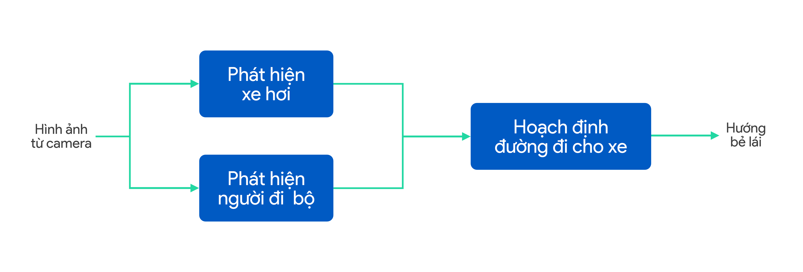

> # 56. Error analysis by parts and comparison to human-level performance

--> _replace THIS LINE by your translation for the above line_

> Carrying out error analysis on a learning algorithm is like using data science to analyze an ML system’s mistakes in order to derive insights about what to do next. At its most basic, error analysis by parts tells us what component(s) performance is (are) worth the greatest effort to improve.

--> _replace THIS LINE by your translation for the above line_

> Say you have a dataset about customers buying things on a website. A data scientist may have many different ways of analyzing the data. She may draw many different conclusions about whether the website should raise prices, about the lifetime value of customers acquired through different marketing campaigns, and so on. There is no one "right" way to analyze a dataset, and there are many possible useful insights one could draw. Similarly, there is no one "right" way to carry out error analysis. Through these chapters you have learned many of the most common design patterns for drawing useful insights about your ML system, but you should feel free to experiment with other ways of analyzing errors as well.

--> _replace THIS LINE by your translation for the above line_

> Let’s return to the self-driving application, where a car detection algorithm outputs the location (and perhaps velocity) of the nearby cars, a pedestrian detection algorithm outputs the location of the nearby pedestrians, and these two outputs are finally used to plan a path for the car.

--> _replace THIS LINE by your translation for the above line_

> To debug this pipeline, rather than rigorously following the procedure you saw in the previous chapter, you could more informally ask:

--> _replace THIS LINE by your translation for the above line_

> 1. How far is the Detect cars component from human-level performance at detecting cars?

--> _replace THIS LINE by your translation for the above line_

> 2. How far is the Detect pedestrians component from human-level performance?

--> _replace THIS LINE by your translation for the above line_

> 3. How far is the overall system’s performance from human-level performance? Here, human-level performance assumes the human has to plan a path for the car given only the outputs from the previous two pipeline components (rather than access to the camera images). In other words, how does the Plan path component’s performance compare to that of a human’s, when the human is given only the same input?

--> _replace THIS LINE by your translation for the above line_

> If you find that one of the components is far from human-level performance, you now have a good case to focus on improving the performance of that component.

--> _replace THIS LINE by your translation for the above line_

> Many error analysis processes work best when we are trying to automate something humans can do and can thus benchmark against human-level performance. Most of our preceding examples had this implicit assumption. If you are building an ML system where the final output or some of the intermediate components are doing things that even humans cannot do well, then some of these procedures will not apply.

--> _replace THIS LINE by your translation for the above line_

> This is another advantage of working on problems that humans can solve--you have more powerful error analysis tools, and thus you can prioritize your team’s work more efficiently.

--> _replace THIS LINE by your translation for the above line_
